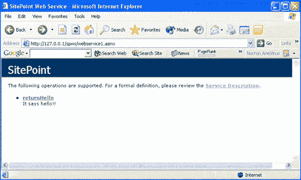
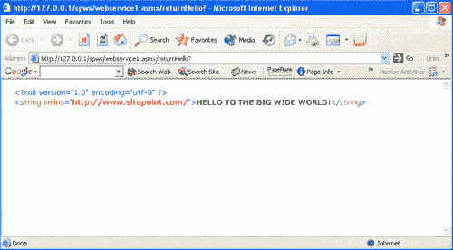
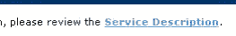
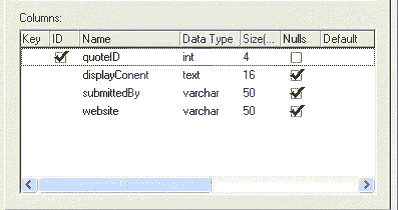
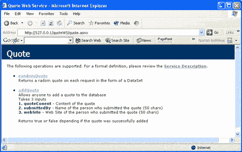
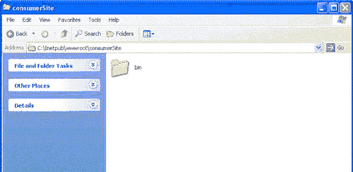
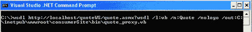
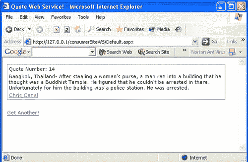
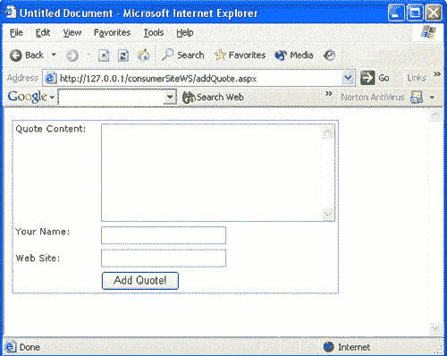

# 。NET Web 服务变得简单

> 原文：<https://www.sitepoint.com/net-web-services-made/>

***感兴趣。网？不要错过[网站。NET 功能指南](https://www.sitepoint.com/using-special-characters-online/) —这是一个极好的资源！***

毫无疑问，你听说过 Web 服务，即使你是一个 ASP，PHP，Java。NET 或 XML 开发人员。如果你还没有，或者真的不知道它们是什么，看看凯文·扬克的[“Web 服务去神秘化”](http://www.webmasterbase.com/article/692)。

Web 服务既不是一个新概念，也不是微软的创造。这个想法已经存在很长时间了——网景公司在他们的 IIOP (Internet Inter-ORB Protocol)中提到了这个概念——1996 年底，网景公司的共同创始人马克·安德森在一篇文章中对此进行了讨论。

在本文中，我们将探索如何构建和利用自己的 Web 服务。

##### 先决条件

我假设你对……NET、Web 窗体和访问数据。对于这个项目，我将使用 MS SQL Server 数据库，但是您也可以使用微软的 MSDE。NET Framework(如果您需要帮助找到它，可以看看 [SitePoint 论坛](http://www.sitepointforums.com))，或者编辑代码以通过 OLEDB 命名空间使用 Access 数据库。

##### 可用协议

因为 Web 服务被设计成尽可能可访问，所以该架构的主要和最重要的方面之一是以通用格式交换数据。您可以使用三种协议在. NET Web 服务中传输数据:Http-Get、Http-Post 和 SOAP(简单对象访问协议)。我们现在来看一下这些协议。因为 Http-Get 和 Http-Post 本质上是一样的，所以我们将一起讨论它们。

***Http-Get 和 Http-Post 协议***

Http-Get 使用名称/值对在 Web 服务之间传递数据，作为一种基于 Http 的协议，它被广泛接受。如果你曾经在 ASP 或 ASP.NET 中使用过`Request.QueryString()`,你很可能以前就和合作过。Http-Get 协议将 UUencoded 字符串附加到 URL 的末尾，通常如下所示:

```
www.e4ums.com/search.aspx?searchtext=search% 

20for%20this&from=index.aspx
```

眼熟吗？我想是的。

Http-Post 也是一种基于 Http 的协议，它使用名称/值对，但是这些对不是附加在 URL 上，而是在请求头中传递。如果您曾经使用过`Request.Form()`，那么您就使用过 Http-Post 数据。Http-Post 请求的实际 HTTP 标头如下所示:

```
POST search.aspx HTTP1.1 

Host: http://www.e4ums.com 

Content-Type: application/x-www-form-urlencoded 

Content-Length: length 

searchtext=search%20for%20this&from=index.aspx
```

***【简单对象访问协议】***

这种轻量级数据交换协议使用 XML 结构来描述对象及其属性和方法。使用 HTTP 和其他互联网技术，SOAP 已经无缝地集成到。NET Web 服务。尽管只是为单向传输而设计的，但是 SOAP 消息可以被组合起来实现像请求/响应这样的系统。

SOAP 消息可能看起来像这样:

```
POST search.aspx HTTP/1.1 

Host: http://www.e4ums.com 

Content-Type: text/xml; charset="utf-8" 

Content-Length: nnn 

SOAPAction: http://www.e4ums.com/ws 

<?xml version="1.0" encoding="utf-8" ?> 

<soap:Envelope xmlns:xsi=http://www.w3c.org/2001/XMLSchema-instance" 

xmlns:xsd=http://www.w3c.org/2001/XMLSchema  

xmlns:soap=http://schemas.xmlsoap.org/soap/envelope> 

   <soap:Body> 

      <tipOfDay xmlns=http://www.e4ums.com> 

         <date>05/12/2002</date> 

      </ tipOfDay > 

   </soap:Body> 

</soap:Envelope>
```

返回的 SOAP 将如下所示:

```
HTTP/1.1 200 OK 

Content-Type: text/xml charset="utf-8" 

Content-Length: nnnnn 

<?xml version="1.0" encoding="utf-8" ?> 

<soap:Envelope xmlns:xsi=http://www.w3c.org/2001/XMLSchema-instance"  

xmlns:xsd=http://www.w3c.org/2001/XMLSchema  

xmlns:soap=http://schemas.xmlsoap.org/soap/envelope> 

   <soap:Body> 

      <tipOfDay xmlns=http://www.e4ums.com> 

         <returnTip>Never stick a light build in your back  

         pocket</returnTip> 

      </tipOfDay> 

   </soap:Body> 

</soap:Envelope>
```

##### 数据类型

像您为站点创建的函数一样，Web 服务接受并返回各种数据类型:

*   线
*   （同 Internationalorganizations）国际组织
*   布尔代数学体系的
*   字节
*   两倍
*   数据类型
*   列举
*   浮动
*   长的
*   短的
*   未签名字节
*   无符号整数
*   无符号长整型
*   无符号短整型

而且，与普通的类和方法一样，您决定可以接受什么数据类型。但是，您可以接受的类型将受到使用服务的协议的很大影响。SOAP 是最具可扩展性的，因为它是基于 XML 的协议，但正因为如此，它也使用了最多的带宽。另一方面，Http-Get 和 Http-Post 是名称/值对，使用的带宽较少，但也更受限制。

##### 我们第一个简单的网络服务

让我们创建一个 Web 服务！我们将构建一个返回字符串的简单脚本——这是一个很好且简单的开始。在那之后，我们将转向更大更光明的事物！

***创建 Web 方法***

如果你曾和。NET 之前，你已经创建了一个自定义类，那么你离创建一个 Web 方法就不远了！这两者实际上没有太大的区别:公开的公共方法可以通过 Web 服务获得，就像类的公共方法可以被应用程序的其余部分获得一样。

好了，那么打开你最喜欢的文本编辑器或者 IDE，把一个空白文档保存为 webservice1.asmx，不，我没有打错扩展名。。NET Web 服务文件保存为. asmx。

好吧，所以你一直等到现在才得到一些代码，所以你在这里:

```
<%@ WebService Language="VB" Class="SitePoint" %>  

Imports System.Web.Services  

<WebService(NameSpace:="https://www.sitepoint.com/")>  

Public Class SitePoint  

  <WebMethod(Description:="It say hello!!")> Public   

  Function returnHello() As String  

  Return "HELLO TO THE BIG WIDE WORLD!"  

  End Function  

End Class
```

看着有点眼熟？我也这么认为！让我们过一遍。

```
<%@ WebService Language="VB" Class="SitePoint" %>
```

第一行看起来有点像普通的 Page 指令，但是它不是 Page，而是一个 WebService 指令，它告诉。NET 框架中，这个类将被公开为 Web 服务。

```
Imports System.Web.Services
```

接下来我们导入系统。Web.Services 命名空间，这样我们就可以访问。NET Web 服务类。

```
<WebService(NameSpace="https://www.sitepoint.com/")>   

Public Class SitePoint
```

这一行为 Web 服务提供了一个 XML 名称空间。现在，如果我们忽略这一行(它是可选的)，它将被赋予`Namespace<http://tempuri.org>`。提供您自己的名称空间通常是一个好主意，因为这有助于将您的名称空间与其他 Web 服务区分开来。

```
<WebMethod(Description:="It say hello!!")>   

Public Function returnHello() As String
```

要创建 Web 服务，您必须公开它的一部分。您可以通过使用 WebMethod 属性并将类和方法声明为 public 来实现这一点。在上面一行中，我们将`returnHello`函数声明为 WebMethod 和 public，这意味着它将作为服务可用。

```
 Return "HELLO TO THE BIG WIDE WORLD!"  

   End Function  

End Class
```

通过这几行，我们返回一个简单的字符串，并关闭函数和类。现在，导航到 webService1.asmx 文件，您将看到。NET Framework 已经自动呈现了它。



酷吧。如您所见，该页面在页面顶部显示了 Web 服务的名称，然后使用`WebMethod`属性列出了可用的方法。现在单击 WebMethod 的名称，在本例中是 returnHello 方法，将出现一个描述 Web 服务的页面。

您将看到方法名，以及我们在代码中设置的描述。在它下面，您会发现一个名为 Test 的标题和一个写有 Invoke 的按钮。先不要打它，我们一会儿会回来的！

在这下面，您将看到一些示例 SOAP、Http-Get 和 Http-Post 请求和响应。他们看起来应该有点眼熟！

现在点击调用按钮！应该会弹出一个如下所示的窗口:



这就是我们公开的服务的外观。

好了，现在回到第一页。有件事我们没讲过，有人知道是什么吗？



这个链接将打开服务描述，有趣的是，它被称为 WSDL 文档。如果你读了凯文的文章，恭喜你——你知道我在说什么！如果不是，你真可耻！

基本上，WSDL (Web 服务描述语言)定义了 Web 服务及其消费方式。有几节详细介绍了如何使用 SOAP、Http-Get 和 Http-Post 与它进行交互。不错吧，嗯？如您所见。NET 框架使得创建 Web 服务比做烤面包更容易！

好了，我们已经构建了一个返回字符串的简单 Web 服务。让我们转到一个你可以与之互动的网络服务上来！

##### 构建交互式 Web 服务

那么，我们开始吧。这一次，我们将创建一个全功能的 Web 服务。但是它能做什么呢？嗯，我们将创建一个 Web 服务，它公开两个 Web 方法，`randomQuote()`和`addQuote()`。我们的 Web 服务将是一个简单的报价系统，为用户提供在其网站上显示随机报价的功能，并为用户提供添加新报价的功能。

在我们开始之前，在您的 Web 根目录(通常是 c:intetpubwwwroot)中创建一个名为 quoteWS 的新文件夹，并将其转换为一个新的虚拟目录。

***数据库***

我们将创建一个简单的数据库来保存报价，并将其设计为允许您轻松地将其更改为 Access 数据库。创建一个新的数据库，并将其命名为 quoteDatabase。该模式如下所示:



一旦你做好了表格，就把它保存为 tblQuotes。

现在我们已经做好了表格，让我们看看我们的第一个 web 方法，`randomQuote()`

***`randomQuote() Web Method`***

在我们开始启动我们的 web 方法之前，我们必须设置我们想要公开的类:

```
<%@ WebService Language="VB" Class="Quote" %>   

Imports System.Web.Services   

Imports System   

Imports System.Data   

Imports System.Data.SqlClient   

<WebService(Namespace:="https://www.sitepoint.com/Quote.")> _   

Public Class Quote   

  ' Private string to hold the connection details   

  Private strConnection As String    

  = "server=localhost;database=quoteDatabase;uid=sa;pwd=;"   

End Class
```

将文件另存为 quote.asmx，看到的东西应该都很熟悉；首先我们有了`@WebService`指令，然后我们为将要使用的类和方法导入名称空间。接下来，我们声明我们的 XML 名称空间，以及我们将要公开的类。类中唯一的一行是一个私有字符串，它保存了我们的数据库细节。

有了我们服务的基本框架，让我们看看我们的第一个 WebMethod。

```
<WebMethod(Description:="Returns a random quote    

on each request in the form of a DataSet")> _   

  Public Function randomQuote() As DataSet   

    Dim objDataAdapter As New SQLDataAdapter '    

    DataAdapter that will get the data from the   

    Dim objConnection As New SQLConnection(strConnection) '    

    Connection object that will allow the DataAdpater to    

    connect to the     

    Dim DS As New DataSet() ' Will store the data   

    Dim returnDS As New DataSet() ' Will be the DataSet    

    that is returned   

    Dim quoteID As Integer ' Will hold the ID number    

    of the random quote   

    objDataAdapter = New SQLDataAdapter("SELECT * FROM    

    tblQuotes", objConnection)   

    objDataAdapter.Fill(DS, "quoteTable")   

    quoteID = DS.Tables("quoteTable").Rows.Count * Rnd()   

    Dim tmpDataTable As New DataTable("returnRow")   

    tmpDataTable = DS.Tables("quoteTable").Clone   

    tmpDataTable.ImportRow(DS.Tables("quoteTable").Rows(quoteID))   

    returnDS.Tables.Add(tmpDataTable)   

    Return returnDS   

  End Function
```

让我们快速回顾一下代码。当我们声明 WebMethod 时，我们提供一个描述、函数名和我们将要返回的内容。

```
<WebMethod(Description:="Returns a random quote    

on each request in the form of a DataSet")> _   

  Public Function randomQuote() As DataSet
```

接下来的几行声明了我们将要使用的对象和变量:

```
Dim objDataAdapter As New SQLDataAdapter '    

DataAdapter that will get the data from the   

Dim objConnection As New SQLConnection(strConnection) '    

Connection object that will allow the DataAdpater to    

connect to the database   

Dim DS As New DataSet() ' Will store the data   

Dim returnDS As New DataSet() ' Will be the DataSet    

that is returned   

Dim quoteID As Integer ' Will hold the ID number    

of the random quote
```

下面几行返回数据库中的数据:

```
objDataAdapter = New SQLDataAdapter("SELECT * FROM    

tblQuotes", objConnection)   

objDataAdapter.Fill(DS, "quoteTable")
```

现在我们有了一个包含报价的数据集，我们必须随机选择其中一个。为此，我们使用数据集的行号和`rnd()`函数。有更好、更可靠的方法可以做到这一点，但是为了速度和方便，我们选择了这个选项。

```
quoteID = DS.Tables("quoteTable").Rows.Count * Rnd()
```

然后我们创建一个数据表来保存我们想要返回的行。我们克隆保存当前报价的表，然后复制该行。

```
Dim tmpDataTable As New DataTable("returnRow")   

tmpDataTable = DS.Tables("quoteTable").Clone   

tmpDataTable.ImportRow(DS.Tables("quoteTable").Rows(quoteID))
```

因为我们不能通过 Web 服务返回 DataTable，所以我们必须将其插入到一个数据集中。

```
returnDS.Tables.Add(tmpDataTable)
```

最后我们返回数据集。

```
Return returnDS
```

至此，我们已经完成了返回随机报价的 WebMethod！为什么不一起冲浪并测试一下呢？

***`addQuote() WebMethod`***

现在我们可以返回报价，我们将构建允许某人添加报价的功能:

```
<WebMethod(Description:="Allows anyone     

to add a quote to the database" _    

  & "<br />Takes 3 inputs" _    

  & "<br /><strong>1\. quoteConent</strong> - Content     

  of the quote" _    

  & "<br /><strong>2\. submittedBy</strong> - Name of the     

  person who submitted the quote (50 chars)" _    

  & "<br /><strong>3\. webSite</strong> - Web Site of the     

  person who submitted the quote (50 chars)" _    

  & "<br /><br />Returns true or false depending if     

  the quote was successfully added")> _    

    Public Function addQuote(quoteContent As String,     

    submittedBy As String, webSite As String) As Boolean    

    Dim objConnection As New SQLConnection(strConnection)    

    Dim objCmd As SQLCommand    

    Dim objParam As SQLParameter    

    Try    

      objCmd = New SQLCommand("INSERT INTO tblQuotes     

      (displayContent, submittedBy, webSite) VALUES     

      (@displayContent, @submittedBy, @webSite)", objConnection)    

      objParam = objCmd.Parameters.Add(New SQLParameter    

      ("@displayContent", SQLDBType.Text))    

      objParam.Value = quoteContent    

      objParam = objCmd.Parameters.Add(New SQLParameter    

      ("@submittedBy", SQLDBType.VarChar, 50))    

      objParam.Value = submittedBy    

      objParam = objCmd.Parameters.Add(New SQLParameter    

      ("@webSite", SQLDBType.VarChar, 50))    

      objParam.Value = webSite    

        objCmd.Connection.Open()    

        objCmd.ExecuteNonQuery()    

        objCmd.Connection.Close    

      Return True    

    Catch ex As Exception    

      Return False    

    End Try    

  End Function
```

如果你曾经使用过 ASP.NET，上面的代码应该很熟悉(其他的也应该很熟悉！).正如你已经知道的，我们做的第一件事是声明 WebMethod。但是这次你会注意到描述更长了。如您所见，它支持 HTML，这意味着您可以为您的 Web 服务提供详细的描述！我们接受三个输入，quoteContent、submittedBy 和 website)并返回一个布尔值(真或假)。

```
<WebMethod(Description:="Allows anyone to     

add a quote to the database" _    

  & "<br />Takes 3 inputs" _    

  & "<br /><strong>1\. quoteConent</strong> - Content of the quote" _    

  & "<br /><strong>2\. submittedBy</strong> -     

  Name of the person who submitted the quote (50 chars)" _    

  & "<br /><strong>3\. webSite</strong> - Web Site     

  of the person who submitted the quote (50 chars)" _    

  & "<br /><br />Returns true or false depending if     

  the quote was successfully added")> _    

  Public Function addQuote(quoteContent As String,     

  submittedBy As String, webSite As String) As Boolean
```

接下来，我们声明我们将要使用的所有对象:

```
Dim objConnection As New SQLConnection(strConnection)    

Dim objCmd As SQLCommand    

Dim objParam As SQLParameter
```

然后，我们使用一个`Try...Catch...Finally`块将提供的数据插入数据库。如您所见，我们不验证数据，这意味着客户必须验证。

```
 Try    

      objCmd = New SQLCommand("INSERT INTO tblQuotes     

      (displayContent, submittedBy, webSite) VALUES     

      (@displayContent, @submittedBy, @webSite)", objConnection)    

      objParam = objCmd.Parameters.Add(New SQLParameter    

      ("@displayContent", SQLDBType.Text))    

      objParam.Value = quoteContent    

      objParam = objCmd.Parameters.Add(New SQLParameter    

      ("@submittedBy", SQLDBType.VarChar, 50))    

      objParam.Value = submittedBy    

      objParam = objCmd.Parameters.Add(New SQLParameter("@webSite",    

      SQLDBType.VarChar, 50))    

      objParam.Value = webSite    

      objCmd.Connection.Open()    

      objCmd.ExecuteNonQuery()    

      objCmd.Connection.Close    

      Return True    

    Catch ex As Exception    

      Return False    

  End Try
```

就这么简单！如果我们现在浏览 quote.asmx 文件，我们会看到类似这样的内容:



为什么不试试我们创建的 Web 服务呢？它们都功能齐全！

##### 消费我们的网络服务

现在我们已经创建了一个简单的 Web 服务，让我们看看如何使用它。

对于使用 Web 服务的人来说，他们必须创建一个代理客户端，然后允许它访问所有公开的 Web 方法。这可以手工编码，但是。NET Framework 包含了一个工具可以帮你做到这一点。我们很快就会看到这一点。我们要做的第一件事是准备好消费 Web 服务。

我们要做的第一件事是为消费者站点建立一个新的文件夹，因此在您的 Web 根目录(通常是 c:inetpubwwwroot)中创建一个名为 consumer site 的文件夹。现在，进入那个文件夹，创建一个名为 bin 的文件夹。



现在我们来看看如何创建我们的代理类。

***WSDL.exe***

 *这是一个命令行实用程序([关于 WebmasterBase.com 的命令行](http://www.webmasterbase.com/article/846)的更多信息)，用于使用任何可用的协议生成代理类。WSDL.exe 评估 Web 服务并生成一个 VB.NET、C#或 Jscript 的代理类，然后将该类编译成一个消费者站点可用的 DLL。

现在让我们创建我们的代理类。打开命令提示符并键入:

```
wsdl http://localhost/quoteWS/quote.asmx?wsdl /l:vb /n:Quote      

/nologo /out:C:inetpubwwwrootconsumerSitebinquote_proxy.vb
```



如果您浏览到 bin 目录，您将找到文件 quote_proxy.vb！酷吧。您可以通过输入以下内容来了解有关 WSDL 工具的更多信息:

```
wsdl /?
```

现在我们需要把它编译成一个 DLL，这样网站就可以使用它了:

```
vbc /t:library /out:C:inetpubwwwrootconsumerSitebinquote.dll      

/r:System.Web.Services.dll, System.dll, system.xml.dll, system.data.dll      

c:inetpubwwwrootconsumerSitebinquote_proxy.vd
```

***吞噬`randomQuote() WebMethod`***

好了，现在我们已经为 Web 服务创建了代理类，我们可以看一下实际使用它了！

我们要使用的第一个 WebMethod 是`randomQuote()`。打开文本编辑器，输入以下代码:

```
<%@ Page Language="VB" %>     

<%@ Import Namespace="System.Data" %>     

<%@ Import Namespace="Quote" %>     

<script language="VB" runat="server">     

  Sub Page_Load(ByVal obj As Object, ByVal e As EventArgs)     

    If ( NOT isPostBack ) Then     

      generateQuote(obj, e)     

    End If     

  End Sub     

  Sub generateQuote(ByVal obj As Object, ByVal e As EventArgs)     

    Dim randomQuote As New quote.quote()     

    Dim getQuote As DataSet = randomQuote.randomQuote()     

    returnQuote.DataSource = getQuote     

    returnQuote.DataBind()     

  End Sub     

  Function checkWebSite(byVal submittedBy As String,      

  byVal website As String) As String     

    Dim returnString As String     

    If ( Regex.isMatch(website, "b(www|http)S+b") ) Then     

      returnString = Regex.Replace(website,      

      "b(www|http)S+b", "<a href=""$0"" target=""_blank"">"      

      & submittedBy & "</a>")     

    Else     

      returnString = submittedBy     

    End If     

    Return returnString     

  End Function     

</script>     

<html>     

  <head>     

    <title>Quote Web Service!</title>     

    <meta http-equiv="Content-Type" content=     

    "text/html; charset=iso-8859-1">     

    <style>     

      .body { font-family: Verdana, Arial, Helvetica; font-size: 11; }     

    </style>     

  </head>      

  <body>     

    <form name="form1" runat="server">     

      <ASP:Repeater ID="returnQuote" runat="server">     

        <itemTemplate>     

          <table width="500" style="border:      

          1 solid #8080C0" class="body">     

          <tr>     

            <td>Quote Number: <%# DataBinder.Eval     

            (Container.DataItem, "quoteID") %></td>     

          </tr>     

          <tr>     

            <td>     

              <%# DataBinder.Eval(Container.DataItem,      

              "displayContent") %>     

            </td>     

         </tr>     

         <tr>     

            <td>     

              <%# checkWebSite(DataBinder.Eval     

              (Container.DataItem, "submittedBy"), DataBinder.Eval     

              (Container.DataItem, "website")) %>     

           </td>     

         </tr>     

       </table>     

       </itemTemplate>     

      </ASP:Repeater>     

      <br>     

      <ASP:LinkButton id="newQuoteButton" runat="server"      

      OnClick="generateQuote" Text="Get Another!" CssClass="body" />     

    </form>     

  </body>     

</html>
```

将该文件保存为 default.asopx，浏览到 consumerSite URL，您应该会看到类似这样的内容:



多酷啊！让我们检查一下代码。

在前几行中，我们有页面指令和要导入的名称空间。如您所见，我们正在导入我们的 Web 服务代理。这允许容易地使用这些方法。

```
<%@ Page Language="VB" %>      

<%@ Import Namespace="System.Data" %>      

<%@ Import Namespace="Quote" %>
```

接下来是我们的`Page_Load`函数，它包含一些启动`generateQuote()`函数的代码，但前提是页面没有被回发。

```
 Sub Page_Load(ByVal obj As Object, ByVal e As EventArgs)      

    If ( NOT isPostBack ) Then      

      generateQuote(obj, e)      

    End If      

End Sub
```

我们现在有了我们的`generateQuote()`函数。这将创建 Web 服务的一个实例，并使用返回的数据创建一个新的数据集。然后我们将它绑定到一个 repeater 类。

```
 Sub generateQuote(ByVal obj As Object, ByVal e As EventArgs)      

    Dim randomQuote As New quote.quote()      

        Dim getQuote As DataSet = randomQuote.randomQuote()      

        returnQuote.DataSource = getQuote      

    returnQuote.DataBind()      

  End Sub
```

让我们跳到 Repeater Web 控件。我们不必使用这个 Web 控件，但是为了简单起见，我们将坚持使用它。

在控件内部，我们有一个保存返回报价的表——非常简单。不过，您可能会注意到，其中一行略有不同。

```
 <ASP:Repeater ID="returnQuote" runat="server">      

    <itemTemplate>      

      <table width="500" style="border: 1 solid #8080C0" class="body">      

        <tr>      

        <td>Quote Number: <%# DataBinder.Eval      

        (Container.DataItem, "quoteID") %></td>      

        </tr>      

        <tr>      

          <td>      

            <%# DataBinder.Eval(Container.DataItem,       

            "displayContent") %>      

          </td>      

        </tr>      

        <tr>      

          <td>      

            **<%# checkWebSite(DataBinder.Eval      

            (Container.DataItem, "submittedBy"), DataBinder.Eval      

            (Container.DataItem, "website")) %>**      

          </td>      

        </tr>      

      </table>      

    </itemTemplate>      

  </ASP:Repeater>
```

粗体的那一行和其他的有点不同。它不是将数据直接发送给浏览器，而是发送给一个名为`checkWebSite()`的函数。这个函数检查网站是否是一个链接。如果是，该函数使用网站和 submittedBy 值返回一个链接，如果不是，它只返回`submittedBy`值。

```
 Function checkWebSite(byVal submittedBy       

  As String, byVal website As String) As String      

    Dim returnString As String      

    If ( Regex.isMatch(website, "b(www|http)S+b") ) Then      

      returnString = Regex.Replace(website,       

      "b(www|http)S+b", "<a href=""$0"" target=""_blank"">"       

      & submittedBy & "</a>")      

    Else      

      returnString = submittedBy      

    End If      

    Return returnString      

  End Function
```

这就是如何使用`randomQuote()` WebMethod！很好很容易！现在，让我们继续讨论`addQuote()`web 方法。

***吞噬`addQuote() WebMethod`***

WebMethod 允许用户向数据库添加报价。如果您还记得，WebMethod 没有验证数据，所以我们将包括一些简单的验证。

在文本编辑器中打开一个新文档，并添加以下内容:

```
<%@ Page Language="VB" %>      

<%@ import Namespace="System.Data" %>      

<%@ import Namespace="Quote" %>      

<script runat="server">      

  Sub addQuote(byVal obj As Object, byVal e As EventArgs)      

  If ( page.isValid) Then      

    Dim randomQuote As New quote.quote()      

    Dim addOK As Boolean = randomQuote.AddQuote      

    (quoteContentTxt.Text, submittedByTxt.Text, websiteTxt.Text)      

      If ( addOK ) Then      

        result.Text = "Quote was successfully added!"      

        quoteContentTxt.Text = ""      

        submittedByTxt.Text = ""      

        websiteTxt.Text = ""      

      Else      

        result.Text = "Quote was not added!"      

      End If      

    End If      

  End Sub      

</script>      

<html>      

  <head>      

    <title>Untitled Document</title>       

    <meta http-equiv="Content-Type" content="text/html;       

    charset=iso-8859-1" />      

  <style>      

      .body {      

      FONT-SIZE: 11px; FONT-FAMILY: Verdana, Arial, Helvetica      

      }      

  </style>      

  </head>      

<body>      

    <form name="addQuoteForm" runat="server">      

    <ASP:Label id="result" CssClass="body" Font-Bold="true"       

    runat="server"></ASP:Label>      

    <table style="border: 1 solid #8080C0" class="body">      

      <tr>      

        <td valign="top">Quote Content:</td>      

        <td width="10">&nbsp;</td>      

        <td>      

          <asp:textbox id="quoteContentTxt" runat="server" TextMode=      

         "MultiLine" Width="290px" Height="121px">      

        </asp:textbox>      

        <asp:RequiredFieldValidator id="quoteContentValidator"       

        runat="server" ControlToValidate=      

        "quoteContentTxt" Display="Dynamic"       

        ErrorMessage="<br />You must supply a       

        quote!"></asp:RequiredFieldValidator>      

        </td>      

      </tr>      

      <tr>      

        <td valign="top">Your Name:</td>      

        <td>&nbsp;</td>      

        <td>      

          <asp:textbox id="submittedByTxt" runat="server"       

          TextMode="SingleLine"></asp:textbox>      

          <asp:RequiredFieldValidator id="submittedByValidator"       

          runat="server" ControlToValidate="submittedByTxt"       

          Display="Dynamic" ErrorMessage="<br />      

          You must supply your name!"></asp:RequiredFieldValidator>      

        </td>      

      </tr>      

      <tr>      

        <td>  Web Site:</td>      

        <td>&nbsp;</td>      

        <td>      

          <asp:textbox id="websiteTxt" runat="server"       

          TextMode="SingleLine"></asp:textbox>      

        </td>      

      </tr>      

      <tr>      

        <td>&nbsp;</td>      

        <td>&nbsp;</td>      

        <td>      

          <asp:button id="addQuoteButton" onclick="addQuote"       

          runat="server" Text="Add Quote!"></asp:button>      

        </td>      

      </tr>      

    </table>      

    </form>      

  </body>      

</html>
```

现在将它保存为 addQuote.aspx，然后浏览它。您应该看到这个:



试试看！酷吧。让我们检查一下代码。

前几行与前一页完全相同:它们包含了我们的页面指令并导入了名称空间。

```
<%@ Page Language="VB" %>      

<%@ import Namespace="System.Data" %>      

<%@ import Namespace="Quote" %>
```

我们现在将跳过实际代码，直接跳到表单。如您所见，这是一个标准的 Web 表单，使用了 3 个文本框、1 个按钮和 2 个验证器。验证器只检查`quoteContentTxt`和`submttedByTxt`以确保它们有一些内容。

```
<form name="addQuoteForm" runat="server">      

    <ASP:Label id="result" CssClass="body" Font-Bold="true"       

    runat="server"></ASP:Label>      

      <table style="border: 1 solid #8080C0" class="body">      

        <tr>      

          <td valign="top">Quote Content:</td>      

          <td width="10">&nbsp;</td>      

          <td>      

            <asp:textbox id="quoteContentTxt" runat="server"       

            TextMode="MultiLine" Width="290px"       

            Height="121px"></asp:textbox>      

            <asp:RequiredFieldValidator id="quoteContentValidator"       

            runat="server" ControlToValidate="quoteContentTxt"       

            Display="Dynamic" ErrorMessage="<br />You must       

            supply a quote!"></asp:RequiredFieldValidator>      

          </td>      

        </tr>      

        <tr>      

          <td valign="top">Your Name:</td>      

          <td>&nbsp;</td>      

          <td>      

            <asp:textbox id="submittedByTxt" runat="server"       

            TextMode="SingleLine"></asp:textbox>      

            <asp:RequiredFieldValidator id="submittedByValidator"       

            runat="server" ControlToValidate="submittedByTxt"       

            Display="Dynamic" ErrorMessage="<br />You must       

            supply your name!"></asp:RequiredFieldValidator>      

          </td>      

        </tr>      

        <tr>      

          <td>  Web Site:</td>      

          <td>&nbsp;</td>      

          <td>      

            <asp:textbox id="websiteTxt" runat="server"       

            TextMode="SingleLine"></asp:textbox>      

          </td>      

        </tr>      

        <tr>      

          <td>&nbsp;</td>      

          <td>&nbsp;</td>      

          <td>      

            <asp:button id="addQuoteButton"       

            onclick="addQuote" runat="server"       

            Text="Add Quote!"></asp:button>      

          </td>      

        </tr>      

    </table>      

    </form>
```

当点击提交按钮时，触发`addQuote()`函数。它首先检查以确保页面有效，然后创建报价 Web 服务的实例。然后它创建一个新的布尔值来保存`addQuote()`调用的结果。如果返回 true，则添加了引用，如果返回 false，则未添加引用。

```
Sub addQuote(byVal obj As Object, byVal e As EventArgs)      

  If ( page.isValid) Then      

    Dim randomQuote As New quote.quote()      

    Dim addOK As Boolean = randomQuote.AddQuote      

    (quoteContentTxt.Text, submittedByTxt.Text, websiteTxt.Text)      

  If ( addOK ) Then      

        result.Text = "Quote was successfully added!"      

        quoteContentTxt.Text = ""      

        submittedByTxt.Text = ""      

        websiteTxt.Text = ""      

  Else      

        result.Text = "Quote was not added!"      

  End If      

  End If      

End Sub
```

##### 收尾工作

祝贺你，你刚刚完成了你的第一个网络服务！虽然我们讨论的内容非常简单，但是您可以在此基础上添加更多的功能，比如返回报价的数量，或者内置编辑或删除报价的功能。你能做的唯一限制是你能被编程困扰到什么程度！

网络服务是向公众或你的客户开放网站的一种令人兴奋的新方式！对于 Web 服务和，您可以做的事情没有真正的限制。NET 的平台独立性，可以使用任何语言生成的 Web 服务！

我们讨论的例子非常简单，但是它应该表明你想要的是可能的！Web 服务有无数的资源，最明显的是。NET SDK，以及微软最新发布的。网。

*本文是 [SitePoint 的一部分。NET 功能指南](https://www.sitepoint.com/using-special-characters-online/) —对于有抱负和有经验的人来说是一个极好的资源。NET 开发人员。不要错过！*

## 分享这篇文章*