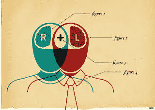
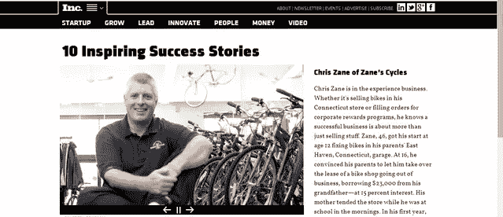
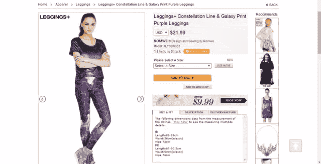
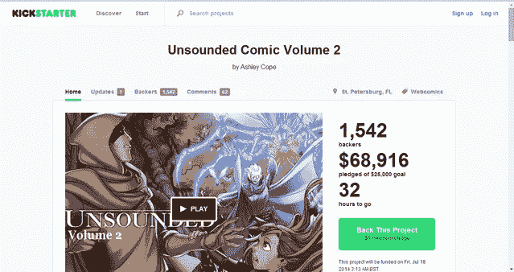
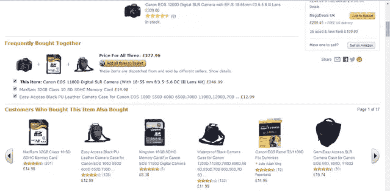
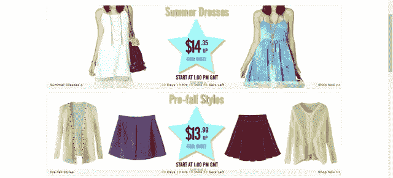

# 神经网络设计:如何制作网络并影响人们

> 原文：<https://www.sitepoint.com/neuro-web-design-make-webs-influence-people/>

图片:opensourceway

在这个关于**神经网络设计** 的简短系列的[第一部分中，我们看到了我们的决策行为是如何受无意识处理控制的，以及我们的体验是如何受外部因素驱动的，如社会认可、相似性和其他有趣的人类因素。](https://www.sitepoint.com/neurology-user-behaviour/)

现在是时候看看这些原则的实际应用了。

在第二部分，我会给你一些建议，如何让网站更有说服力，更容易让人“点击”，或者采取行动。希望你会发现它们很有用，尤其是如果你有一个电子商务，并希望提高你的销售。

我把它们分成了 6 条原则，你在规划网站营销策略时应该考虑(如果你是卖家)或者牢记(如果你是买家)。

## 1).相似性:一张图胜过千言万语

图像构成了我们思维的大部分，不管它们起源于何种感官形态，也不管我们是想到一个物体(如一艘船)还是想到与物体相关的过程(如一次乘船旅行)、词语或符号。

简而言之，通过图像传达的信息比书面数据更容易被记住，我们也给予它更多的关注。

**总结**:使用少量精心挑选的词语来描述你的产品或服务，并结合吸引人的、精辟的形象。

## 2).害怕失去

我们生来就注意和关注那些会引发我们对失去的恐惧的情况。

事实上，对失败的恐惧比赢得或获得的机会更能激励我们。面对潜在损失的情况，我们的身体和潜意识比意识水平更快地被激活。

一旦解释完毕，想象一下像*只有两个库存*这样的东西对我们大脑的影响。这是一个打算使用电子商务服务销售产品的人应该深入探讨的话题。在下图中，你可以看到一个应用于网站的例子。

如果某样东西供应有限，我们会认为它更有价值，我们会更想要它。产品的稀缺性导致我们迅速采取行动。这适用于产品，也适用于信息。事实上，如果我们认为信息很难获得，我们会赋予它更大的价值。

如果你有一个电子商务，并且想知道为什么你的产品会很快断货，你应该反思并观察在那个特定的时刻你的商店里有多少商品。

## 3).讲故事

作为人类，我们倾向于用叙事的方式思考。使用故事和传说的网站会吸引我们的注意力。

事实上，仅仅使用单词**‘故事’**本身就非常有效。将图像和故事结合起来是吸引注意力、抓住注意力并帮助我们回忆所见所闻的一种强有力的方式。

最好的例子之一就是众筹宠儿 [Kickstarter](http://kickstarter.com/ "Kickstarter") 如下图所示。

想在众多众筹网站中的一个上开始一个新项目的人应该仔细考虑他们如何管理他们的拷贝。

在竞争激烈的市场中，写一份精确而简洁的描述，阐明项目目标，并试图吸引潜在支持者的情绪，这些都是取得成功的关键步骤。

## 4).给予社会认可

社会认可的概念在许多方面与前面描述的概念相关联。

我们*是*社会性动物。我们总会找到一种方法，利用任何现有的技术来交流和发展社会关系。我们生活在这样一个时代，像 T3、T5、T7 这样的 T2、T5 和 T6 评论是基本货币。

也许我们比以往任何时候都更需要以虚拟的方式分享我们的想法、感受和情绪。但是我们经常低估这些简单的活动对读者行为的说服力。

使用说服原则的社交网站是发展最快的。如果你想实现下一个大的创新网络，试着想象如何在社会意义上使用一项新技术。

这就是为什么(正如我在本文第一部分中提到的)我们经常在了解到两条信息中的一条时采取行动:

*   或许通过阅读评论，了解了其他人对特定产品或服务的体验；
*   当我们通过网站本身提供的建议(例如“ColoradoMom74 刚刚带来了一套 3 碗搅拌机”)发现其他人正在做的事情时。

在这种情况下，最符合这一原则的例子是亚马逊。

这张图片完美地解释了我的意思:网站(在这种情况下是亚马逊)根据我们考虑购买的产品提供了一些建议。因此，如果我们需要购买一台新相机，系统会“记住”我们可能还需要一个外部存储卡、一个外壳或一个镜头。

你买得越多，他们当然赚得越多。通过这种方式，他们成功地激发了你的需求感。

你真的需要那些额外的东西吗？

就像超市队列中的巧克力和垃圾杂志一样，你可能不会。

## 5).促进稀缺

能够立即得到某样东西的想法会强烈地推动人们采取行动并立即购买。

在短时间内拥有物品的能力(或者，更好的是，现在！)，影响我们的中间脑。它将试图在正在执行成本/收益分析的逻辑大脑上占上风，让该对象立即等待。这个时刻影响着我们的选择。

销售将在 19 小时 10 分 58 秒后结束。隐藏的信息是:“快点，没有多少时间了！”。我们中有谁从来没有在这样的心情下买过东西？

我们都知道说服力有多大…

## 6).省下的每一分钱都是赚来的

用“*展示你的产品，一切都包括了*，然后让买家知道他们可以“节省更多！”通过删除“可选的额外功能”,比在基础产品上增加额外功能更有效。

此外，如果你想让用户在你的网站上选择一个特定的产品，你应该先展示它。当用户进行昂贵的购买时，如果提供的相关产品很贵，但远低于他最初的购买(例如，购买 MacBook Air 时附带 100 美元的笔记本电脑外壳)，他或她可能会两者都买。

相反，如果用户稍后回来购买产品，他或她会倾向于省钱。

## 结论

在这个由两部分组成的简短系列中，我们已经看到了神经网络设计的一些原则。它们有助于学习如何设计吸引潜意识的网站，以促使人们采取行动。

你可以通过阅读《神经网络设计:是什么让它们点击》这本书来深化这两篇文章中讨论的所有主题。苏珊·温申克。

这绝对值得一读。

## 分享这篇文章