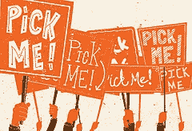
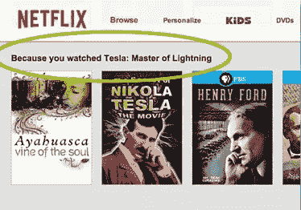
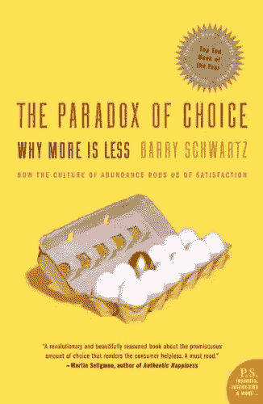

# 神经学和用户行为:我们知道什么

> 原文：<https://www.sitepoint.com/neurology-user-behaviour/>

照片:Eduardo muertes

眼球和转化。我想大多数人都会同意，这是我们衡量任何网站成功与否的两个主要方法。

当然，网站传达特定的信息，可能是为了实现一系列不同的小目标而建立的。大多数网站都是为了吸引用户并把他们带到一个企业——尤其是电子商务——而建立的，并且可能包含一个潜在的策略，旨在吸引更多的潜在客户，并把他们中最大的比例转化为购买。

近年来，人类因素中出现了一种新现象，叫做神经网络设计。这是一种从各个领域借鉴而来的方法，它处理以下各项的结合:

*   动机研究
*   决策
*   神经系统科学

它的目的是提供一个有用的方法来创建更吸引人和更有效的网站。

那么，神经网络设计的概念是什么，它可以以什么方式应用于现实世界呢？

在这篇由两部分组成的文章中，我们将首先讨论一些一般的思想和原则，然后我将继续介绍一些将它应用到您自己的设计中的技巧和技术。

## 神经网络设计:它是什么？

神经科学的最新研究为人们如何思考、如何决策以及什么促使人们采取行动提供了见解。无论你是想创建一个网站，软件，游戏，还是应用程序，你都应该关注这些最新的研究，并学习如何将神经科学中的研究应用到你的设计项目中。

### 首先，我们先来消解几个迷思。

我们喜欢(并且习惯于)认为，我们是在花了一些时间进行了仔细的冥想之后才做出决定的。事实上，我们的大多数选择都来自于无意识的层面。

图片:ota_photos

其次，我们经常相信自己是这些选择的自信主人，但事实是，一般来说，人们会观察其他人的态度，然后决定做什么(往往在这个过程中改变自己的想法)。这是真的，尤其是在他们不确定如何行动(尤其是 ***if*** )的怀疑环境中。

有时，只有当我们知道其他人对某种产品或服务的体验时，我们才决定采取行动。

如果你在完成购买前从未看过关于商品或服务质量的评论，请举手。我怀疑现在很少有人举手。

在其他情况下，当我们知道其他人正在购买同样的产品时，我们说服自己购买，也许他们现在正在购买。

当然，这不仅仅适用于购买。想想看，在你的上一个视频结束后，你如何决定在 YouTube 或网飞等网站上看下一个视频。

网飞:因为你看了…

同样，当你在网上购物时，我怀疑你有好几次点击了邀请，比如*“你可能也会感兴趣……”*，或者*“买了这件商品的人也买了……”*。

我错了吗？

另一件可能不太明显的事情是，尽管我们可能会说我们更喜欢有很多选择的自由，但现实是，当有太多选择需要评估时，我们许多人都无法做出决定。我们因优柔寡断而瘫痪。

这种情况下的结果是什么？简单。我们什么都不买。

这种考虑让我们想到了**“多即是少”**的概念。我们倾向于认为更多的选择意味着更好的选择和更大的满足感。事实是，它会让我们在做出决定之前就对自己的决定产生怀疑。此外，它会产生不切实际的期望，并为我们的一些失败引发不必要的负罪感。

如果你对这个话题感兴趣，你应该看看由**巴里·施瓦茨**写的书，书名为[选择的悖论](http://www.amazon.com/dp/145588443X)。

选择的悖论——巴里·施瓦茨

在他的作品中，作者解释了为什么太多的好东西被证明对我们的心理和情感健康有害。综合当前社会科学的研究，他提出了一个违反直觉的案例，即消除选择可以大大减少我们生活中的压力、焦虑和忙碌。

这是一本值得一读的书，让你明白如何只关注重要的决定而忽略其他的，最重要的是，从我们做出的决定中获得更大的满足感。

访问者对给定网站的反应基于三个方面:情感、逻辑和本能，它们可以为我们成功设计网站提供重要和有益的线索。这是由于大脑的物理结构。

你们中的许多人可能已经知道我们的大脑由三部分组成:旧的、中间的和新的。这有点像一个古老的城市，每一代人都是围绕着上一代人建造的。从外面看，你可能会看到一个闪闪发光的现代大都市，但毫无疑问，真正的权力仍然通常来自古老的核心城市。

*   古老的核心大脑负责我们的生存，并对食物、性和危险上的所有刺激做出反应；
*   中间层次处理原始情绪；
*   最近的层次管理更高层次的思维和常识。

我们的成功取决于我们在整合这些细分市场的特点和需求方面做得如何。

旧大脑照顾我们:它保护我们，知道我们何时饥饿，并帮助我们繁殖后代。如果你想抓住某人的注意力，你首先需要吸引他/她的旧大脑的注意力。

这通常是通过使用清晰的激励信号，展示食物，使用性暗示，以及通过使用单词**“你”**来表达他们的自我意识。

另一方面，如果你想触及用户最深最私人的感受，你需要找到一种方法来挖掘和激发大脑的这个中间层。

你是怎么做到的？

人们更有可能会听他们喜欢或觉得有吸引力的人发来的信息。请记住，将一个物体与一个名人或有吸引力的人捆绑在一起也会使这个物体更有吸引力。人们发现更容易认同那些与他们相似的人，或者那些他们认为与他们有共同背景或价值观的人。

如果你的目标是说服人们去完成一个特定的任务，你网站上的故事和图像应该与目标受众相匹配，或者反映潜在的受众。

我们有一个奇怪的大脑，不是吗？我们实际上刚刚触及了这个话题的表面。

### 结论

在这篇文章中，我们已经看到了我们的决策行为是如何经常被无意识处理所支配，以及我们的经验是如何被外部因素所驱动的，例如社会认可、相似性和其他东西。

在本文的下一部分中，我们将看到所有这些理论被应用到一些实际的例子中。我们还将调查要应用的设备和技术，以便注意到即时和显著的改进。

## 分享这篇文章