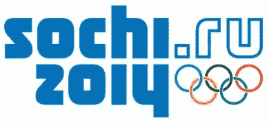
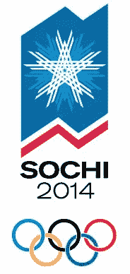
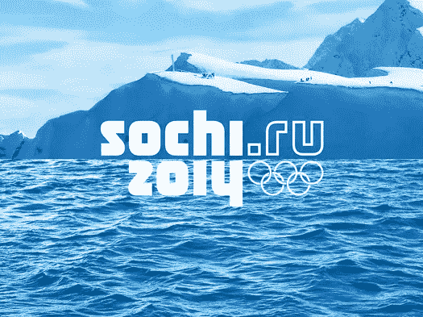

# 2014 年冬奥会新品牌揭晓

> 原文：<https://www.sitepoint.com/new-branding-revealed-for-winter-olympics-2014/>

2014 年索契冬奥会的官方标志于上周公布。这是俄罗斯举办的第一届冬季奥运会，也是第一个包含互联网网址的奥运会标志。

根据该品牌的官方广告，

> 索契 2014 年奥运会会徽保持了过去和未来之间的对话。该品牌融合了俄罗斯文化的各个方面，可以宣传我们充满活力的国家的多个形象:
> 
> *   一个历史悠久、前途光明的国家
> *   一个对机遇和梦想成真的热情敞开大门的国家
> *   一个致力于平等和庆祝多样性的国家。

在最初的申办过程中，每个城市都会提供一个标志，有时获胜的城市会更换这个标志。你可以在下面看到原始的投标标志。他们应该坚持使用这个标志，而不是用新的官方标志来代替它吗？

新的官方印刷标志被设计成顶部是索契，下面是年份。索契市坐落在大海和山脉的交汇处，这是设计背后的部分原因。大海像一面镜子反射着群山。标志由 Interbrand 和索契 2014 组委会成立的专家品牌委员会设计。

我不确定新的官方标志是否看起来像是几年前公布的伦敦 2012 年奥运会标志后的一种解脱，这个标志受到了普遍的反对。我喜欢左手边的反射字体，但是右手边看起来有点忙。

[Brand Republic](http://www.brandrepublic.com/News/970812/Sochi-2014-unveils-first-Olympic-logo-London-2012/) 有一篇关于新 logo 的精彩深入的文章，以及[多家伦敦设计机构对 logo](http://www.brandrepublic.com/News/971202/UKs-leading-design-agencies-review-latest-Olympic-offering/?DCMP=ILC-SEARCH) 的评论和讨论。

**你觉得官方 logo 怎么样？** **有必要在 logo 里有网址吗？**

## 分享这篇文章