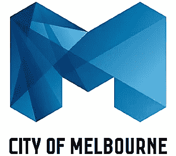
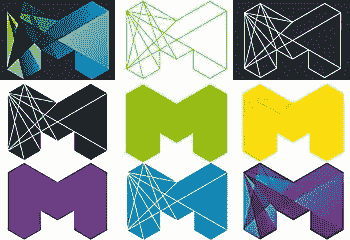
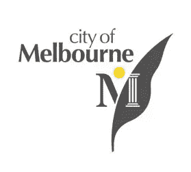
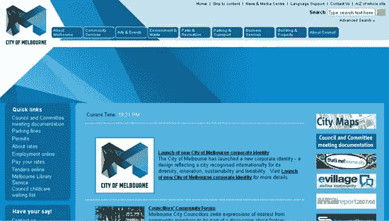
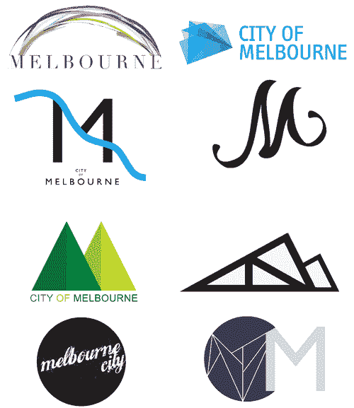

# 墨尔本的新企业形象

> 原文：<https://www.sitepoint.com/new-corporate-identity-for-melbourne/>

澳大利亚墨尔本市议会，SitePoint 的家乡，最近公布了他们的城市新标志设计。新标志上有一个大而醒目的 m。

这个标志是由美国大型品牌公司 Landor Associates 设计的，他们也在可口可乐 100 周年纪念日(T2)重新设计了可口可乐的标志。新的墨尔本标志有几种变化，在一些版本中看起来几乎像宝石，或者对一些批评家来说，像廉价的玻璃。

墨尔本市长的官方广告；

> 新的设计将成为墨尔本的标志，现代、充满活力、酷的城市的代名词，墨尔本现在是这样，将来也会是这样。

墨尔本之前的 logo(见下图)，大概是 15 年前设计的，是一片树叶，被认为有些弱。

不用说，这些东西并不便宜，而且已经有人表示担心新标志花费了太多。该市市长透露，初步研究花费墨尔本市议会 9.1 万美元，而最终设计花费 14.8 万美元。(我在这里做一个心理笔记，以收取更多的标志设计)。

市长为成本辩护，宣称从长远来看，使用新标志可以节省开支。旧的树叶标志将被逐步淘汰，每年为该市节省约 9 万美元。

该标志只是整体品牌的一部分，现在已经出现在市议会的网站、文具、小册子上，并将出现在全市各地。

我个人喜欢深蓝色多面的版本，但我不太热衷于平面的颜色或轮廓的版本。不过，这是对老叶子的一大改进。

澳大利亚先驱太阳报要求当地的设计学生制作一个标志来击败新的昂贵的 M，这里有几个制作的标志。你怎么想呢?有更好的赠品吗？

你觉得新的墨尔本标志怎么样，喜欢还是讨厌？或者只是漠不关心？你如何看待设计和开发这样一个新的企业形象所涉及的成本？

## 分享这篇文章