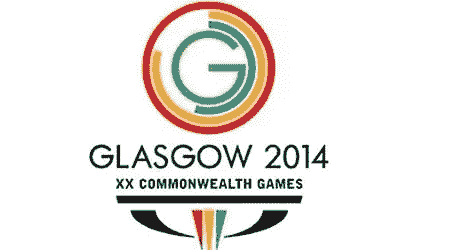

# 格拉斯哥 2014 年英联邦运动会新标志揭幕

> 原文：<https://www.sitepoint.com/new-logo-for-glasgow-2014-commonwealth-games-unveiled/>

将在格拉斯哥举行的 2014 年英联邦运动会的新标志今天公布。据报道，这个标志是由格拉斯哥的设计机构[品牌](http://marquecreative.com/)和[设计的](http://news.bbc.co.uk/2/hi/uk_news/scotland/8551841.stm)，据说花费了 9.5 万英镑。该设计基于与游戏相关的数字。这是第 20 次举办奥运会，有 17 个运动代表，它发生在 11 天的比赛和 1 个主办城市。

如果你认为它只是几个包裹在字母 G 周围的部分完成的圆环，下面是来自[游戏网站](http://www.glasgow2014.com/news/latest_news/glasgow_2014_unveils_identity.aspx)的新闻稿的完整解释:

> 1.格拉斯哥 2014 年英联邦运动会将是第 20 届。这是一个里程碑式的数字，增加了格拉斯哥作为东道主的自豪感。外环，包括其他环，是一种强烈的，充满活力的红色——英联邦运动会联合会(CGF)调色板的官方“真正的红色”。
> 
> 2.2014 年格拉斯哥奥运会将有 17 个比赛项目。品牌标识的下一环是 CGF 调色板中的“凯旋黄”，代表运动项目的数量。正好是整圈的 17/20。
> 
> 3.格拉斯哥 2014 将举办为期 11 天的比赛，这是品牌标识的第三环，以 CGF 的“传统蓝”呈现，占整个圆环的 11/20。
> 
> 4.我们品牌标识的核心是一个主办城市，以“G”代表格拉斯哥，在盖尔语中是“亲爱的绿色之地”的意思，并且是一种合适的充满活力的绿色。

英联邦运动会联合会也首次批准使用另一种盖尔语形式的设计。盖尔语版本包含“Glaschu 2014”类型，后跟“20mh Geamaichean a 'Cho Fhlaitheis”(第 20 届英联邦运动会)。

[logo Design Love](http://www.logodesignlove.com/glasgow-2014-logo-revealed) 也有对新 Logo 的分析，你可以在这里看到动画版 Logo，在[苏格兰电视台网站](http://video.stv.tv/bc/news-100308-logo/)上。

对这个标志有什么想法吗？你认为这是一个好的设计还是你认为这是一种你已经见过很多次的设计？

## 分享这篇文章