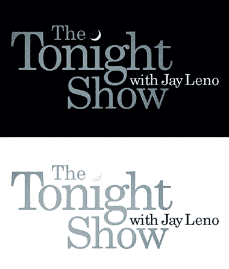
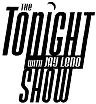
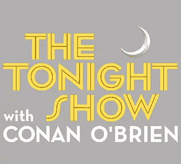

# 莱诺的新标志

> 原文：<https://www.sitepoint.com/new-logo-for-leno/>

在饱受争议和一番唇枪舌剑之后，美国脱口秀主持人杰伊·莱诺将重返他被柯南·奥布莱恩霸占的深夜秀时段。作为回报的一部分，该节目有一个新的标志，这是昨天在[thejaylenoshow.com](http://www.thejaylenoshow.com/backstage-with-bryan/new-logo---new-stage/)网站上公布的。新标志的特点是黑色背景上的深蓝色文字，一个小的月亮像一个点一样挂在字母“I”上。“和杰·雷诺在一起”几个字用白色插在中间。

(图片来自 Twitpic 上的 [B Carvahlo)](http://twitpic.com/13p1lz)

这是杰·雷诺之前的《今夜秀》中的旧标志，也是在字母“I”上使用了四分之一月亮。

下面你可以看到由柯南·奥布莱恩主持的《今夜秀》的标志。2009 年 4 月，当柯南准备从杰·雷诺手中接过帅印时，这个特别的标志被公之于众。当时他说:

> 我想要一个标志，承认*今夜秀*悠久、丰富的传统，同时在帽子、t 恤、杯子、草坪家具、笔记本、高脚杯、骨灰盒、除颤器、水瓶、手机、运动器材、钢笔、吸尘器、编钟和我们新的男女通用的古龙水系列上仍然很好看。

(有趣的是，在如此多的品牌案例中，这都是事实)。

新的 Leno 标志与此相差不远，但在颜色或排版方面并不突出。话虽如此，我确实喜欢新标志中使用的字体和颜色的简洁。

更重要的是，你认为新的 Leno 标志怎么样？他们应该回到原来的样子，还是现在已经太过时了？或者他们应该只是在灰色和黄色版本上替换柯南·奥布莱恩的名字？

## 分享这篇文章