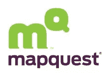
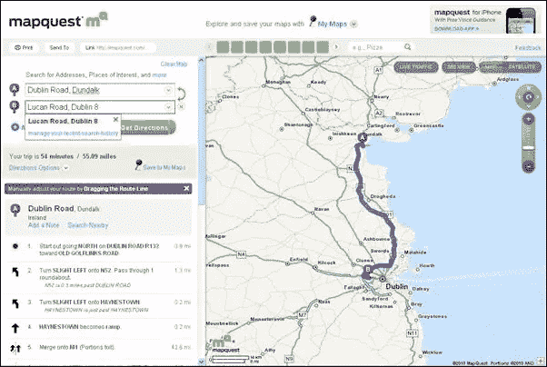

# MapQuest 的全新外观

> 原文：<https://www.sitepoint.com/new-look-feel-for-mapquest/>

[MapQuest](http://new.mapquest.com/) 提供地图和方向工具服务，直到几年前 ***还是*** 的方向网站，直到谷歌地图粗暴地以其花哨的街景和往返任何地方的即时方向打断了它。今天，MapQuest 推出了一个全新的身份和一个完全重新设计的网站，进行反击。

**新 Logo**

首先，一个小图标的历史。MapQuest 于 2000 年被 AOL 收购，并使用了这个古怪的标志，两端有斜角、阴影和卡通破折号:

在一个非常 *un-web 2.0* 的举动中，该徽标后来被更新并更改为这个没有效果的更简单版本:

今天发布的新品牌标识有一些重大变化，最明显的是颜色和字体的变化。漫画风格的字体已经改为小写无衬线字体，紫色为“mapquest ”,亮绿色为风格化字母 m 和 Q。

新的标志设计是由品牌咨询公司 Wolff Olins 创建的，他说这次改造旨在强调品牌的新焦点和定位。

**网站大修**

除了新的品牌，网站的设计和功能也有了很大的改进，用户友好是一个重要因素。新功能包括:

单行搜索框和重新设计的主页，更突出地显示地图。

能够搜索“时间类型的内容”，如 7 月 4 日的烟花表演或万圣节的鬼屋。

“我的地图”可让您个性化、保存和共享地图、路线和收藏的热门地点。

未来的计划包括允许用户上传照片，以建立一个社区社交网络的感觉。

你可以在[new.mapquest.com](http://new.mapquest.com)看到网站和徽标的新变化，它目前处于测试阶段，但应该会在 8 月份之前在主网站上全面推出。

你对新 logo 的重新设计有什么看法？你认为 MapQuest 与谷歌地图相比会如何？

## 分享这篇文章