# CSS3 背景中的新属性和值

> 原文：<https://www.sitepoint.com/new-properties-and-values-in-backgrounds-with-css3/>

在过去的几年中出现了很多文章，向我们展示了各种各样可以用 CSS3 做的很酷的事情。然而，CSS3 经常被忽视的一个方面是 CSS3 背景。

有了 CSS3，我们有了一系列新的属性和值，让我们可以更好地控制背景图像。然而，在我们谈论这些新的属性和值之前，我们需要理解三个重要的框。

## 三个特殊的盒子

### 内容盒

让我们从一个内部包含一些内容的简单容器开始。虽然我们看不到它，但在内容的周围有一个无形的盒子，叫做`content-box`。

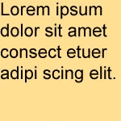
*内容框图*

### 填充框

如果我们要在这个元素的所有边上添加填充，我们就会有第二个盒子，叫做`padding-box`。

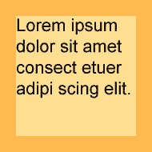
*填充框图*

### 边框

如果我们在`padded-box`周围添加一个边框，我们就会有第三个盒子，称为`border-box`。

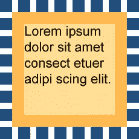

<address>Diagram of border-box</address>

我们为什么要关心这些盒子？这些框用于定义浏览器最初将背景图像放入框中的位置，我们如何重新定位这些背景图像，甚至我们如何裁剪这些背景图像。

## `background-position`属性

默认情况下，背景图像放在`padding-box`的左上角。

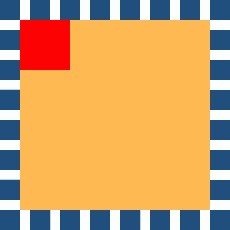
*初始背景图位置图*

我们可以通过使用`background-position`属性来改变这个默认位置。在 CSS2.1 中，我们可以使用两个值来确定背景图像相对于元素的位置。第一个值表示水平位置，第二个值表示垂直轴。

```
p { background-position: 10px 10px; }
```

### 值的类型

我们可以使用长度值、百分比值或关键字来定义水平轴和垂直轴。

```
p { background-position: 10px 10px; }
p { background-position: 20% 50%; }
p { background-position: left bottom; }
```

长度值可以包括`em`、`ex`(小写字母“x”的高度)、`px`(像素)、`in`(英寸)、`cm`(厘米)、`mm`(毫米)、`pt`(磅)或`pc`(十二点活字)。

```
p { background-position: 1em 1em; }
p { background-position: 2ex 2em; }
p { background-position: 3px 3px; }
p { background-position: 4in 4in; }
p { background-position: 5cm 5cm; }
p { background-position: 6mm 6mm; }
p { background-position: 7pt 7pt; }
p { background-position: 8pc 8pc; }
```

如果我们使用一个长度或百分比值，这些值取自元素的左上角。

### 正值和负值

我们可以使用正值或负值来确定背景图像的位置。

正值会将背景图像向右下方移动-在元素的背景区域内。

```
p { background-position: 5px 9px; }
```


*显示使用正值定位的背景图像的图表*

负值会将背景图像向左上方移动，移出元素的背景区域。

```
p { background-position: -5px -9px; }
```


*显示使用负值定位的背景图像的图表*

### CSS3 附加功能

在 CSS3 中，我们可以为`background-position`指定多达四个值。前两个值代表水平轴。后两个值代表垂直轴。

```
p { background-position: left 10px top 15px; }
```

这是一个强大的补充，因为这意味着我们可以使用与元素的四个角中的任何一个相关的长度值或百分比值来定位图像，而不仅仅是左上角。然而，Opera 11 是目前唯一支持使用四个值用于`background-position`的浏览器。

## `background-repeat`属性

默认情况下，图像将从填充框的左上角开始沿 x 轴和 y 轴重复。即使背景图像从`padding-box`的左上角开始，它们也会向外朝各个方向重复，包括进入`border-box`区域。在 CSS2.1 中，我们可以使用四个不同的关键字来改变重复行为。

```
p { background-repeat: repeat; }
p { background-repeat: repeat-x; }
p { background-repeat: repeat-y; }
p { background-repeat: no-repeat; }
```

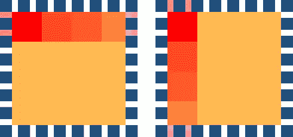
*显示重复 x 和重复 y 的图表*

在 CSS3 中，我们现在可以使用两个值而不是一个值来定义`background-repeat`。这两个值中的第一个代表水平轴。第二个值代表垂直轴。如果我们只使用一个值，浏览器会将其解释为双精度值。这允许`background-repeat`值向后兼容。

```
p { background-repeat: repeat repeat; }
p { background-repeat: repeat [repeat]; }
```

### 新的`background-repeat`值—`space`和`round`

CSS3 还允许我们对`background-repeat`属性使用两个新值——它们是`space`和`round`。

`space`值将图像设置为尽可能频繁地重复，以适应背景区域，然后图像被隔开以填充该区域。第一个和最后一个图像接触区域的边缘。

```
p { background-repeat: space; }
```

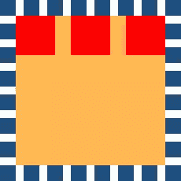
*显示用空间值设置的背景图像的图*

`round`值将图像设置为根据背景区域的大小重复播放。如果它不适合整数倍，它将被重新缩放，以便适合容器的尺寸。请注意，使用这种方法可能会拉伸或扭曲背景图像。

```
p { background-repeat: round; }
```

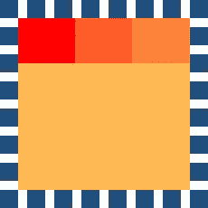
*显示背景图像设置为圆形值的图*

这些新的值给了我们更多的灵活性来布置背景图片。例如，我们现在可以使用两个值来定义不同的水平和垂直行为。

```
p { background-repeat: space no-repeat; }
```

## 三个新属性

在 CSS3 中，我们还可以使用三个全新的背景属性:`background-origin`、`background-clip`和`background-size`。

## `background-origin`属性

属性用来决定背景图片在盒子里的位置。我们可以使用三个可能的值来定位背景图像:

```
p { background-origin: content-box; }
p { background-origin: padding-box; }
p { background-origin: border-box; }
```

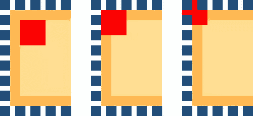
*显示相对于内容框、填充框和边框定位的背景图像的图*

<caption>Browser support for background-origin</caption>
| 火狐 3.6，4 | 是 |
| Safari 4，5 | 是 |
| Chrome 10，11 | 是 |
| IE 6，7，8 | 不 |
| IE 9 | 是 |
| 歌剧 10，11 | 是 |

## `background-clip`属性

`background-clip`属性用于确定背景图像在背景区域内的何处以及是否被剪切(或切断)。我们可以使用三个可能的值来裁剪背景图像:

```
p { background-clip: content-box; }
p { background-clip: padding-box; }
p { background-clip: border-box; }
```


*显示内容框、填充框和边框内背景图像剪辑的图*

<caption>Browser support for background-clip</caption>
| 火狐 3.6 | 支持`border`和`padding`的旧语法，但不支持`content` |
| 火狐 4 | 是 |
| Safari 4，5 | `-webkit-background-clip` |
| Chrome 10，11 | 是 |
| IE 6，7，8 | 不 |
| IE 9 | 是 |
| 歌剧 10，11 | 是 |

## `background-size`属性

在 CSS.1 中，我们可以将背景图像应用到元素中，但是我们没有办法控制这些背景图像的大小。CSS3 允许我们使用`background-size`属性来设置背景图片的大小。我们可以使用长度值、百分比值或两个新关键字来设置大小:`cover`和`contain`。

```
p { background-size: 10px 20px; }
p { background-size: 10% 20%; }
p { background-size: cover; }
p { background-size: contain; }
```

<caption>Browser support for background-size</caption>
| 火狐 4 | 是 |
| Safari 5 | 是 |
| 铬 11 | 是 |
| IE 9 | 是 |
| 歌剧 11 | 是 |

### 长度值

长度值设置背景图像的高度和宽度。第一个值设置宽度；第二个值设置高度。如果只给定一个长度值，第二个值被设置为 auto 的“初始值”。

```
p { background-size: 10px 20px; }
p { background-size: 10px [auto]; }
```

### 百分比值

百分比值将高度和宽度设置为父元素的百分比。第一个值设置宽度；第二个值设置高度。与长度值一样，如果只给定一个百分比值，第二个百分比值将被设置为 auto 的“初始值”。

```
p { background-size: 20% 40%; }
p { background-size: 10% [auto]; }
```

### `contain`值

`contain`值将缩放图像(同时保持其纵横比),以便整个图像能够适合背景区域。

```
p { background-size: contain; }
```

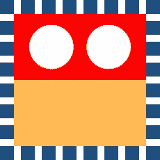
*用包含*的图显示背景-图像集

### `cover`值

`cover`值会将图像缩放到完全覆盖背景区域的最小尺寸(同时保持其纵横比)。

```
p { background-size: cover; }
```

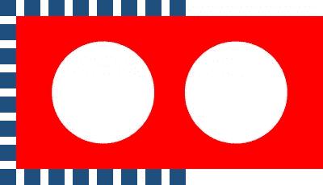
*显示带有封面的背景图像集的图表*

## 多重背景

使用 CSS2.1，我们只能给任何 HTML 元素添加一个背景图片。但是，CSS3 允许我们向任何元素添加多个背景图像！

<caption>Browser support for background-size</caption>
| 火狐 3.6 以上版本 | 是 |
| Safari 4，5 | 是 |
| 铬 10+ | 是 |
| IE 9 | 是 |
| Opera 10+ | 是 |

## 手写多幅背景图像

CSS3 允许我们将多个逗号分隔的值放入任何背景属性中。

```
p {
	background-image:
		url(01.gif),
		url(02.gif),
		url(03.gif);
}
```

下面是一个元素中三个背景图片的例子——手写的。

```
p {
        background-image: url(1.gif), url(2.gif), url(3.gif);
        background-position: left center, 50% 30%, 10px 100px;
        background-size: 20px 300px, 10% auto, auto;
        background-repeat: no-repeat, repeat, repeat-y;
        background-attachment: scroll, scroll, scroll;
        background-origin: padding-box, padding-box, border-box;
        background-clip: border-box, border-box, border-box;
}
```

根据其他背景属性中的相应值来调整每个图像的大小、位置和平铺。如果属性没有足够的逗号分隔值来匹配层数，浏览器必须通过重复值列表来计算其已用值，直到有足够的值。

背景图像随后分层显示，一层在另一层之上。列表中的第一个图像是离用户最近的层，下一个图像绘制在第一个图像的后面，依此类推。

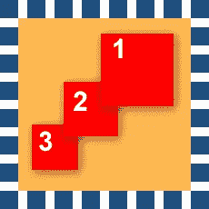
*图中显示的背景图片层层叠加*

### 使用`background-color`

任何元素只能定义一个`background-color`！这个`background-color`位于最后一层背景图片的下面。如果分配了一个以上的`background-color`值，所有背景色都将被忽略。

```
p {
        background-image: url(1.gif), url(2.gif), url(3.gif);
        background-position: left center, 50% 30%, 10px 100px;
        background-size: 20px 300px, 10% auto, auto;
        background-repeat: no-repeat, repeat, repeat-y;
        background-attachment: scroll, scroll, scroll;
        background-origin: padding-box, padding-box, border-box;
        background-clip: border-box, border-box, border-box;
        background-color: yellow;
}
```

## 速记多个背景图像

简写的`background`属性允许我们使用一个规则来设置所有单独的背景属性。

在 CSS2.1 中，我们可以在一个后台速记属性中使用 5 个不同的`background`属性:

```
[background-color]
[background-image]
[background-repeat]
[background-attachment]
[background-position]
```

在 CSS3 中，我们现在可以使用八个不同的`background`属性。

```
[background-color]
[background-image]
[background-repeat]
[background-attachment]
[background-position]
[background-origin]
[background-clip]
[background-size]
```

多个速记背景的书写方式与单个速记背景相同——用逗号分隔每个背景值。

```
p {
	background:
		url(01.gif) no-repeat,
		url(02.gif) repeat left bottom,
		url(03.gif) repeat-y 10px 5px;
}
```

就像手写的多个背景一样，每个背景图像都显示为一个层，一个在另一个之上。

### 关于背景色的一个注记

只有被称为“最终层”的最低层可以被赋予一个`background-color`。`background-color`仅位于最后一层背景图像的下方。如果一个`background-color`值被分配给除最终层之外的任何其他层，整个规则将不会显示。

```
p {
	background:
		url(01.gif) no-repeat,
		url(02.gif) repeat left bottom,
		url(03.gif) repeat-y 10px 5px yellow;
}
```

使用 background-color 属性将背景色作为单独的声明添加可能更安全。

```
p {
	background:
		url(01.gif) no-repeat,
		url(02.gif) repeat left bottom,
		url(03.gif) repeat-y 10px 5px yellow;
	background-color: yellow;
}
```

## 一些有速记背景的人。

如果你正在编写更复杂的速记规则，你必须意识到一些浏览器的怪癖和缺陷。理论上，所有背景属性的正确语法是:

```
p {
	background:
		[background-image]
		[background-position]
		[/ background-size]
		[background-repeat]
		[background-attachment]
		[background-origin]
		[background-clip]
		[background-color];
}
```

你可能注意到了在`background-position`和`background-size`之间有一个正斜杠。Safari 5、firefox 4 和 Chrome 10 都有两个这样完整写出规则的问题。

### 问题 1:

当包含正斜杠或背景大小值时，这些浏览器会忽略整个声明。

### 问题二:

当包含两个框值(`background-clip`和`background-origin`)时，这些浏览器会忽略整个声明。只能包含一个值。

因此，在这个时候，对于不太复杂的声明，速记规则是可以的，但是如果您想要包含所有七个属性，目前使用手写可能更好。

## 多种背景和渐变

请记住，渐变是一种生成的图像。它们可以用来代替`url()`值。这意味着您可以在多个背景中包含渐变。

```
p {
	background:
		url(demo.jpg) no-repeat 0 0,
		linear-gradient(left, blue, green);
}
```

## 特定于供应商的扩展和多种背景

当您想要将特定于供应商的属性添加到多个背景中时会发生什么？

浏览器会忽略他们不理解的 CSS 声明。浏览器只理解他们自己的特定于供应商的属性——这是他们的目的。这样做的缺点是，我们不能在一个声明中添加多个特定于供应商的属性，因为所有浏览器都会忽略整个声明。这意味着我们必须为每个特定于供应商的属性重写背景属性。任何其他背景图像必须包含在每个声明中。

```
p {
	background:
		url(demo.jpg) no-repeat 0 0,
		-webkit-gradient(linear, left top, right top, from(blue), to(green));
	background:
		url(demo.jpg) no-repeat 0 0,
		-webkit-linear-gradient(left, blue, green);
	background:
		url(demo.jpg) no-repeat 0 0,
		-moz-linear-gradient(left, blue, green);
	background:
		url(demo.jpg) no-repeat 0 0,
		-ms-linear-gradient(left, blue, green);
	background:
		url(demo.jpg) no-repeat 0 0,
		-o-linear-gradient(left, blue, green);
	background:
		url(demo.jpg) no-repeat 0 0,
		linear-gradient(left, blue, green);
}
```

我们完事了。

虽然 CSS3 无疑为开发人员和设计人员提供了对背景更大的控制，但在这个阶段成功的实现在很大程度上取决于浏览器的支持。

然而，CSS3 带来的变化有足够的空间让开发人员和设计人员忙于学习和实验，因为现代浏览器能够显示他们的努力逐渐变得更加流行。

## 分享这篇文章