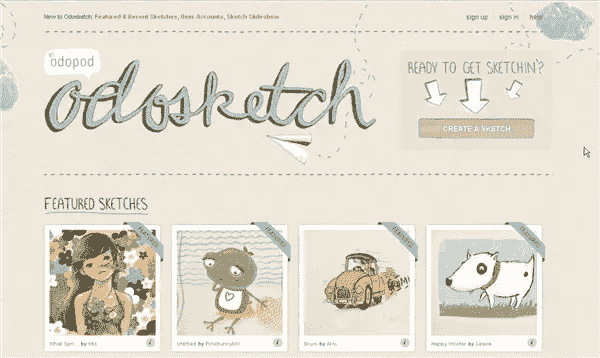
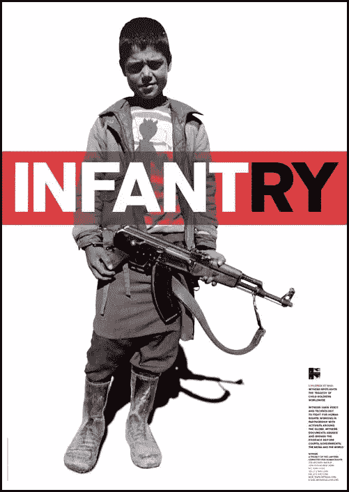
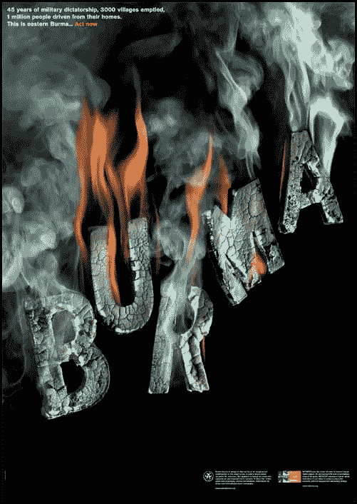

# 新系列:设计中的和谐

> 原文：<https://www.sitepoint.com/new-series-harmony-in-design/>

是时候开始另一个关于设计原则的简短系列了。在接下来的 3 周里，我会发表一些关于设计中视觉和谐以及如何在工作中实现视觉和谐的短文。

视觉和谐基本上意味着你的设计中的元素在美学和主题上的结合或一致。在接下来的几周里，我们将从以下几个方面来看看和谐设计的例子:

*   **重复**
*   **主题参考**
*   **视觉回声**

视觉和谐是通过统一性和多样性的平衡来实现的。这可能意味着选择[互补或相似的配色方案](https://www.sitepoint.com/principles-of-design-colour/)来实现色彩和谐，或者选择[和谐或对比但不冲突的字体](https://www.sitepoint.com/typography-concordant-contrasting-conflicting/)。元素之间的共同特征可以是纹理、图案、颜色、形状或大小。

举个例子，如果你看一下 odosketch 网站，你会发现它使用了互补色，并且有一个完全粗略的主题。颜色、草图纸张纹理、排版、标志设计和网站实际内容之间的相互关系产生了视觉上的呼应。

和谐并不意味着无聊或沉闷。这并不意味着你应该只在关于“美好事物”的设计工作中寻求和谐你可以创造一个和谐的关于战争、饥荒、癌症、死亡的设计作品。设计元素可能与快乐的作品不同，但它们在视觉和主题上仍然彼此一致。

*利帕·皮尔斯的海报/* [*五角星*](http://www.pentagram.com/en/)

*利帕·皮尔斯的海报/* [*五角星*](http://www.pentagram.com/en/)

在缅甸的海报中，火的颜色和文字中使用的橙色以及小标志重复出现。焚烧信件和海报上关于村民被赶出家园的信息之间有着主题上的联系。

你可以看到和谐是视觉艺术的所有方面，从雕塑到绘画和电影。只要稍微仔细观察一下你的日常环境，你就会发现你周围的几乎所有东西都是经过“设计”的。

下周我们将学习重复的用法，我希望你能加入。

## 分享这篇文章