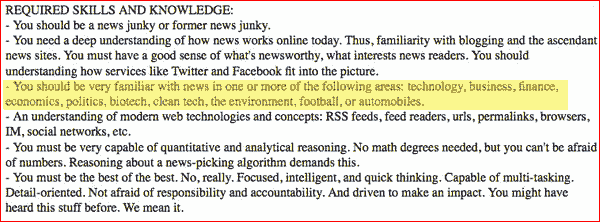

# Techmeme 的新垂直市场:商业、环境、汽车和足球？

> 原文：<https://www.sitepoint.com/new-verticals-for-techmeme-business-the-environment-cars-and-football/>

 **更新:** *一位了解该公司的消息人士向我证实，Epivoz 至少正在为 environment vertical 开发一个新网站，尽管该项目是否已经超越了内部演示还不得而知。*

自从 2005 年在其以政治为主题的哥哥的一个子域上推出以来，Techmeme 已经成为一份日报(每小时？)在技术博客圈的必读网站，就像 [Memeorandum](http://www.memeorandum.com/) 已经成为政治博客圈的必读网站一样。Techmeme 及其相关网站由一家名为 Epivoz 的两人创业公司运营，在博客和新闻爱好者中非常受欢迎，因为它们比谷歌新闻(Google News)和 Topix 等资金更充足的竞争对手更好、更快地呈现当天的头条新闻。

自从 2004 年 Memeorandum 和 2005 年 Techmeme(最初是 Memdorandum 的一个子域名)推出以来，Epivoz 已经在同一后端推出了另外两个网站:2006 年 3 月的名人八卦网站 [WeSmirch](http://www.wesmirch.com/) 和几周后的棒球新闻网站 [BallBug](http://www.ballbug.com/) 。

“Memeorandum 的下一个垂直网站是什么？(创始人 Gabe Rivera)不会说得太具体，但据我所知，他是一个讨论追随者。当 BallBug 推出时，Mike Arrington 想知道:“如果博客在谈论一些事情，并且来回链接很多，预计 Memeorandum 最终会出现。然而，在这中间的两年半时间里，Techmeme 帝国的规模保持不变。

然而，周末发布的一则招聘信息指出了 Techmeme 未来可能的扩张方向。Epivoz 希望雇用第三名员工，他们希望获得的一项必备技能是熟悉以下主题:“技术、商业、金融、经济、政治、生物技术、清洁技术、环境、足球或汽车。”

Epivoz 的两个最受欢迎的网站(分别是 Techmeme 和 Memeorandum)已经涵盖了技术和政治，但商业、金融、经济(所有当前流行的相关问题)、生物技术、清洁技术、环境、足球和汽车为该公司提供了潜在的新垂直市场。Techmeme 会准备推出新的配套新闻观看网站吗？听起来的确是这样。

鉴于目前世界经济的状况，财经新闻已经成为许多消费者的头号话题，因此作为网站的扩展领域，这很有意义。清洁技术和环境也很有意义，因为石油价格已经在这些话题上引起了很多主流兴趣。与此同时，足球和汽车是热门话题，非常适合 Epivoz 基于链接的算法新闻收集框架。

## 分享这篇文章