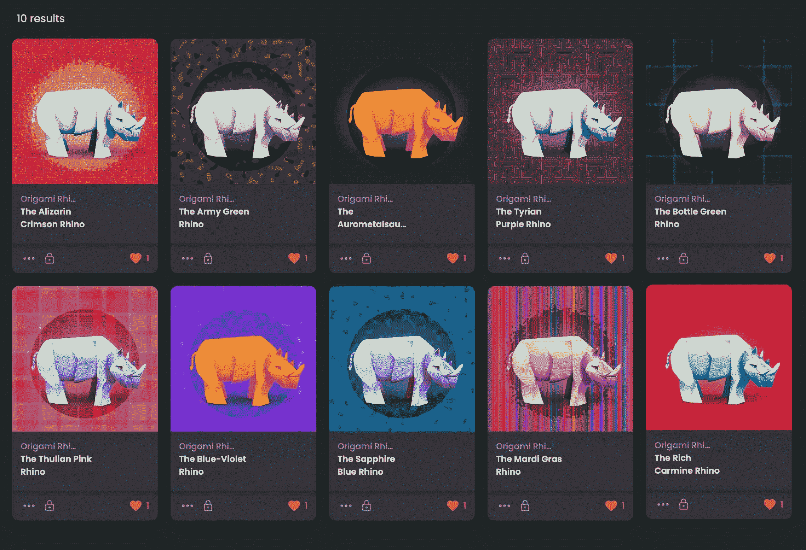
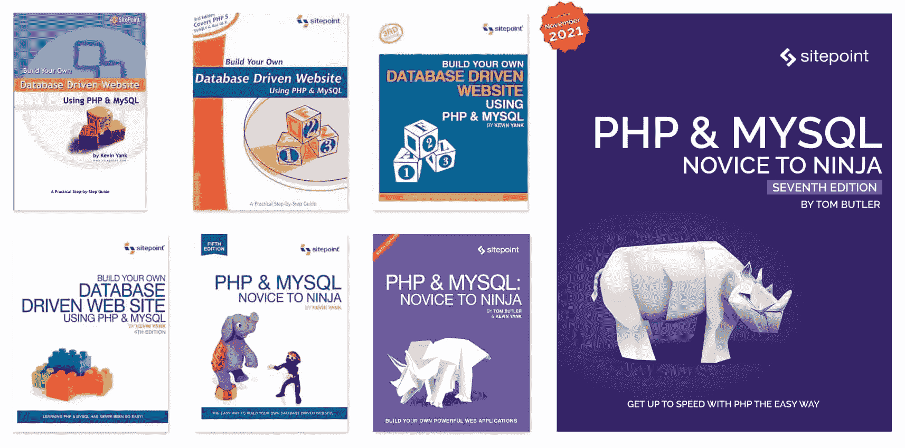

# site point NFTs——或者我们如何在公海上漂浮犀牛

> 原文：<https://www.sitepoint.com/nfts-rhinos-on-the-oceansea/>

今天早上，在 SitePoint，我们将首次进军 NFTs 领域！… *<插入胜利的小号>* …🎺🎷🎺

经过 20 多年，超过 100 本书的封面设计，我们发布了严格限制运行的最新设计作品，作为可购买的数字艺术。

10 月 21 日(星期四)中午 12:00[(PDT)](https://time.is/1200_21_Oct_2021_in_San_Francisco?SitePoint_NFT_Drop)将有 [**10 只折纸犀牛**](https://opensea.io/collection/origami-rhino-collection) 可供竞拍。

### 需要知道的事情

*   将不会有“多个打印”或数以千计的变化。每一件作品都是一次性的原创作品——永不再发行。
*   每只 Rhino 都包含一份为期 12 个月的 SitePoint Premium 订阅,只能由其所有者解锁。
*   此次拍卖将持续 3 天，于 10 月 24 日周日中午(太平洋时间)结束
*   该作品是一个清晰的可缩放矢量图形(SVG ),可以在任何现代网络浏览器或操作系统中以任何分辨率显示，无需像素化。
*   所有销售收入将捐给一个非常重要的慈善机构——国际犀牛基金会 。

### [在这里保护你自己的犀牛 NFT](https://opensea.io/collection/origami-rhino-collection)

* * *

### 为什么是犀牛？

第一个 SitePoint 图书封面是在 2001 年制作的，当时出版纸质图书的想法对我们来说完全是一个实验。这本书非常成功，但我没有花很长时间在封面设计上，它也没有老化。

令人高兴的是，随着我们学习和变得更好，事情确实有所改善，从积木到一系列强大的野兽。

第七版将于 11 月推出([放置这一版](https://www.sitepoint.com/premium/books/php-mysql-novice-to-ninja-6th-edition))，并延续了我自 2014 年以来一直使用的矢量折纸主题。这个犀牛设计是我们尝试 NFT 水的完美作品。

### 什么是 NFT？

NFT(不可替换的令牌)是一种数字作品(可能是图像、3d 模型、视频或声音)。

然而，与可以无限复制和再现的标准数字文件不同，每个 NFT 都存在于区块链上的特定地址。如果我把我的 NFT 卖给你，我就不能再用它了。

就像旧爵士乐唱片、古董手表和稀有漫画一样，NFT 允许艺术家和音乐家创作具有内在稀缺性的数字艺术品。

## 分享这篇文章