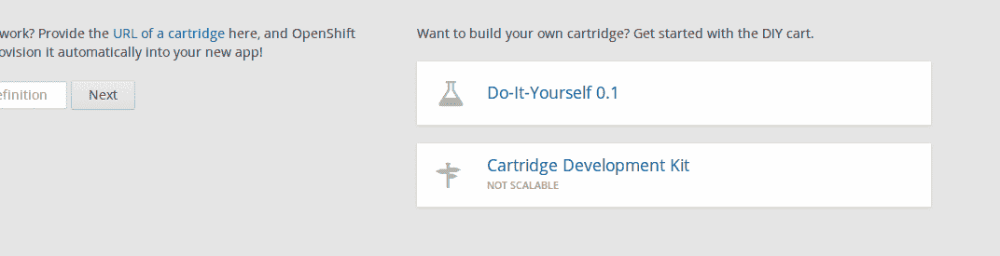
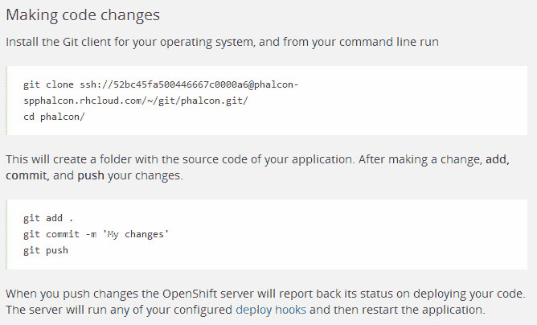
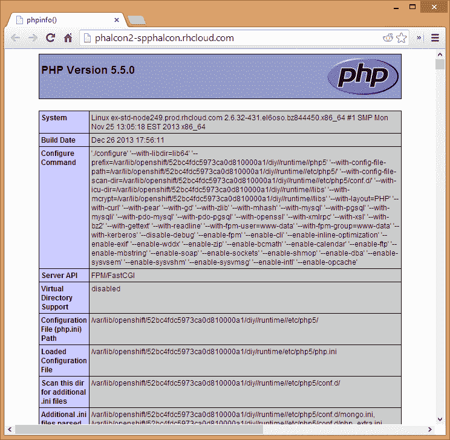
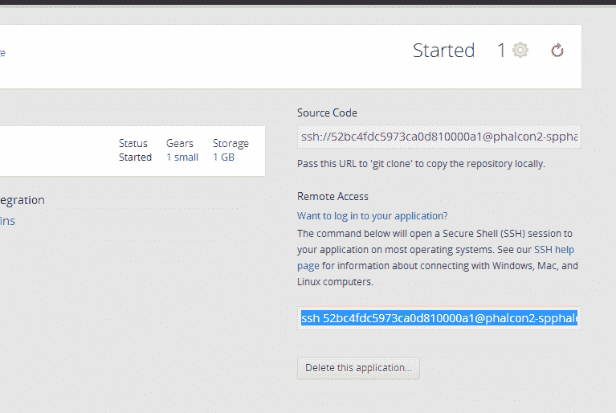
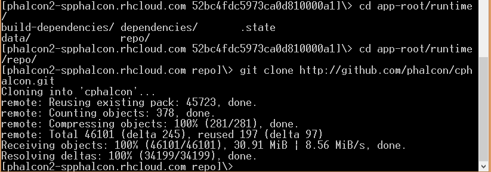
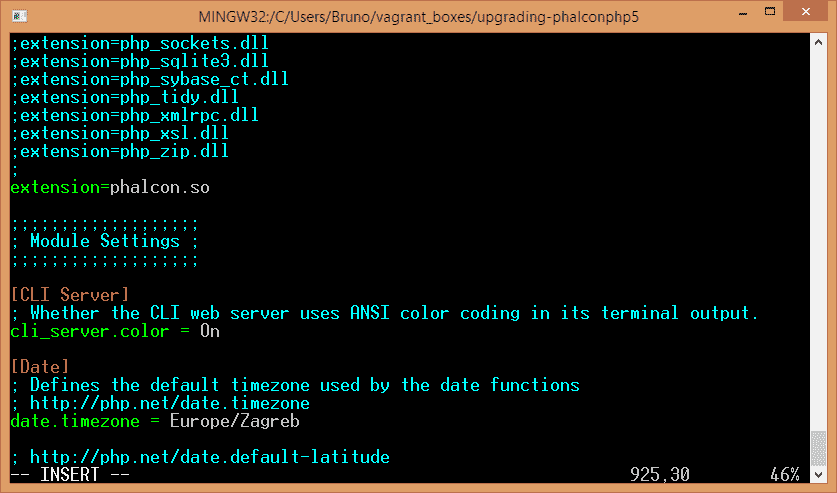

# OpenShift 上的 Nginx，PHP5.5 和 Phalcon

> 原文：<https://www.sitepoint.com/nginx-php5-5-phalcon-openshift/>

近年来，云部署环境似乎风靡一时——从 AWS 到 Google App Engine，从 Windows Azure 到 DigitalOcean，每个月都有更多的云部署环境出现。在所有这些环境中，能够部署您需要的软件非常重要。

在本教程中，改编自 [duythien](https://github.com/duythien) 的一步一步的试错过程，在他的全力支持下，我们将介绍 Phaclon 在另一个环境中的安装过程: [OpenShift](https://www.openshift.com/products/online) 。这个过程是血腥的——open shift 并没有让我们轻松地部署定制环境——但回报是值得的。

**注:**本例中使用的回购协议最初克隆自 [Boekkooi](https://github.com/boekkooi/openshift-diy-nginx-php) 。他保持他的 Openshift starter repo 是最新的，所以如果你需要一个定制的 PHP+Nginx Openshift 环境并快速运行，使用他的原始版本，然后只需将 Phalcon 过程插入其中。

## 开始

在 [OpenShift](http://www.openshift.com) 上记账。他们提供了一个[免费层](https://www.openshift.com/products/pricing)，我们将充分利用这一优势。

与云环境的通常情况一样，OpenShift 也有自己的工具。遵循 RHC 工具[安装程序](https://www.openshift.com/developers/rhc-client-tools-install)。在`rhc setup`步骤的最后一部分，我选择了“spphalcon”作为名称空间。

在[https://openshift.redhat.com/app/console/applications](https://openshift.redhat.com/app/console/applications)下，选择“现在创建你的第一个应用程序”,然后选择“自己动手”——这个选项应该在屏幕的底部。



为应用程序命名——此时，您会注意到您之前在 rhc 设置中定义的名称空间会反映在应用程序的公共 URL 中。

注意:OpenShift 上的“服务器”称为盒式磁带。

## 创建和克隆应用程序

点击“创建应用程序”并等待几分钟后，下一个屏幕将显示如何下载和修改应用程序代码的说明。



现在使用这些指令克隆代码。

## 辅助回购

克隆完成后，进入带有`cd phalcon`的文件夹，在第一个存储库中克隆另一个存储库:

```
git clone https://github.com/duythien/openshift-diy-nginx-php
```

进入这个新创建的文件夹，并将`.openshift`文件夹复制到父文件夹——这个文件夹包含您之前克隆的主应用程序代码。您可能会被要求覆盖一些文件-接受所有覆盖。

```
cd openshift-diy-nginx-php
cp -R .openshift ../
```

我们还需要根据原始 [helper repo](https://github.com/boekkooi/openshift-diy-nginx-php) 上的说明刷新权限:

```
git update-index --chmod=+x -- $(git ls-files .openshift/action_hooks/*)
```

你可以删除 openshift-diy-nginx-php 目录，我们不再需要它了。我们只需要它的`.openshift`子文件夹。

现在添加更改，提交并推送:

```
git add -A
git commit -am 'Added .openshift folder'
git push
```

在这一步之后启动的被称为构建过程，你的 DIY 应用程序将被停止，以便读取`.openshift`文件夹的内容并做出相应的反应。在我们的例子中，它将要构建一个 nginx 服务器环境。这个构建过程可能需要一段时间，有些人报告说要等一个多小时。这是因为我们正在安装的所有软件都是从源代码构建的，而不是由包管理器构建的。

也有关于 OpenShift 在构建过程中由于超时而断开连接的报告。如果发生这种情况，只需对一个自述文件或其他无关紧要的文件进行任意更改，提交并再次推送即可。

构建完成后，您可以在应用程序的根目录(本地)创建一个`web`文件夹，并在其中创建一个包含以下内容的`index.php`文件，以确保一切正常:

```
<?php
phpinfo();
```

提交、推送，你应该能够在浏览器中打开你的应用程序的 URL，并看到 PHP 信息屏幕。



## 法尔孔

现在到了困难的部分，一些核心的黑客技术随之而来，让 Phalcon 开始运行。

通过遵循应用程序仪表板上的步骤，或者通过使用`rhc domain show`找到 SSH URL，将 SSH 加载到您的插件中。



然后输入`app-root/runtime/repo`并在该文件夹中克隆 cphalcon 存储库。

```
cd app-root/runtime/repo
git clone http://github.com/phalcon/cphalcon.git
```



找到 PHP bin 目录的位置。一般是在`$OPENSHIFT_RUNTIME_DIR/php5/bin`里。试着用光盘录下来，看看它是否能用。如果一切正常，进入之前克隆的 cphalcon 的`build`目录。

```
cd && cd app-root/runtime/repo/cphalcon/build
```

用 vi 或 vim 之类的文本编辑器打开`install`文件，用`$OPENSHIFT_RUNTIME_DIR/php5/bin/phpize`替换所有对`phpize`的引用，或者你为自己的应用找到的任何位置，如果和我的不一样的话。phpize 引用应该在文件的底部。另外，将选项`--with-php-config=$OPENSHIFT_RUNTIME_DIR/php5/bin/php-config`添加到配置行。基本上，你应该替换这个块:

```
#Clean current compilation
if [ -f Makefile ]; then
        make clean
        phpize --clean
fi

#Perform the compilation
phpize && ./configure --enable-phalcon && make && make install && echo -e "\nThanks for compiling Phalcon!\nBuild succeed: Please restart your web server to complete the installation"
```

与这个

```
#Clean current compilation
if [ -f Makefile ]; then
        make clean
        $OPENSHIFT_RUNTIME_DIR/php5/bin/phpize --clean
fi

#Perform the compilation
$OPENSHIFT_RUNTIME_DIR/php5/bin/phpize && ./configure --enable-phalcon --with-php-config=$OPENSHIFT_RUNTIME_DIR/php5/bin/php-config && make && make install && echo -e "\nThanks for compiling Phalcon!\nBuild succeed: Please restart your web server to complete the installation"
```

我们在这里所做的是通过明确声明我们想要那个来确保新安装的 php5.5 的`phpize`正在运行。这样，就可以用我们的 PHP 配置为我们的 PHP 版本构建 cphalcon。

之后运行`./install`即可。在 OpenShift 盒式磁盘上不允许使用 Sudo，但是使用 SSH 的用户是您所能获得的最接近 root 的用户。

现在让我们将它添加到`php.ini`文件中。

```
cd $OPENSHIFT_RUNTIME_DIR
vim etc/php5/php.ini
```

找到列出扩展名的块。使用 vim 的 pattern finder:按正斜杠(/)并键入“extension=”并回车，这将把您带到下面截图中的块。将“extension=phalcon.so”添加到代码块的末尾，当您在那里时，再向下滚动一点，并添加您的时区。



我们现在需要重新启动我们的卡盒来重新加载这些更改。你可以在盒子里敲入`ctl_app restart`来完成。

编辑:你可能会遇到这样的问题

```
"PHP Warning: PHP Startup: Unable to load dynamic library '/path/to/extensions/phalcon.so' - /path/to/extensions/phalcon.so: undefined symbol: output_globals in Unknown on line 0".
```

。

要修复它，请按照这里提供的说明[重新编译 Phalcon，换句话说，请执行以下操作:](http://forum.phalconphp.com/discussion/582/php-5-3-3-and-php-5-4-13-dual-installation-error#C2447):)

```
 cd cphalcon/build/64bits
make clean
phpize --clean
/path-to-php/bin/phpize
./configure --with-php-config=/path-to-php/bin/php-config
make && make install 
```

感谢阿列克谢·巴库林的提示！

重新检查你的应用程序的 URL，现在你应该在 PHP 信息屏幕上看到 Phalcon。


## 配置 Nginx

最后一步是为 URL 重写配置 Nginx，这样我们就可以部署一个 Phalcon 应用程序。我们将部署 Phalconphp.com 网站，但请随意修改这些设置以应用于您自己的应用。

```
vim $OPENSHIFT_RUNTIME_DIR/nginx/conf/nginx.conf
```

用模式查找器查找服务器块(要搜索的模式是“server {”)。在 root 下，将`//web`部分改为`//website/public`。在`index`下面，把`index.php`作为第一选项，而不是最后一个。向下滚动一点，根据`location @rewrites`下的 [Nginx 安装说明](http://docs.phalconphp.com/en/latest/reference/nginx.html)更换

```
location @rewrites {
    rewrite ^(.*)$ /index.php/$1 last;
}
```

随着

```
location @rewrites {
    rewrite ^/(.*)$ /index.php?_url=/$1;
}
```

将 Phalconphp.com 网站克隆到 repo 文件夹中，完成后，重新启动墨盒:

```
cd && cd app-root/runtime/repo
git clone http://github.com/phalcon/website
ctl_app restart
```

访问应用程序的公共网址，瞧，你在 OpenShift 上有一个运行的 Phalconphp.com 克隆。


## 结论

在 OpenShift 上安装 Phalcon(或任何其他 PHP 扩展)显然既不容易也不有趣——但鉴于他们的 DIY 应用程序只有 0.1 版本，这个过程肯定会变得容易得多。现在，我希望这个对定制 OpenShift 环境的介绍足够激起您自己玩的兴趣。打开。打开 shift 文件夹，剖析动作钩子——有很多东西要学，如果你能自动完成我们刚刚用钩子完成的过程，请告诉我，我会更新文章，给你满分。

请在下面的评论中留下您的反馈！

## 分享这篇文章