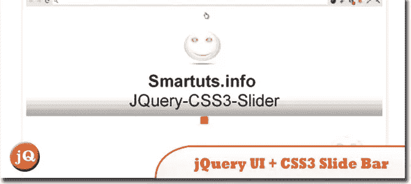
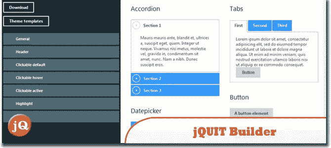
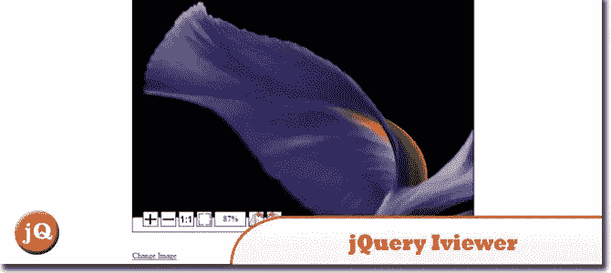
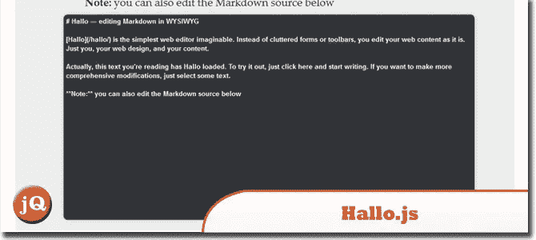
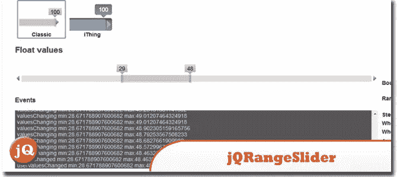
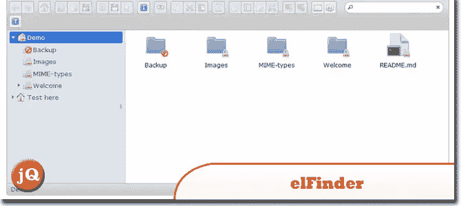
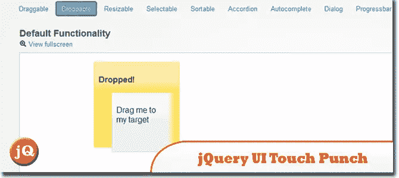
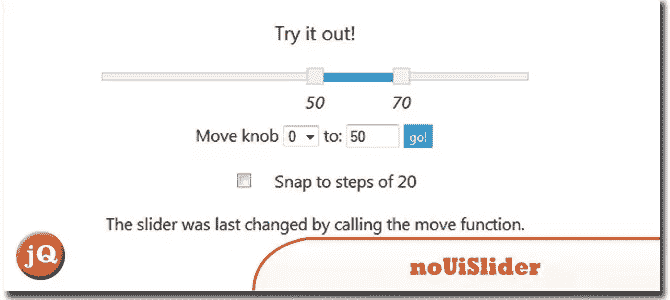
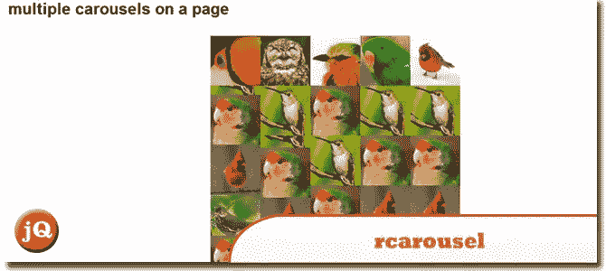
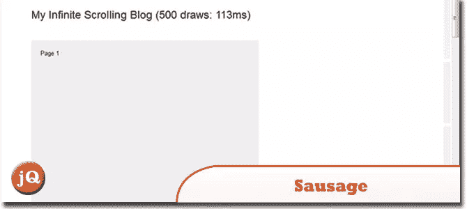

# 10 个漂亮的 jQuery UI

> 原文：<https://www.sitepoint.com/nice-jquery-ui/>

在这篇文章中，我们将与你分享我们收集的 **10 个 jQuery 用户界面**的东西，它们提供了非常好的交互和动画、高级效果和高级功能，构建在 jQuery JavaScript 库之上。让您的用户体验更上一层楼，玩得开心！

## 1.jQuery UI + CSS3 滑动条教程

这是一个新的教程，用 JQuery UI 和 CSS3 给你的网站添加一个漂亮的高级滑动效果栏。
 
[源+演示](http://www.smartuts.info/2012/08/jquery-ui-css3-slide-bar-tutorial.html)

## 2.jQUIT 生成器

jQuit Builder 是一个工具，它允许你创建自定义的 jQuery UI 主题，就像 jQuery UI 主题滚轮一样。
 
[源+演示](http://jquit.com/builder/)

## 3.jQuery Iviewer

是一个 jquery ui 小部件，代表图像查看器组件，用于加载和查看图像，并能够缩放图像和在容器中用鼠标拖动图像。
 
[来源](https://github.com/can3p/iviewer) [演示](http://test.dpetroff.ru/jquery.iviewer/test/)

## 4.hallo . js:jQuery UI 的就地富编辑器

一个非常简单的用于网页的富文本编辑器。它使用 jQuery UI 和 HTML5 contentEditable 功能来编辑 web 内容。
 
[来源](https://github.com/bergie/hallo) [演示](http://hallojs.org/demo/markdown/)

## 5.jQRangeSlider

支持日期的 jquery UI 范围选择滑块。
 
[来源](http://ghusse.github.com/jQRangeSlider/) [演示](http://ghusse.github.com/jQRangeSlider/stable/demo/)

## 6.埃尔芬德

一个用于 web 的开源文件管理器，使用 jQuery UI 用 JavaScript 编写。
 
[来源](https://github.com/Studio-42/elFinder) [演示](http://elfinder.org/)

## 7.jQuery UI Touch Punch:带有演示的 jQuery UI 的触摸事件

用于向 jQuery UI 添加触摸事件的 duck punch。这个小库通过提供模拟鼠标事件的触摸代理，将触摸事件插入 jQuery UI。
 
[来源](https://github.com/furf/jquery-ui-touch-punch) [演示](http://touchpunch.furf.com/)

## 8.努瓦里德

是一个小的 jQuery 插件，它把一个 html 对象变成一个漂亮的(范围)滑块。它可以有两个手柄来选择范围，一个固定的最小值或最大值来选择限制，或者只有两个手柄来拾取一些点。
 
[源+演示](http://refreshless.com/nouislider/)

## 9.rcarousel

是一个 jQuery UI 连续转盘，具有许多很酷的特性。它是高度可定制的，甚至支持旧的浏览器(请不要 IE6)。rcarousel 使用起来非常简单。只需在容器中添加一些元素，然后在上面运行小部件！
 
[源+演示](http://ryrych.github.com/rcarousel/)

## 10.香肠

是一个用于上下文分页的 jQuery UI 小部件。它通过让用户知道她在文档中的位置来补充长的或无限滚动的页面。
 
[来源](http://christophercliff.github.com/sausage/) [演示](http://christophercliff.github.com/sausage/examples/basic.html)

## 分享这篇文章