# 九种免费显示字体为你的标题增添戏剧性

> 原文：<https://www.sitepoint.com/nine-free-display-fonts-to-add-drama-to-your-headings/>

显示字体最适合用作标题、副标题或引用，但不太适合正文。显示字体通常被认为是“有趣”的字体，可以为你的设计作品增添个性和才华。要记住的主要一点是，适度是关键。显示字体通常不如衬线字体或无衬线字体清晰，因此您可能需要使用较大的字体以使其可读。它们都可以免费下载并用于个人用途(例如在你自己的网站上)，但可能不能免费用于商业用途。一如既往地检查这些字体的许可。闲聊够了，让我们来看看免费的字体。

Jorge Artola 的 Oh Mai Mai 是一个实验性的排版和字符设计项目；您可以下载结果。

[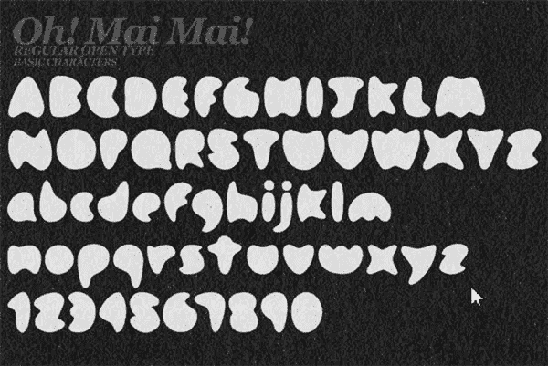](https://www.sitepoint.com/wp-content/uploads/2010/11/OhMaiMai.jpg)

[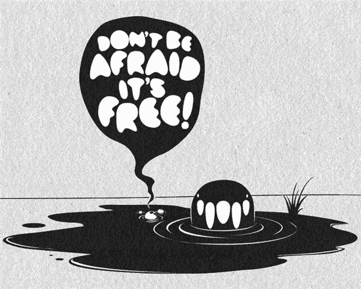](https://www.sitepoint.com/wp-content/uploads/2010/11/OhMaiMai2.jpg)

设计师兼排版师阿列克谢·弗罗洛夫制作了《穿孔》，你可以在这里下载。

[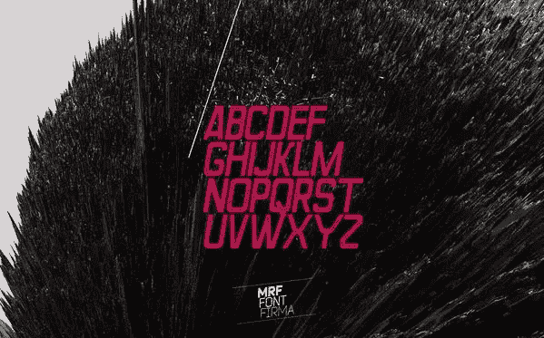](https://www.sitepoint.com/wp-content/uploads/2010/11/FontFirma.jpg)

Serge Shi 的 Adec 字体可以在这里下载[。](http://sergeshidesign.narod.ru/fonts/ss_adec.otf)

[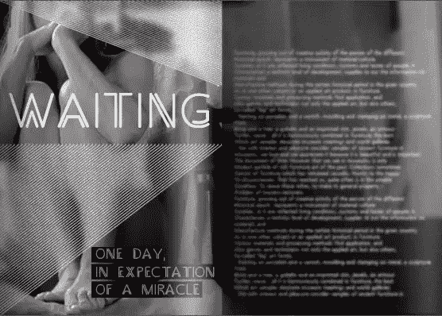](https://www.sitepoint.com/wp-content/uploads/2010/11/Adec2.jpg)

Dan 是一种开放的字体，在许多语言中都可以使用。

[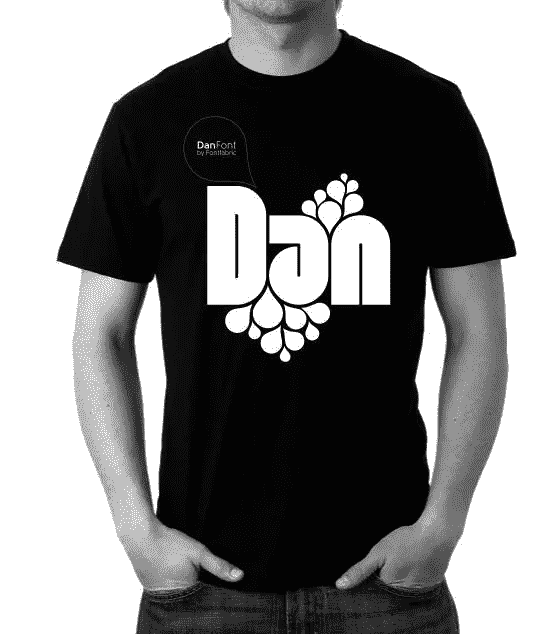](https://www.sitepoint.com/wp-content/uploads/2010/11/Dan2.jpg)

Marcelo Magalhaes 的《民俗》由四个民俗字符集组成，立体、阴影和轮廓草图。这个想法是将实体的主组件与体验不同轮廓的其他组件结合起来。

[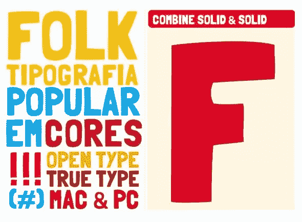](https://www.sitepoint.com/wp-content/uploads/2010/11/Folk1.jpg)

I luv color 是一种基于阴阳符号的非常粗厚的标题字体(装饰性的)。帮我传播爱”。[下载这里](http://iluvcolor.com/wp-content/uploads/fonts/MonkeyLove.zip)。

[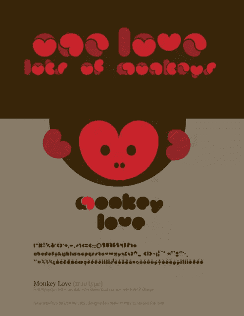](https://www.sitepoint.com/wp-content/uploads/2010/11/Monkeylove.png)

[佛掌](http://iluvcolor.com/category/goodies/)也由 I luv color“是一种花卉类型，装饰做成看起来像一束花的样子。有机、自然、充满爱”。[在这里下载。](http://iluvcolor.com/wp-content/uploads/fonts/PalmofBuddha.zip)

[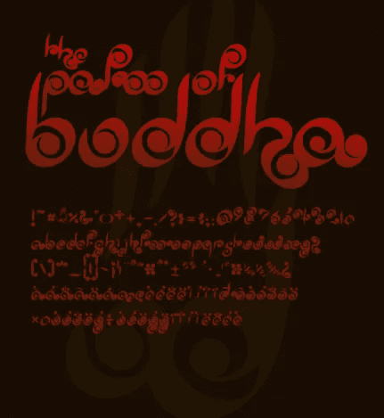](https://www.sitepoint.com/wp-content/uploads/2010/11/Buddha.png)

如果你不想自己画，你可以使用拉希德·阿克里姆的手工字体。[下载这里](http://huskmelk.no/download/REV.zip)。

[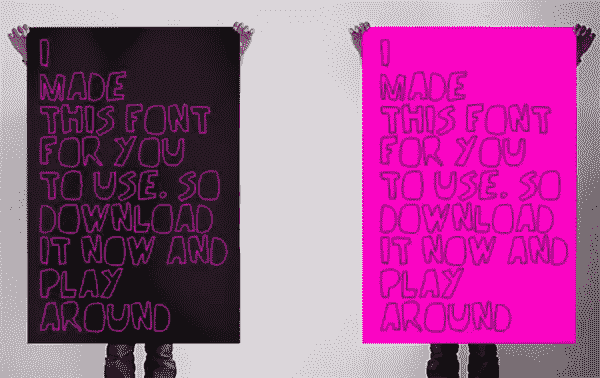](https://www.sitepoint.com/wp-content/uploads/2010/11/Handmade.png)

[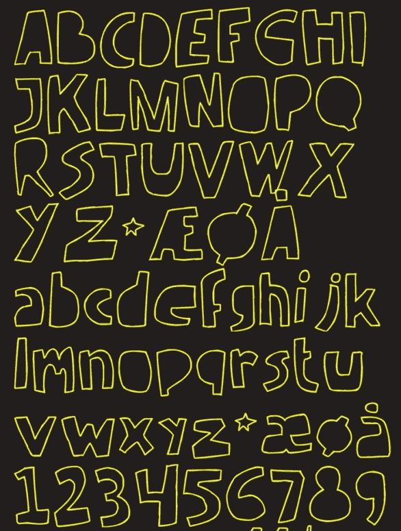](https://www.sitepoint.com/wp-content/uploads/2010/11/Handmade2.png)

[File](http://fontfabric.com/file-free-font/) 是 Font Fabric 的另一款优秀字体，仅供个人使用。

[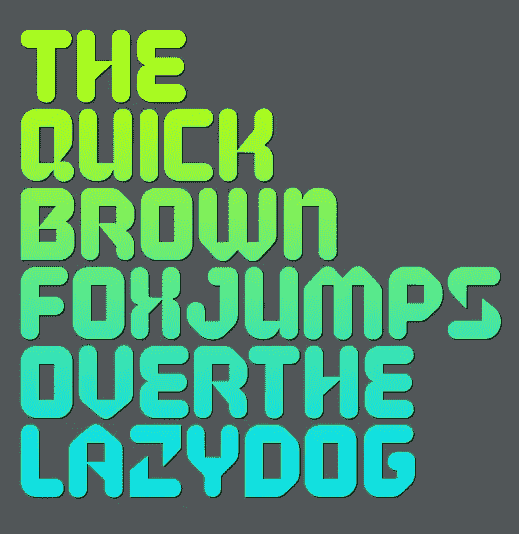](https://www.sitepoint.com/wp-content/uploads/2010/11/File1.png)

享受字体。

## 分享这篇文章