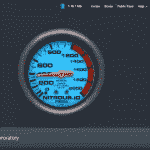
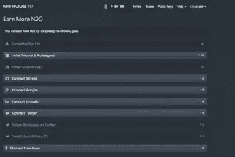
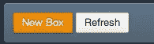
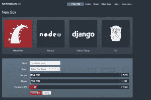
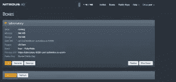
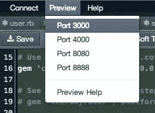
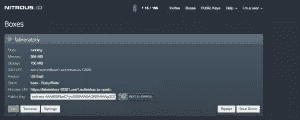

# 氮气。IO:云中的 Rails 开发

> 原文：<https://www.sitepoint.com/nitrous-io-rails-development-cloud/>



### 基础扎实的

每当我准备开发一个 Rails 应用程序时，我都需要准备一套基本的工具。这些加载到我的机器上:

*   红宝石
*   崇高文本 2
*   延髓头端腹内侧核群
*   大错
*   一种数据库系统
*   饭桶
*   协作工具(也许)
*   Heroku 工具包(在 Mac 上)

也许你也有类似的设置。而且，和我一样，你用那台机器(对我来说就是我的 MacBook Pro)开发 Rails 应用程序最舒服，因为它包含了你的整个开发环境。相反，如果没有这套基本工具，在一个项目(无论是新的还是现有的)上工作是一个相当大的挑战。

### 生活在“云中”

然而，我的所有部署都是基于云的。我总是觉得有点讽刺的是，为了开发一个最终产品，我被绑在一个特定的硬件上，这个最终产品被设计成*缥缈的*。

这就是我发现一氧化二氮时非常兴奋的原因。IO 。这不仅仅是另一个基于浏览器的代码编辑器。[笑气。IO](https://nitrous.io) 是 EC2 实例中的一个完整的开发环境。我提到的所有工具(运行在 Linux 下)都可以加载。有趣的是，您可以在在线“浏览器”编辑器窗口或您喜欢的 shell 编辑器(VIM、Emacs)之间进行选择。如果你是 Mac 用户，有一个非常新的 OSX 应用程序可以将你的电脑直接连接到你的[氮气。IO](https://nitrous.io) 实例！

但我不指望你会简单地相信我的话。本文的目标是让您快速浏览该服务，并指出我认为特别值得注意的几个特性。我相信在你自己花了一点时间探索它之后，你会分享我的热情。

### 安装

实际上不涉及任何设置。你需要开始的一切都包括在内。你可以[创建一个账户](https://www.nitrous.io/users/sign_up)并立即开始写代码。将浏览器指向 nitrous . io .


如果你使用你的 Github 账户进行认证，你就建立了一个到你的代码库的链接，你马上就能赚到一些 N20(见侧栏)。

> ##### 赚取硝基
> 
> 你可以用他们称之为 N20 的“点数”在系统上获得更多的能力。
> 我认为这是非常巧妙的营销；你**给**的账户充值。这从完成注册过程开始。
> 之后，您可以通过多种方式赚取更多的 N20，并将其用于一些额外的服务。
> 
> 

在任何情况下，您都应该至少添加一个 SSH 密钥。此外，和以前一样，有一种简单的 GUI 方式为您的盒子生成一个密钥。

### 创建您的第一个盒子

一氧化二氮的每个“实例”。木卫一被称为“盒子”。

前往*箱子*并设置一个箱子。

在这里，您必须选择您希望使用此框的环境。在我们的例子中，我们将选择‘Ruby on Rails ’,但是我鼓励你探索其他的；特别是如果这些是你经常使用的技术。



此外，您必须命名您的盒子，并为将要产生的 EC2 实例选择区域。创建此框后，您可以从仪表板“开始”、“终止”并输入“IDE”。

当你创建一个盒子时，它会自动启动。一旦机器开始运行，你可以点击 IDE(或者终端，如果你愿意的话)。在本文中，我们将留在浏览器中),并将看到在线开发环境。

请注意，除了 IDE 顶部的标准菜单之外，还支持许多标准的*键盘快捷键。这是我*真正*喜欢的东西。我倾向于用键盘开车。当我深陷于写代码的痛苦中时，我的手去拿触控板会分散注意力。*

左边有一个资源管理器树，一旦你创建或打开一个文件，你会在编辑器窗口的顶部看到一些按钮，这些按钮提供了一些我在其他类似产品中从未见过的真正有用的功能。

浏览器窗口的底部是一个终端。氮气。IO IDE 通过结合以下几个方面真正提供了最好的东西

*   GUI 工具
*   文件系统浏览器
*   终端实例

你不仅限于一个实例。单击加号“+”在新选项卡中开始另一个。最右边的“X”会将终端打开到全屏模式。

* * *

这是一个 Linux 系统，你可以通过输入`cat /etc/*-release`来获得操作系统的详细信息

* * *

点击*框*链接，点击你的新框。

你会注意到，在每个箱子的信息当中，都有“预览 URI”。这是在您处理项目时对项目的实时交互式预览。

## 让我们写一些 Ruby 代码

这只是对界面的一个快速浏览。我相信随着你的探索，你会发现更多的好东西。是时候加载一些工具并编写代码了！

> 在写这篇文章的时候， [AutoParts Package Manager](http://blog.nitrous.io/2013/09/18/introducing-autoparts-for-nitrous-io.html) 刚刚发布。这背后的原则是提供预先构建的工具和实用程序集，可以很容易地加载到任何一氧化二氮。IO 盒。
> 使用`search`命令查看可用软件包列表；这个数字还在继续增长。

### 初始化工具

作为我们选择 Ruby On Rails 的结果，我们已经提供了许多工具:

*   饭桶
*   大错
*   Heroku 客户端
*   Ruby 1.9
*   Rails 4.0.0
*   mySQL 和 sqlite3

这是立即构建 Rails 4 应用程序所需的一切！

我提到 RVM 是我的标准工具列表的一部分。这不包括在内，但是如果你打算使用多个版本的 Ruby(和 Rails ),你可以很容易地加载它。 [Timothy Boronczyk](https://www.sitepoint.com/author/tboronczyk/) 有一篇关于[在 Ubuntu](https://www.sitepoint.com/installing-ruby-with-rvm-on-ubuntu/) 上安装 RVM 的好文章。

查看 IDE 中的 *Connect* 菜单选项，您将看到可供您选择的数据库。


“导游”已经足够了。**让我们写一些代码**

#### 构建一个 Rails 应用程序

作为一名 *Serial Rails 开发人员*，我从用户/会话认证逻辑开始每个 Rails 项目。这在几乎所有的 web 应用程序中都很常见。我认为这可以作为一个简单的例子来演示亚硝酸。如果我们通过“从零开始”实现用户注册来构建 Rails 应用程序的基础。

我知道经验丰富的 Rails 开发人员有一个处理这个问题的最佳方法。请原谅我。

在控制台窗口中，键入以下内容:

```
rails new youzer
```

然后

```
cd youzer
```

接下来是这三个命令。

```
rails g model User name:string email:string password:string password_confirmation:string password_digest:string
rails g controller Users new create
rails g controller Sessions index new create logout destroy
```

您可以利用左侧的资源管理器树导航到以下每个文件，并进行适当的编辑(您可能需要刷新树，右上方有一个按钮)。只需点击树中的文件名，就可以在编辑器中打开它。

##### app/models/user.rb

```
class User < ActiveRecord::Base
  attr_accessible :email, :name, :password, :password_confirmation, :password_digest
  has_secure_password   #This is the Rails 3 'magic' 
  validates_presence_of :password, :on => :create
end
```

##### app/controller/application _ controller . Rb

```
class ApplicationController < ActionController::Base
  protect_from_forgery

private

def authenticate_user!
  if current_user.nil?
    redirect_to login_url, :alert => "You must first log in to access this page"
  end
end

def current_user
 begin
     @current_user ||= session[:user_id] && User.find(session[:user_id])
 rescue
 end
end

def user_signed_in?
 begin
  User.where("id=?", session[:user_id]).exists?
 rescue
  false
 end
end

  helper_method :current_user, :user_signed_in?, :authenticate_user?

end
```

##### app/controllers/sessions _ controller . Rb

```
class SessionsController < ApplicationController
  def index
  end

  def new
  end

  def create
    user = User.find_by_email(params[:email].downcase)
    if user && user.authenticate(params[:password])
      session[:user_id] = user.id
      redirect_to root_url, :notice => "Welcome #{user.name}"  #you may wish to modify this redirect
    else
      flash.now.alert = "Invalid email or password"
      render "new"
    end
  end

  def logout
    self.destroy
  end

  def destroy
    session[:user_id] = nil
    redirect_to root_url, :notice => "Goodbye"
  end

end
```

##### app/控制器/用户 _ 控制器. rb

```
class UsersController < ApplicationController
 def new
  @user = User.new
 end

  def create
  @user = User.new(params[:user])
  @user.name = params[:user][:name]
  @user.email = (params[:user][:email]).downcase
  if @user.save
        session[:user_id] = @user.id
        current_user #call in application helper
   redirect_to :root, :notice => "Registered!"  #you may wish to modify this redirect
  else
   render "new"
  end
  rescue Exception => ex
    logger.warn('ERROR: ' + ex.message)
    flash.now[:error] = 'There was an error creating the user.'
    render :action => 'new' 
 end
end
```

##### app/views/sessions/new . html . erb

```
<%= form_tag sessions_path do %>
<h3>Log in</h3>
  <div class="field">
    <%= label_tag :email %>
    <%= text_field_tag :email, params[:email] %>
  </div>
  <div class="field">
    <%= label_tag :password %>
    <%= password_field_tag :password %>
  </div>
  <div class="actions"><%= submit_tag "Log in" %></div>
<% end %>
```

##### app/views/users/new.html.erb

```
<%= form_for @user do |f| %>
 <% if @user.errors.any? %>
   <div class="error_messages">
    <h2>Form is invalid</h2>
    <ul>
     <% for message in @user.errors.full_messages %>
       <li><%= message %></li>
     <% end %>
    </ul>
   </div>
 <% end %>
<h3>Sign Up</h3>
 <div class="field">
  <%= f.label :name %>
  <%= f.text_field :name %>
 </div>
 <div class="field">
  <%= f.label :email %>
  <%= f.text_field :email %>
 </div>
 <div class="field">
  <%= f.label :password %>
  <%= f.password_field :password %>
 </div>
 <div class="field">
  <%= f.label :password_confirmation %>
  <%= f.password_field :password_confirmation %>
 </div>
 <div class="actions"><%= f.submit "Register" %></div>
<% end %>
```

##### app/views/layouts/application . html . erb

```
<!DOCTYPE html>
<head>
  <title>Your Own User Zero Effort Reset</title>
  <%= stylesheet_link_tag "application", :media => "all" %>
  <%= javascript_include_tag "application" %>
  <%= csrf_meta_tags %>

</head>
<body>
<ul id="nav">
 <% unless user_signed_in? %>
  <li><%= link_to "Log In", sign_in_path %></li>
  <li><%= link_to "Register", sign_up_path %></li>
 <% end %>
    <% if user_signed_in? %>
  <li><%= link_to "Log Out", log_out_path %></li>
 <% end %>
</ul>

<%- flash.each do |key, msg| -%>
  <div id="<%= key %>">
    <p style="float:right;"><a href="#">X</a></p>
    <p><%= msg %></p>
    <div class="clear"></div>
  </div>
<%- end -%>

<%= yield %>

<div id="wrap"></div>
<div id="foot">Application developed by Thom Parkin / Websembly, LLC</div>

</body>
</html>
```

##### app/config/routes.rb

```
Youzer::Application.routes.draw do
  get "users/new"
  get "users/create"
  get "sessions/index"
  get "sessions/new"
  get "sessions/create"
  get "sessions/logout"
  get "sessions/destroy"

  match 'sign_in' => 'sessions#new', :via => :get
  match 'sign_up' => 'users#new', :via => :get

  match 'log_out' => 'sessions#destroy', :via => :get

  resources :sessions
  resources :users

  root :to => 'sessions#index'
end
```

##### Gemfile

```
source 'https://rubygems.org'

# Bundle edge Rails instead: gem 'rails', github: 'rails/rails'
gem 'rails', '4.0.0'

# Use sqlite3 as the database for Active Record
gem 'sqlite3'

# Use SCSS for stylesheets
gem 'sass-rails', '~> 4.0.0'

# Use Uglifier as compressor for JavaScript assets
gem 'uglifier', '>= 1.3.0'

# Use CoffeeScript for .js.coffee assets and views
gem 'coffee-rails', '~> 4.0.0'

# See https://github.com/sstephenson/execjs#readme for more supported runtimes
# gem 'therubyracer', platforms: :ruby

# Use jquery as the JavaScript library
gem 'jquery-rails'

# Turbolinks makes following links in your web application faster. Read more: https://github.com/rails/turbolinks
gem 'turbolinks'

# Build JSON APIs with ease. Read more: https://github.com/rails/jbuilder
gem 'jbuilder', '~> 1.2'

group :doc do
  # bundle exec rake doc:rails generates the API under doc/api.
  gem 'sdoc', require: false
end

# Use ActiveModel has_secure_password
gem 'bcrypt-ruby', '~> 3.0.0'

gem 'protected_attributes'

# Use unicorn as the app server
# gem 'unicorn'

# Use Capistrano for deployment
gem 'capistrano', group: :development
```

(您并不局限于在 IDE 中创建的代码和资源。有一个方便的“上传文件”功能。)

**确保您已经保存了所有更改**

回到控制台，运行`bundle update`获得所有必要的宝石。运行这两个命令来迁移数据库(在开发环境中)

```
RAILS_ENV=development && bundle exec rake db:create
RAILS_ENV=development && bundle exec rake db:migrate
```

##### 试映

在命令行输入`rails server`。

这将启动 Webbrick 开发服务器。它使用的端口(默认)是 3000。请注意，在*预览*菜单下有一个选项。

如果你喜欢另一个服务器(如瘦)，只需安装它。


点击*预览端口 3000* 看你努力的结果。

试用该应用程序。注册一个用户帐户，然后登录并尝试注销。

这只是一个 Rails 应用程序的框架。但它不能从这里运行，这只是为了发展。我们仍然需要部署它。

##### 部署

您可以使用控制台客户端部署到 [Heroku](https://www.heroku.com/) ，使用 Capistrano 或其他喜欢的部署工具。如前所述，您需要为您的机器获取 SSH 密钥，以便对您的部署目标使用 SSH 认证。
如果你选择部署到 [Heroku](https://www.heroku.com/) ，你需要首先设置 git 并且 [Heroku 站点已经非常好地记录了这个过程](https://devcenter.heroku.com/articles/git)。

##### 试验

测试驱动开发，对吗？所以我们*应该先*写一些测试。
在给这个项目添加更多功能之前，我会把这个问题留给你。这里的目标是展示如何简单地构建一个新的 Rails 应用程序。

##### 开源代码库

有一个简单的工具可以获取 SSH 公钥并建立到 Github 帐户的连接。

还有，这是另一种在你的账户上额外赚取一些 N20 的方法！

### 合作

[氮气。IO](http://nitrous.io) 还支持一个非常灵活的协作功能，允许你与其他开发者在应用程序上交互工作。这方面的细节远远超出了本文的范围，但是在[氮气帮助中心](http://help.nitrous.io/collab/)有一个很好的描述。

### 每一步的指导

Nitrous 背后的人是开发者，并且坚信“开发者幸福”。

[帮助](http://help.nitrous.io/)非常清楚，也相当完整。永远不应该有一个点让你感到迷失或停滞不前。
工具栏上有一个“邀请”按钮，可以让你分享[亚硝酸。IO](http://nitrous.io) 为自己多挣些 20 先令。

[氮气。IO](http://nitrous.io) 显然是开发者写的，也是为开发者写的。它承诺完全“在云中”工作。

随着无线互联网接入的不断发展，以及在“移动”状态下工作的趋势，在云中创建/更新/维护 Rails 应用程序是很有意义的。

在开发 Rails 应用程序时，我不再受限于任何特定的设备。而且，不管我在哪里，也不管我有什么硬件，我都可以远程启动、继续和完成任何 Rails 项目。迁移到一台新的计算机不再会在让环境“恰到好处”的时间里让我瘫痪。我预计，很快有一天，我对电脑(尽管是笔记本电脑、平板电脑和手机)的“硬件要求”将不会超过 WiFi 功能。

耶胡达·卡茨曾报道过"[一氧化二氮。IO 和 ChromeOS 真是天造地设的一对](http://blog.nitrous.io/2013/08/05/nitrous-stories-i-yehuda-katz-tilde-nitrousio.html)”。自从那篇文章写出来之后，又有了一个新的 [Chrome 打包应用](https://chrome.google.com/webstore/detail/nitrousio/efdcneeepllhjlbejkfnaolelbpdacai/)来处理氮气。

{这篇文章的所有代码都可以在这个要点获得

## 分享这篇文章