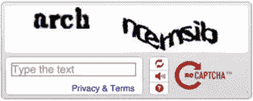
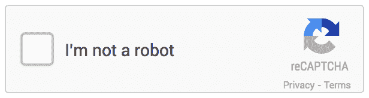

# 没有验证码 reCAPTCHA 与 WordPress 集成

> 原文：<https://www.sitepoint.com/no-captcha-integration-wordpress/>

几周前，[谷歌安全团队宣布了](http://googleonlinesecurity.blogspot.com/2014/12/are-you-robot-introducing-no-captcha.html)一个受欢迎的 reCAPTCHA 系统的新版本，该系统被数百万网站用于打击垃圾邮件。

多年来，reCAPTCHA 通过要求用户阅读输入到一个框中的扭曲文本来提示用户确认他们不是机器人，就像这样:



很多人抱怨和指责旧的 reCAPTCHA 系统有很多原因。它产生的扭曲文本很难识别，机器人比人类更容易通过测试。

新的验证码简单方便。你所需要做的就是点击一个复选框，然后你就完成了。它在打击垃圾邮件方面也非常有效。



SitePoint 前情提要，我们写了一个关于将旧的 reCAPTCHA 集成到以下 WordPress 表单的系列文章:

*   [登录](https://www.sitepoint.com/integrating-a-captcha-with-the-wordpress-login-form/)
*   [登记](https://www.sitepoint.com/integrating-a-captcha-with-the-wordpress-registration-form/)
*   [评论](https://www.sitepoint.com/integrating-a-captcha-with-the-wordpress-comment-form/)

在这篇文章中，我们将学习如何把新的 **No CAPTCHA reCAPTCHA** 与自定义表单和 WordPress 集成在一起。

## reCAPTCHA 表单集成

让我们回顾一下如何将 reCAPTCHA 与 web 表单集成的过程。

首先，前往 [reCAPTCHA](https://www.google.com/recaptcha/admin#createsite) 获取您的站点和密钥。

### 显示验证码

将以下内容添加到网页的标题部分:`<script src="https://www.google.com/recaptcha/api.js" async defer></script>`。

将`<div class="g-recaptcha" data-sitekey="your_site_key"></div>`添加到您想要输出验证码的地方，其中`your_site_key`是您的域站点/公钥。

关于配置验证码小工具显示的更多信息可以在找到[。](https://developers.google.com/recaptcha/docs/display)

### 验证用户的响应

为了验证用户的响应(检查用户是否通过了验证码测试)，使用 [cURL](https://www.sitepoint.com/using-curl-for-remote-requests/) 、 [Guzzle](https://www.sitepoint.com/guzzle-php-http-client/) 、 [WordPress HTTP API](https://www.sitepoint.com/the-wordpress-http-api) 或任何 HTTP 客户端向下面的 URL 发送 GET 请求。

```
https://www.google.com/recaptcha/api/siteverify?secret=your_secret&response=response_string&remoteip=user_ip_address
```

其中:

–**你的秘密**:秘密(私人)密钥。
–**response _ string**:用户响应令牌(由`$_POST['g-recaptcha-response'])`通过 PHP 获取)。
–**用户 ip 地址**:用户 IP 地址，虽然是可选的。(`$_SERVER["REMOTE_ADDR"]`)。

如果请求发送成功，响应将是一个 JSON 对象，如下所示。

```
{
  "success": true|false
}
```

使用`json_decode()`解码响应，并获取成功属性`$response['success']`，如果用户通过测试，则返回 true，否则返回 false。

有关验证用户响应的更多信息，请点击查看[。](https://developers.google.com/recaptcha/docs/verify)

## reCAPTCHA WordPress 集成

了解了新的 **No CAPTCHA reCAPTCHA** 如何与表单集成，让我们看看它如何与 WordPress 集成。

第一步是包含插件文件头:

```
<?php

/*
Plugin Name: No CAPTCHA reCAPTCHA
Plugin URI: https://www.sitepoint.com
Description: Protect WordPress login, registration and comment form from spam with the new No CAPTCHA reCAPTCHA
Version: 1.0
Author: Agbonghama Collins
Author URI: http://w3guy.com
License: GPL2
*/
```

将 reCAPTCHA 脚本加入到 WordPress header 部分。

```
// add the header script to login/registration page header
add_action( 'login_enqueue_scripts', 'header_script' );

// add CAPTCHA header script to WordPress header
add_action( 'wp_head', 'header_script' );

/** reCAPTCHA header script */
function header_script() {
echo '<script src="https://www.google.com/recaptcha/api.js" async defer></script>';
}
```

接下来，我们使用`display_captcha()`和`captcha_verification()`包装函数来显示 CAPTCHA 小部件并验证用户响应。

**注意:**将下面代码中的*your_site_key*和*your_secret*分别改为你的 site(公钥)和 secret(私钥)。

```
/** Output the reCAPTCHA form field. */
function display_captcha() {
	echo '<div class="g-recaptcha" data-sitekey="your_site_key"></div>';
}
```

```
/**
 * Send a GET request to verify CAPTCHA challenge
 *
 * @return bool
 */
function captcha_verification() {

	$response = isset( $_POST['g-recaptcha-response'] ) ? esc_attr( $_POST['g-recaptcha-response'] ) : '';

	$remote_ip = $_SERVER["REMOTE_ADDR"];

	// make a GET request to the Google reCAPTCHA Server
	$request = wp_remote_get(
		'https://www.google.com/recaptcha/api/siteverify?secret=your_secret&response=' . $response . '&remoteip=' . $remote_ip
	);

	// get the request response body
	$response_body = wp_remote_retrieve_body( $request );

	$result = json_decode( $response_body, true );

	return $result['success'];
}
```

我们现在已经定义了插件的基本功能，接下来是将验证码与登录、注册和评论表单集成在一起。

### 登录表单

通过将函数`display_captcha()`与 [login_form](https://codex.wordpress.org/Plugin_API/Action_Reference/login_form) 动作挂钩，将验证码小部件包含到登录表单中。

```
// adds the CAPTCHA to the login form
add_action( 'login_form', array( __CLASS__, 'display_captcha' ) );
```

`validate_login_captcha()`函数将验证并确保验证码复选框没有被取消选中，并且测试通过。

```
// authenticate the CAPTCHA answer
add_action( 'wp_authenticate_user', 'validate_captcha', 10, 2 );

/**
 * Verify the CAPTCHA answer
 *
 * @param $user string login username
 * @param $password string login password
 *
 * @return WP_Error|WP_user
 */
function validate_captcha( $user, $password ) {

	if ( isset( $_POST['g-recaptcha-response'] ) && !captcha_verification() ) {
		return new WP_Error( 'empty_captcha', '<strong>ERROR</strong>: Please retry CAPTCHA' );
	}

	return $user;
}
```

### 登记表

通过将函数`display_captcha()`与 [register_form](https://codex.wordpress.org/Plugin_API/Action_Reference/register_form) 动作挂钩，将验证码小部件包含到注册表单中。

```
// adds the CAPTCHA to the registration form
add_action( 'register_form', 'display_captcha' );
```

用与`registration_errors`挂钩的`validate_captcha_registration_field()`函数验证注册表中的验证码测试。

```
// authenticate the CAPTCHA answer
add_action( 'registration_errors', 'validate_captcha_registration_field', 10, 3 );

/**
 * Verify the captcha answer
 *
 * @param $user string login username
 * @param $password string login password
 *
 * @return WP_Error|WP_user
 */
function validate_captcha_registration_field( $errors, $sanitized_user_login, $user_email ) {
	if ( isset( $_POST['g-recaptcha-response'] ) && !captcha_verification() ) {
		$errors->add( 'failed_verification', '<strong>ERROR</strong>: Please retry CAPTCHA' );
	}

	return $errors;
}
```

### 评论表格

首先，创建一个保存 CAPTCHA 测试状态的全局变量。也就是说，当用户挑战失败时，它将被设置为“失败”,否则为空。

```
global $captcha_error;
```

通过将`display_captcha()`函数与`comment_form`动作挂钩，将 CAPTCHA 小部件包含到评论表单中。

```
// add the CAPTCHA to the comment form
add_action( 'comment_form', 'display_captcha' );
```

过滤器`preprocess_comment`调用`validate_captcha_comment_field()`函数来确保验证码字段不为空，并且答案是正确的。

```
// authenticate the captcha answer
add_filter( 'preprocess_comment', 'validate_captcha_comment_field');

/**
 * Verify the captcha answer
 *
 * @param $commentdata object comment object
 *
 * @return object
 */
function validate_captcha_comment_field( $commentdata ) {
	global $captcha_error;
	if ( isset( $_POST['g-recaptcha-response'] ) && ! (captcha_verification()) ) {
		$captcha_error = 'failed';
	}

	return $commentdata;
}
```

过滤器`comment_post_redirect`调用`redirect_fail_captcha_comment()`删除被检测为垃圾邮件的评论，并向评论重定向 URL 添加一些查询参数。

```
add_filter( 'comment_post_redirect', 'redirect_fail_captcha_comment', 10, 2 );

/**
 * Delete spam comments
 * 
 * Add query string to the comment redirect location
 *
 * @param $location string location to redirect to after comment
 * @param $comment object comment object
 *
 * @return string
 */
function redirect_fail_captcha_comment( $location, $comment ) {
	global $captcha_error;

	if ( ! empty( $captcha_error ) ) {

		// delete the failed captcha comment
		wp_delete_comment( absint( $comment->comment_ID ) );

		// add failed query string for @parent::display_captcha to display error message
		$location = add_query_arg( 'captcha', 'failed', $location );

	}

	return $location;
}
```

瞧啊。我们完成了插件的编码。

## 摘要

在本文中，我们学习了如何使用新的 No CAPTCHA reCAPTCHA 来保护 web 表单免受垃圾邮件的侵害，最后，将它与 WordPress 登录、注册和评论表单集成在一起。

如果你想把这个新的 reCAPTCHA 小工具和你的 WordPress powered 站点集成在一起，这个插件可以在 [WordPress 插件目录](https://wordpress.org/plugins/no-captcha-recaptcha/)中找到。

直到我再次来到你的身边，编码快乐！

## 分享这篇文章