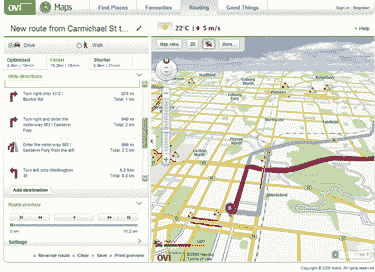
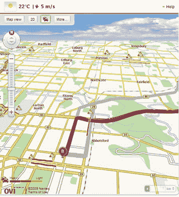
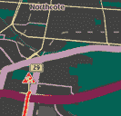

# 诺基亚提供免费的谷歌地图

> 原文：<https://www.sitepoint.com/nokia-offers-free-google-maps-alternative/>

让我们先弄清楚这一点:谷歌地图很棒，有些人甚至认为它是过去十年中最重要的网络服务。此外，随着 Foursquare 、[、](http://gowalla.com/)、 [Yelp](http://www.yelp.com/) 、 [Urbanspoon](http://www.urbanspoon.com/) 以及一系列其他基于位置的服务的兴起，我们对地图的集体热爱似乎只会与日俱增。

然而，我们也喜欢保持每个人诚实，所以很高兴看到诺基亚上周宣布他们的 Ovi 地图服务将免费发布。

尽管目前仍处于封闭测试阶段，但很快任何懂一点 HTML 和 JavaScript 的人都应该能够使用诺基亚的 Ovi SDK/API 从 T2 的任何移动应用或网络应用中获取地图数据。

好吧，也许你在想“嗯”..我已经知道了谷歌地图 API。我为什么要改变？’。好吧，这里有几个理由让你考虑一下。

1.  矢量:Ovi 地图的来源是基于矢量的。这允许您的应用程序下载、存储和使用大型地图部分，消除了连接速度慢、不稳定或不存在的任何问题-这始终是随用随下载位图服务的一个潜在问题。
2.  3D 视图:像一个经典的车载 GPS 单元一样，Ovi 提供了一个飞行员视角的地图。
3.  即时路线:Ovi 开箱即用，提供即时路线导航。这是最新的 Android 版本内置的功能(如 droid 和 Nexus one)，但 iPhone 目前没有。
4.  夜间模式:Ovi 提供了一种优化色彩设置的模式，便于在弱光环境下阅读。我怀疑夜间模式也将使用更少的电力，如果这是一个问题。
5.  基于位置的数据:Ovi 自动提供该位置的自动天气、交通和新闻。
6.  出行方式:Ovi 地图为您提供驾车或步行路线的选择。
7.  速度:这是谷歌的标志性特征，Ovi 在缩放和平移方面似乎快如闪电。比我用过的任何东西都快。

我发现的唯一轻微的缺点是，目前基于网络的版本需要一个浏览器插件才能在 IE8、Firefox 和 Safari 上访问其全部功能(3d、夜间模式等)。其他浏览器有一个更简单的地图应用程序，没有铃声和哨声。

尽管如此，我认为有一些非常令人信服的理由，至少可以对诺基亚的产品进行一点研究。

诺基亚的高尔夫球掌声。虽然他们仍然每秒钟卖出可笑数量的手机，但感觉他们已经很久没有做过任何有趣的事情了。希望这种趋势继续下去。

另一方面，如果你仍然持有 Garmin 或 Tomtom 的股票，也许可以看看。

## 分享这篇文章