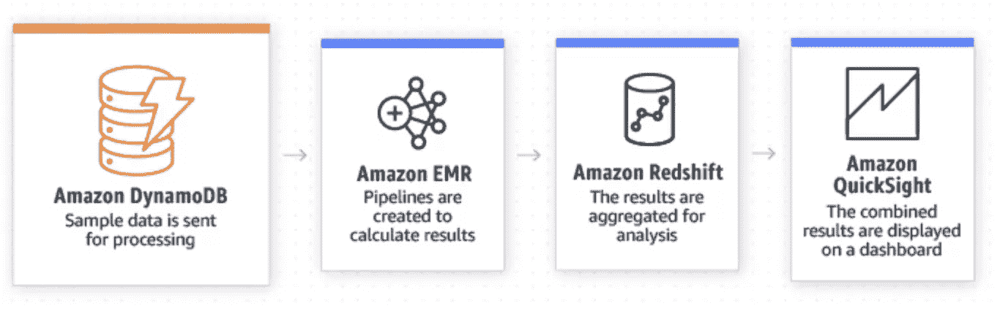
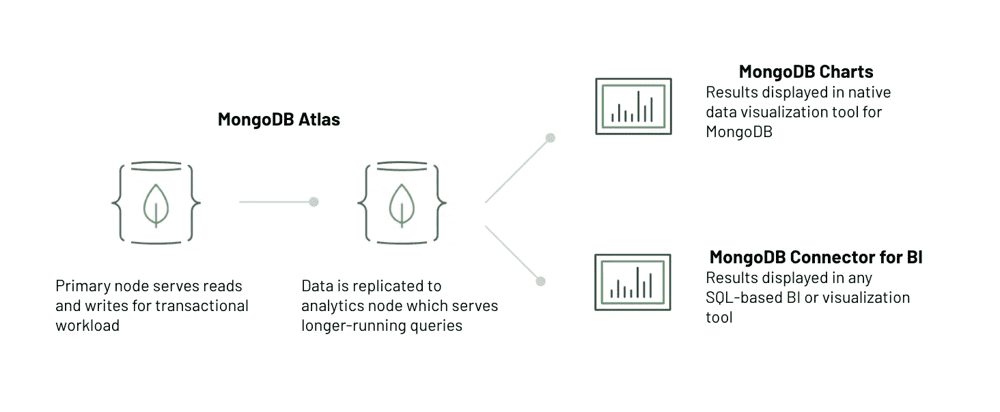

# 非关系数据库并支持混合工作负载

> 原文：<https://www.sitepoint.com/non-relational-databases-and-supporting-mixed-workloads/>

*本文是与 [MongoDB](https://www.mongodb.com/?utm_medium=sp-synd&utm_source=sitepoint&utm_content=nosql-db&jmp=sp-ref) 合作创作的。感谢您对使 SitePoint 成为可能的合作伙伴的支持。*

假设您正在构建一个电子商务平台，作为练习的一部分，您需要为库存管理提出一个新的数据架构。您需要支持快速的事务性工作负载，以便近乎实时地跟踪库存。

企业还希望能够回答诸如“根据历史数据，我们什么时候应该补充小部件和小发明？”以及“购买小工具的人是谁？一般来说，他们在哪里？”您的数据架构需要支持*混合*工作负载。

你会从哪里开始？

对于事务性组件，您可能会意识到您需要一个可操作的数据库，也就是说，一个允许您对数据进行读、写和更新操作的数据库。这应该是有意义的，因为您不仅需要知道您的库存中有多少小部件，还需要能够在客户购买小部件时更新该数量。您还需要确保您的数据层能够为任何连接的应用程序提供一致的数据视图。否则，你很快就会不高兴的顾客会发现他们把实际上不可用的东西放进了购物车。

为了支持您的事务性工作负载，根本不缺少操作数据库可供选择，因为底层技术可以追溯到 40 年前。对于需要处理各种数据类型和数据结构的应用程序，比如我们的 inventory 应用程序，许多公司选择了更新的非关系型选项来代替关系型数据库，比如 Oracle、MySQL 或 SQL Server。

这是因为非关系型数据库不像关系型数据库那样以行和列的形式存储数据，在获取和处理各种格式和形状的数据方面提供了更大的灵活性，从而在应用程序开发和迭代周期中节省了大量的时间和精力。传统的关系数据库被设计为纵向扩展(“获得更大的机器”)，也很难支持低延迟的分布式请求，并可能遇到性能限制。如果我们的客户分布在不同的地理位置，或者应用程序使用出现意外的高峰，这可能会带来问题。

为了讨论支持*混合*工作负载的数据架构，让我们比较两个流行的非关系操作数据库的实现:DynamoDB，这是 AWS 开发的一个非关系数据库服务；还有 [MongoDB](https://www.mongodb.com/cloud/atlas?utm_medium=sp-synd&utm_source=sitepoint&utm_content=nosql-db&jmp=sp-ref) ，最流行的非关系数据库之一。

## 使用 DynamoDB 的混合工作负载

DynamoDB 是一个完全托管的云数据库服务，它将数据存储为键-值对的集合，其中一个键充当唯一标识符。键和值可以是任何东西，从简单的对象到复杂的复合对象。与使用关系数据库相比，这使得大量数据的摄取和持久化要简单得多。

然而，对于简单查询之外的任何事情，比如我们希望我们的数据架构支持的分析，AWS 建议您使用其他产品，比如 Amazon EMR、Amazon Redshift 等。

来源:https://aws.amazon.com/dynamodb/

这是因为 DynamoDB 查询语言的表达能力，或者更简单地说，使用 DynamoDB 查询语言可以表达和交流的思想的广度，在某种程度上是有限的。这种品质在非关系数据库中非常普遍，有时被称为“NoSQL”数据库，这种数据库为数据模型的灵活性和可伸缩性进行了优化，但往往以牺牲核心数据库功能为代价。

从上面推荐的模式可以看出，数据存储在 DynamoDB 中，然后转移到 Amazon EMR，它提供了一个托管的大数据框架来进行处理。然后，数据通过管道传输到 Amazon Redshift，这是一个用于聚合的托管数据仓库。最后，商业智能工具 Amazon Quicksight 可以使用汇总的数据创建图表和仪表板，供业务用户使用。

这个数据架构中有相当多的移动部分，更不用说学习使用、构建和操作多个组件(通过使用托管服务而不是自己构建来抵消一些)和成本的复杂性了。由于数据是从一个系统移动到另一个系统，一端的图表和仪表板中显示的数据很可能与源数据库中的实际状态不一致。

只要你同意上面的警告，这种方法没有什么本质上的错误，但是让我们看看另一种方法。

## 使用 MongoDB 的混合工作负载

MongoDB 在几个方面与 DynamoDB 相似:

*   这是一个非关系数据库
*   它可以通过 [MongoDB Atlas](https://www.mongodb.com/cloud/atlas?utm_medium=sp-synd&utm_source=sitepoint&utm_content=nosql-db&jmp=sp-ref) 作为完全托管的云数据库使用

在很大程度上，这是相似之处的终点。与 DynamoDB 不同，数据存储在类似 JSON 的文档中。根据应用程序的需要，文档可以包含任意多的键值对或复杂的嵌套结构。MongoDB 还有一种表达性查询语言，这使它有别于其他非关系数据库。不仅可以很容易地将数据放入数据库，而且还可以很容易地将数据取出，以服务于各种用例。例如，数据库有一个聚合框架，允许您就地执行分析，而无需将数据移动到另一个系统。

这意味着我们支持混合工作负载的数据架构可以简化很多。如果我们删除 Amazon EMR 和 Amazon Redshift(或您的云提供商提供的同等服务)，我们只剩下数据库和我们的商业智能或仪表板工具。

然而，我们还有另一件事要考虑——我们如何确保分析查询(通常比支持事务性工作负载的查询运行时间更长)不会影响整个系统的性能？幸运的是，MongoDB 对此也有一个答案。数据库本身支持复制和自动故障转移，以确保高可用性，但也可以添加副本节点，用于隔离特定的工作负载和查询。

[Atlas 是 MongoDB](https://www.mongodb.com/cloud/atlas?utm_medium=sp-synd&utm_source=sitepoint&utm_content=nosql-db&jmp=sp-ref) 的完全托管服务，通过点击按钮或简单的 API 调用，您可以创建一个数据库集群并添加额外的副本节点用于工作负载隔离(称为专门的“分析”节点)。任何长时间运行的分析查询都会触及这些分析节点，从而确保事务性工作负载的性能完全不受影响。

[Atlas](https://www.mongodb.com/cloud/atlas?utm_medium=sp-synd&utm_source=sitepoint&utm_content=nosql-db&jmp=sp-ref) 还在云中提供了一个名为 MongoDB Charts 的自助式分析工具，它在 MongoDB 数据上本地运行，没有数据移动或转换。这为您提供了关于事物真实状态的更准确的信息，因为 BI 工具利用了实时数据。

*注意，因为您将对一个副本运行分析查询，所以也存在最终一致性的可能性。这种情况下的“延迟”可能会更短，因为它与“主”副本上的操作和将该操作应用于分析副本之间的延迟有关，而不是像以前的体系结构中所示的那样在多个不同的系统之间物理移动数据。*

现在，您已经有了两种不同的数据架构，用于支持使用非关系数据库的混合工作负载。各有利弊。如果您需要对您的交易数据进行复杂的分析，那么增加复杂性、延迟和成本来转换您的数据并通过 Amazon EMR 和 Amazon Redshift 移动它可能是值得的。

然而，本文开头提出的分析问题并不需要这种复杂程度。通过选择一个允许您就地运行分析的数据库，以及一种隔离这些工作负载以确保对实时操作的性能影响最小的方法，您的架构可以变得更简单、更易于使用。

## 分享这篇文章