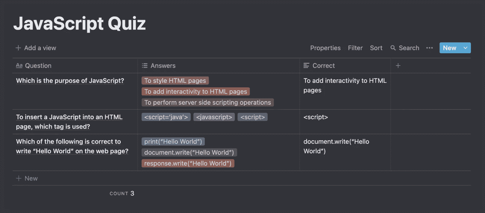
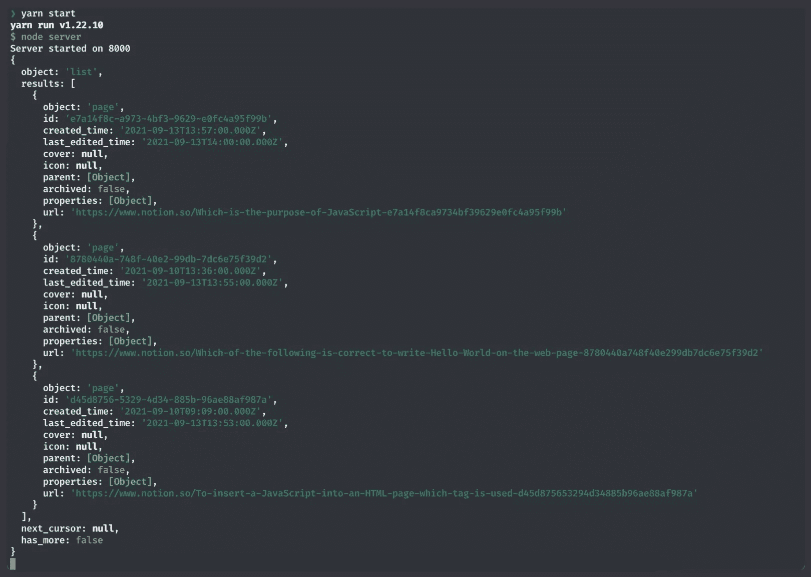
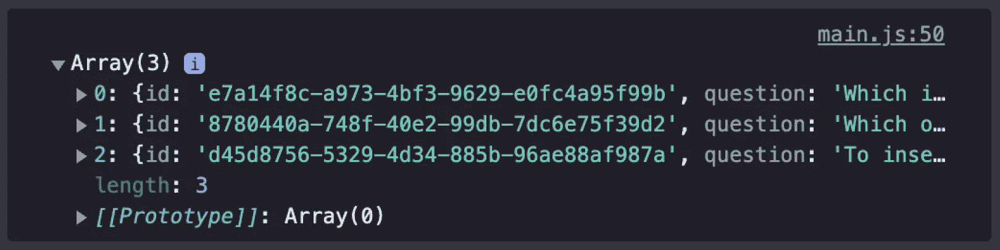
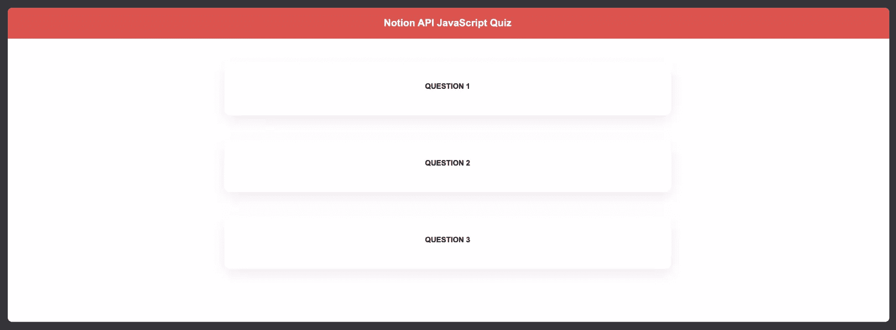
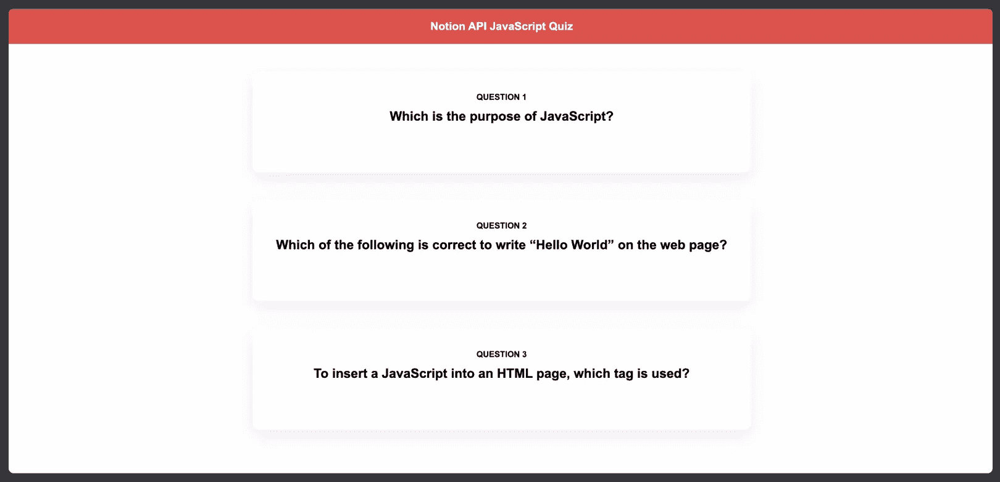
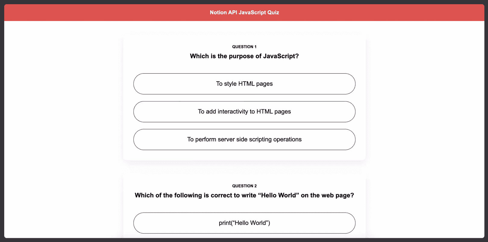
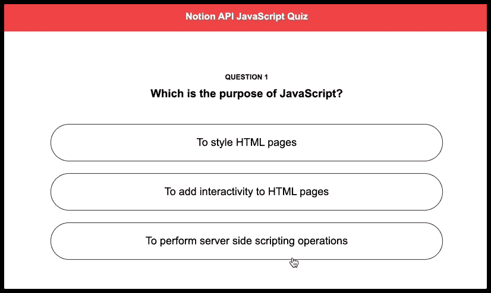

# 使用概念 API 创建一个带有 JavaScript 的测验

> 原文：<https://www.sitepoint.com/notion-api-javascript-quiz/>

概念是一个多功能应用程序，用于组织各种内容，从笔记到日历和提醒。在我们的上一篇文章“[开始使用概念 API 及其 JavaScript SDK](https://www.sitepoint.com/notion-api-javascript-sdk/) ”中，我们深入研究了如何使用概念的 API，并创建了一个小接口来与之交互。本文现在将探索概念 API 的另一个用例:创建一个 JavaScript 测验。

虽然这篇文章不需要以前的知识(我将提供所有需要的步骤)，但我们将处理前端和后端代码，因为涉及到一些 Node.js 和 Express 设置，所以需要一些 JavaScript 技能。

## JavaScript 测验项目设置

我们将把我们的设置分成两个部分。在第一部分中，我们将在概念方面完成所需的设置，在第二部分中，我们将使用我们的代码。

为了跟进，您需要一个概念帐户(下面会详细介绍)，以及安装在您的机器上的[节点的最新副本。一如既往，教程的](https://www.sitepoint.com/quick-tip-multiple-versions-node-nvm/)[最终代码可以在 GitHub](https://github.com/sitepoint-editors/notion-api-javascript-quiz) 上找到。

## 概念设置

如果您还没有概念账户，请点击[此链接](https://www.notion.so/login)创建一个。创建您的帐户并登录后，选择**添加页面**并为其命名，创建一个新页面。对于本教程，我们将使用一个`Table`数据库。虽然它不是构建测验的理想数据库，但它是我们可以用 concept 实现的最接近的数据库！

### 将信息插入表格

现在我们有了空的`Table`，我们需要弄清楚如何正确地将我们的信息插入其中。
我们的测验计划如下:

```
{
  "1": {
    "Question": "Which is the purpose of JavaScript?",
    "Answers": {
      "1": "To style HTML Pages",
      "2": "To add interactivity to HTML pages",
      "3": "To perform server side scripting operations"
    },
    "Correct": "To add interactivy to HTML pages"
  },
  "2": {
    "Question": "To insert a JavaScript into an HTML page, which tag is used?",
    "Answers": {
      "1": "<script='java'>",
      "2": "<javascript>",
      "3": "<script>"
    },
    "Correct": "<script>"
  },
  "3": {
    "Question": "Which of the following is correct to write “Hello World” on the web page?",
    "Answers": {
      "1": "print('Hello World')",
      "2": "document.write('Hello World')",
      "3": "response.write('Hello World')"
    },
    "Correct": "document.write('Hello World')"
  }
} 
```

concept 并不是真正为这种类型的数据库而构建的，所以我们需要发挥它的创造性！💡所以我们的`Question`列将只是一个`Title`(这很好)，而我们的`Correct`列将是类型`Text`(这也能按预期工作)。然而，对于我们的多种选择，我们需要做一些不同的事情！我的方法是使用`Multi-select`字段类型，这样我就可以将多个结果写入同一个单元格中(我们将看到从这个单元格中检索到的数据是什么样子)。所以我们的`Table`最终结果应该是下图这样。



### 创建我们的概念 API 集成

现在，我们需要去观念 API [网站](https://developers.notion.com/)来创建我们的集成。按右上角的**我的集成**按钮，然后点击**创建新的集成**。我们需要填写我们的标题，并确保选择我们的相关工作区(这将是默认选择，但要确保这一点)。如果我们按下 **Submit** ，我们将被定向到一个新页面，该页面带有一个内部集成令牌(我们将在我们的代码中使用它)和两个选项框，用于显示我们希望在哪里使用我们的集成。除了复制我们的令牌并按下**保存更改**之外，我们不需要在这个页面上做任何事情。

现在我们回到我们的概念空间。在我们新创建的概念数据库中，我们想按下**分享**，然后**邀请**。然后，我们将能够选择我们新创建的集成。如果我们选择它并按下**邀请**，我们的概念设置就完成了。干得好！🙌

## 代码设置

对于我们的代码设置，我们将使用一个概念模板库(我们可以在任何概念 API 项目中使用它！)中，它已经有了使用 idea 的 API 所需的初始代码。这个回购可以在[这里](https://github.com/sitepoint-editors/notion-api-javascript-starter)找到，所以一定要叉出来克隆出来陪我们的项目！如果你对所有代码都做了什么感兴趣，请参考“[概念 API 及其 JavaScript SDK](https://www.sitepoint.com/notion-api-javascript-sdk/) 入门”，因为我们对每一段代码都有很多细节(回购也有一个`README`应该解释它做了什么！).

### 安装依赖项

在分叉和克隆我们的概念模板 repo 之后，我们的第一步是安装我们的依赖项，所以确保在我们的终端上运行文件夹内的`yarn`或`npm install`。在这个项目中，我们有三个依赖项:T2、notionhq/client、T4、dotenv 和快递。我们将使用 dotenv 来管理我们的变量并保证它们的安全(比如我们在集成中看到的),并使用 Express 来为我们的应用程序创建后端和服务器。

要用 dotenv 管理我们的变量，在我们项目的根目录下创建一个`.env`文件，然后将以下内容粘贴到那里:

```
NOTION_API_KEY = YOUR_TOKEN_HERE
NOTION_API_DATABASE = YOUR_DATABASE_ID_HERE 
```

我们的`NOTION_API_KEY`是我们可以在我们的**集成**中找到的关键，我们的`NOTION_API_DATABASE`可以通过转到创建的概念页面并查看浏览器的 URL 栏来找到。它位于您的工作区名称(如果我们有)和斜线(`myworkspace/`)之后，问号(`?`)之前。ID 长度为 32 个字符，包含数字和字母:

```
https://www.notion.so/myworkspace/a8aec43384f447ed84390e8e42c2e089?v=...
                                  |--------- Database ID --------| 
```

如果我们担心在我们的 repo 中的某个文件上有 ideal 的 API 键，请注意在我们的`.gitignore`上有一个`.env`文件；`.gitignore`允许我们将不同的文件/文件夹名放入其中，这意味着当我们推送代码时，这些文件/文件夹不会被添加到我们的 repo 中。

既然我们已经有了初始的存储库，并且我们已经从 concept 获得了所需的凭证，我们可以开始我们的测验了！

## 获取 JavaScript 测验数据

我们应该首先检查我们是否成功连接到我们的概念数据库，因此我们将导航到我们的`.index.js`文件并记录我们的`reponse`变量(看我们如何从我们的`.env`文件中获取我们的`databaseId`，并在我们的*数据库查询*中使用它？).

如果我们随后运行`yarn start`，我们应该会在终端上看到类似下面的截图。



在我们的终端上看到这个意味着我们正确地连接到了我们的概念数据库，现在我们可以获得我们需要的数据了。我们的`getDatabase`函数将如下所示:

```
exports.getDatabase = async function () {
  const response = await notion.databases.query({ database_id: databaseId });

  const responseResults = response.results.map((page) => {
    return {
      id: page.id,
      question: page.properties.Question.title[0].plain_text,
      answers: page.properties.Answers.multi_select,
      correct: page.properties.Correct.rich_text[0].plain_text,
    };
  });

  return responseResults;
}; 
```

使用`responseResults`，我们映射到我们的`results`(匹配我们数据库中的条目)，我们将不同属性的路径映射到我们选择的名称(在本例中，`id`、`question`、`answers`和`correct`)。请注意对象路径有多具体。这是由设计决定的，这意味着在开发和使用您自己的数据库时，您应该不断地调查返回的属性，直到找到您正在寻找的信息(这实际上是一个试错的问题)。

有了这个新代码，我们就可以调用我们的 API 并选择我们想要在代码中使用的属性，这意味着我们已经准备好在我们的接口上使用它们了！

## 在浏览器中显示我们的数据

让我们从处理 HTML 和 CSS 开始，因为它们非常直接！我们不会对模板中的 HTML 做任何修改，在我们的`style.css`中，我们可以将以下代码粘贴到现有代码的下方:

```
.questionContainer {
  padding: 30px;

  display: flex;
  flex-direction: column;
  justify-content: center;
  align-items: center;

  box-shadow: rgba(149, 157, 165, 0.2) 0px 8px 24px;
  border-radius: 10px;
}

.numberElement {
  margin: 0px auto 10px;

  font-size: 12px;
  font-weight: 700;
  text-transform: uppercase;
}

.question {
  margin: 0px auto 40px;
}

.answersDiv {
  width: 100%;

  display: flex;
  flex-direction: column;
  gap: 20px;
}

.answerOption {
  padding: 20px;
  margin: 0px;

  font-size: 18px;
  text-align: center;

  cursor: pointer;

  border: 1px solid rgb(42, 43, 44);
  border-radius: 40px;
} 
```

我们还看不到这些样式上的变化，但是我们现在可以把注意力放在功能上，这是本教程中更重要的部分。

如果我们现在转到`public`文件夹中的`main.js`文件，我们会看到我们已经用`getDataFromBackend`函数从后端抓取了数据。如果你对此感到困惑，那么“[开始使用概念 API 及其 JavaScript SDK](https://www.sitepoint.com/notion-api-javascript-sdk/) ”有一个更长的解释，但基本上在我们的`server.js`上，我们创建了一个获取我们的数据库的路由，在这里的`getDataFromBackend`上，我们创建了一个到相同路由的`fetch`，它将为我们获取我们的数据。

注意在`addData`内部我们已经有了`const data = await getDataFromBackend();`。这意味着我们已经准备好开始处理我们的数据，我们实际上可以检查这一点！`log`这个`data`变量，我们应该在控制台上看到一个数据库条目的数组。



### 在屏幕上显示我们的数据

现在我们知道了返回的数据是什么样子，我们需要考虑如何在屏幕上显示它。我对它的想法是每个问题有一张卡片，里面有不同的答案，当用户按下*正确答案*时，答案的背景应该变成*绿色*；如果是*错了*，它应该把*变成红色*。

让我们从为每个问题创建一个`<div>`开始。我们可以通过用一个`forEach`循环迭代我们的数组来做到这一点，允许我们创建`<div>`并向它添加一些类。

所以在我们的`addData`函数中，我们可以这样做:

```
const addData = async () => {
  const data = await getDataFromBackend();

  data.forEach((value, index) => {
    const div = document.createElement('div');
    div.classList.add('questionContainer');

    container.append(div);
  });
}; 
```

但感觉还是有点空，所以让我们给每张卡片附加一个标题，如下所示:

```
const addData = async () => {
  const data = await getDataFromBackend();

  data.forEach((value, index) => {
    const div = document.createElement('div');
    div.classList.add('questionContainer');

    const numberElement = document.createElement('p');
    numberElement.classList.add('numberElement');
    numberElement.innerHTML = `Question ${index + 1}`;

    div.appendChild(numberElement);

    container.append(div);
  });
}; 
```

这里我们创建一个`<p>`并给它一个类，我们使用的是`index + 1`，因为 JavaScript 中的数组是从零开始的，我们不想看到问题 0，因为那没有意义！如果我们现在启动我们的应用程序，我们应该会看到类似下图的东西。



### 有趣的部分:呈现问题和答案的新功能

现在是有趣的部分！我们可以在`addData`中完成所有的逻辑，但这可能会变得太混乱，所以我们将创建新的函数来呈现我们的*问题*和*答案*。

让我们从*问题*开始，让我们在`addData`函数上做一些工作，这些工作仍然不会转化成太多:

```
const addData = async () => {
  const data = await getDataFromBackend();

  data.forEach((value, index) => {
    const div = document.createElement('div');
    div.classList.add('questionContainer');

    const numberElement = document.createElement('p');
    numberElement.classList.add('numberElement');
    numberElement.innerHTML = `Question ${index + 1}`;

    div.appendChild(numberElement);

    // OUR NEWLY ADDED CODE
    const question = createQuestion(value.question);

    div.appendChild(question);
    // END OF OUR NEWLY ADDED CODE

    container.append(div);
  });
}; 
```

我们刚刚添加的代码非常类似于`numberElement`的代码，但是这里我们将一个函数赋给一个变量并追加那个变量。还要注意，我们将`value.question`传递给我们的`createQuestion`，因为我们想要处理并呈现*问题*，当然。很快一切都会变得有意义——别担心！

现在，在`addData`之外，让我们创建这个新的`createQuestion`函数。在它里面，我们非常希望有与我们为`numberElement`添加的相同的逻辑:创建一个元素，给它一个类，并向它添加一些内容。这里我们将使用`innerHTML`而不是`createTextNode`:因为我们的问题与代码有关，如果我们在类似`<b>text</b>`的东西中使用`innerHTML`，它实际上会呈现单词`text`，但是用粗体而不是整个语法(你可以在这里看到一个例子)。我们最终的`createQuestion`将是这样的:

```
const createQuestion = (question) => {
  const questionElement = document.createElement('h3');
  questionElement.classList.add('question');
  const questionNode = document.createTextNode(question);

  questionElement.appendChild(questionNode);

  return questionElement;
}; 
```

如果我们现在运行`yarn start`，我们的浏览器应该如下所示。



现在我们对*答案*的设置基本相同。让我们首先做我们在`addData`中对`createQuestion`做的同样的事情:

```
const addData = async () => {
  const data = await getDataFromBackend();

  data.forEach((value, index) => {
    const div = document.createElement('div');
    div.classList.add('questionContainer');

    const numberElement = document.createElement('p');
    numberElement.classList.add('numberElement');
    numberElement.innerHTML = `Question ${index + 1}`;

    div.appendChild(numberElement);

    const question = createQuestion(value.question);

    div.appendChild(question);

    // OUR NEWLY ADDED CODE
    const answers = createAnswers(value);

    div.appendChild(answers);
    // END OF OUR NEWLY ADDED CODE

    container.append(div);
  });
}; 
```

现在，我们对`createAnswers`的最初看法将是这样的:

```
const createAnswers = (value) => {
  const answersDiv = document.createElement('div');
  answersDiv.classList.add('answersDiv');

  return answersDiv;
}; 
```

注意我们是如何做的`const answers = createAnswers(value);`。我们不能只将`value.answers`传递给我们的函数，因为我们也需要`value.correct`。我们可以给我们的函数传递两个参数:一个是*答案*的数组，另一个是*正确的*答案。

### 呈现一系列答案

我们现在有一个由*个答案*组成的数组，我们需要呈现所有答案，所以我们需要一个循环来遍历所有答案。这个循环中的过程和所有其他元素几乎一样，所以我们现在应该是在 DOM 上呈现元素的*专家*:

```
const createAnswers = (value) => {
  const answersDiv = document.createElement('div');
  answersDiv.classList.add('answersDiv');

  for (let i = 0; i < value.answers.length; i++) {
    const answerElement = document.createElement('p');
    answerElement.classList.add('answerOption');
    const answerNode = document.createTextNode(value.answers[i].name);

    answerElement.appendChild(answerNode);

    answersDiv.appendChild(answerElement);
  }

  return answersDiv;
}; 
```

使用这段代码，我们循环遍历我们的`array`，创建一个元素，给它一个类，并使用`createTextNode`来呈现我们的*答案*。(有趣的是，如果我们在这里使用了`innerHTML`，那么*和`<script>`的答案*就不会呈现出来😄。)然后我们简单地把这个`answerNode`附加到我们的`<p>`上，把这个附加到我们的`<div>`上！如果我们运行`yarn start`，我们现在将看到我们的整个测验！呜！🚀



## 与答案互动

嗯……但是我们不能真正地与答案互动，如果我们不知道我们得到的答案是对还是错，这就不是真正的测验，对吗？我们应该解决这个问题！

我们知道我们想要点击每个*答案*，并且知道它是*对的*还是*错的*，所以我们可以开始向它添加一个事件监听器，如下所示:

```
const createAnswers = (value) => {
  const answersDiv = document.createElement('div');
  answersDiv.classList.add('answersDiv');

  for (let i = 0; i < value.answers.length; i++) {
    const answerElement = document.createElement('p');
    answerElement.classList.add('answerOption');
    const answerNode = document.createTextNode(value.answers[i].name);

    // OUR NEWLY ADDED CODE
    answerElement.addEventListener('click', () => {});
    // END OF OUR NEWLY ADDED CODE

    answerElement.appendChild(answerNode);

    answersDiv.appendChild(answerElement);
  }

  return answersDiv;
}; 
```

记得我们做了`createAnswers(value)`，所以我们可以得到`value.correct`？现在是时候闪亮登场了！当我们点击一个答案时，有两种可能的结果:用户选择了与正确答案相同的答案，或者用户选择了与正确答案不同的答案。为了处理这些可能的结果，我们将使用 if 语句，我们将通过改变答案的`background-color`来向用户显示他们得到的答案*正确*或*错误*。所以我们的逻辑会是这样的:

```
const createAnswers = (value) => {
  const answersDiv = document.createElement('div');
  answersDiv.classList.add('answersDiv');

  for (let i = 0; i < value.answers.length; i++) {
    const answerElement = document.createElement('p');
    answerElement.classList.add('answerOption');
    const answerNode = document.createTextNode(value.answers[i].name);

    answerElement.addEventListener('click', () => {
      // OUR NEWLY ADDED CODE
      answerElement.style.color = 'white';
      if (value.answers[i].name !== value.correct) {
        // colour our answerElement red
        answerElement.style.backgroundColor = '#f55142';
      } else {
        // colour our answerElement green
        answerElement.style.backgroundColor = '#6dbf39';
      }
      // END OF OUR NEWLY ADDED CODE
    });

    answerElement.appendChild(answerNode);

    answersDiv.appendChild(answerElement);
  }

  return answersDiv;
}; 
```

因此，每次点击时，我们都将文本颜色改为白色，然后我们检查每个答案的`name`属性是否等于`value.correct`(这显然不理想，索引会更好，但我们已经尽了最大努力使用了 ideal 的数据库！).如果不是，我们把它的颜色改成红色，如果是，我们把它改成绿色！



我们的测验结束了！🚀是不是很奇妙？

## 概念 JavaScript 测验总结

在本教程中，我们已经探索了由概念的 API 提供的许多功能，老实说，看到您可以用这样一个简单的工具做多少事情总是非常令人兴奋的！

我希望这篇文章最终能激发你探索 concept API，并用 concept 构建你自己的测验和其他 rad 东西！

如果你想快速测试这个概念项目，你可以从我们的 [GitHub repo](https://github.com/sitepoint-editors/notion-api-javascript-quiz) 中克隆它。

## 分享这篇文章