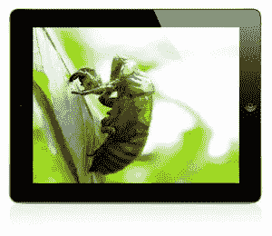

# 现在轮到你了:用蝉计划赢得一台 iPad 2

> 原文：<https://www.sitepoint.com/now-its-your-turn-win-an-ipad2-with-the-cicada-project/>

两周前，我们向您展示了一种使用巧妙的数字来制作几乎无穷无尽的平铺背景的方法。这篇文章得到了惊人的回应:2500+转推，2500+脸书喜欢，240+评论。没看过文章？查看[**Cidada 原理**](https://www.sitepoint.com/the-cicada-principle-and-why-it-matters-to-web-designers/ "DesignFestival.com: The Cicada Principle") 。

你问这个“蝉计划”是什么？还有它和上面的 iPad 2 有什么共同点？

嗯，根据兴趣和反应，我们决定不仅要看看设计节和 Design View 时事通讯的读者群能提出什么样的有机背景瓷砖组合，其中最受欢迎的将成为设计节网站的特色，还要赢得赢得 iPad 2 的机会！是的，我们已经说服老板给最佳作品的作者一个漂亮的 iPad 2。

## 细节

一切都美好而简单:

1.  阅读了从[到 **Cidada 原理**文章的教程后，请点击 DesignFestival 上的蝉项目页面](https://www.sitepoint.com/the-cicada-principle-and-why-it-matters-to-web-designers/ "DesignFestival.com: The Cicada Principle")
2.  使用你最喜欢的图形编辑器创建你自己的连锁蝉瓷砖(最多八个)
3.  使用 Twitter 登录
4.  [在设计节现场测试结果，在蝉项目页面](https://www.sitepoint.com/the-cicada-principle-and-why-it-matters-to-web-designers/ "DesignFestival.com: The Cicada Project")
5.  完成后，完成，您的提交将由我们审查，然后发表！
6.  比赛将于 5 月 25 日结束

我们都期待着看到你的意见。

## 分享这篇文章