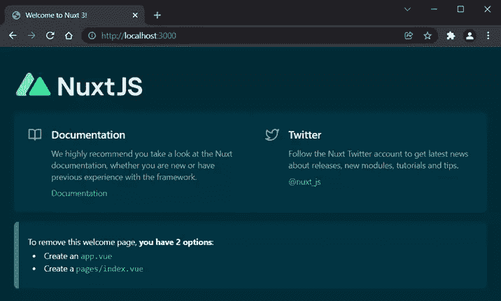
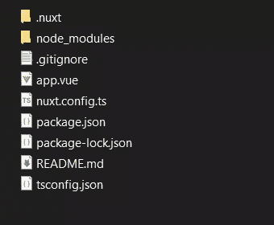
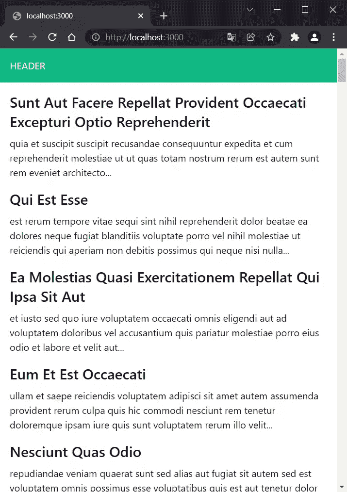
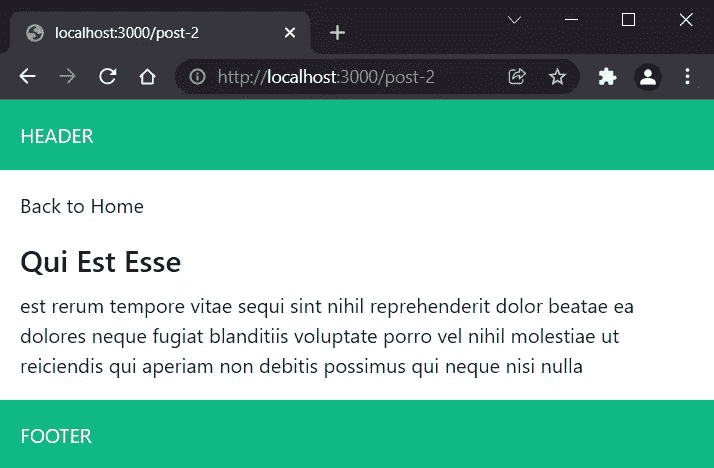
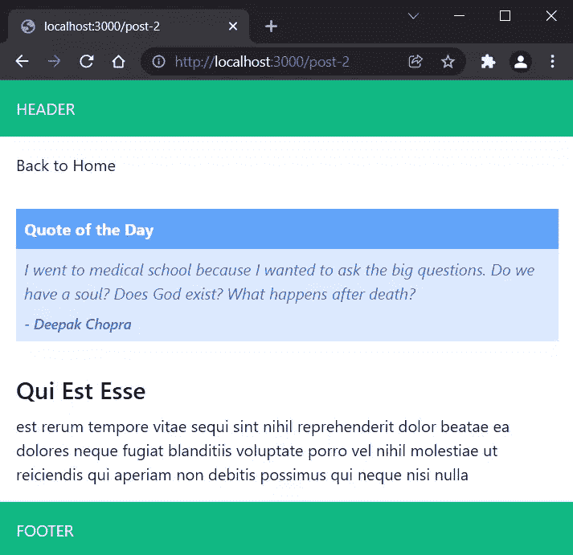
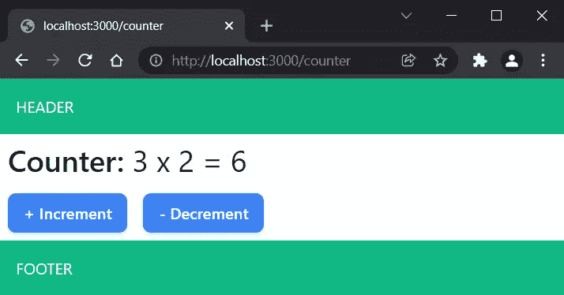

# Nuxt 3 测试版:新特性和入门方法

> 原文：<https://www.sitepoint.com/nuxt-3-whats-new-get-started/>

在这篇文章中，我们将探索 Nuxt 3 提供的最显著的新特性和改进，我们也将看看它们中的大多数是如何在实践中使用的。这将很好地概述 Nuxt 3 的潜力，以及如何在项目中实现它的优点。

## Nuxt 概述

Nuxt 是一个建立在 [Vue](https://v3.vuejs.org/) 之上的[高级开源应用开发框架](https://v3.nuxtjs.org/)。它的目标是加速、简化和促进基于 Vue 的应用程序的开发。

为此，它提供了以下功能:

*   大多数最好的 web 性能优化都是现成的。
*   自动化应用搭建和开发。Nuxt 以优化和微调的启动项目的形式组合和集成了一组精选的同类工具。
*   一组自以为是的目录结构约定，用于更轻松有效地管理页面和组件。

所有这些优点使得 Nuxt 已经成为构建 Vue 应用的完美选择。但好消息是，在漫长的延迟之后， [Nuxt 3 beta 版于 2021 年 10 月](https://nuxtjs.org/announcements/nuxt3-beta/)公布。这个完全重新架构的版本承诺更快、更轻、更灵活和更强大，提供顶级的 DX(开发者体验)。Nuxt 现在比以往任何时候都更好，它带来了一些真正令人印象深刻的功能。让我们来看看它们是什么。

## Nuxt 3 测试版有什么新功能

Nuxt 3 beta 有很多改进和令人兴奋的新功能。让我们探索其中最值得注意的。

Nitro 是在 T2 H3 T3 的基础上为 Nuxt 构建的一个新的服务器引擎。它提供了以下好处:

*   **API 路线支持**。你的*服务器 API* 和*中间件*分别通过读取`server/api/`和`server/middleware/`目录下的文件自动生成。您可以通过将相应的文件放在`server/api/`目录中来创建所需的 API 端点。例如，`tasks.js`文件将生成一个`http://yourwebsite.com/api/tasks`端点。`server/middleware/`中的函数自动加载并在每个请求中运行——这与 [Express](http://expressjs.com/) 的工作方式非常相似。
*   app 可以部署到各种无服务器平台，如 Vercel、Netlify、AWS、Azure 等。此外，一些平台(Vercel、Netlify)在部署时会被自动检测，无需添加自定义配置。
*   构建的应用程序可以部署在任何 JavaScript 支持系统上，包括 Node、Deno、Serverless、Workers 等。
*   **增量静态生成**。这允许对静态和无服务器站点使用混合模式。最终结果是 SSR(服务器端呈现)和 SSG(静态站点生成)的混合。(这是一个计划中的功能，但还没有实现。)
*   **轻得多的 app 输出**。构建好的 app 放在一个通用的`.output/`目录下。构建被缩小，所有节点模块(聚合填充除外)都被删除。这种策略针对现代浏览器，它在客户机和服务器上产生了高达 75 倍的更小的包。
*   通过动态服务器代码分割和异步加载块优化冷启动。
*   更快的捆绑和热重装。

Nuxi 是一个新的 Nuxt CLI。它提供了一种零依赖体验，可以轻松搭建新项目和模块集成。

[Nuxt Kit](https://github.com/nuxt/framework/tree/main/packages/kit) 通过 TypeScript 支持和跨版本兼容性，提供了一种新的灵活的模块开发体验。

Nuxt Bridge 允许你在现有的 Nuxt 2 项目中使用 Nuxt 3 的一些特性。它的目标是通过向 Nuxt 2 用户提供增量更新/升级他们的项目的能力，使未来的迁移更加顺利。下面是 Nuxt 3 的特性，你可以把它们包含在你的 Nuxt 2 项目中，正如 Nuxt 网站上所说的:

*   在 Nuxt 2 中使用 Nitro 服务器
*   在 Nuxt 2 中使用组合 API(与 Nuxt 3 相同)
*   在 Nuxt 2 中使用新的 CLI 和 devtools
*   逐步升级到 Nuxt 3
*   与 Nuxt 2 模块生态系统的兼容性
*   逐件升级(Nitro，Composition API，Nuxt 套件)

Nuxt Bridge 还旨在促进整个 Nuxt 生态系统的升级。出于这个原因，遗留插件和模块将继续工作，Nuxt 2 的配置文件将与 Nuxt 3 兼容，一些 Nuxt 3 APIs(如 Pages)将保持不变。

这些是所谓的“大”功能，但 Nuxt 3 有更多的小功能和改进。我们将在下面的列表中探索它们:

*   **Vue 3 支持**。Nuxt 3 版本与 Vue 3 保持一致，因此您可以利用 Vue 3 的所有强大功能，如 Composition API、 [composables](https://vueschool.io/articles/vuejs-tutorials/what-is-a-vue-js-composable/) 等等。Nuxt 已经以内置组件的形式提供了一些功能，比如`useFetch()`、`useState()`和`useMeta()`。有关 Vue 3 组合 API 的更多信息，请参见[如何使用 Vue 3 组合 API](https://www.sitepoint.com/vue-composition-api-reusable-components/) 创建可重用组件。
*   **Webpack 5 和 Vite 支持**。享受最新版本的最佳捆扎机，提供更快的构建时间和更小的捆扎机尺寸，无需配置。Vite，顾名思义，提供超快速 HMR(热模块更换)。
*   **TypeScript 支持**类型检查、更好的自动完成和错误检测，以及自动生成的类型。如果你不喜欢或者不需要 TypeScript，你仍然可以不用它来使用 Nuxt。
*   **原生 ESM 支持**。
*   [**悬念支持**](https://v3.vuejs.org/guide/migration/suspense.html#introduction) 允许您在导航之前或之后在任何组件中获取数据。
*   **全局实用程序和可组合函数的自动导入**。在`<script setup>`或`setup()`函数中，您可以使用 Nuxt 3 提供的任何可组合函数，如`useFetch()`、`useState()`、`useMeta()`，以及 Vue 反应函数，如`ref()`、`reactive()`、`computed()`等。在新的`composables/`目录中，您可以在组合函数中定义您的所有功能，这些功能也是自动导入的。即使对于来自 [VueUse](https://vueuse.org/) 库的组件来说也是如此，在一个小的配置之后[。](https://vueuse.org/guide/index.html#nuxt)
*   **可选页面支持**。 [Vue 路由器 4](https://next.router.vuejs.org/) 仅在您创建了`pages/`目录时使用。如果不使用 pages，这可以生成较轻的版本。
*   Nuxt Devtools ，它直接从浏览器提供无缝集成的调试工具。(这是一个计划中的功能，但还没有实现。)

好了，现在我们已经看到了 Nuxt 在其最新实现中有多棒，让我们看看如何在实际中使用它的超能力。

在接下来的章节中，我们将探索如何开始使用 Nuxt 3，以及如何使用它来实现一些最小的博客功能。特别是，我们将检查以下内容:

*   创建一个新的 Nuxt 3 项目
*   向项目添加[顺风 CSS](https://tailwindcss.com/) 支持
*   创建和使用自定义布局
*   创建博客页面
*   创建和使用自定义组件
*   使用 Nuxt 3 内置组件
*   创建和使用自定义组件

## Nuxt 3 入门

*注意:在我们开始之前，请确保您的机器上安装了[节点](https://nodejs.org/en/) v14 或 v16。*

我们将从创建一个新的 Nuxt 3 项目开始。为此，请在终端中运行以下命令:

```
npx nuxi init nuxt3-blog
```

这将为您设置一个没有安装任何依赖项的新项目，因此您需要运行以下命令来导航到该项目并安装依赖项:

```
cd nuxt3-blog
npm install
```

最后，要启动 dev 服务器，运行以下命令:

```
npm run dev
```

在浏览器中打开 [http://localhost:3000](http://localhost:3000) 。如果一切正常，您应该会看到下面的欢迎页面。



如果你熟悉 Nuxt 2，你可能会注意到 Nuxt 3 中的项目结构有所简化。



这里有一个简短的列表，探索了与 Nuxt 2 相比，Nuxt 3 在项目结构上最显著的变化。在 Nuxt 3 中:

*   添加一个`app.vue`文件。它是应用程序中的主要组件。无论你放什么进去(CSS，JS 等。)将在全球范围内提供，并包含在每个页面中。
*   使用`pages/`目录是可选的。你只能用`app.vue`作为主要组件，其他组件放在`components/`文件夹中来构建你的应用。如果是这样的话，就不会使用 vue-router，应用程序的构建也会更简单。
*   添加一个新的`composables/`目录。这里添加的每个可组合组件都是自动导入的，因此您可以在应用程序中直接使用它。
*   正如我们之前提到的，添加了一个新的`.output/`目录，产生了更小的包。

## 用 Nuxt 3 构建一个最小的博客

*注意:你可以在 [Nuxt 3 博客示例报告](https://github.com/sitepoint-editors/nuxt3-blog-example)中探索该项目的完整源代码。*

在这一节中，我们将通过构建一个超级简约的博客来探索 Nuxt 3 的基础。我们需要一些样式，而 Tailwind CSS 是一个很好的选择。

### 在项目中包含顺风 CSS

要安装 Tailwind 及其对等依赖项，请运行以下命令:

```
npm install -D tailwindcss@latest postcss@latest autoprefixer@latest
```

现在我们需要生成 Tailwind 和 PostCSS 配置文件。运行以下命令:

```
npx tailwindcss init -p
```

这将在根目录下生成`tailwind.config.js`和`postcss.config.js`文件。打开第一个文件，配置`content`选项以包含所有包含顺风实用程序类的项目文件:

```
// tailwind.config.js
module.exports = {
  content: [
    "./components/**/*.{vue,js,ts}",
    "./layouts/**/*.vue",
    "./pages/**/*.vue",
    "./plugins/**/*.{js,ts}",
    "./app.vue",
  ],
  theme: {
    extend: {},
  },
  plugins: [],
}
```

*注意:从版本 3 开始，Tailwind 不再使用引擎盖下的 PurgeCSS，并且`purge`选项被重命名为`content`。关于`content`选项的更多信息，请阅读顺风文档的[内容配置](https://tailwindcss.com/docs/content-configuration)部分。*

`postcss.config.js`文件不需要任何配置。它已经包含了 Tailwind 和 Autoprefixer 插件:

```
// postcss.config.js
module.exports = {
  plugins: {
    tailwindcss: {},
    autoprefixer: {},
  },
}
```

下一步是添加 Tailwind 的样式。创建一个新的`assets`目录，并在其中放置一个`css`文件夹。在`assets/css/`目录下，创建一个`styles.css`文件，放入以下内容:

```
/* assets/css/styles.css */
@tailwind base;
@tailwind components;
@tailwind utilities;
```

最后一步是用以下内容更新`nuxt.config.ts`:

```
// nuxt.config.ts
import { defineNuxtConfig } from 'nuxt3'

// https://v3.nuxtjs.org/docs/directory-structure/nuxt.config
export default defineNuxtConfig({
  css: ["@/assets/css/styles.css"],
  build: {
    postcss: {
      postcssOptions: require("./postcss.config.js"),
    },
  },
})
```

现在我们可以在我们的项目中使用 Tailwind 的所有工具。

### 创建博客的布局

我们将开始创建一个包含页眉和页脚的简单布局的博客。创建一个`layouts`目录，并在其中添加一个`blog.vue`文件，内容如下:

```
<!-- layouts/blog.vue -->
<template>
  <div>
    <header class="text-white bg-green-500 p-4">HEADER</header>
    <slot />
    <footer class="text-white bg-green-500 p-4">FOOTER</footer>
  </div>
</template>
```

当我们使用这种布局时，`<header>`和`<footer>`元素将在它们出现在这里时被添加。`<slot />`组件定义了实际内容(根据您使用布局的位置而有所不同)的加载位置。现在，我们可以在每个页面或组件中重用此布局，只需按照以下模式提供自定义布局的名称:

```
<script> export default {
    layout: [custom_layout_name]
  } </script>
```

我们将在下一节中看到这一点。

### 创建博客页面

我们已经有了一个博客布局，是时候创建将利用它的博客页面了。在此之前，我们需要在`app.vue`文件中做一个小小的修正。打开它，用`<NuxtPage />`替换`<NuxtWelcome />`组件:

```
<!-- app.vue -->
<template>
  <div>
    <NuxtPage />
  </div>
</template>
```

这告诉 Nuxt 我们将在应用程序中使用页面。

让我们创建主页，它将列出博客的帖子。创建一个新的`pages`目录，并在其中放入一个`index.vue`文件，内容如下:

```
<!-- pages/index.vue -->
<script> export default {
    layout: "blog"
  } </script>

<script setup> const { data: posts } = await useFetch('https://jsonplaceholder.typicode.com/posts') </script>

<template>
  <div>
    <article class="m-4 md:w-1/2 lg:w-1/3" v-for="post in posts" :key="post.id">
      <NuxtLink :to="`/post-${post.id}`">
        <h2 class="mb-2 capitalize text-2xl font-semibold">{{ post.title }}</h2>
      </NuxtLink>
      <p>{{ post.body }}...</p>
    </article>
  </div>
</template>
```

这里，我们首先使用一个常规的`<script>`元素来定义我们想要使用的自定义`blog`布局。然后我们使用[`script setup>`语法糖](https://v3.vuejs.org/api/sfc-script-setup.html#sfc-script-setup)来创建一个设置函数。然后我们使用可组合的 Nuxt 3 `useFetch()`来获取帖子。在模板部分，我们遍历帖子并为每个帖子创建一个`<article>`元素。我们使用`<NuxtLink>`元素来创建每个帖子的链接。每篇文章都有一个遵循`post-[id]`模式的 URL。

这项工作现在已经完成了一半。剩下的工作就是创建一个代表一篇文章的页面。Nuxt 3 为`pages/`目录提供了一个新的括号语法，因此我们可以使页面名称的一部分动态化。我们来测试一下。

创建一个包含以下内容的`post-[id].vue`页面:

```
<!-- pages/post-[id].vue -->
<script> export default {
    layout: "blog"
  } </script>

<script setup> const route = useRoute()
  const { data: post } = await useFetch(`https://jsonplaceholder.typicode.com/posts/${route.params.id}`, { pick: ['title', 'body'] }) </script>

<template>
  <div>
    <NuxtLink to="/">
      <h1 class="m-4 hover:underline">Back to Home</h1>
    </NuxtLink>
    <!-- A <quote /> component should be added here later on -->
    <article class="m-4 md:w-1/2 lg:w-1/3">
      <h2 class="mb-2 capitalize text-2xl font-semibold">{{ post.title }}</h2>
      <p>{{ post.body }}</p>
    </article>
  </div>
</template>
```

这里，我们再次添加`blog`布局。然后我们使用`useRoute()` composable 来获取当前 URL 的`id`参数，这是我们在`useFetch()`中需要的。我们还使用了`pick`选项，所以我们将只获取我们需要的东西(`title`和`body`属性)。然后，在模板部分，我们使用`post`变量来呈现文章的标题和正文。我们还使用`<NuxtLink>`组件来创建一个到主页的链接。

太好了。现在，如果您运行这个项目(如果服务器已经在运行，您可能需要重启它)，您应该会在主页上看到一个帖子列表。



当你点击一篇文章的标题时，你会被重定向到显示该文章的单个文章页面。



### 创建报价组件

除了页面，组件是 Nuxt 应用程序中最常用的元素。让我们来看看如何创建一个简单的报价组件，为每个被访问的帖子呈现当天的随机报价。

新建一个`components`文件夹，放一个`quote.vue`文件在里面，内容如下:

```
<!-- components/quote.vue -->
<script setup> const quote = ref('')
  const { data: qotd } = await useFetch('https://favqs.com/api/qotd')
  quote.value = qotd.value.quote </script>

<template>
  <div class="p-4 md:w-1/2 lg:w-1/3">
    <p class="p-2 font-bold bg-blue-400 text-white">Quote of the Day</p>
    <div class="p-2 bg-blue-100  text-indigo-600">
      <p class="italic">{{ quote.body }}</p> 
      <p class="mt-2 italic text-sm font-medium">- {{ quote.author }}</p>
    </div>
  </div>
</template>
```

这里，我们随机获取当天的报价，并将其赋给`quote`变量。然后，我们在模板中使用它来呈现报价的`body`和`author`。为了测试我们的报价组件，我们需要将它包含在位于`<article>`元素上方的`post-[id].vue`文件中:

```
<!-- pages/post-[id].vue -->
...
<template>
  <div>
    <NuxtLink to="/">
      <h1 class="m-4 hover:underline">Back to Home</h1>
    </NuxtLink>
    <quote /> <!-- put quote component here -->
    <article class="m-4 md:w-1/2 lg:w-1/3">
      <h1 class="mb-2 capitalize text-2xl font-semibold">{{ post.title }}</h1>
      <p>{{ post.body }}</p>
    </article>
  </div>
</template>
```

现在，当你打开一个特定的帖子时，帖子上方会出现一个当日报价框。



### 创建和使用`useCounter()`可组合

我们将探索的最后一件事是如何创建和使用可组合的。在这个练习中，我们将使用著名的反例。新建一个`composables`文件夹，放一个`useCounter.js`文件在里面，内容如下:

```
// composables/useCounter.js
export default () => {
  const counter = ref(0)
  const increment = () => counter.value++
  const decrement = () => counter.value--
  const counterDouble = computed(
    () => counter.value * 2
  )
  return {
    counter,
    increment,
    decrement,
    counterDouble
  }
}
```

在这个可组合组件中，我们添加了一个值设置为零的`counter`反应属性和一个使计数器值加倍的计算属性。我们还添加了两个函数来增加和减少计数器的值。然后我们返回所有的属性和函数，这样它们就可以使用了。

现在，为了测试它，让我们用以下内容创建另一个名为`counter.vue`的页面:

```
<!-- pages/counter.vue -->
<script> export default {
    layout: "blog"
  } </script>

<script setup> const { counter, increment, decrement, counterDouble } = useCounter() </script>

<template>
  <div>
    <p class="m-2 text-3xl"><span class="font-semibold">Counter:</span> {{ counter }} x 2 = {{ counterDouble }}</p>
    <button @click="increment" class="m-2 py-2 px-4 bg-blue-500 text-white font-semibold rounded-lg shadow-md hover:bg-blue-700">+ Increment</button>
    <button @click="decrement" class="m-2 py-2 px-4 bg-blue-500 text-white font-semibold rounded-lg shadow-md hover:bg-blue-700">- Decrement</button>
  </div>
</template>
```

这里我们可以看到我们直接使用了`useCounter()`,因为它是由 Nuxt 自动导入的。然后我们在模板中使用它的变量和函数。

重启服务器，打开[http://localhost:3000/counter](http://localhost:3000/counter)。您应该会看到如下图所示的计数器。



## 结论

在本教程中，我们探索了 Nuxt 3 最显著的新特性和改进，并展示了它们中的大部分如何在实践中使用。我希望这已经给了你一个很好的概述，关于 Nuxt 3 的可能性，以及你如何在你的项目中实现它的好处。最后，我必须警告你，Nuxt 3 仍处于测试阶段，这意味着它可能还没有准备好生产。当然，这不应该阻止我们学习和试验它，对不对？所以我们来玩吧！

## 分享这篇文章