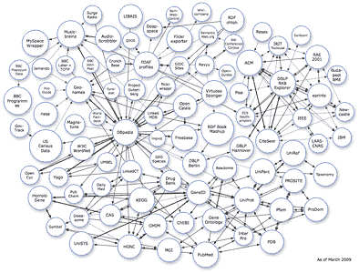
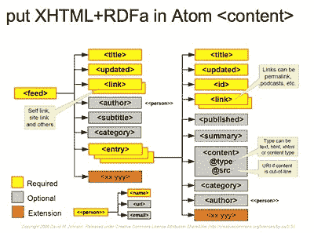
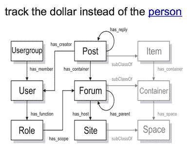
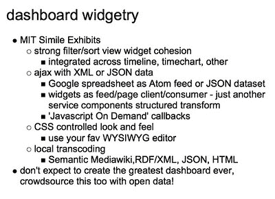

# 奥巴马对语义网的突破性使用

> 原文：<https://www.sitepoint.com/obama-groundbreaking-use-semantic-web/>

在一个革命性的举措中，奥巴马政府将利用下一代网络技术为政府带来前所未有的透明度。在这种情况下，大约 8000 亿美元的经济刺激计划将会如何支出将会一目了然。最近推出的[recovery.gov](http://www.recovery.gov/)网站(由 Drupal 提供支持)承诺公民将能够看到钱去了哪里，如何被花掉。

为了让公民混搭者施展他们的魔法，政府将开放一个名副其实的糖果商店:语义网、 [RDF](http://en.wikipedia.org/wiki/Resource_Description_Framework) 、[关联数据](http://linkeddata.org/)、 [SPARQL](http://en.wikipedia.org/wiki/SPARQL) 、 [RDFa](https://www.w3.org/TR/xhtml-rdfa-primer/) 、 [SIOC](http://sioc-project.org/) 、 [ATOM](http://en.wikipedia.org/wiki/Atom_(standard)) 、[RESTful](http://en.wikipedia.org/wiki/Restful)API、JSON、Widgets、 [Wikis](http://semantic-mediawiki.org/) 、XForms 哇哦。他们只忘记了狮子、老虎和熊，哦，天哪…这是一堆令人难以置信的技术。我想政府甚至不知道什么是 RSS 提要:)

来自美国政府网站 recovery.gov 的乔治·汤姆斯在本月早些时候透明营的一次谈话中介绍了一些细节。他谈到了政府正在采取的措施，以及上述技术对实现这一目标的重要性。

大约两个月前，我写了一篇关于欧巴马总统在 whitehouse.gov 问题上使用 RDFa 的文章。诚然，这只是一粒沙子的大小，但这就像发现了一颗新的行星。那个星球就在步行距离之内。

布什、后门交易和地下钱庄的时代已经一去不复返了。).现在，每一分钱都可以被观察、追踪和点击。但是，随着超过 8000 亿美元的支出，有很多小钱需要跟踪。允许这种情况发生的最有效的方法是什么？

**众包**

很快，每个公民活动家都将拥有与资金轨迹相关的一切智能数据，这将与最好的 Web 2.0 和 Web 3.0 混搭工具相结合。想象一下各种可能性…看看 Adrian Holovaty 用 [ChicagoCrime](http://chicago.everyblock.com/crime/) 做了什么，就知道当数据以独特的方式组合时可以做什么。

我很兴奋！这确实是一个了不起的历史性举措。这是一种极端的透明，在美国或任何其他国家都没有出现过。标准现已确立。加油澳大利亚！其余的国家……翻开书本，让我们看看筹码到底落在了哪里。

我差点把这篇文章的标题定为“给我钱！！!"配上一张汤姆·克鲁斯的可爱照片。嗯，这个标题仍然非常准确。或者……**“给我钱……小道！”**。

汤姆·克鲁斯

## 分享这篇文章