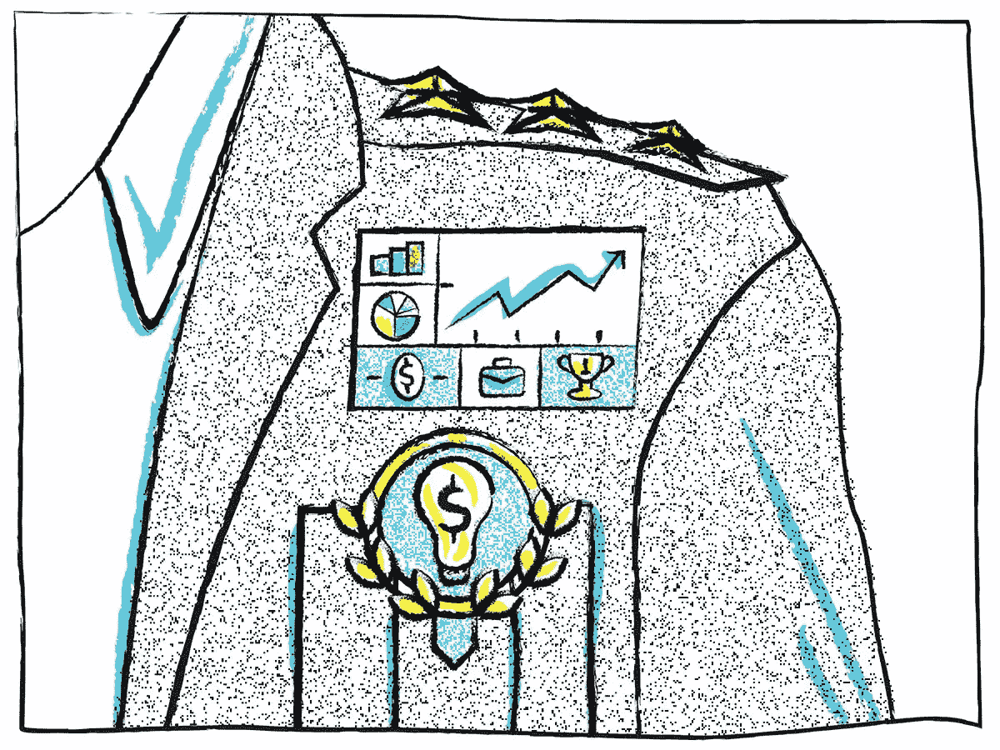
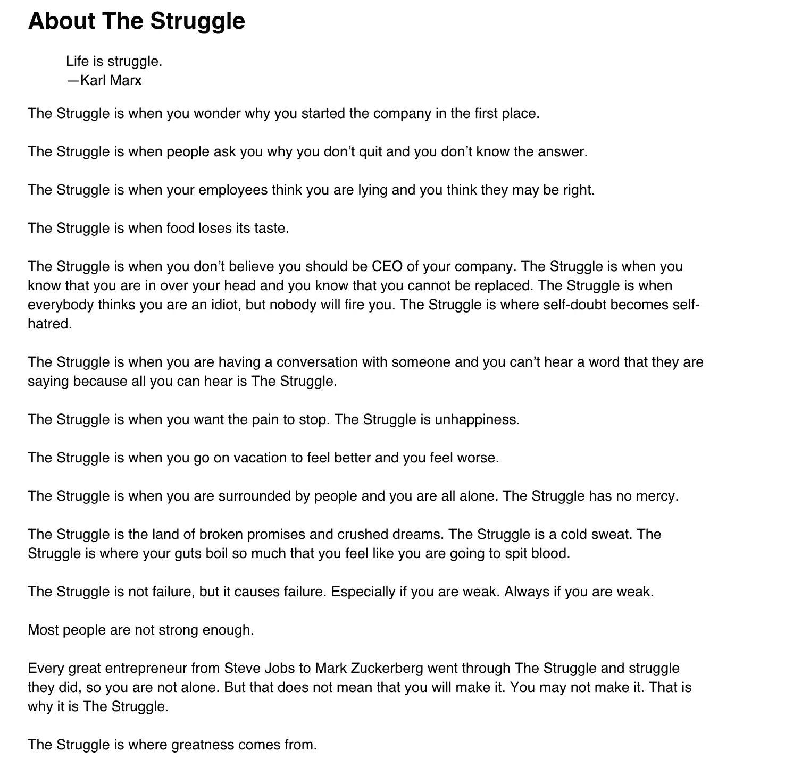

# 十月份的社论主题:斗争

> 原文：<https://www.sitepoint.com/octobers-theme-the-struggle/>

有时需要压倒性的崩溃才能有不可否认的突破。

史蒂夫·乔布斯被他创办的公司解雇了。

由于创始人糟糕的预算习惯，迪士尼勉强生存了下来。

J.K .罗琳是当今世界上最富有的女性之一，她曾经依靠福利生活。

畅销书《每周 4 小时工作》的作者蒂姆·费里斯在找到愿意与他合作的出版商之前被拒绝了 25 次。

即使是最恐怖的万圣节故事也与企业家们关于“奋斗”的传奇毫无关系

当你在**奋斗**的时候，没有什么是容易的，也没有什么是对的。你已经跌入深渊，可能再也出不来了。–[本·霍洛维茨](http://techcrunch.com/2012/06/14/the-struggle/)

这个月的主题围绕着“奋斗”，因此，勇敢的企业家。

当你真的在乎时，你愿意为之奋斗。告诉我们你是如何奋斗的。

> 仅仅因为你有一件连帽衫和来自风投的 7 位数支票，并不意味着你会创造下一个大事件。归结起来就是野心；这是你血管里的东西。

无论你目前正在经历“斗争”，还是你在过去经历过这个地狱，我们都想出版你的胜利与冲突的故事。

请详细地告诉我们，你的创业或职业生涯经历了一次可怕的转折，以及你是如何克服的。

我们只想听到真实的故事——无论是你自己的奋斗经历，还是你认识或能采访到的人的故事。

> 我的微笑归功于毅力。

我们将接受匿名投稿，因为我们知道这可能是一个敏感话题。当然，我们确实相信走出俗套是需要勇气的，所以我们希望你能拥有自己的奋斗目标——这种冲突最终滋养了你的成功。

## 分享这篇文章