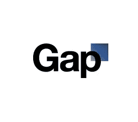
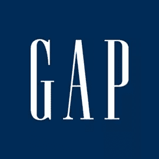

# 老盖普回来了！新徽标已被删除

> 原文：<https://www.sitepoint.com/old-gaps-back-new-logo-is-dropped/>

Gap 证实，在对他们的新标识的一场[批评风暴之后，他们将带回他们旧的蓝盒子标识。这个新标志是由莱尔德&合伙人设计的，在网上被拍成碎片。也有很多猜测认为，新标志是在那里创造辩论(任务完成)和众包的情况下创造一个新的标志看起来很有可能。](https://www.sitepoint.com/mind-the-gap-new-logo-goes-down-like-a-lead-balloon/)

然而，在不到一周的时间里，负面反馈似乎已经势不可挡，Gap 总裁 Marka Hansen 证实，该公司将回到熟悉的蓝盒子。

|  | **** |
| *新旧临时缺口标识* | *旧原 Gap 标志* |

在公司的一份声明中，马尔卡·汉森说:

> 自从我们上周在我们的网站上推出了我们的徽标的更新版本以来，我们已经看到了来自客户和在线社区的大量支持标志性蓝盒徽标的评论。
> 
> 上周，我们迅速处理了反馈，并开始探索如何挖掘所有的激情。最终，我们知道了我们品牌周围有多少能量。所有的道路都将我们引回蓝盒子，所以我们决定不再在 gap.com 上使用新的标志。
> 
> 在 Gap 品牌，我们的客户永远是第一位的。在过去的一周里，我们一直在听和看所有的评论。我们听到他们一遍又一遍地说，他们对我们的蓝盒标志充满热情，他们希望它回来。所以我们决定这样做——我们将在所有渠道重新推出。
> 
> 与此同时，该网站将回到我们标志性的蓝盒子标志，在假期，我们将把我们的蓝盒子变成红色，用于我们的季节性活动。
> 
> 在这个过程中我们学到了很多。我们很清楚我们没有以正确的方式去做这件事。我们认识到我们错过了与在线社区互动的机会。这不是一个适合众包的合适项目。
> 
> 也许会有一个时间来改进我们的标志，但是如果那个时间到了，我们会用不同的方式来处理。

*在 [Ad Age Daily](http://adage.com/article?article_id=146417) 上看到的声明。*

正如在以前的帖子中提到的，标志重新设计受到负面影响并不罕见。大多数人不喜欢变化，互联网当然允许人们表达意见，但这是暴民统治的案例还是 Gap 的狡猾计划？

那么谁会想到有人会关注互联网呢？这一切都是宣传噱头吗？

## 分享这篇文章