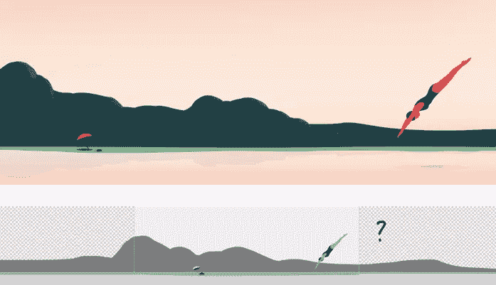
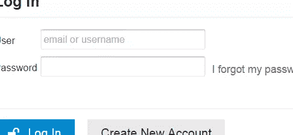

# 本周我们要关注的是:中等手段胜于肮脏手段

> 原文：<https://www.sitepoint.com/on-our-radar-medium-better-than-dirty-tricks/>

### 设计

自新年以来，设计师们不断涌现，我们被许多伟大的文章淹没，而媒体最近似乎很受欢迎，这使得写作体验变得相当轻松。

在每一个细节上都投入了大量的关心和关注，在文章[中很好地表达了这一点，这篇文章将带您浏览他们的 SVG 图标集和](https://medium.com/@dmiiiitri/fixing-icons-for-medium-8939ae05db85)[插图，其中深入研究了一些背景插图工作。随着](https://medium.com/@Thomas_Danthony/illustrating-for-medium-45088765decc)[我们的内容提要被打破](https://medium.com/@tyrale/your-content-feed-is-broken-f8c6576077c2)，更多的内容也随之而来，这为新闻提要的出现探索了一些潜在的更好的方法。

培养一个合作的设计过程可能很有挑战性，但是有了合适的人和来自其他地方的灵感，就变得容易多了，比如, [365 杰出设计师](http://365awesomedesigners.com/)，他们每天都展示一些新的有趣的东西。

### 3D 窗帘和上帝登录

设计师们最近也展示了一些有趣的设计和技术，比如 [3D 窗帘模板](http://codyhouse.co/gem/3d-curtain-template/)和有用的[文本输入效果](http://tympanus.net/Development/TextInputEffects/)。我也对[神登录](http://blog.codinghorror.com/the-god-login/)很感兴趣，它带我们了解完美的神登录可能是什么样子，如果你在寻找 CSS 专用图标，那么 [icono](https://github.com/saeedalipoor/icono) 会支持你。

更进一步，你可以 [(ab)使用 CSS3 的:n-child 选择器来发明新的样式](https://grack.com/blog/2015/01/09/abusing-css3-selectors/)。与此同时，我们给出了关于 [Sass 基础知识的更多细节:mixin 指令](https://www.sitepoint.com/sass-basics-the-mixin-directive/)，并且有一个关于[如何用更少的资源加速你的 web 开发过程的精彩截屏。](https://www.sitepoint.com/video-speed-web-development-process-less/)

### 肮脏的把戏

本周我们对 Beacon API 做了一个很好的[介绍，它使得在页面卸载时更容易将数据发送回服务器，这让我们不禁要问，](https://www.sitepoint.com/introduction-beacon-api/)[你自己的项目需要一个 API](https://www.sitepoint.com/do-you-need-an-api/) 吗？答案无疑是一个预料中的结论，但即使如此，游戏开发也有其棘手的问题。我们并不以他们为荣，但是当面对棘手的游戏错误时，[肮脏的编码技巧](http://www.gamasutra.com/view/feature/4111/dirty_coding_tricks.php)有时会被使用，这可以决定是否成功发布。

### 机器人变得越来越聪明

有一天，我们可能不得不向我们的机器人霸主低头，我们在这里做的工作可能会在这方面有所帮助。[这个机器人是世界上最好的德州扑克玩家](http://motherboard.vice.com/read/this-robot-is-the-best-limit-texas-holdem-player-in-the-world)，我们正试图让机器人从[艺术博主新手](http://noviceartblogger.tumblr.com/)开始解读艺术。如果他们开始变得太聪明，我们可能不得不做点什么，美国宇航局有正确的想法来对付他们——[美国宇航局机器人潜入火山探索裂缝](http://www.nasa.gov/jpl/nasa-robot-plunges-into-volcano-to-explore-fissure/)。

哪些链接引起了你的注意？你觉得 3D 窗帘怎么样？你是否需要运用自己的卑鄙手段来完成任务，而角落里的机器人是否在你不注意的时候盯上了你？我们很想听听你的想法。

## 分享这篇文章