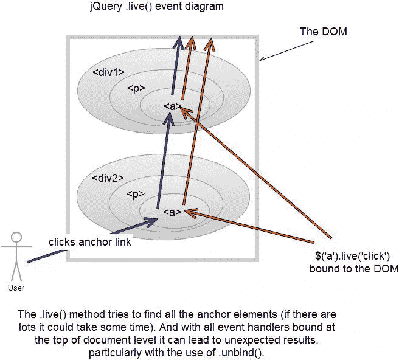
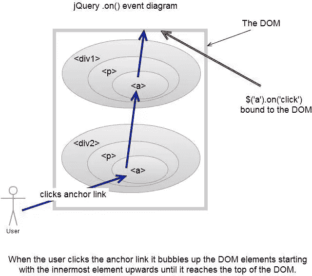
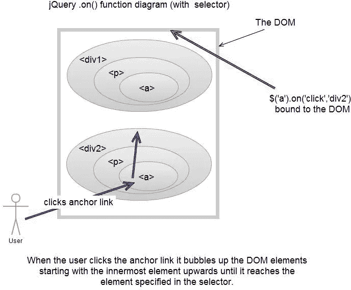
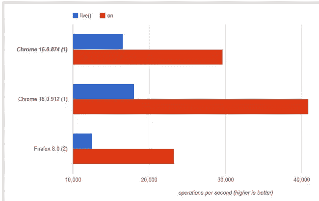

# jQuery 1.7+。上()与下()回顾

> 原文：<https://www.sitepoint.com/on-vs-live-review/>

我最近看了一段 jQuery summit 2011 的录音，我想是 Adam Sontag 建议使用名为。在()和上。off()事件处理程序，而不是。live() 。使用后。live()在过去的几年里，我经常想看看主要的不同之处，并考虑使用新的功能。在()和上。最近在 jQuery 1.7 中增加了 off()。

让我们看看这些函数以及它们是如何工作的。

## jQuery。直播()

> 为现在和将来匹配当前选择器的所有元素附加一个事件处理程序。

来源:http://api.jquery.com/live/

什么时候。live()出现在几年前，它是“狗球！”。最后，我们可以将事件附加到动态插入 DOM 的元素上。。live()在提供这个特性方面做得很好。然而，随着事情的发展，jQuery 在不断发展，现在我们看到了一些新成员。参见的演示。live() 功能。




## jQuery。在()

> 将一个或多个事件的事件处理函数附加到所选元素。

来源:http://api.jquery.com/on/





这给我们带来了几个问题。

### 出了什么问题。直播()

的使用。不再推荐使用 live()方法，因为 jQuery 的更高版本提供了更好的方法，没有它的缺点。特别是，使用时会出现以下问题。live():

1.  jQuery 试图在调用。live()方法，这在大型文档上可能很耗时。
2.  不支持链接方法。例如$(“a”)。查找("。异地，。外部”)。live(…)；无效，并且不能按预期工作。
3.  既然都。live()事件附加在 document 元素上，事件在被处理之前会经过最长最慢的路径。
4.  在事件处理程序中调用 event.stopPropagation()对于停止附加在文档下层的事件处理程序无效；事件已经传播到文档。
5.  的。live()方法以令人惊讶的方式与其他事件方法交互，例如$(document)。unbind("click ")移除任何对。live()！

### 之间的主要区别是什么。live()和。on()函数？

**功能:**它不是在主体和文档级别冒泡，而是直接在文档中注册。

**用法:**
如果我们看看这三种主要事件附加方法，我们会发现它们非常相似。值得注意的是。live()没有选择器参数。

```
$(selector).live(events, data, handler);                // jQuery 1.3+
$(document).delegate(selector, events, data, handler);  // jQuery 1.4.3+
$(document).on(events, selector, data, handler);        // jQuery 1.7+

```

**性能:**我本来打算创建一个 [jsPerf 测试](http://jsperf.com/live-vs-on)，但是发现有人已经做了这项艰巨的工作！以下是的性能结果。live()和。在()。如你所见。on()的性能优于其前身。live()，快了差不多 3、4 倍！



### 威尔。on()在早期版本的 jQuery 中有效吗？

据我所知。on()函数只包含在 jQuery 1.7 中，它不能在早期版本中使用。

## 。关闭()

> 移除事件处理程序。

这个很简单，基本上可以用来移除事件处理程序。有点像。unbind()事件，该事件移除先前附加到元素的事件处理程序。

## bind()和 on()有什么区别？

如果我们看一下 jQuery 1.7 源代码，我们可以看到 bind()使用 on()，unbind()使用 off()。因此本质上没有区别，并保持了对早期版本 jQuery 的向后兼容性。

```
//https://code.jquery.com/jquery-1.7.1.js
//line 3755
    bind: function( types, data, fn ) {
        return this.on( types, null, data, fn );
    },
    unbind: function( types, fn ) {
        return this.off( types, null, fn );
    },
```

总而言之，正如 jQuery 专家所建议的，你应该**开始使用。在()和上。off()而不是。live()** 为您的下一个项目开发。

### 2012 年 6 月 4 日更新

从 jQuery 1.7 开始。绑定()和。live()函数实际上是。on()函数。当你在 console 中键入:“jQuery.fn.bind.toString()”它会返回:“function (a，b，c) { return this.on(a，null，b，c)；}".

### 更新日期:2012 年 6 月 20 日

```
$('selector').live(event, function(){ //do stuff here })
```

就是现在

```
$(document).on(event, selector, function(){ //do stuff here })
```

## 分享这篇文章