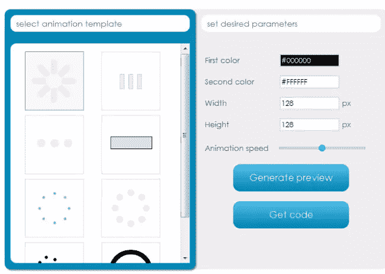
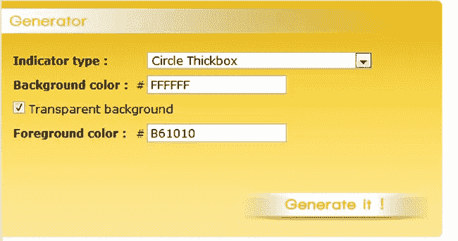
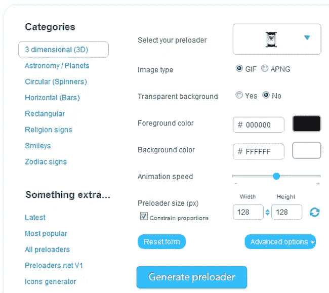
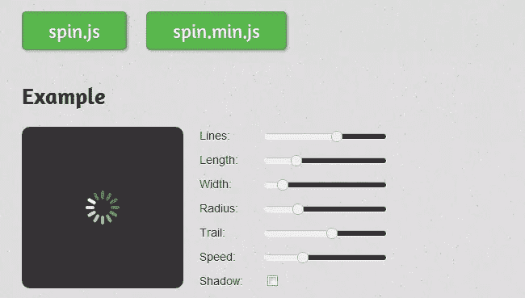

# 5+在线加载 AJAX Spinner 生成器工具

> 原文：<https://www.sitepoint.com/online-loading-ajax-spinner-generators/>

**2013 年 03 月 06 日更新:** [**见 100+ AJAX 加载微调器集合**](http://www.jquery4u.com/ajax/ajax-spinners/)

在这篇文章中，我们收集了 10 个免费的在线加载 AJAX Spinner 生成器工具来制作你自己的定制 AJAX 加载器。轻松创建您自己的产品

1.  选择您的微调器类型
2.  选择你的颜色
3.  选择你的动画速度
4.  单击创建

您还可以创建自己的图像，并将其用作加载 gif 动画，参见 [**10 在线自定义 GIF 制作工具**](http://www.jquery4u.com/ajax/10-online-gif-generator-tools/) 。享受吧。

**2013 年 13 月 5 日更新:发现更多好的！(抱歉现在图像拇指还没！)**

*   [Chimply 牛逼发电机工具](http://www.chimply.com/Generator#classic-spinner,animatedCircle)
*   [HTML5 画布加载器生成器](http://heartcode.robertpataki.com/canvasloader/)
*   [Xeosoft.com Ajax loader](http://xeosoft.com/ajaxloader)
*   [Spiffygif 发生器](http://spiffygif.com/)

## 1.CSS 加载在线工具

cssload.net 是一个标准的在线工具，用于生成你自己的 Ajax 旋转器。它有一个很好的实时预览和动画速度控制。原色和次色选项给了它一些其他工具所没有或不太好用的特别之处。这个工具的美妙之处在于，它将为您生成 CSS 来创建一个仅包含 CSS 的微调器，而不是保存为图像。

## 2.Ajax 加载在线工具

ajaxload.info 完全按照 tin 上说的做，在几秒钟内为您创建一个 ajax 加载程序。限于微调，你可以选择，但它总是可靠的，需要几秒钟来选择和生成自己的彩色微调透明背景选项。

## 3.加载信息在线工具

loadinfo.net 为你提供了 132 张旋转图片，选择一张后，你可以改变颜色和尺寸，最大可达 48×48。唯一的缺点是它比其他选项稍慢，但我们仍然在这里只谈论秒。不错的选择。

## 4.预加载器在线工具

preloaders.net 可能是我最好的选择，因为它有很好的选择自定义图片的选项。

## 5.Spin.js 在线工具

Spin.js 是一个插件，可以用来为 Ajax Spinners 创建你自己的在线工具。

## 分享这篇文章