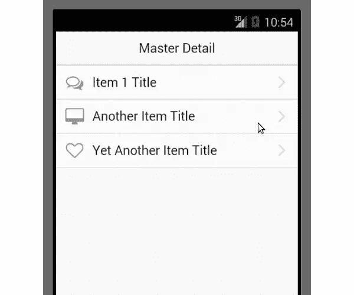

# Onsen UI 是科尔多瓦 UI 开发的答案吗？

> 原文：<https://www.sitepoint.com/onsen-ui-answer-cordova-ui-development/>

[Onsen UI](http://onsenui.io/) 是一个新的 JavaScript 和 CSS 框架，用于开发移动应用。凭借其基于 web 的 UI 组件的大量选择，您可以开发 HTML5、PhoneGap 和 Cordova 应用程序。专注于类似本机的性能、用户体验、响应式设计和多样化平台，它似乎很有前途。它结合了 HTML 5，CSS， [AngularJS](http://angularjs.org) ， [jQuery](http://jquery.com) 和 [Font Awesome](http://fortawesome.github.io/Font-Awesome/) 的力量来创建令人印象深刻的应用程序。

## 装置

要开始使用 Onsen UI，首先确保您已经安装了 [Node.js](http://www.nodejs.org/) 和 npm。

接下来，根据你计划开发的应用平台，安装所需的 [Android](http://cordova.apache.org/docs/en/3.3.0/guide_platforms_android_index.md.html#Android%20Platform%20Guide) 或 [IOS](http://cordova.apache.org/docs/en/3.3.0/guide_platforms_ios_index.md.html#iOS%20Platform%20Guide) 平台依赖。在本文中，我们将尝试为 Android 创建一个应用程序。

[Cordova](http://cordova.apache.org/) 可以如下图安装:

```
sudo npm install -g cordova
```

Onsen UI 提供了许多模板，如[主细节](http://onsenui.io/OnsenUI/project_templates/onsen_master_detail.zip)、[滑动菜单](http://onsenui.io/OnsenUI/project_templates/onsen_sliding_menu.zip)等。我们将使用主详细信息模板。

下载模板，提取它并导航到项目根文件夹。现在，我们将添加开发应用程序的平台。添加平台，如下所示:

```
cordova platform add android
```

完成后，键入以下命令来模拟我们下载的模板:

```
cordova emulate
```

它应该是这样的:



## 我们将创造什么

在本教程中，我们将使用 Onsen UI 组件设计我们的应用程序。该应用程序将有一个登录，注册页面和页面列出所有注册用户。一旦我们完成设计，我们将把应用程序连接到 [Firebase](http://firebase.com) 。

你可以在 GitHub 上找到最后的项目

## 设计登录屏幕

下面是我们下载的模板的文件夹结构:

```
OnsenUI(root)
      -----> hooks
      -----> merges
      -----> platforms
      -----> plugins
      -----> www
```

文件夹`www`包含 html、css 和 JavaScript 文件，我们将修改这些文件来创建我们的自定义应用程序。我觉得学习任何新事物的最好方法是从头开始。打开`index.html`并移除`body`标签内的所有东西。

Onsen UI 提供了大量的[组件](http://onsenui.io/guide/components.html)来创建 UI。我们将用其中的一些来设计我们的屏幕。

为了维护一个页面栈，Onsen UI 提供了一个名为 [ons-navigator](http://onsenui.io/guide/components.html#ons-navigator) 的组件。它充当我们所有页面的容器。在这里面，我们将添加另一个名为 [ons-page](http://onsenui.io/guide/components.html#ons-page) 的组件。

它应该是这样的:

```
<ons-navigator title="Navigator" var="myNavigator">
    <ons-page>
        // Page content comes here
    </ons-page>
</ons-navigator>
```

在页面内添加另一个名为 [ons-toolbar](http://onsenui.io/guide/components.html#ons-toolbar) 的组件作为工具栏。

我们还需要添加一个用户名和密码输入框。为了添加这些内容，首先我们将添加一个列表框，并在其中包含输入文本。为了添加列表项，Onsen UI 提供了一个名为 [ons-list](http://onsenui.io/guide/components.html#ons-list) 的组件。

它应该是这样的:

```
<ons-navigator title="Navigator" var="myNavigator">
    <ons-page>

        <ons-toolbar>
            <div class="center">Onsen UI App</div>
        </ons-toolbar>

        <ons-list>
            <ons-list-item>
                <input type="text" placeholder="Username" class="text-input text-input--transparent" style="margin-top:8px; width: 100%;">
            </ons-list-item>

            <ons-list-item>
                <input type="password" placeholder="Password" class="text-input text-input--transparent" style="margin-top:8px; width: 100%;">
            </ons-list-item>
        </ons-list>

    </ons-page>
</ons-navigator>
```

接下来，我们将添加一个按钮来登录，为此我们将使用 [ons-button](http://onsenui.io/guide/components.html#ons-button) 组件。[这里的](http://codepen.io/jay3dec/pen/rlLnH)是上面更改后登录界面的样子。

## 设计注册屏幕

接下来，让我们添加用户注册的注册屏幕。注册屏幕应该可以从主屏幕访问。所以，在工具栏的右上角，添加一个注册图标。为了添加图标，Onsen UI 提供了一个名为 [ons-icon](http://onsenui.io/guide/components.html#ons-icon) 的组件。修改 ons-toolbar 代码，如下所示:

```
<ons-toolbar>
      <div class="center">Onsen UI App</div>
      <div class="right">

        <ons-icon icon="ion-plus-circled" size="40px"</ons-icon>

      </div>
</ons-toolbar>
```

我们将把注册页面定义为一个单独的 html 片段，为此我们将利用 [ons-template](http://onsenui.io/guide/components.html#ons-template) 。注册 html 应该有一个工具栏，输入控件和注册按钮列表项。

下面是注册模板代码:

```
<ons-template id="register.html">
    <ons-page>
        <ons-toolbar>
            <div class="left">
                <ons-back-button>Back</ons-back-button>
            </div>
            <div class="center">Register</div>
        </ons-toolbar>

        <div style="text-align: center">
            <br />
            <ons-page>

                <ons-list>
                    <ons-list-item>
                        <input type="text" placeholder="Username" class="text-input text-input--transparent" style="margin-top:8px; width: 100%;">
                    </ons-list-item>

                    <ons-list-item>
                        <input type="text" placeholder="Email Address" class="text-input text-input--transparent" style="margin-top:8px; width: 100%;">
                    </ons-list-item>
                    <ons-list-item>
                        <input type="text" placeholder="Password" class="text-input text-input--transparent" style="margin-top:8px; width: 100%;">
                    </ons-list-item>

                    <ons-list-item>
                        <ons-row>
                            <ons-col width="90px">
                                <span style="color: #666">Gender</span>
                            </ons-col>
                            <ons-col>

                                <div style="float: right; padding-right: 16px;">
                                    <label class="radio-button">
                                        <input type="radio" name="level">
                                        <div class="radio-button__checkmark"></div>
                                        Male
                                    </label>

                                    <label class="radio-button">
                                        <input type="radio" name="level">
                                        <div class="radio-button__checkmark"></div>
                                        Female
                                    </label>
                                </div>

                            </ons-col>
                        </ons-row>
                    </ons-list-item>

                </ons-list>

                <div class="content-padded">
                    <ons-button modifier="large" onclick="">
                        Sign Up
                    </ons-button>
                </div>

            </ons-page>
        </div>
    </ons-page>
</ons-template>
```

上面代码中使用的大多数组件与我们在登录页面中使用的组件相同。使用的两个新组件是 [ons-back-button](http://onsenui.io/guide/components.html#ons-back-button) 和 [ons-row](http://onsenui.io/guide/components.html#ons-row) 。ons-back-button 用于提供 back 按钮支持，ons-row 用于表示网格系统中的一行。

最后，为了将工具栏中的图标链接到登录页面，向图标添加一个`onclick`事件。为了导航，我们将使用 [ons-navigator 的](http://onsenui.io/guide/components.html#ons-navigator) `pushPage`方法，如下所示:

```
<ons-icon icon="ion-plus-circled" size="40px" onclick="myNavigator.pushPage('register.html', { animation : 'slide' } )"></ons-icon>
```

[这里的](http://codepen.io/jay3dec/pen/hqlmD)是登录和注册页面的演示。

## 结论

在本教程中，我们学习了如何使用 Onsen UI 开始移动应用程序开发。我们设计了一个简单的用户注册和登录应用程序。在本教程的下一部分，我们将通过把它与 Firebase 连接起来使应用程序正常工作。

## 分享这篇文章