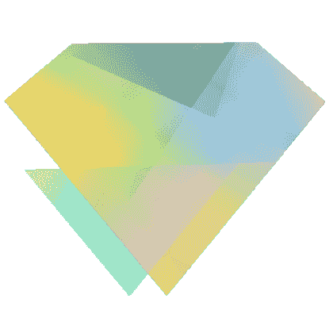
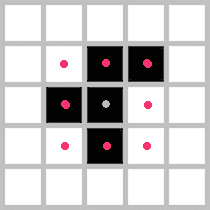
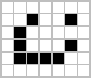
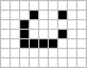
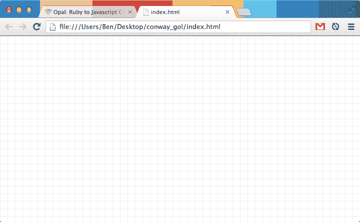
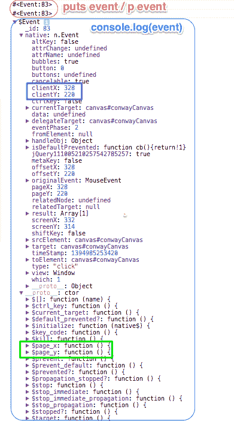
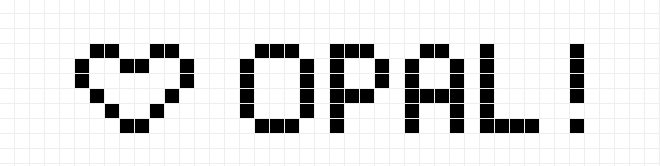

# Opal:浏览器中的 Ruby，基础知识

> 原文：<https://www.sitepoint.com/opal-ruby-browser-basics/>



我喜欢 Ruby，它是我构建 web 应用程序的首选语言。不幸的是，在与浏览器打交道时，Javascript 是一个不可避免的祸害。如你所见，我不是一个超级粉丝。

所以当有人提供在浏览器上使用 Ruby 的方法时，请帮我注册！

在本文的第一部分，我将介绍 Opal 并展示如何设置 Opal。之后，我们将深入研究并实现示例应用程序的前半部分。(我将暂时让你保持悬念，除非你向下滚动，这会破坏乐趣。)

## 你好，澳普！

那个出现的人恰好是[蛋白石](https://github.com/opal/opal)的创造者[亚当·贝农](https://github.com/adambeynon)。Opal 是一个 Ruby 到 Javascript 的源码到源码编译器。换句话说，Opal 将您编写的 Ruby 翻译成 Javascript。

## 获得蛋白石

启动终端:

```
% gem install opal opal-jquery
Successfully installed opal-0.6.0
Successfully installed opal-jquery-0.2.0
2 gems installed
```

注意我们也在安装`opal-jquery`。这个 gem 包装了 jQuery，并提供了一个 Ruby 语法来与 DOM 交互。稍后会详细介绍。

让我们在`irb`中给蛋白石加自旋:

```
% irb                                                                               
> require 'opal'
=> true
> Opal.compile("3.times { puts 'Ohai, Opal!' }")
=> "/* Generated by Opal 0.6.0 */\n(function($opal) {\n  var $a, $b, TMP_1, self = $opal.top, $scope = $opal, nil = $opal.nil, $breaker = $opal.breaker, $slice = $opal.slice;\n\n  $opal.add_stubs(['$times', '$puts']);\n  return ($a = ($b = (3)).$times, $a._p = (TMP_1 = function(){var self = TMP_1._s || this;\n\n  return self.$puts(\"Ohai, Opal!\")}, TMP_1._s = self, TMP_1), $a).call($b)\n})(Opal);\n"
```

## 康威在欧泊的生活游戏

是时候用蛋白石弄脏我们的手和脚了。我一直想要一个理由来建立康威的生活游戏，这就是我们的目标。

如果你不熟悉康威的《生活游戏》(或者懒得看维基百科词条):

它从一个正方形单元的空网格开始。每个细胞不是*活着*就是*死了*。每个细胞与它的八个*邻居*相互作用。



这里，有 5 个细胞是活的。其他人都死了。标有蓝点的单元格与标有红点的 8 个相邻单元格一起显示。

在每个*节拍*，一个单元可以基于四个规则进行转换:

### 规则 1

任何少于两个活邻居的活细胞都会死亡，就好像是由*人口不足*造成的。

### 规则 2

任何有两个或三个活邻居的活细胞都可以存活到下一代。

### 规则 3

任何有三个以上活邻居的活细胞都会死亡，就好像是由于*过度拥挤*。

### 规则 4

任何一个死细胞，只要有三个活的邻居，就会变成活细胞，就像通过*繁殖*一样。

令人惊讶的是，仅仅通过这 4 条简单的规则，我们就可以观察到非常有趣的模式。这里有一个例子，叫做*轻型飞船*，取自【ConwayLife.com】的:



这是运行中的宇宙飞船:



## 安装

继续创建一个空目录，将其命名为`conway_gol`，并创建以下目录结构:

```
├── Gemfile
├── Rakefile
├── app
│   ├── conway.rb
├── index.html
└── styles.css
```

### 1.Gemfile

填充您的 Gemfile，如下所示:

```
source 'https://rubygems.org'

gem 'opal'
gem 'opal-jquery'
gem 'guard'
gem 'guard-rake'
```

之后，安装 gems:

```
% bundle install
```

### 2.设置防护装置

请注意，我们包括了`guard`宝石。

使用 Opal 进行开发时，Guard 非常方便。由于 Opal 是一个*编译器*，它需要编译你已经写成 Javascript 的 Ruby 代码。因此，每次进行更改时，都要重新编译源代码。Guard 使这个过程稍微容易一些。

Guard 根据在一个`Guardfile`中设置的规则监视某些文件或目录，我们将很快创建它。它还附带了一堆方便的插件。例如，`guard-rake`在文件改变时运行 Rake 任务。

接下来，在`conway_gol`目录中，使用以下命令创建一个`Guardfile`:

```
% bundle exec guard init
00:30:21 - INFO - rake guard added to Guardfile, feel free to edit it
```

将此规则包含在您的`Guardfile`中。

```
guard 'rake', :task => 'build' do
  watch %r{^app/.+\.rb$}
end
```

这将监视`app`目录中*任何* Ruby 文件的任何变化。这样的改变将触发`rake build`任务，我们将在下面编写。

### 3.设置 Rakefile

在`Rakefile`中:

```
require 'opal'
require 'opal-jquery'

desc "Build our app to conway.js"
task :build do
  env = Opal::Environment.new
  env.append_path "app"

  File.open("conway.js", "w+") do |out|
    out << env["conway"].to_s
  end
end
```

以下是`build` Rake 任务的功能:

1.  设置存储 Ruby 文件的目录
2.  创建`conway.js`，Ruby - > Javascript 编译的结果。

### 4.静态文件

在`index.html`中:

```
<!DOCTYPE html>
<html>
  <head>
    <script src="https://code.jquery.com/jquery-1.11.0.min.js"></script>
    <script src="https://code.jquery.com/jquery-migrate-1.2.1.min.js"></script>
    <link rel="stylesheet" href="styles.css">
  </head>
  <body>
    <canvas id="conwayCanvas"></canvas>
    <script src="conway.js"></script>
  </body>
</html>
```

我们需要 jQuery。我们还使用了 HTML5 `canvas`元素，所以通常的“这在旧版本的 Internet Explorer 上不起作用”免责声明适用。

最后，我们将蛋白石生成的`conway.js` *放在画布元素的*下面。这使得 canvas 元素对`conway.js`可用。

在`styles.css`中:

```
* {
  margin: 0;
  padding: 0;
}
```

这种样式可以在绘制网格时消除边界上的任何间隙。

### 5.使用蛋白石

在我们使用 Guard 来自动化该过程之前，这里有一个关于如何与 Opal 交互的示例:

转到`app/conway.rb`，键入以下内容:

```
require 'opal'

x = (0..3).map do |n|
      n * n * n
    end.reduce(:+)
puts x
```

在您的终端中，在`conway_gol`目录下，运行 Rake 任务:

```
% rake build
```

打开`index.html`。结果显示在浏览器的开发人员控制台上。这是它在 Chrome 中的样子:


只是为了好玩，去看看生成的`conway.js`是什么样子。当您欣赏生成的 Javascript 时，请花点时间思考一下 Opal 团队的才华。

既然我们已经将 Guard 全部设置好了，在*的另一个*终端窗口中，运行这个命令:

```
% bundle exec guard
01:11:39 - INFO - Guard is using TerminalTitle to send notifications.
01:11:39 - INFO - Starting guard-rake build
01:11:39 - INFO - running build

01:11:41 - INFO - Guard is now watching at '/Users/Ben/conway_gol'
[1] guard(main)>
```

这里有一个提示:任何时候你想重新运行`rake build`，只需在守卫终端窗口中按“回车”即可:

```
[1] guard(main)> (Hit Enter)
01:13:42 - INFO - Run all
01:13:42 - INFO - running build
```

尝试在`conway.rb`中进行更改:

```
require 'opal'

x = (0..3).map do |n|
      n * n * n
    end.reduce(:*) # <- change to this
puts x
```

注意，当您保存`conway.rb`(或任何 Ruby 文件)时，运行 Guard 的终端窗口会输出以下消息:

```
09:25:11 - INFO - running build
```

刷新浏览器将显示更新后的值。

现在我们已经确保一切正常，继续删除`conway.rb`中的所有内容——有趣的事情开始了！

## 让游戏开始吧！

我们的应用程序将由两个主要组件组成。第一块是游戏逻辑。第二部分是画布的绘制和处理画布事件。

让我们先处理第二部分。

### 1.绘制空白网格

这就是我们的目标:



网格线覆盖整个浏览器视口。这意味着我们需要访问这个视口的高度和宽度。更重要的是，在开始绘制任何东西之前，我们需要访问 DOM 上的 canvas 元素。

#### `Grid`类

打开`app`中的`conway.rb`，并填入:

```
require 'opal'
require 'opal-jquery'

class Grid
  attr_reader :height, :width, :canvas, :context, :max_x, :max_y

  CELL_HEIGHT = 15;
  CELL_WIDTH  = 15;

  def initialize
    @height  = `$(window).height()`                  
    @width   = `$(window).width()`                   
    @canvas  = `document.getElementById(#{canvas_id})` 
    @context = `#{canvas}.getContext('2d')`
    @max_x   = (height / CELL_HEIGHT).floor           
    @max_y   = (width / CELL_WIDTH).floor             
  end

  def draw_canvas
    `#{canvas}.width  = #{width}`
    `#{canvas}.height = #{height}`

    x = 0.5
    until x >= width do
      `#{context}.moveTo(#{x}, 0)`
      `#{context}.lineTo(#{x}, #{height})`
      x += CELL_WIDTH
    end

    y = 0.5
    until y >= height do
      `#{context}.moveTo(0, #{y})`
      `#{context}.lineTo(#{width}, #{y})`
      y += CELL_HEIGHT
    end

    `#{context}.strokeStyle = "#eee"`
    `#{context}.stroke()`
  end

  def canvas_id
    'conwayCanvas'
  end

end

grid = Grid.new
grid.draw_canvas
```

我们需要明确要求`opal`和`opal-jquery`。

这个`Grid`类看起来*大部分*像 Ruby。乍一看，我们有所有常见的 Ruby 语法。让我们从`initialize`开始，稍微详细地看看这个类的每个部分。

##### `initialize`

```
class Grid
  attr_reader :height, :width, :canvas, :context, :max_x, :max_y

  CELL_HEIGHT = 15;
  CELL_WIDTH  = 15;

  def initialize
    @height  = `$(window).height()`                  
    @width   = `$(window).width()`                   
    @canvas  = `document.getElementById(#{canvas_id})` 
    @context = `#{canvas}.getContext('2d')`
    @max_x   = (height / CELL_HEIGHT).floor           
    @max_y   = (width / CELL_WIDTH).floor             
  end

  def canvas_id
    'conwayCanvas'
  end

  ### snip snip ###
end
```

在 Opal 中，我们可以直接用反勾号来评估 Javascript。例如，要获取浏览器视口的高度:

```
@height  = `$(window).height()`
```

Opal 将`@height`的值存储为一个`Numeric` Ruby 类。我们还使用了`$`，它调用了一个 jQuery 实例。

##### 使用画布

如果您以前从未使用过`canvas`元素，也不用担心，因为这不是本文的重点。我所知道的关于`canvas`的一切都来自于[潜入 HTML5](https://diveintohtml5.info/canvas.html) 。

```
@canvas  = `document.getElementById(#{canvas_id})`
```

要使用画布，您需要在 DOM 中引用它。看看我们如何通过一个`canvas_id`方法调用使用字符串插值来填充画布 id。

```
@context = `#{canvas}.getContext('2d')`
```

更重要的是，每一张画布都有一个绘图*背景*。所有的绘图都是通过这个上下文完成的。注意我们如何再次使用字符串插值来传入`canvas`，检索上下文，并将其存储在`@context`中。

```
@max_x   = (height / CELL_HEIGHT).floor           
@max_y   = (width / CELL_WIDTH).floor
```

`@max_x`和`@max_y`以坐标的形式存储网格的界限，这解释了为什么我们需要除以`CELL_HEIGHT`和`CELL_WIDTH`。

##### `draw_canvas`

这就是我们如何在画布上绘制网格线。`canvas`只被调用来设置宽度和高度。所有的绘图都通过对`context`的函数调用来处理。

是一个很好的例子，说明了 Opal 如何让您完美和谐地一起使用 Ruby 和 Javascript 代码。

```
def draw_canvas
  `#{canvas}.width  = #{width}`
  `#{canvas}.height = #{height}`

  x = 0.5
  until x >= width do
    `#{context}.moveTo(#{x}, 0)`
    `#{context}.lineTo(#{x}, #{height})`
    x += CELL_WIDTH
  end

  y = 0.5
  until y >= height do
    `#{context}.moveTo(0, #{y})`
    `#{context}.lineTo(#{width}, #{y})`
    y += CELL_HEIGHT
  end

  `#{context}.strokeStyle = "#eee"`
  `#{context}.stroke()`
end
```

##### 让我们看看画布

最后，绘制网格只是一个简单的方法调用:

```
grid = Grid.new
grid.draw_canvas
```

如果您正在运行 Guard，请按“Enter”键，或者您可以运行`rake build`。无论哪种方式，当你打开`index.html`时，你会看到一个光荣的网格。

### 2.增加一些互动性

能够在一个`canvas`上画网格线——用 Ruby，不多不少！–一切都很好，但如果我们不能对其做任何事情，那就完全没用了。

让我们给事情加点料。

我们可以做的事情之一是填充一个单元格。为了做到这一点，我们需要知道我们点击了的*，然后计算单元格相对于网格的位置。也就是说，我们需要根据我们绘制的网格计算出点击的坐标。*

甚至在知道我们点击了的*之前，我们需要知道我们点击了*的*。在这一节中，我们还将了解`opal-jquery`如何让我们使用 Ruby 与 jQuery 的事件监听器进行交互。*

#### 充满不甘的单元格

以下方法绘制一个黑色正方形并清除一个相同尺寸的正方形:

```
def fill_cell(x, y)
  x *= CELL_WIDTH;
  y *= CELL_HEIGHT;
  `#{context}.fillStyle = "#000"`
  `#{context}.fillRect(#{x.floor+1}, #{y.floor+1}, #{CELL_WIDTH-1}, #{CELL_HEIGHT-1})`
end

def unfill_cell(x, y)
  x *= CELL_WIDTH;
  y *= CELL_HEIGHT;
  `#{context}.clearRect(#{x.floor+1}, #{y.floor+1}, #{CELL_WIDTH-1}, #{CELL_HEIGHT-1})`
end
```

#### 获取光标的位置

这里有一个将 Javascript 翻译成 Ruby 的例子。我太懒了，没有耐心去想如何实现这个特殊的功能。事实证明， [Dive Into HTML 5](https://diveintohtml5.info/) 在 Javascript 中已经有了一个例子:

```
function getCursorPosition(event) {
  var x;
  var y;
  if (event.pageX != undefined && event.pageY != undefined) {
    x = event.pageX;
    y = event.pageY;
  }
  else {
    x = event.clientX + document.body.scrollLeft +
          document.documentElement.scrollLeft;
    y = event.clientY + document.body.scrollTop +
          document.documentElement.scrollTop;
  }
}
```

现在，让我们看看蛋白石味的红宝石是什么样子的:

```
def get_cursor_position(event)
  if (event.page_x && event.page_y)
    x = event.page_x;
    y = event.page_y;
  else
    doc = Opal.Document[0]
    x = event[:clientX] + doc.scrollLeft + 
          doc.documentElement.scrollLeft;
    y = event[:clientY] + doc.body.scrollTop + 
          doc.documentElement.scrollTop;
  end
end
```

如你所见，几乎是一对一的转换。

你可能想知道为什么有两个分支只是为了找到光标的位置。简而言之，不同的浏览器有不同的方式来实现这个功能。

### 发现方法

例如，我怎么知道对于`event`存在`page_x`方法，或者应该使用散列符号访问`clientX`?

```
def get_cursor_position(event)
  `console.log(#{event})` # <- I cheated.
  # code omitted
end
```

我*没有*用`puts event`甚至`p event`。我选择了`console.log`。

原因如下:



使用`console.log`给了我们更多的细节，因为`event`首先是一个 Javascript 对象。用`puts`、`p`甚至`inspect`都没多大作用。

在`if`分支中，我们使用点符号来访问`event`，而在`else`分支中，我们将`event`视为一个散列。

在绿色框中，`event.page_x`是一个方法调用，因为确实有一个被定义为`$page_x: function { ... }`的`page_x`函数。

在紫色框中，`clientX`是一个*值*。因此，使用散列符号来访问它。

这里有一些额外的代码来计算相对于网格的坐标。

```
def get_cursor_position(event)

  ## Previous code omitted ...

  x -= `#{canvas}.offsetLeft`
  y -= `#{canvas}.offsetTop`

  x = (x / CELL_WIDTH).floor
  y = (y / CELL_HEIGHT).floor

  Coordinates.new(x: x, y: y)
end
```

#### `Coordinates`和 OpenStruct

我偷偷去上了一堂课。有趣的是，Opal 也有 [OpenStruct](https://www.ruby-doc.org/stdlib-2.0/libdoc/ostruct/rdoc/OpenStruct.html) 。

你可以这样定义`Coordinates`:

```
require 'opal'
require 'opal-jquery'
require 'ostruct'     # <- remember to do this!

class Grid
  # ...
end

class Coordinates < OpenStruct; end
```

就像 Ruby 版本一样，我们需要`require ostruct`才能使用它。

### 事件监听

最后，我们有了监听事件的所有构件。两个监听器都将监听`canvas`上的事件。

第一个事件侦听器在单击鼠标事件时触发。一旦发生这种情况，就会计算光标位置并填充适当的单元格。

第二个事件侦听器在双击鼠标事件时触发。再次计算光标位置，并且适当的单元格未被填充。

```
def add_mouse_event_listener
  Element.find("##{canvas_id}").on :click do |event|
    coords = get_cursor_position(event)
    x, y   = coords.x, coords.y
    fill_cell(x, y)
  end

  Element.find("##{canvas_id}").on :dblclick do |event|
    coords = get_cursor_position(event)
    x, y   = coords.x, coords.y
    unfill_cell(x, y)
  end
end
```

绘制画布后，注册鼠标监听器:

```
class Grid
  # ...
end

grid = Grid.new
grid.draw_canvas
grid.add_mouse_event_listener # <- Add this!
```

一旦我们的更改完成，继续打开`index.html`。尝试单击任何网格来标记单元格，双击来取消标记单元格。

这是我的杰作:



## 完整的源代码

作为参考，下面是完整的源代码:

```
require 'opal'
require 'opal-jquery'
require 'ostruct'     

class Grid
  attr_reader :height, :width, :canvas, :context, :max_x, :max_y

  CELL_HEIGHT = 15;
  CELL_WIDTH  = 15;

  def initialize
    @height  = `$(window).height()`                   # Numeric!
    @width   = `$(window).width()`                    # A Numeric too!
    @canvas  = `document.getElementById(#{canvas_id})` 
    @context = `#{canvas}.getContext('2d')`
    @max_x   = (height / CELL_HEIGHT).floor           # Defines the max limits
    @max_y   = (width / CELL_WIDTH).floor             # of the grid
  end

  def draw_canvas
    `#{canvas}.width  = #{width}`
    `#{canvas}.height = #{height}`

    x = 0.5
    until x >= width do
      `#{context}.moveTo(#{x}, 0)`
      `#{context}.lineTo(#{x}, #{height})`
      x += CELL_WIDTH
    end

    y = 0.5
    until y >= height do
      `#{context}.moveTo(0, #{y})`
      `#{context}.lineTo(#{width}, #{y})`
      y += CELL_HEIGHT
    end

    `#{context}.strokeStyle = "#eee"`
    `#{context}.stroke()`
  end

  def get_cursor_position(event)
    puts event
    p event
    `console.log(#{event})`
    if (event.page_x && event.page_y)
      x = event.page_x;
      y = event.page_y;
    else
      doc = Opal.Document[0]
      x = e[:clientX] + doc.scrollLeft + doc.documentElement.scrollLeft;
      y = e[:clientY] + doc.body.scrollTop + doc.documentElement.scrollTop;
    end

    x -= `#{canvas}.offsetLeft`
    y -= `#{canvas}.offsetTop`

    x = (x / CELL_WIDTH).floor
    y = (y / CELL_HEIGHT).floor

    Coordinates.new(x: x, y: y)
  end

  def fill_cell(x, y)
    x *= CELL_WIDTH;
    y *= CELL_HEIGHT;
    `#{context}.fillStyle = "#000"`
    `#{context}.fillRect(#{x.floor+1}, #{y.floor+1}, #{CELL_WIDTH-1}, #{CELL_HEIGHT-1})`
  end

  def unfill_cell(x, y)
    x *= CELL_WIDTH;
    y *= CELL_HEIGHT;
    `#{context}.clearRect(#{x.floor+1}, #{y.floor+1}, #{CELL_WIDTH-1}, #{CELL_HEIGHT-1})`
  end

  def add_mouse_event_listener
    Element.find("##{canvas_id}").on :click do |event|
      coords = get_cursor_position(event)
      x, y   = coords.x, coords.y
      fill_cell(x, y)
    end

    Element.find("##{canvas_id}").on :dblclick do |event|
      coords = get_cursor_position(event)
      x, y   = coords.x, coords.y
      unfill_cell(x, y)
    end
  end

  def canvas_id
    'conwayCanvas'
  end

end

class Coordinates < OpenStruct; end

grid = Grid.new
grid.draw_canvas
grid.add_mouse_event_listener
```

## 接下来…

在以后的文章中，我们将通过实现游戏逻辑并将其连接到网格来完成 Conway 的生活游戏应用程序。这样，我们还将看到更多 Opal 如何优雅地融合 Ruby 和 Javascript 的例子，

感谢阅读！

## 分享这篇文章