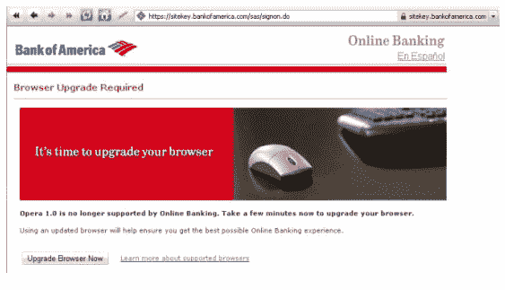

# Opera 10 的千年虫:浏览器检测变坏

> 原文：<https://www.sitepoint.com/opera-10s-y2k-bug-browser-detection-goes-bad/>

世界第五大浏览器的最新版本 Opera 10(根据 NetApplications，谷歌的 Chrome 已经超过了它)本月早些时候在 T2 发布了测试版。作为第一个发布两位数版本的网络浏览器，一个意想不到的后果是什么？许多网站由于浏览器检测代码的错误而瘫痪，这让人想起了“千年虫”问题。

Opera 的兼职质量保证开发人员 Hallvord Steen 表示，许多网站都有缺陷浏览器检测方案，这些方案假定网络浏览器的版本号只有一位数字。这在检测 Opera 10 时会产生一个问题，Opera 10 显然不止一个数字。

“如果网站认为版本号总是有一个字母的“主要”部分，并寻找一个单一的数字，他们将“检测”Opera 1！”霍尔沃德写道。

如此多的网站，包括像微软的 Live Mail 和美国银行这样的流量很大的网站，都把 Opera 10 当成 Opera 1.0 来阅读，并认为该浏览器不被支持。因此，这个星球上最符合标准和最新的浏览器之一的用户反而会收到敦促他们升级到更好的浏览器的消息。例如，微软的页面建议用户切换到 Internet Explorer、Safari 或 Firefox。

这是网络开发者 Andrew Gregory 在五月份的一篇博客文章中预测的事情。

不幸的是，这反映了 Opera 的不足，尽管这是一些 web 开发人员粗制滥造的编程造成的。许多用户无疑会将问题归咎于 Opera，因为同样的网站在其他浏览器上运行良好。然而，事实上，这不是 Opera 的错。你的网站的浏览器检测能和 Opera 10 一起工作吗？

## 分享这篇文章