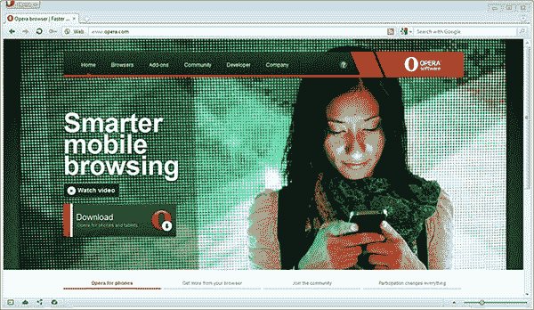

# Opera 11.50 的新特性

> 原文：<https://www.sitepoint.com/opera-11-5-whats-new/>

作为一名开发者，Opera 的版本编号似乎是明智的。不像 Chrome 和 T2 火狐的快速更新和 IE 的缓慢步伐，Opera 通常一年发布一到两次新的浏览器。正确时，版本号会增加。

[Opera 11.50 现已发布](http://www.opera.com/)，它充满了可爱的新功能。加油 Opera——作为逻辑更新的最后堡垒，应该是 12 版了！最明显的变化是重新设计的界面:

差别是微妙的，但 11.5 运动更轻，更时尚，更干净的外观。更容易专注于网页内容，Opera 声称这样更快。我喜欢。

## 快速拨号分机

也许最大的变化是快速拨号扩展。扩展不是简单地提供对喜爱站点的快速访问，而是可以向快速拨号页面添加动态信息。本质上，它是一个个人主页或启动屏幕上的一组桌面小部件。今天将会有一些扩展，包括 Read It Later，Webdoc 和 StockTwits。

为了帮助您管理收藏夹和分机，新的流量功能提供了无限数量的拨号。尺寸会根据您的屏幕自动调整，或者您可以指定自己的缩放级别。

## 密码同步

密码同步终于在 Opera Link 中实现了。浏览器实现了强大的安全性，因此密码在客户端使用您的 Opera 帐户密码和随机生成的密钥进行加密。没有任何密码是以明文形式存储或传输的，所以这应该让那些受到最近索尼、任天堂、中情局和其他组织所经历的高调安全漏洞影响的人放心。

更多信息，请参见[Opera Link](http://my.opera.com/operalink/blog/2011/05/03/security-of-synchronized-passwords-with-opera-link)同步密码的安全性。

## 在后台

开发人员已经修复了数千个错误，并升级了渲染引擎。这应该会使 CSS 和 SVG 渲染的速度提高 10-15%。

浏览器一直处于 HTML5 的前沿，现在它支持会话历史和导航、W3C 文件 API、classlist 和<`time` >元素。

最后，如果你是蜻蜓的粉丝，你会很高兴听到 1.1 版本即将推出*(请，请，请给我们 CSS 行号和链接！)*

Opera 11.5 建立在已经很棒的浏览器之上。如果你还没有安装，去 Opera.com 看看，成为他们的在线下载柜台上成千上万的特色之一。

如何看待 Opera 11.5？

## 分享这篇文章