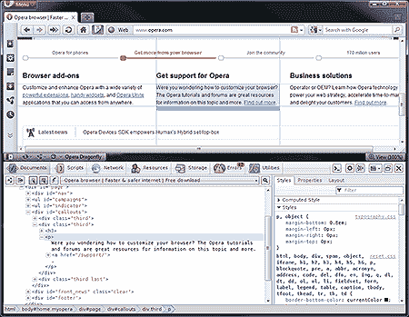
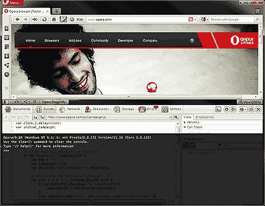
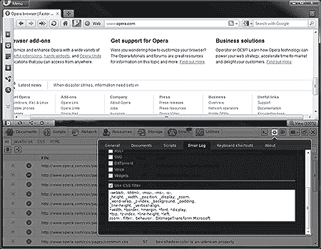
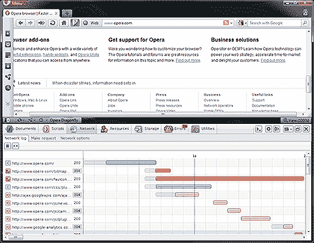

# Opera 蜻蜓 1.0 版——最好的浏览器开发工具？

> 原文：<https://www.sitepoint.com/opera-dragonfly-1-browser-development-tool/>

谢天谢地，每个主流浏览器都提供了一套开发工具。你可以在 Firefox、IE 的开发工具、webkit inspector 或者 Opera 的蜻蜓中使用 Firebug。然而，你可能不知道蜻蜓是一个测试产品。像许多开发人员一样，我不时地使用它，但发现几乎没有什么引人注目的特性能让我远离 Firebug。直到今天。

2011 年 5 月 5 日标志着 1.0 版本的发布…我已经皈依了！蜻蜓太棒了。你将熟悉大多数功能，但蜻蜓提供更多的工具，感觉更光滑，看起来比它的竞争对手更好。

最根本的变化是界面。beta 版本有点丑陋和令人迷惑，但是在 1.0 版本中，Opera 产生了一个漂亮的开发工具。它看起来和 webkit inspector 一样好，但是更清晰，不那么杂乱。

[ **查看完整歌剧蜻蜓截图**](https://blogs.sitepointstatic.cimg/tech/520-opera-dragonfly-1.png)

蜻蜓的 DOM 检查员是优秀的。HTML 元素节点，文本和 CSS 属性可以很容易地检查或更改。您甚至可以动态调试和编辑 SVG 图形。属性也可以通过文本字符串过滤——这是一个有用的工具，还没有出现在其他工具中。

Opera 一直提供很棒的 JavaScript 调试工具。蜻蜓在脚本选项卡中延续了这一传统，您可以在任何源文件中监视和设置观察器或断点。有趣的是，JavaScript 控制台显示为一个覆盖图，因此您仍然可以在主界面中查看和导航信息。这是一个聪明的想法，效果很好。

[ **查看完整歌剧蜻蜓截图**](https://blogs.sitepointstatic.cimg/tech/520-opera-dragonfly-2.png)

类似地，Errors 选项卡报告了 HTML、JavaScript、CSS、XML、XSLT、SVG、Opera 小部件等中的一系列问题。最好的特性之一是过滤器，它可以去除由厂商前缀属性引起的 CSS 错误。

[ **查看完整歌剧蜻蜓截图**](https://blogs.sitepointstatic.cimg/tech/520-opera-dragonfly-3.png)

“网络和资源”提供了所有文件下载以及请求和响应时间的视图。文件可以在它们自己的选项卡中打开，以便进一步检查。

[ **查看完整歌剧蜻蜓截图**](https://blogs.sitepointstatic.cimg/tech/520-opera-dragonfly-4.png)

“存储”选项卡允许您查看、修改和删除 cookies、HTML5 本地存储、HTML5 会话存储和小部件中的数据。Firebug 还没有提供这种功能，尽管 webkit inspector 更漂亮一些，但蜻蜓的实现更容易使用，并提供了更好的编辑选项。

最后一个标签是“实用工具”，其特点是屏幕截图，缩放，颜色选择器和调色板工具。这对设计师来说很棒，也是蜻蜓独有的。

最后，如果这对你来说还不够，蜻蜓用 Opera Mobile 为手机、平板电脑、电视和任何其他设备提供远程调试。

所以你可能会问如何安装这个神奇的工具？蜻蜓是一个缓存的 HTML5 应用程序，当你使用它时会被下载或更新。您将需要来自[opera.com](http://www.opera.com/)的 Opera 浏览器，安装后，从菜单中选择工具>高级>蜻蜓或按 Ctrl+Shift+I。或者，创建一个快捷图标:

1.  右键单击工具或状态栏并选择自定义，然后选择外观。
2.  选择“按钮”标签，然后选择“浏览器视图”。
3.  将“蜻蜓歌剧院”图标拖到工具栏上。

Opera 创造了一个令人惊叹的浏览器开发工具，即使不比所有竞争对手更好，也是一样好。速度和稳定性非常好，虽然我在最终测试版中遇到了一些小问题，但你可以期待问题很快得到解决。

如果你以前尝试过蜻蜓，但没有评价它，我建议你再看一看。我开心地玩了几个小时新开发的玩具，笑得合不拢嘴。

有关更多信息和教程，请参考[opera.com/dragonfly](http://www.opera.com/dragonfly/)

请告诉我们你对蜻蜓 1.0 版的看法…

## 分享这篇文章