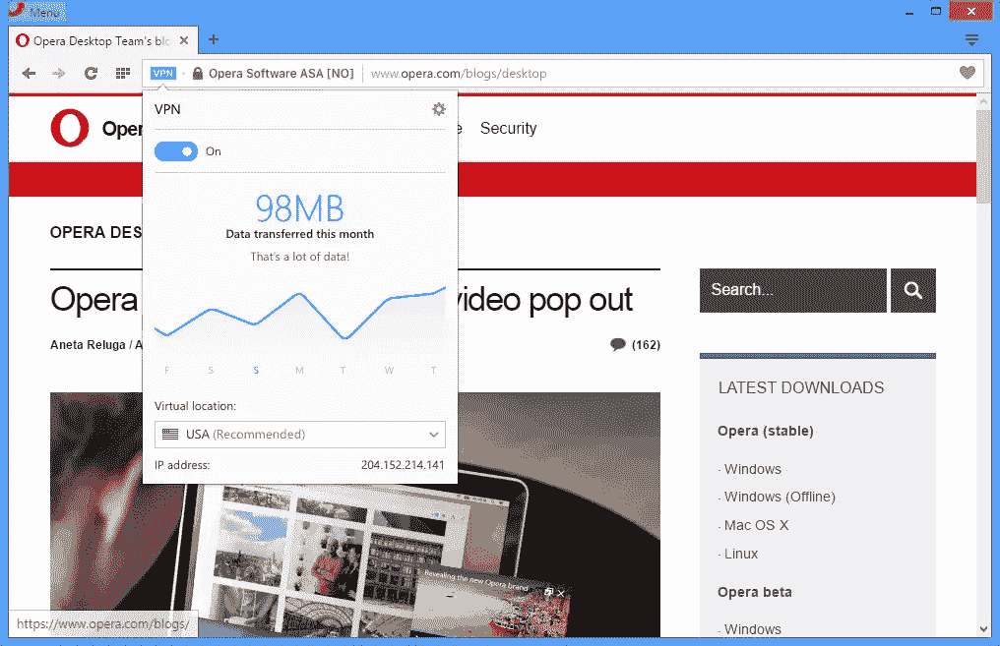

# Opera VPN:隐私浏览的未来？

> 原文：<https://www.sitepoint.com/opera-vpn-future-private-browsing/>

Opera 的开发者版本 38 是第一款内置虚拟专用网客户端的浏览器。这项功能不太可能让大众兴奋，但它可能会改变我们上网的方式。

## 什么是 VPN？

虚拟专用网将您的家庭或公司网络扩展到公共互联网。假设您有两台计算机连接到您的家庭路由器——PCa 和 PCb。它们位于同一个物理专用网络上，可以互相看到对方并共享打印机等资源。

现在想象你把 PCb 搬到了世界的另一边。除非你有一根很长的以太网电缆，否则你不能把它连到同一个路由器上——它将在不同的专用网络上。

可以安装 VPN 客户端软件，以便在远程位置之间建立虚拟网络。实际上，PCa 和 PCb 将再次位于同一个内部网络上。加密用于确保其他系统无法窃听他们的通信。

开源软件如 [OpenVPN](https://openvpn.net/) 和 [Freelan](http://www.freelan.org/) 是可用的，但是[建立自己的 VPN](https://www.sitepoint.com/create-your-own-vpn-server/) 可能会有点令人生畏。幸运的是，有几十种 VPN 服务让这个过程变得更容易。这些服务通常收取月租费，并可能限制带宽。

## VPN 如何帮助网页浏览？

一句话:*隐私*。您不再直接连接到网站；您已连接到 VPN。就您的 ISP 而言，您只有一个到该 VPN 的活动连接，除此之外别无其他。好处包括:

*   你的 IP 地址是隐藏的
    你的网络请求通过虚拟专用网路由到服务器。该服务器可以看到 VPN 的 IP 地址，但它不可能访问您的地址。
*   你的活动是隐藏的
    没有人能看到你的网上冲浪活动，因为你有一个私人加密连接。您可以使用公共或未加密的 Wi-Fi 热点，仍然可以访问您的银行帐户，而不必担心被窥探。
*   **防火墙解封**
    许多国家、组织和学校限制访问整个网络。假设你可以访问你的虚拟专用网，你可以在任何地方冲浪。
*   **虚拟位置**
    您的外出 VPN 可以位于世界上的任何地方。因此，举例来说，您可能能够访问在您的国家被封锁的美国专用服务。这项技术对网飞和 BBC iPlayer 等地区特定的服务提出了一些挑战。

## VPN 和代理服务器有什么不同？

通过代理服务器路由所有 web 请求和响应，可以以类似的方式增强隐私。主要区别是 VPN 更复杂；流量总是加密的，绝不会传递诸如原始 IP 地址之类的数据。

## 基于浏览器的 VPN

您可能不需要为您的整个系统和每个应用程序安装 VPN。VPN 扩展如 [Hola](https://chrome.google.com/webstore/detail/unlimited-free-vpn-hola/) 、 [TunnelBear](https://chrome.google.com/webstore/detail/tunnelbear-vpn/omdakjcmkglenbhjadbccaookpfjihpa) 和 [Betternet](https://chrome.google.com/webstore/detail/unlimited-free-vpn-better/gjknjjomckknofjidppipffbpoekiipm) 提供了一个更简单的选择，将你的冲浪活动隐藏在一个浏览器中。不同的费用和服务水平将适用，您的访问速度可能会受到影响。

## Opera 38 内置 VPN

Opera 38 是该公司在 2016 年 3 月收购 [SurfEasy](https://www.surfeasy.com/) 后第一个提供免费、无限制、原生 VPN 客户端的浏览器。它目前在[开发者版](http://www.opera.com/developer)中可用，但将在几个月内推出标准版。

要激活 VPN，从菜单中选择**设置** (Windows)或**首选项** (Mac/Linux)，然后选择**隐私&安全**。确保勾选了**启用 VPN** :

一个 **VPN** 图标将出现在您的地址栏中。单击此处以查看您的数据使用情况或更改您的 VPN 位置。目前，可以选择美国、加拿大和德国，更多地区将于 2016 年晚些时候发布 Opera 38 的稳定版本。

VPN 访问通常比使用标准网络连接慢，但您必须评估它是否明显。从历史上看，Opera 为服务提供了极好的基础设施——例如 Opera Mini，它在服务器端呈现页面，以及旧的 Turbo 模式，它在下载前压缩资产。一旦整个中国意识到他们可以绕过国家的防火墙，他们是否能够支持快速 VPN 服务就是另一回事了！…

## 私人冲浪的新时代？

网络行业的隐私提案通常令人印象深刻。很少有人费心去遵从诸如[不跟踪(DNT)报头](https://en.wikipedia.org/wiki/Do_Not_Track)之类的倡议，并且向无处不在的 SSL 加密的移动也一直是无精打采的。

[私密、安全的浏览并不新鲜](https://www.torproject.org/)。这些技术变得越来越容易，但仍然超出了大多数用户的知识和能力。Opera 是第一个提供内置虚拟专用网络的主流浏览器，任何人都可以启用。

看看其他厂商是否会跟随 Opera 的脚步将会很有趣。Opera 总部位于挪威，该国(大部分)不在美国和欧盟管辖范围内。美国国家安全局会允许谷歌、苹果或微软在其浏览器中提供类似的服务吗？有些人会争辩说，如果你没有什么可隐藏的，浏览就不应该是隐私…

## 分享这篇文章