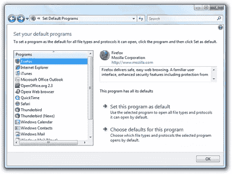

# Opera 的反垄断申诉:微软必须支持标准

> 原文：<https://www.sitepoint.com/operas-antitrust-complaint-microsoft-must-support-standards/>

Opera 已经向欧盟委员会提交了一份针对微软的反垄断申诉，指控微软通过将 Internet Explorer 捆绑到 Windows 上以及未能支持网络标准来非法抑制浏览器市场的竞争。

如果这一切对你来说听起来有点熟悉，那是因为微软在 2001 年与美国司法部进行了一场类似的战斗，并且输了。基于这一裁决，微软[开始着手](http://www.microsoft.com/about/legal/settlementprogram/default.mspx)工作，使得 Windows 中的所有捆绑应用程序都有可能被第三方替代程序覆盖。这种功能目前在 Windows XP 和 Windows Vista 中以设置默认程序应用程序的形式存在。

虽然这些措施令美国司法部满意，但它们并没有令欧洲法院满意。根据 Opera 的新闻稿，9 月份欧洲初审法院裁定微软非法将 Windows Media Player 与 Windows 捆绑在一起，尽管微软能够使用 Windows 中的 Set Default Programs 功能来覆盖程序的文件关联，尽管微软在欧洲可以获得 Windows 的[特殊“N”版本，该版本不包含 Windows Media Player，这是 2005 年欧洲委员会的一项决定所要求的。](http://www.microsoft.com/About/Legal/eudecision/faq.mspx)

在这一最新裁决的背后，Opera 正寻求让欧盟委员会将完全相同的逻辑应用于 ie 浏览器，并迫使微软发布没有 ie 浏览器的 Windows(微软一直坚持认为这在实践中是不可能的)，或者捆绑了替代浏览器的 Windows。

除了捆绑问题，Opera 的投诉还试图要求微软在 ie 浏览器中实现对网络标准的支持。这将是一个更难证明的问题。尽管 Internet Explorer 无疑是当今主流浏览器中最不符合标准的，但 Internet Explorer 的每个版本都包含了改进的标准支持。Opera 似乎是在说，微软开发 Internet Explorer 的速度缓慢，这本身就是一种非法和反竞争的行为。

你觉得怎么样？微软在让用户在 Windows 中选择替代浏览器方面做得足够多了吗？法律上是否应该要求浏览器制造商支持网络标准，不管他们是否有足够的编程资源来支持这些标准？

## 分享这篇文章