# 优化审计:深入探究 Chrome 的开发控制台

> 原文：<https://www.sitepoint.com/optimization-auditing-a-deep-dive-into-chromes-dev-console/>

Chrome DevTools 整合了许多用于在客户端调试 web 应用程序的子工具，比如记录性能配置文件和检查动画，其中大部分你可能在学习 web 开发的早期就一直在使用，主要是通过 DevTools 控制台。

让我们来看看其中的一些工具，特别关注控制台和性能指标。

要访问 Chrome 的 DevTools:

*   右键单击页面上的任意位置，从上下文菜单中单击**检查**
*   在 Windows 和 Linux 系统上使用键盘快捷键`Ctrl + Shift + I`或在 macOS 上使用`Alt + Command + I`
*   在 Windows 和 Linux 系统上使用键盘快捷键`Ctrl + Shift + J`，在 macOS 上使用`Alt + Command + J`。

## 片段工具

如果您经常在控制台中编写 JavaScript 代码，请确保使用 DevTools 的 Snippets 功能，它类似于代码编辑器，提供了编写 JavaScript 代码片段的机制，可以在当前页面的上下文中运行代码片段，并保存它们以备后用。比直接在控制台写多行 JavaScript 代码要好。

您可以从“源”面板中访问代码片段工具。一旦打开，控制台就会堆叠在下面(如果没有，只需按 Escape ),这样您就可以编写、运行代码并同时查看控制台输出。

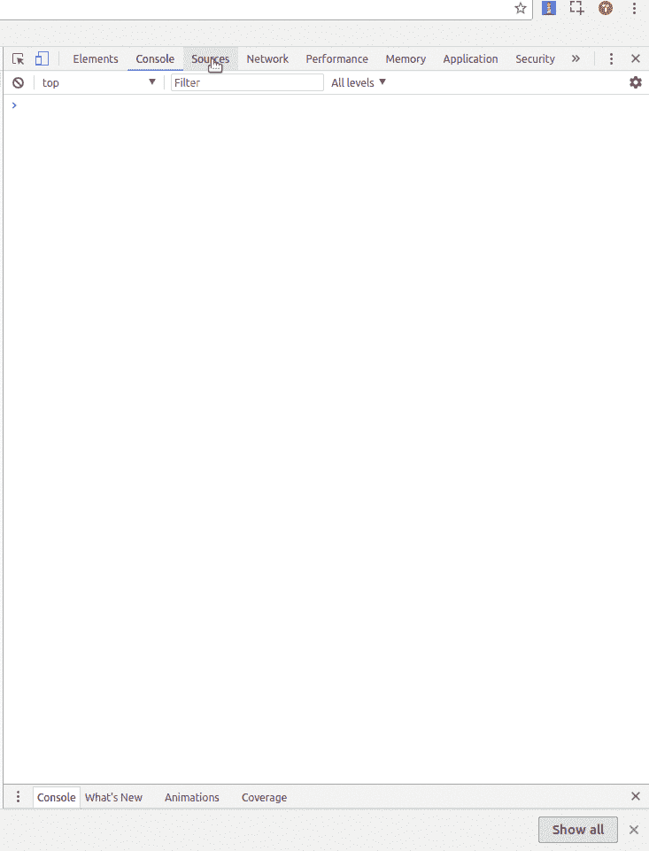

## 使用 Chrome DevTools 控制台

您可以使用控制台通过 JavaScript 与任何网页进行交互。您可以查询和更改 DOM，并查询/输出不同类型的性能信息。

当 DevTools 打开并获得焦点时，通过按`Escape`可以将控制台打开为全屏专用面板或任何其他 DevTools 面板旁边的抽屉。

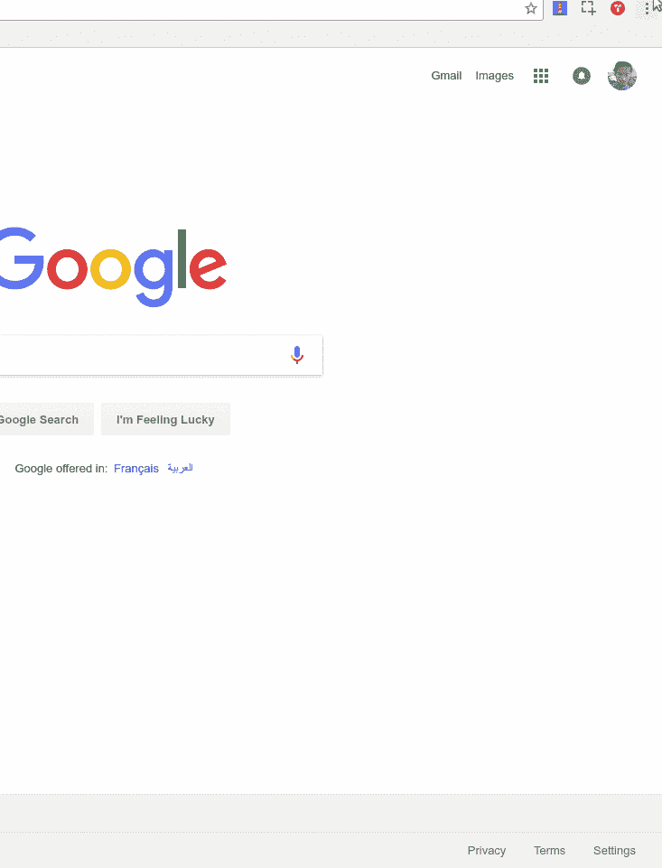

当使用浏览器的控制台时，如果你想输入多行表达式，你需要使用`Shift + Enter`，因为此时只有`Enter`会执行输入行中的内容。

### 控制台历史记录

您可以用不同的方式清除控制台历史记录:

*   通过在控制台中键入`clear()`
*   通过调用控制台中的`console.clear()`方法或 JavaScript 代码
*   通过点击控制台左上角的红色圆圈
*   在 macOS、Windows 和 Linux 中按`CTRL+L`
*   右键点击控制台，然后按*清除控制台*。

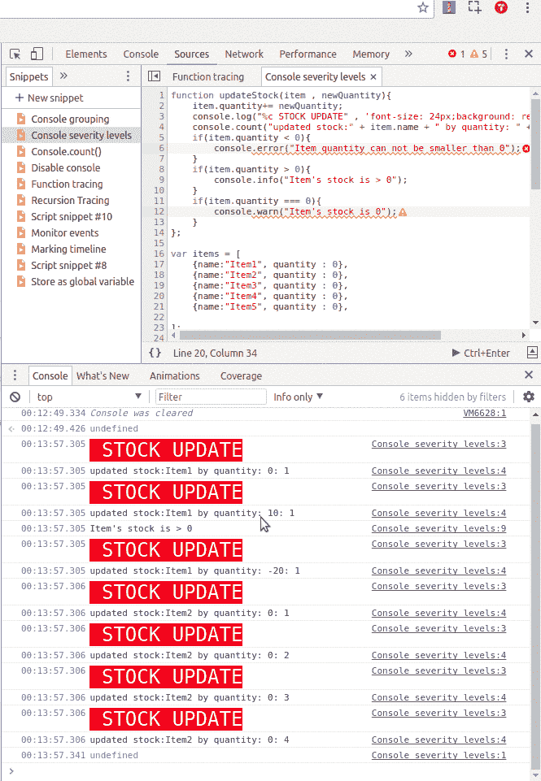

您可以在页面刷新或更改之间保留日志(通过启用保留日志复选框)，直到您清除控制台或关闭选项卡。

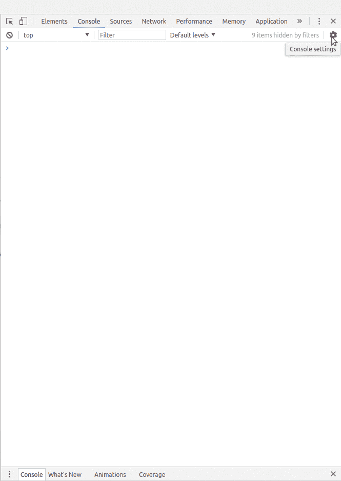

您可以将控制台中的历史保存为文本文件，方法是在控制台中右键单击并选择*另存为…* ，然后选择日志文件的位置。

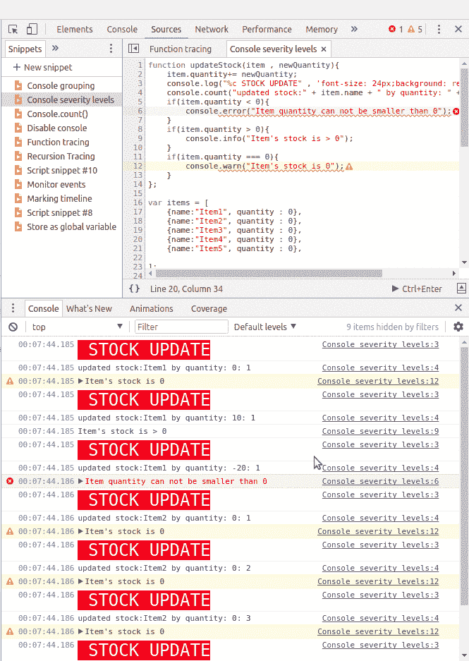

### 控制台变量

您在控制台中创建的变量会一直存在，直到您刷新页面，所以在声明变量时，请注意使用关键字，如 **let** 或 **const** 。第二次运行相同的代码或函数会抛出一个**未捕获的语法错误**，表示该标识符已经被声明了。您可以使用 OR ( **||** )操作符来检查变量是否已经定义，或者您可以使用 **var** 来声明变量，因为它不会抱怨之前声明的变量。

### 存储为全局变量特征

如果从代码中将对象记录到控制台，您可能希望从控制台引用这些变量，以便检查它们的值。不要在控制台行中搜索，让控制台为您完成这项工作。有一些内置的方法可以引用这些对象。

您可以使用`$_`，它引用控制台中返回的最后一个对象。

另一种方法是将**存储为全局变量**(右键菜单选项)用于任何登录到控制台或从函数返回的对象，将其转换为全局变量。您新创建的全局变量将被称为`temp1`。如果你存储更多的变量作为全局变量，它们将被称为`temp2`、`temp3`，以此类推。

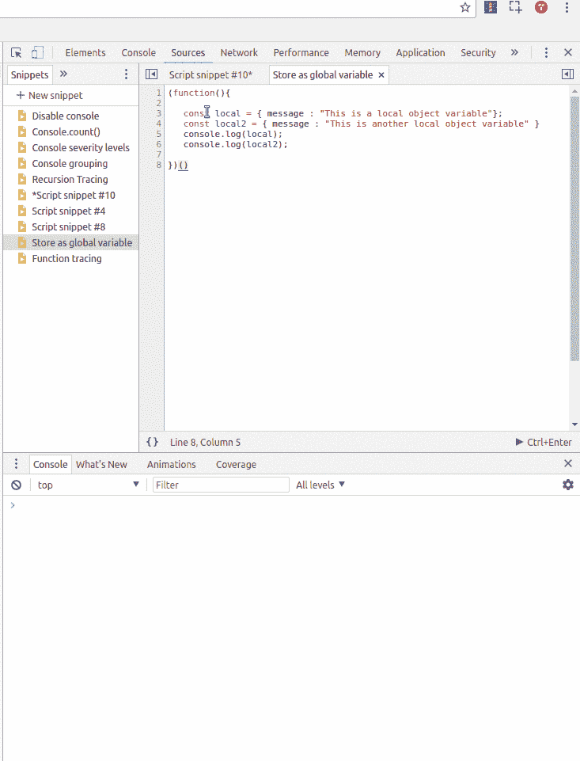

### 使用 console.log()记录日志

当构建复杂的客户端 web 应用程序时，最好使用浏览器提供的调试工具，这可以帮助开发人员在不干扰应用程序的实际用户界面的情况下找出代码级别发生了什么(也就是说，使用警告和消息框来调试错误)。

打开 DevTools 控制台后，尝试记录一个简单的语句:

```
console.log("hello console"); 
```

`console.log()`方法可以接受许多参数和格式说明符。

您可以传递字符串和其他类型的 JavaScript 变量，用逗号分隔，这样可以用空格代替逗号将它们连接成一个字符串。

```
console.log("this is a concatenated string composed from: ",1,"and",{type:"object"} ); 
```

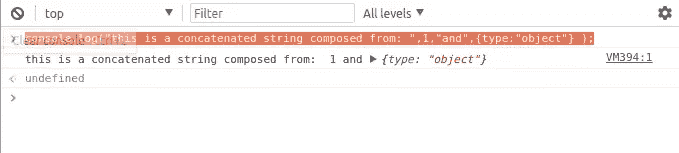

您还可以添加格式说明符:

*   `%s`:指定字符串的占位符
*   `%d`:指定数字的占位符
*   `%i`:指定整数的占位符
*   `%f`:为浮动指定占位符
*   `%o`:为 DOM 元素指定占位符
*   `%O`:指定 JavaScript 对象的占位符
*   `%c`:指定 CSS 样式以格式化控制台输出

```
var op1 = 1;
var op2 = 2;
var result = op1 * op2;
var operation = "multiply";

console.log('%c %s: %d x %d = %d','font-size: 24px;background: red; color: white;' ,operation, op1 , op2 , result); 
```

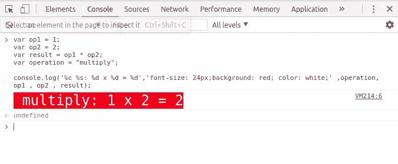

### 使用 console.assert()断言

`console.assert()`评估第一个参数，这是一个布尔表达式，如果表达式失败，记录第二个参数(评估为`false`):

```
var a = 102;
var b = 101;
console.assert(a < b, "a is bigger than b"); 
```

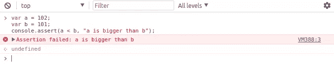

### 使用 console.count()计算执行次数

`console.count(label)`输出它在同一行和同一标签上被调用了多少次。

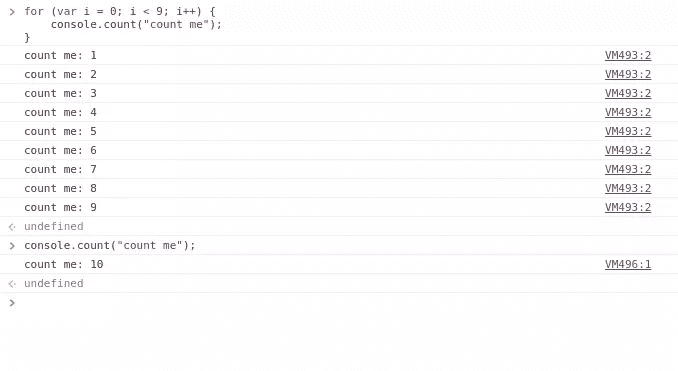

从截图中可以看到，当同一个语句传递给`console.count()`时，计数加 1。

如果你需要记录一个函数被调用或者在循环中被调用了多少次，这是非常有用的。

让我们看另一个例子:

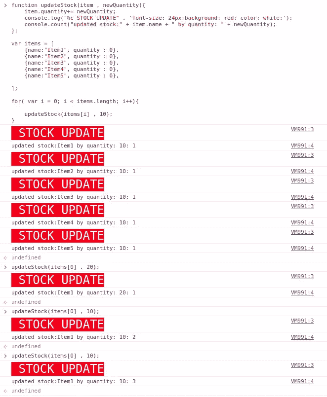

这些简单的调整可以在调试应用程序和试图发现某个函数的输出时为您节省大量时间，尤其是当您的控制台充满日志记录语句时。

### 用 console.error()、console.info()和 console.warn()标记控制台的输出

`console.error()`、`console.warn()`、`console.info()`方法与`console.log()`类似。它们可用于将信息记录到浏览器的控制台，但有一些不同:

*   `console.error()`在控制台上将输出标记为**错误**，并打印错误堆栈。
*   `console.warn()`将输出标记为**警告**。
*   `console.info()`将输出标记为**信息**。

向控制台输出添加标志非常有用，因为控制台提供了一种只显示带有指定标志的消息的方式。

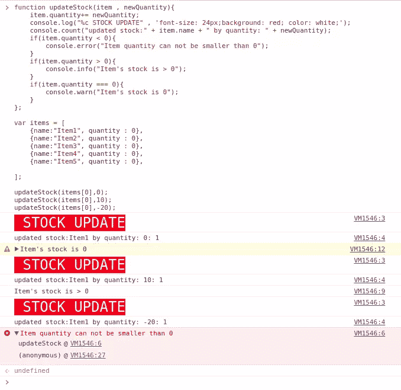

#### 过滤控制台日志

使用前面的方法，您可以按严重性级别过滤控制台输出。

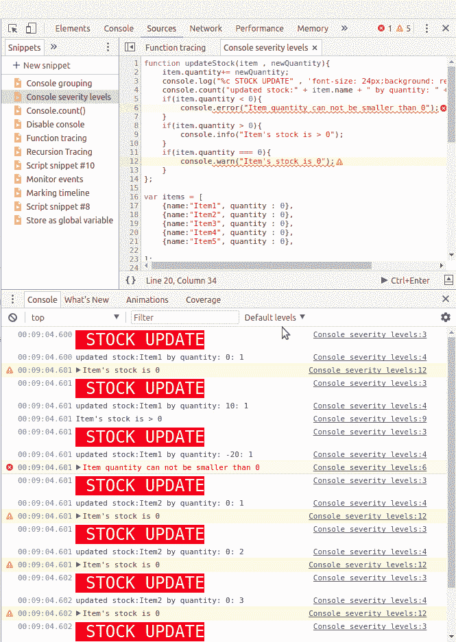

您也可以通过文本过滤输出。

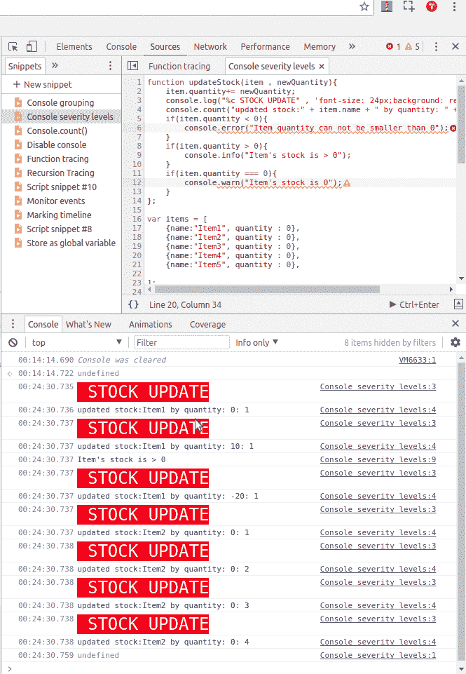

### 使用 console.group()、console.groupCollapsed()和 console.groupEnd()对控制台的输出进行分组

将`console.group(name)`或`console.groupCollapsed(name)`与`console.groupEnd()`配合使用，你可以将许多日志信息归入一组。

`console.groupCollapsed()`与`console.group()`相同，只是它创建了一个折叠组。

让我们将简单的例子改为将消息分组:

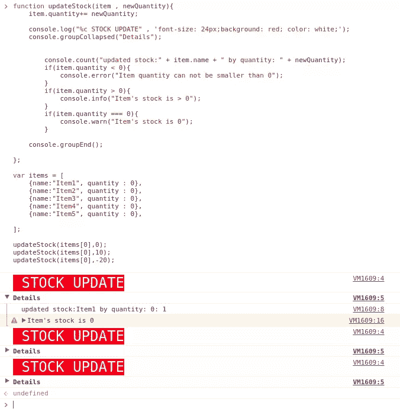

我们还可以嵌套组:

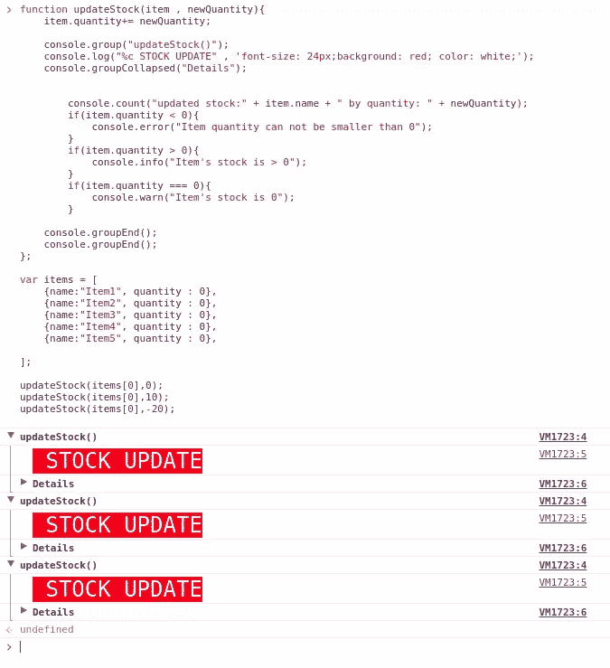

我们创建了两个组:名为 *updateStock()* 的外部组，以及名为 *Details* 的内部折叠组。您可以点击*详情*了解更多日志信息。

### 用 console.table()、console.dir()和 console.dirxml()记录数组和对象相关数据

`console.table()`方法对于记录表格数据或数组很有用:

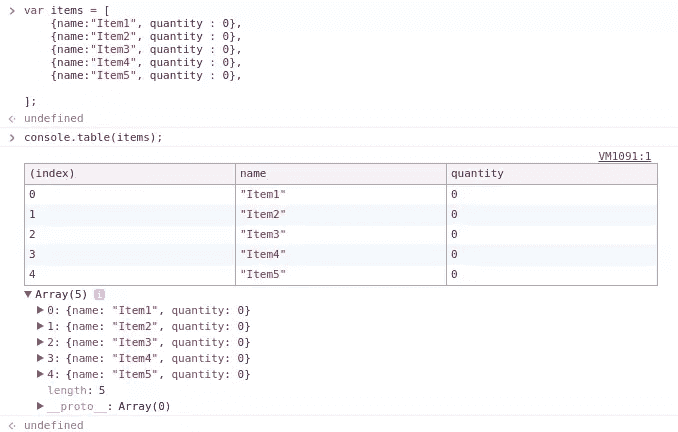

`console.dir()`方法对于将对象记录为 JSON 数据很有用:

```
console.log($("body"));
console.dir($("body"));
console.dirxml($("body")); 
```

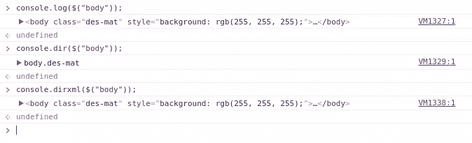

### CPU 配置文件

`console.profile([label])`开始和`console.profileEnd()`结束一个 JavaScript CPU 配置文件。

让我们为 *updateStock()* 方法创建一个名为 *Updating Stock* 的概要文件:

```
function updateStock(item , newQuantity){
    console.profile("Updating Stock");
    //the method body
    console.profileEnd("updateStock Time");
} 
```

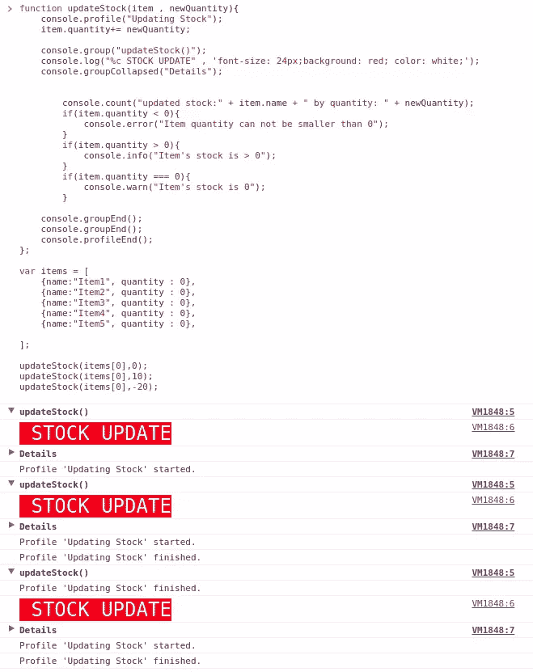

您可以使用 JavaScript Profiler 面板来查找您创建的配置文件，这允许您查看每次运行该函数所花费的时间。

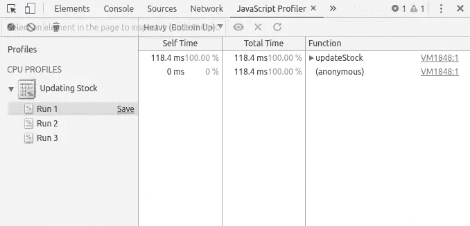

### 使用 console.time()和 console.timeEnd()测量执行时间

您可以使用`console.time(label)`和`console.timeEnd(label)`来测量代码执行所需的时间。让我们在简单的例子中测量一下`updateStock()`方法的执行时间:

```
function updateStock(item , newQuantity){
    console.time("updateStock Time");
    //the method body
    console.timeEnd("updateStock Time");
} 
```

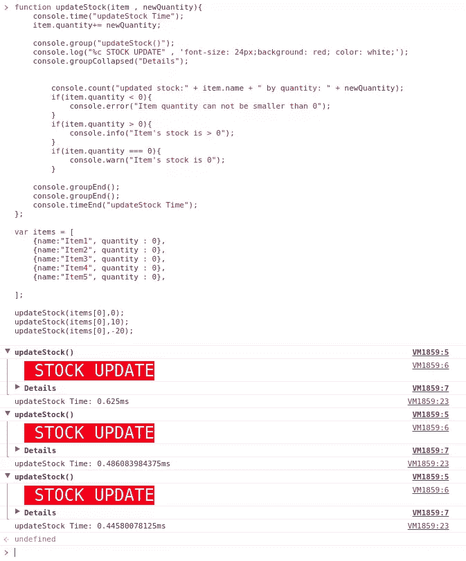

### 获取 JavaScript 函数的堆栈跟踪

通过使用`console.trace()`,您可以获得调用函数的堆栈跟踪，这允许您更好地理解代码执行流程。

该函数的完整调用堆栈显示在控制台上，带有代码文件名和行号，单击它们可以导航到源代码中相应的行。

值得一提的是，`console.trace()`也可以和 DevTools Snippets 工具一起使用。

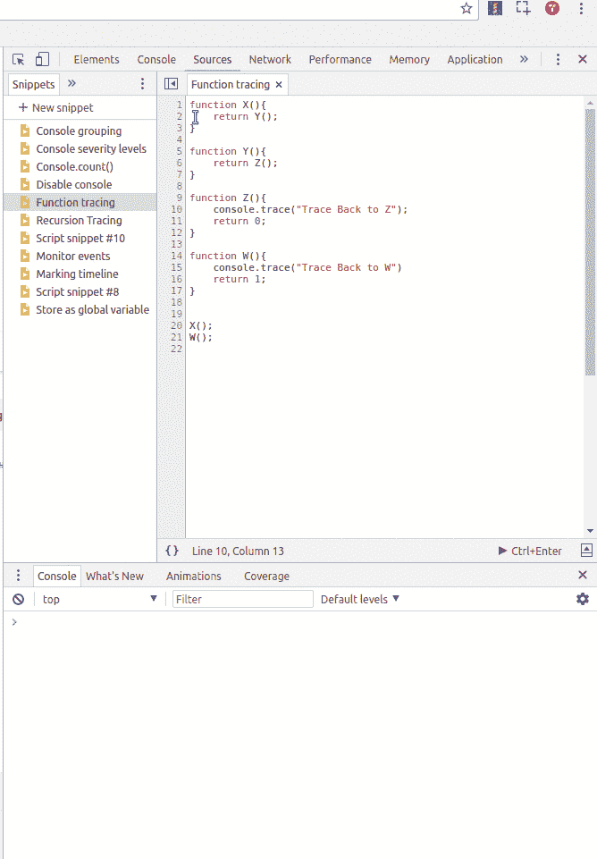

### 使用 monitorEvents()从控制台监视事件

您可以使用`monitorEvents`方法从控制台监视 DOM 事件，该方法将被监视的对象作为第一个参数，将监听的事件数组作为第二个参数。例如，让我们监控谷歌网站的`scroll`、`mousedown`、`mouseup`和`mouseover`事件:

```
monitorEvents(document.body, ["scroll"]);
monitorEvents($$('img')[2], ["mouseover","mousedown", "mouseup"]);//monitor the logo image 
```

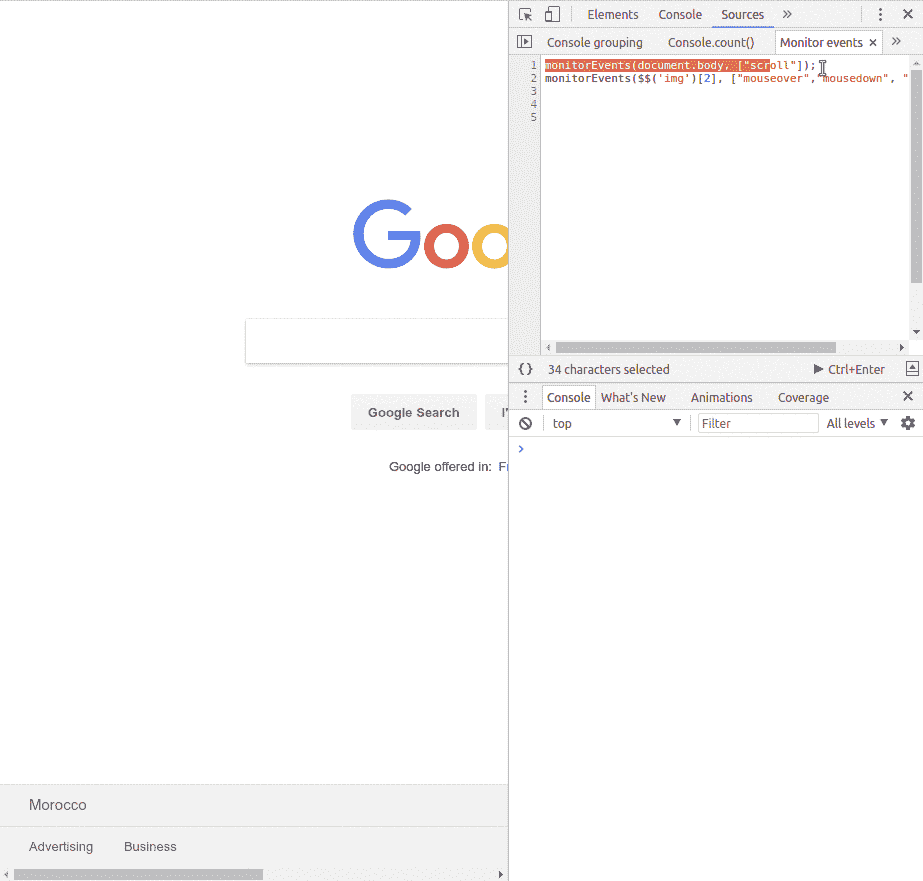

### 从控制台查询 DOM

DevTools 控制台有一个方法，允许您使用 CSS 选择器查询当前的 HTML 文档。该方法可以通过输入两个美元符号`$$(selector)`来使用，它返回所有选择器的数组。

以下是您可以用`$$()`做些什么的一些例子:

```
$$('p') // outputs an array of all <p> elements
$$('.cls') // outputs an array of all elements with the '.cls' class
$$('#id') // outputs the element with id '#id' 
```

即使结果只有一个，查询方法也会返回一个数组，所以需要使用类似`array[0]`的东西来访问结果。

请注意，您也可以使用标准的 JavaScript API 从控制台查询当前的 HTML 文档，如`document.querySelector()`或`document.getElementsByClass()`等。

### 引用选定的元素

如果您正在使用 DevTools 元素面板，并且已经选择了一些 DOM 元素，那么您可以在控制台面板中轻松地引用它，而不必查询它。

当您选择元素时，您可以看到 Chrome 添加了`==$0`，这表示您可以使用`$0`从控制台引用该元素。

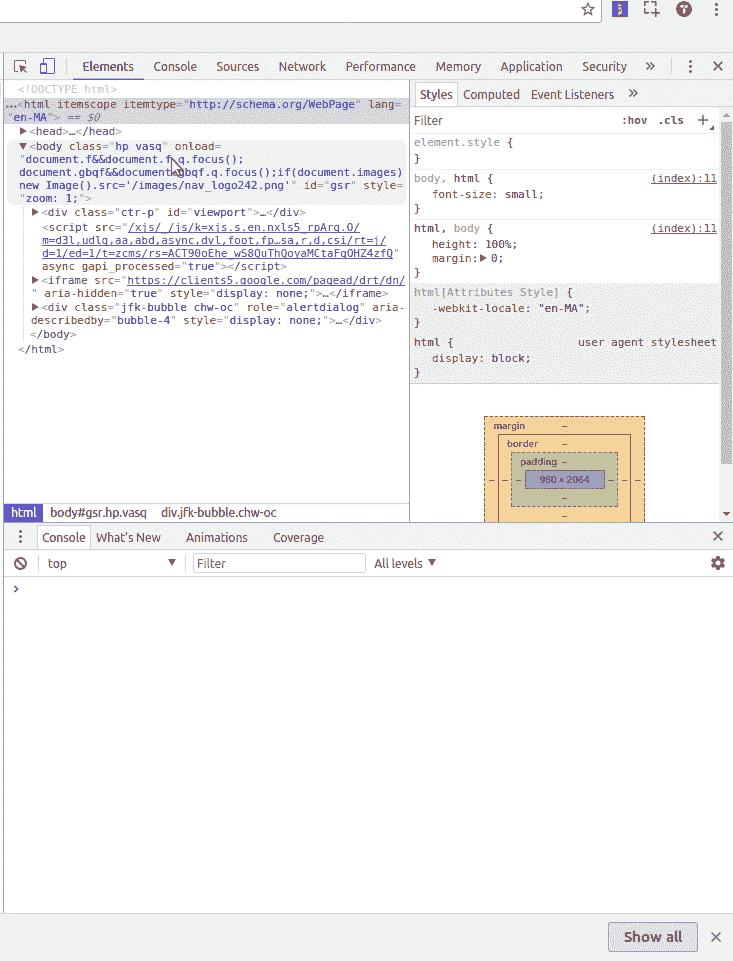

### 在生产中禁用/清除控制台输出

在开发中使用不同的控制台 API 非常有用，但是您可能不希望所有的日志记录信息都出现在生产中，因此您可以使用工具清理生产代码，或者使用下面的简单代码禁用控制台 API:

```
(function () {
    var methods = [];
    var noop = () => {};

    Object.keys(window.console).forEach(key => {

        methods.push(key);

    });
    console.log(methods);
    var length = methods.length;

    var m;
    while (length--) {
        m = methods[length];
        window.console[m] = noop;
    }
}()); 
```

您还可以使用以下工具来清理生产代码:

*   web pack-strip:Yahoo！开发人员从您的代码中剥离定制功能(如调试或控制台功能)。
*   GulpJS 的一个模块，用于从你的代码中剥离定制函数。
*   grunt-strip-debug:grunt js 的一个模块，用于剥离自定义函数。

控制台面板是专门为调试 JavaScript 代码而设计的。现在，让我们来看看设计用来分析和识别性能问题或可能优化的领域的工具。

## DevTools 性能选项卡

性能面板旨在记录 web 应用程序的运行时和加载时性能，以发现瓶颈。它可以用来测量一些事情，比如你的代码在哪里花了大部分时间。这些信息可用于进一步优化影响性能的问题区域，以减少 UI 阻塞并优化 UI 响应。

值得一提的是，性能面板是 Chrome 中的新功能。它结合了旧的时间轴和 JavaScript CPU Profiler，后者仍然存在，但隐藏在 **More tools** 下——这是它将从未来版本的 Chrome 中删除的一个步骤。

Performance 选项卡既可以分析运行时性能，也可以分析加载时性能。

您可以通过单击 record 按钮(黑点)或点击`CTRL+E`来记录运行时性能的概要文件:

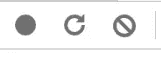

对于加载时间性能，您需要使用第二个按钮或点击`CTRL+Shift+E`，这将重新加载当前页面并开始新的记录。

对于要分析的演示，您可以使用 Google 提供的 [jank 示例](https://googlechrome.github.io/devtools-samples/jank/)。你可以在这里阅读更多关于使用这个演示[的信息。](https://developers.google.com/web/tools/chrome-devtools/evaluate-performance/)

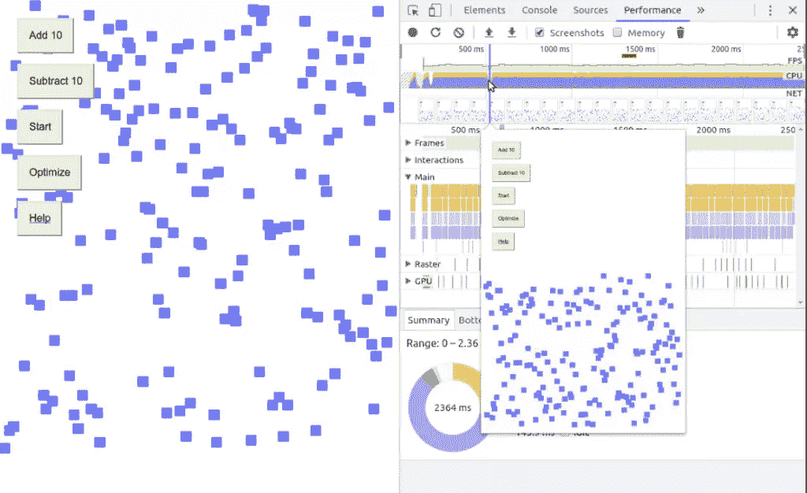

此演示是为测试目的而设计的。您可以通过添加更多方块来减慢动画速度，或者通过删除方块来加快动画速度。您也可以按优化按钮来测试这个演示的优化代码。

当分析一个应用程序的性能时，确保你在*匿名模式*下使用 Chrome，这样你就可以防止其他打开的标签——尤其是安装在你的 Chrome 系统上的扩展——干扰你的应用程序的分析。

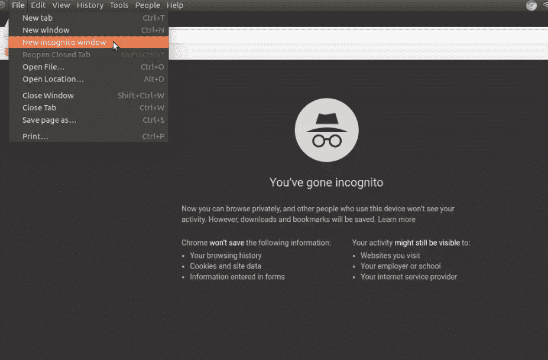

### 网络节流

性能选项卡允许您在分析应用程序以模拟不同的网络条件时调节网络。

您可以选择不同的网络条件，如在线、离线、快速 3G 和慢速 3G。

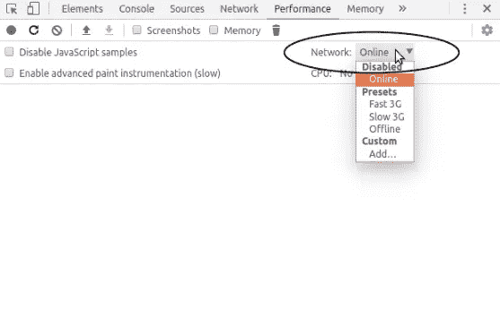

您还可以添加自定义条件，以更好地针对用户群的条件:

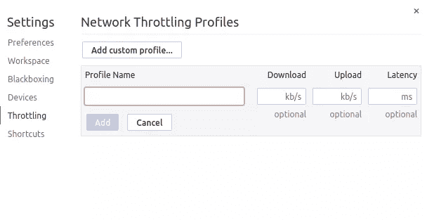

### 模拟移动 CPU

CPU 节流允许您模拟移动设备缓慢的 CPU 能力，以便您可以准确地测试您的网页在移动设备中的执行情况。

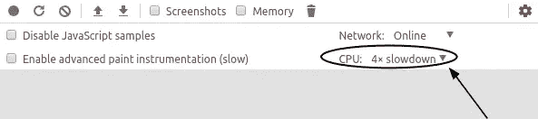

可以选择**不节流**、 **4x 减速**或 **6x 减速**。

### 录制时截图

勾选*截图*框可以截图每一帧。截图将帮助您在分析过程中可视化应用程序用户界面的状态。当你制作动画时，它们特别有用。

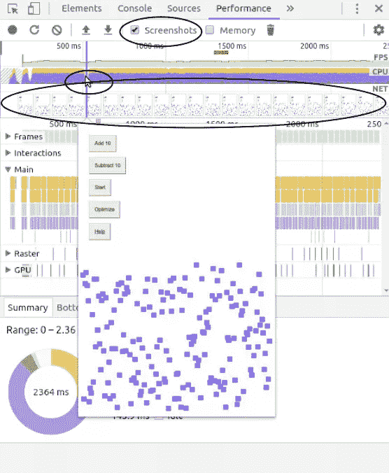

### 分析性能报告

在优化应用程序的性能之前，您需要对其进行分析，原因有二:第一，测量性能有多差，第二，确定可以进行优化的地方。生成性能报告后，您可以了解不同图表的含义以及如何使用其他子工具。

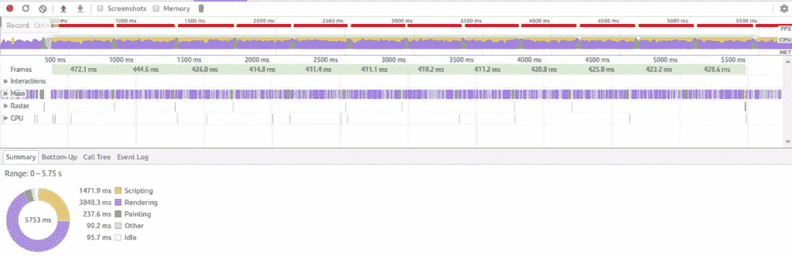

### 放大或选择时间范围

DevTools 使您能够放大性能选项卡报告的不同图表和区域。你可以专注于一段时间，这将帮助你清楚地了解在几毫秒的水平上发生了什么。

您只需用鼠标点击包含 FPS、CPU 和网络图表的区域。当范围手柄出现时，您可以拖动其中一个或两个手柄来自定所选部分。

当您选择一个部分时，所有不同的图表和部分将被更新，以仅显示有关在所选时间发生的帧和操作的信息。

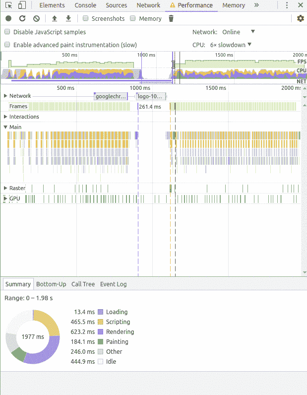

### 每秒帧数(FPS)

[维基百科将 FPS](https://en.wikipedia.org/wiki/Frame_rate) 定义为:

> 帧速率(以每秒帧数或 fps 表示)是动画显示中称为帧的连续图像显示的频率(速率)。该术语同样适用于电影和摄像机、计算机图形和动作捕捉系统。帧速率也可以称为帧频率，用赫兹表示。

从定义中，你可以看到**帧速率**是一个与电影和计算机图形相关的概念，但它也用于现代性能工具，如 Chrome DevTools，以测量页面对用户交互的响应。

为了构建高性能的应用程序，你需要达到 60fps 的目标。这里有一段谷歌开发人员的视频，解释了为什么 *60fps* 速率很重要:

[https://www.youtube.com/embed/CaMTIgxCSqU?rel=0](https://www.youtube.com/embed/CaMTIgxCSqU?rel=0)

您可以在 DevTools 中访问一个方便的实用程序(从 More tools -> Rendering 选项卡访问)，它可以显示页面 FPS 随时间变化的实时可视化。

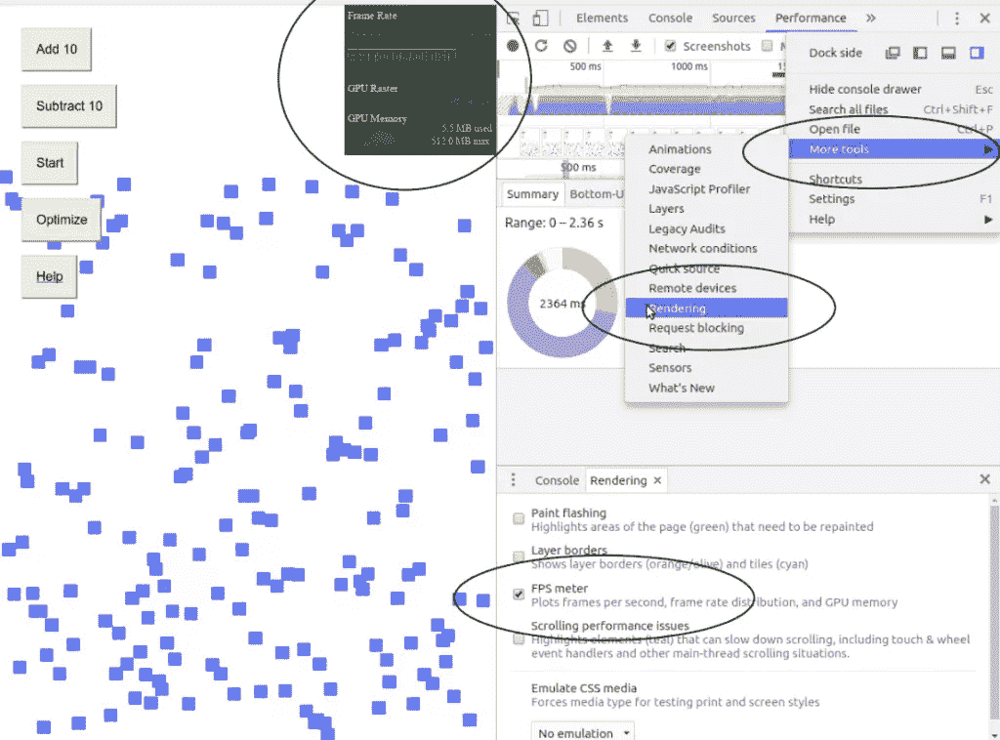

### FPS 图表

FPS 图表显示分析过程中每秒的帧速率。


正如谷歌、*指出的那样，FPS 图表中的红线表明帧速率太低，以至于损害了用户体验。*

下面是优化代码的另一个截图，没有红色条:

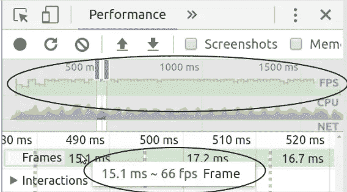

FPS 图表有助于您在使用其他子工具之前发现问题所在。

### 框架

维基百科是这样定义框架的:

> 动画和电影制作中的关键帧是定义任何平滑过渡的起点和终点的绘图。这些图画被称为“帧”,因为它们的时间位置是以胶片上的帧来衡量的。关键帧序列定义了观众将看到的运动，而关键帧在电影、视频或动画中的位置定义了运动的时间。因为在一秒钟内只有两到三个关键帧不会产生运动的错觉，所以剩余的帧会被中间帧填充。

框架部分位于图表区域的正下方，包含代表框架的绿色框。一旦你将鼠标移动到一个特定的帧上，DevTools 就会向你显示两个重要的细节:FPS 速率，以及渲染该帧所涉及的所有操作所花费的时间。

如果您单击框架框，则“摘要”、“自下而上”、“调用树”和“事件日志”选项卡将仅显示该特定框架的详细信息。

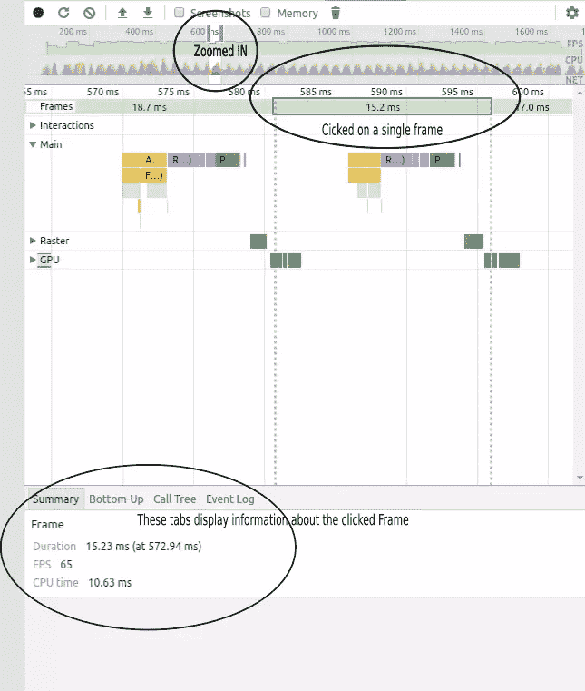

### CPU 图表

CPU 图表显示了分析期间 CPU 的活动。它位于 FPS 图表的下方。

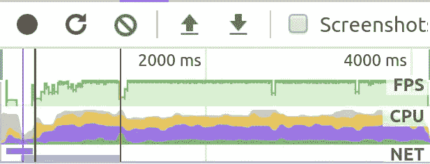

颜色对应于摘要选项卡中的不同活动。如果你看到 CPU 图表充满了颜色，这意味着 CPU 长时间处于最大使用状态。这是你做一些性能优化的信号。

#### 网络图和网络部分

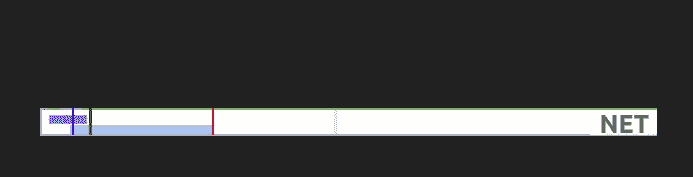

网络图显示了分析期间的网络请求。它对于显示加载请求的网络部分的加载时间分析特别有用。

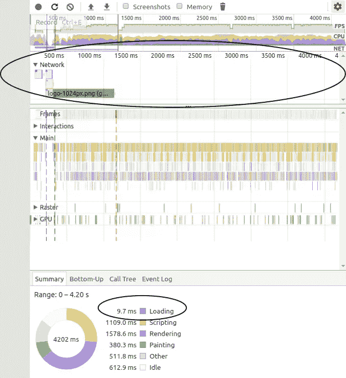

当您将鼠标移到某个请求上时，它会显示该特定请求的加载时间。

当您单击特定请求时，所有其他子工具都会更新，以包括仅在请求期间发生的操作。

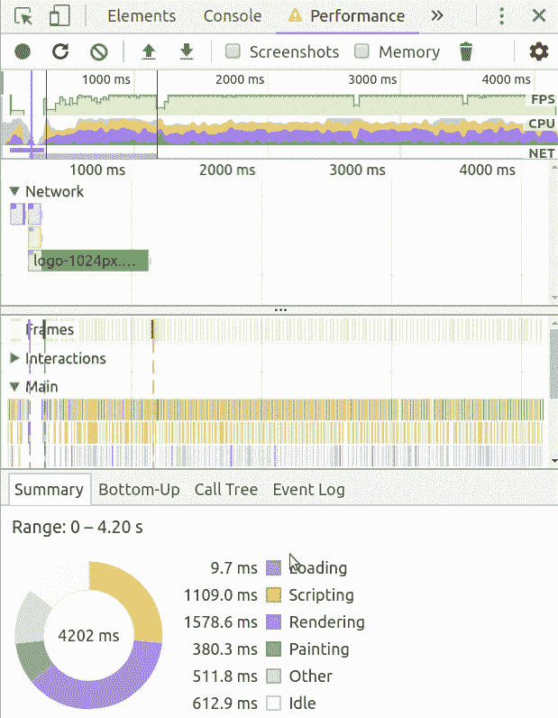

不同的颜色代表不同的资源类型——Java script、CSS、图像等。加载时间较长的资源具有较长的条形。每个条较亮的部分代表第一个字节或 **TTFB** 的**时间。较暗的部分代表**传输时间**。**

### “摘要”选项卡

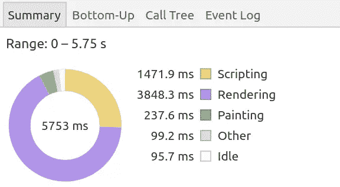

我们对该应用进行了为期*5.75 秒*(或*5753 毫秒*)的评测。当没有选定的时间部分时——在存在 FPS 和其他图表的概览区域上——范围指向整个评测周期。它显示浏览器正在执行的活动的彩色明细。从这个细分中我们可以得出一堆结论:在*的 5753 ms* 、*的 3848.3ms* (最多的时间)花在了渲染上，对于*的 95.7ms* 线程是空闲的。

您可以通过尝试减少渲染时间来优化此应用程序的性能。

当在主区域中选择一个事件或函数调用时，Summary 选项卡仅显示关于该事件/调用的信息。

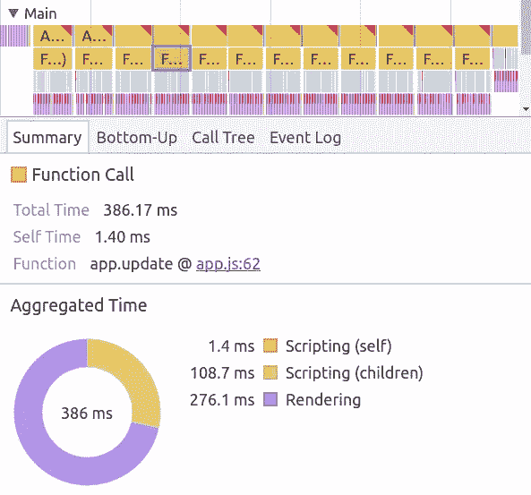

“摘要”选项卡为您提供详细的计时信息，即浏览器花费时间的位置。在采取措施优化代码之前，您需要获得关于您需要采取行动的确切位置的信息。为此，您可以使用性能选项卡下的其他工具(调用树选项卡、自下而上选项卡和事件日志表格视图)。

*   **自底向上选项卡**:该选项卡从自底向上的角度显示在所选时间范围内或在所有分析时间内(如果没有选择范围)占用最多时间的聚合活动。

*   **调用树选项卡**:显示(所选)评测期间的活动及其调用堆栈。

*   **事件日志**选项卡显示事件，按事件执行的顺序，在分析时间或选定的时间内。

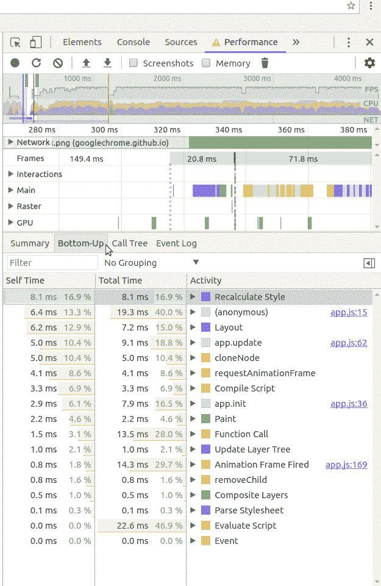

### 主要部分

#### 火焰图/图表

[内核和性能工程师 Brendan Gregg](https://en.wikipedia.org/wiki/Brendan_Gregg) 为性能分析创建了许多可视化类型，他将火焰图定义为:

> 火焰图是剖析软件的可视化，允许快速准确地识别最频繁的代码路径。火焰图是采样堆栈跟踪的可视化，它允许快速识别热代码路径。

也可以看他关于[火焰图](http://queue.acm.org/detail.cfm?id=2927301)的详细文章。

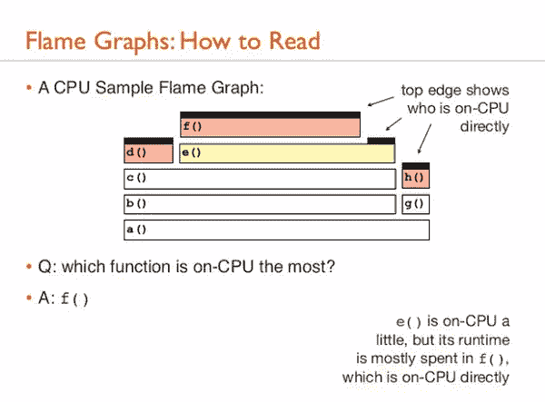

*[图片来源](https://medium.com/netflix-techblog/java-in-flames-e763b3d32166)*

Performance 选项卡中的 Main 部分显示了主线程上活动的火焰图。

火焰图以毫秒为单位显示性能评测过程中代码的 JavaScript 堆栈的状态(包含有关被调用的函数和事件的详细信息)。

**y 轴**表示**调用栈深度**,**x 轴**表示**记录时间**。每个框(或放大后的条)是一个事件或函数调用的堆栈框架。**方框的宽度**代表操作花费的时间。

从左到右的顺序并不重要(堆栈按字母顺序排序)。较宽的条形表示较长的时间，因此您需要关注那些优化代码性能的条形。每个框右上角的红色三角形(代表函数调用或触发的事件)表示操作有问题。不同性能图表中的颜色与主要部分中的颜色相对应。

所有这些都在取代旧的 *JavaScript CPU Profiler* 。

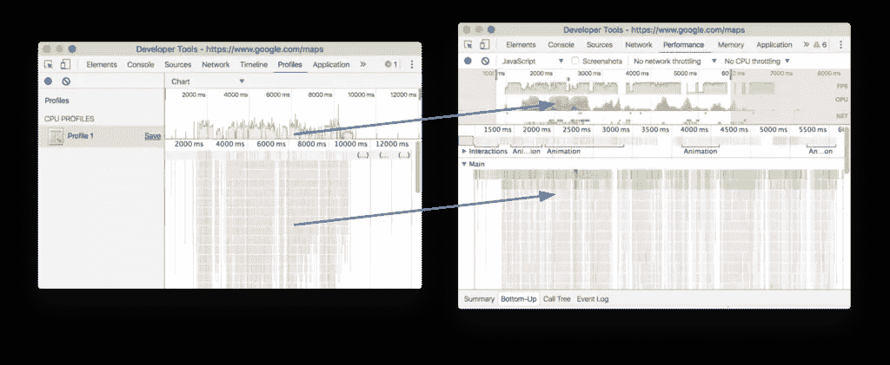

*[图片来源](https://developers.google.com/web/updates/2016/12/devtools-javascript-cpu-profile-migration)*

“自下而上”选项卡取代了旧的 CPU profiler 的沉重(自下而上)视图。

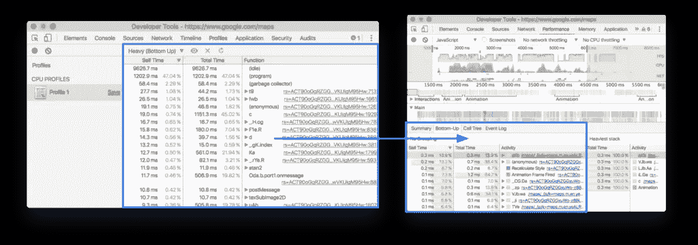

*[图片来源](https://developers.google.com/web/updates/2016/12/devtools-javascript-cpu-profile-migration)*

旧的 CPU 档案器中的树(自上而下)视图可以被调用树选项卡所取代。

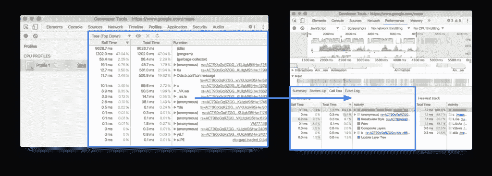

*[图片来源](https://developers.google.com/web/updates/2016/12/devtools-javascript-cpu-profile-migration)*

## “审计”选项卡

审计工具可用于识别并指导您解决影响 web 应用程序性能、可访问性和用户体验的常见问题。它有许多审核和最佳实践，并根据您通过的审核数量和遵循的最佳实践数量及其权重(即，并非所有审核在最终得分中的贡献都相同)来计算您的应用程序得分。最终审计报告将所有审计分为两类——通过和未通过——并显示提示/指南，其中包含指向外部 Google Web Developers 博客帖子的链接，介绍如何通过特定的审计。

### 访问审计和执行审计

您可以通过打开 DevTools 来访问审计，然后通过单击它来激活它的选项卡。

接下来，您可以通过触发中间的蓝色“执行审计…”按钮来执行审计，然后选择要执行的审计类别(或全部)，最后单击*运行审计*。

*   渐进式 web 应用程序:运行审计来测试页面是否符合渐进式 Web 应用程序的标准
*   绩效:运行绩效审计
*   最佳实践:运行审计来测试页面是否遵循现代 web 开发的最佳实践
*   可访问性:运行审计来测试页面是否可供残障人士使用。

Lighthouse 设置 DevTools 来模拟移动设备，对页面运行一系列测试，然后在 Audits 面板中显示结果。然后，您可以查看或下载报告。

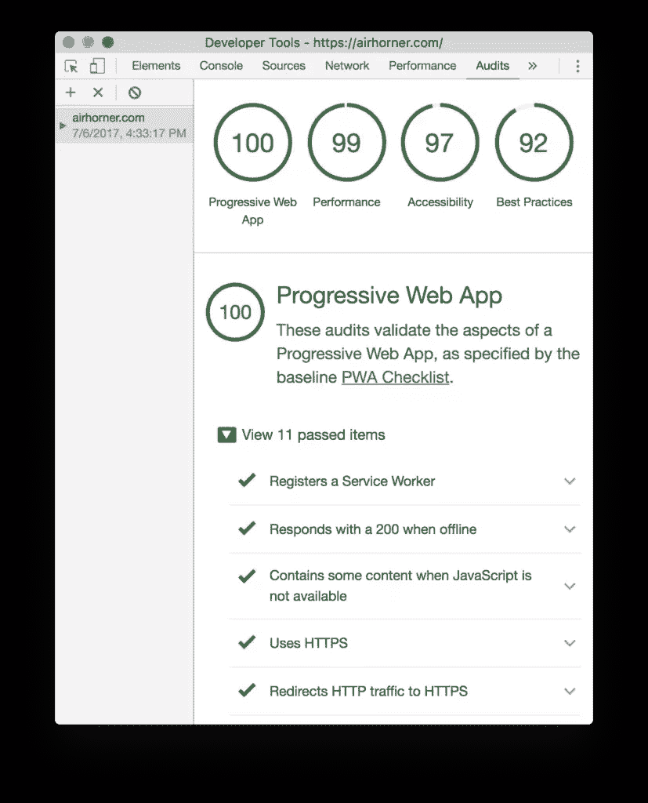

*[图片来源](https://developers.google.com/web/updates/2017/05/devtools-release-notes)*

请注意，Audits 是由 [Lighthouse](https://github.com/GoogleChrome/lighthouse) 提供支持的，这是一个用于提高 web 应用质量的开源工具，我们在[渐进式 Web 应用:速成班](https://www.sitepoint.com/progressive-web-apps-a-crash-course)中有更详细的介绍。

## 结论

一旦您理解了代码级性能问题的原因，您就可以应用不同的 JavaScript 技术来解决瓶颈，比如使用 [requestAnimationFrame()](https://developer.mozilla.org/en-US/docs/Web/API/window/requestAnimationFrame) 或者使用 HTML5 Web Workers 在自己的线程中执行操作。

在本文中，我们介绍了 Chrome DevTools，特别是控制台面板和 API 以及与性能相关的工具。你可以在这个回购中找到上面[中使用的不同片段。](https://github.com/techiediaries/chrome-console-snippets)

## 分享这篇文章