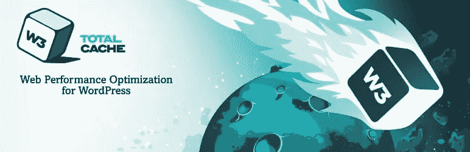
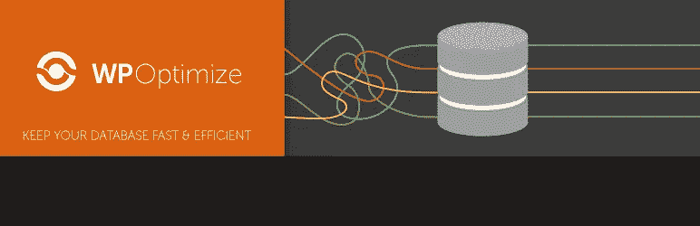

# 优化 WordPress 网站性能的 10 个步骤

> 原文：<https://www.sitepoint.com/optimize-wordpress-sites-performance/>

这篇关于 WordPress 网站性能的文章是与 [SiteGround](https://www.siteground.com/go/article-sp) 合作创作的系列文章的一部分。感谢您对使 SitePoint 成为可能的合作伙伴的支持。

你不想要一个缓慢的网站。潜在的访问者可能会在你的页面加载完成之前就离开了。你会在搜索结果中受到惩罚，这意味着更少的流量。

您希望在两秒钟或更短的时间内加载您的网页。你是怎么做到的？一步一步来。

在这篇文章中，我们涵盖了一系列你可以优化来加速你的 WordPress 站点的项目。

## 我的网站到底有多慢？

你的网站可能不会让你觉得慢。很可能你的浏览器已经缓存了它，所以你不会像一个新的访问者那样体验它。

以下是一些服务，它们会告诉你页面加载需要多长时间，并告诉你页面的整体文件大小:

*   [GTmetrix](https://gtmetrix.com/)
*   [YSlow](http://yslow.org/)
*   [谷歌页面速度洞察](https://developers.google.com/speed/pagespeed/insights/)
*   [Pingdom](https://tools.pingdom.com/)

在调整网站性能之前和之后，检查一下网站的速度。如果你能在两秒钟内加载你的页面，你做得很好。

记录下你采取的每一步带来了多大的不同。什么最重要？

## #1.选择一个好的虚拟主机

如果一个网站运行在一个很慢的服务器上，它是不可能加速的。选择合适的主机提供商是拥有一个快速加载网站的第一步。

如何选择一家把速度放在首位的公司？在[选择托管服务提供商的终极指南](https://www.sitepoint.com/ultimate-guide-choosing-hosting-provider/)中查看我们的性能清单。

[SitePoint 最近与 SiteGround 合作，成为我们的官方推荐主机](https://www.siteground.com/go/article-sp)。SiteGround 在多个大洲都有服务器，并使用最新的 SSD 硬件、内部缓存工具和免费的 CDN 服务，提供并大量投资于[速度加速](https://www.siteground.com/speed?afcode=97a975da3502771c04e59cbae092b1dd&campaign=speed)。他们灵活的服务器支持 PHP7 和 HTTP/2，并且他们有持续的软件和硬件更新。

## #2.优化你的主题

首先，**使用快速主题**。具有大量选项的主题使您的工作更容易，但代价是使 web 服务器和浏览器更难工作。一些 WordPress 主题的大小是兆字节，增加了你的页面加载时间。

每一个你不使用的特性都会毫无理由的降低你网站的速度。如果你喜欢调整代码，选择一个选项较少的主题来加速你的站点。

*   默认的 WordPress 主题很容易调整，轻量级，并且编码良好。考虑使用一个，或者自己修改代码，或者雇佣一个开发人员。
*   [论文](http://diythemes.com/)和[模式](https://mythemeshop.com/themes/schema/)是另外两个优先考虑性能的主题。

延伸阅读:

*   最好的 WordPress 主题是什么？
*   9 个最受欢迎的免费 WordPress 主题
*   [如何设计一个完整的主题为&元素或](https://elementor.com/base-theme-with-elementor/)的 WordPress 网站

第二，**使用响应式设计**。这些为移动设备加载较少的资源，或者为桌面显示器指定高分辨率图像。移动用户不必下载巨大的图片，而桌面用户不必眯着眼睛看微小的图片。

响应网站也是谷歌的首选，所以一旦你转换，搜索引擎优化会有轻微的提升。

## #3.监控您的插件

第一，**尽量减少你使用的插件数量**。在你安装任何插件之前，问问它是否真的有必要。安装大量插件不会对你的网站速度产生巨大的影响，但是会增加安装不良插件的风险。

其次，**确保你的插件已经针对 WordPress 的当前版本进行了优化**。在安装一个插件之前做一些研究，尤其是如果它被评为三星或更低。可能是发育不良，或者使用了不合适的钩子。这将降低你网站的速度，也可能对 WordPress 和你的其他插件产生负面影响。保持插件更新也很重要，以确保您拥有最新的性能改进、安全补丁和功能。

## #4.优化您的部件

你的小部件应该尽可能的轻便和易于装载。有些在渲染时加载外部 JavaScript 或 CSS。这在脸书、Twitter 和 Google+的社交网络小工具中很常见。

如果一个小部件不太可能经常更新，直接上传到你的服务器上。通过不依赖外部服务器，你将改善你的网站的加载时间。

## #5.优化您的静态内容

首先，**用 gzip** 压缩静态内容。压缩文件更小，所以显然会加载更快。

1.  如果您在共享服务器上，最好的选择是直接从 cPanel 启用 gzip 压缩(如果您的主机提供的话)。
2.  你可以使用像 [W3 Total Cache](https://en-au.wordpress.org/plugins/w3-total-cache/) 这样的插件来启用 gzip 压缩。我们将在下一篇文章中讨论插件。

第二，**用 CDN** 减轻你的网络服务器的负担。您的静态资源(如图像、脚本和 CSS 文件)将由遍布全球的优化内容交付网络服务器提供服务——通常是离您的访问者最近的服务器。您的 web 服务器将被释放出来为网站的其余部分服务，从而提高性能。

理想情况下，寻找一个在其[托管计划](https://www.siteground.com/go/article-sp)中提供 CDN 的网络主机，比如 SiteGround。还有很多 CDN 网络:

*   [亚马逊 S3](https://aws.amazon.com/s3/)
*   [MaxCDN](https://www.maxcdn.com/)
*   [媒体寺 CDN](https://mediatemple.net/)
*   [Cloudflare](https://www.cloudflare.com/)
*   [免费 CDN](https://wordpress.org/plugins/free-cdn/)

这些与我们将在下一次讨论的缓存插件一起工作。

这里有一些关于 CloudFront 的进一步阅读:

*   [使用 CloudFront 进行动态图像交付](https://www.sitepoint.com/dynamic-image-delivery-with-cloudfront-2/)

## #6.优化您的图像

图像是你的网站中最重要的元素之一:它们占了网页内容的 65%以上。有几种方法可以优化你上传的图片。

首先，**指定缩略图、中等尺寸和大尺寸图像的最大图像尺寸**。您可以在设置/媒体中找到这些选项。如果你上传了一个 1024 像素的图片，而你的内容区域只有 604 像素宽，那么图片将会使用 CSS 缩小。由此产生的预调整大小，604 像素宽的图像将大大减少下载。

第二， **smush it** ！这种技术无损地减小了图像文件的大小，而没有改变它们的大小或降低它们的质量。虽然雅虎在几年前扼杀了 Smush.it 服务，但还有像 [reSmush.it](http://www.resmush.it/) 这样的替代品，以及一些插件，我们将在下一篇文章中讨论。

第三，**采用懒加载**。这种技术对图片多的网站很有效。图像只有在变得可见时才被加载，而不是在页面初始加载时。这可以大大加快页面加载速度，尽管当图像滚动到视图中时会有延迟。

延伸阅读:

*   [偷懒加载图片提升网站性能的五种技巧](https://www.sitepoint.com/five-techniques-lazy-load-images-website-performance/)

第四，**为你的网站选择最好的图片格式**。一些图像格式更容易处理，而另一些则更小。例如，可伸缩的 SVG 具有较小的文件大小，尤其是如果您针对 web 优化它们并用 gzip 压缩它们。

在此了解各种图像格式的优缺点:

*   什么样的图片格式最适合你的网站？
*   使用 SVG 图像对你的网站性能有好处吗？

第五，**使用 CSS 精灵**。通过将大量小主题和杂七杂八的图像组合成尽可能少的图像来提高性能。点击此处了解更多信息:

*   [CSS 精灵](https://www.sitepoint.com/css-sprites/)
*   [如何使用 SVG 图像精灵](https://www.sitepoint.com/use-svg-image-sprites/)

最后，查看优化图像的全面概述:

*   [为 WordPress 优化你的图片](https://www.sitepoint.com/optimizing-your-images-for-wordpress/)

## #7.优化您的数据库

WordPress 页面从 MySQL 数据库加载。随着时间的推移，数据库可能会包含许多您不再需要的信息。优化数据库可以删除这些信息并提高性能。

您可以直接从 phpMyAdmin 优化您的数据库。也可以用插件优化。我们将在下一篇文章中讨论这些。

## #8.通过缓存加速高流量网站

缓存在优化高流量网站方面非常有效。每当一个 WordPress 页面被加载，信息从你的数据库和 CSS 文件中被检索，并被合并成一个 HTML 文件，该文件可以被加载到访问者的浏览器中。这需要时间。

缓存使这些 HTML 文件对将来的访问者可用，从而节省大量时间。我们将在下一篇文章中讨论缓存插件。

## #9.执行日常的 WordPress 维护

通过定期维护来保持你的 WordPress 站点处于最佳状态。一些日常维护可以显著加快速度，尤其是:

*   保持 WordPress 和你的插件最新。
*   删除旧的帖子修订。
*   删除垃圾评论。

在此了解如何完成这些任务以及更多内容:

*   你的常规 WordPress 维护清单。

## #10.使用性能插件

对于许多优化任务，有 WordPress 插件会为你处理繁重的工作。我们已经涵盖了八个最好的插件，涵盖了所有的基础。我们还列出了近 24 种选择，因此您可以探索哪种最适合您的需求。深入了解，看看是什么给你的网站带来了最大的不同。

如果你在遵循我们的维护清单，你可能已经在使用这些插件了。保持下去！这种弊端将继续积累。

### [W3 总缓存](http://wordpress.org/plugins/w3-total-cache/)

*   费用:免费
*   活跃安装数:100 多万

该插件使用缓存提供了简单的 Web 性能优化(posts 将帖子和页面缓存到内存或磁盘，缓存提要、搜索结果页面、数据库对象和缩小的 CSS 和 Javascript 文件。为了充分利用它，请花些时间仔细配置它。

W3 Total Cache 还可以与您的 CDN(如 Cloudflare 或 MaxCDN)配合使用，以进一步缩短加载时间。

> W3 Total Cache 通过内容交付网络(CDN)集成等功能提高网站性能，减少下载时间，从而改善网站的 SEO 和用户体验。

备选缓存插件包括 [WP 超级缓存](http://wordpress.org/plugins/wp-super-cache/)、[超级缓存](http://wordpress.org/extend/plugins/hyper-cache/)、 [WP 最快缓存](https://en-gb.wordpress.org/plugins/wp-fastest-cache/)和[缓存使能器](https://en-gb.wordpress.org/plugins/cache-enabler/)。

如果你想避免使用插件，一个好的选择是寻找一个主机提供商来为你缓存。我们的合作伙伴 [SiteGround](https://www.siteground.com/go/article-sp) 有一个很棒的内部开发的缓存工具，可以帮助你大幅提高网站速度。

### [WP 优化](https://en-au.wordpress.org/plugins/wp-optimize/)

*   费用:免费
*   活跃安装次数:600，000 次以上

这个免费的插件可以通过点击一个按钮来优化你的 WordPress 数据库，或者通过内置的调度程序自动优化。像垃圾评论、帖子修改和其他垃圾信息这样的冗余信息将从你的 mySQL 数据库中清除，从而加快你的网站加载速度。

> WP-Optimize 是一个有效的工具，可以自动清理你的 WordPress 数据库，使其以最高效率运行。

备选数据库优化插件包括[删除修订后优化数据库](https://wordpress.org/plugins/rvg-optimize-database/)、 [WP 清理](http://wordpress.org/plugins/wp-clean-up/)、[WP 优化](http://wordpress.org/plugins/wp-optimize/installation/)、 [WP 数据库清理](http://wordpress.org/plugins/wp-database-cleaner/)和 [WP-DBManager](https://wordpress.org/plugins/wp-dbmanager/) 。

### [自动优化](http://wordpress.org/plugins/autoptimize/)

*   费用:免费
*   活跃安装次数:300，000 次以上

结构不良的 CSS 和 HTML 会导致网站运行缓慢和流量损失。这个插件扫描并调整你的网站，“缩小”并删除多余的代码。

为了防止兼容性冲突，自动优化可以忽略您的其他插件。它还可以强制你的插件以特定的顺序运行。通过这种尝试，你可能会大大提高你的加载时间。

> 自动优化使优化您的网站非常容易。它连接所有的脚本和样式，缩小和压缩它们，添加过期标题，缓存它们，将样式移动到页面头部，并可以将脚本移动到页脚。

可选的缩小插件包括 [WP 超级缩小](https://en-gb.wordpress.org/plugins/wp-super-minify/)和 [Better WordPress 缩小](https://wordpress.org/plugins/bwp-minify/)。

### [P3(插件性能分析器)](http://wordpress.org/plugins/p3-profiler/)

*   费用:免费
*   活跃安装次数:100，000 次以上

糟糕的插件会对你的网站性能产生负面影响。P3 会评估你的。它会识别出对你的网站加载时间影响最大的插件，并以饼状图的形式显示出来，这样你就可以很容易地看到哪些调整会产生最大的影响。

> 这个插件通过测量插件对你的站点加载时间的影响来创建一个你的 WordPress 站点插件性能的档案。很多时候，WordPress 站点加载缓慢是因为插件配置不佳或者插件太多。通过使用 P3 插件，你可以缩小任何导致你的网站缓慢。

可选的插件相关插件包括[插件管理器](https://en-au.wordpress.org/plugins/plugin-organizer/)。

### [WP Smush](https://premium.wpmudev.org/project/wp-smush-pro/)

*   费用:[免费](https://wordpress.org/plugins/wp-smushit/)和[高级](https://premium.wpmudev.org/project/wp-smush-pro/)每月 19 美元起
*   活跃安装数:700，000 以上

这个插件通过从 JPEG 文件中剥离元数据来压缩图像，优化 JPEG 压缩，将某些 gif 转换为索引 png，并从索引图像中剥离未使用的颜色。您可以设置它在新图像上传到您的网站时自动压缩它们。

WP Smush 速度快，性能好。文件使用专用服务器压缩，这是网站性能工具[GTmetrix.com](https://gtmetrix.com/)推荐的。

> 使用 WPMU DEV 的 superteam 为您带来的功能强大且 100%免费的 WordPress image smusher，调整、优化和压缩您所有的图像。

备选图像压缩插件有 [EWWW 图像优化器](https://wordpress.org/plugins/ewww-image-optimizer/)、 [Imagify](https://imagify.io/) 、[北海巨妖图像优化器](https://kraken.io/)、[短像素图像优化器](https://wordpress.org/plugins/shortpixel-image-optimiser/)和 [CW 图像优化器](http://wordpress.org/plugins/cw-image-optimizer/)。

### [惰性负载](https://wordpress.org/plugins/lazy-load/)

*   费用:免费
*   活跃安装次数:90，000 次以上

这个插件确保图片只有在文件夹上方可见时才被加载。它不需要配置，开箱即用。

> 延迟加载图像以改善页面加载时间。使用 jQuery.sonar 仅加载在视口中可见的图像。

备选的懒人加载插件有 [jQuery 图片懒人加载 WP](https://wordpress.org/plugins/jquery-image-lazy-loading/) 、 [BJ 懒人加载](http://wordpress.org/plugins/bj-lazy-load/)、[火箭懒人加载](https://wordpress.org/plugins/rocket-lazy-load/)、[揭秘懒人加载](https://wordpress.org/plugins/unveil-lazy-load/)和[视频懒人加载](https://wordpress.org/plugins/lazy-load-for-videos/)。

### [精神不健全](http://wordpress.org/plugins/imsanity/)

*   费用:免费
*   活跃安装次数:100，000 次以上

这个免费插件不提供无损压缩，而是自动将图像调整到更“合理”的分辨率。它能够设置最大宽度，高度和图像质量，并可以将 BMP 文件转换为 JPG。

> Imsanity 会自动将上传的大图片调整到更适合在浏览器中显示的大小，但对于典型的网站使用来说还是绰绰有余。该插件可配置最大宽度，高度和质量。

### [WP HTTP 压缩](http://wordpress.org/plugins/wp-http-compression/)

*   费用:免费
*   活跃安装数:5，000 以上

这个插件以 gzip 格式压缩你的页面(如果浏览器支持压缩页面的话)。HTTP 压缩可以减少 60-80%的页面大小，使页面加载速度提高三至四倍。

> 如果浏览器支持压缩，这个插件允许你的 WordPress 博客输出 gzip 格式的压缩页面。

你也可以从上面提到的 W3 总缓存中启用 gzip 压缩，或者在你的 web 主机控制面板的设置中启用。

## #11.更多提示

*   清空你的垃圾。你的数据库中可能会有很多垃圾，这会降低你的网站的性能。默认情况下，WordPress 会在 30 天后自动删除垃圾。你可以从你的仪表板手动清空垃圾，我们将在下一篇文章中分享一些有用的插件。
*   通过删除所有不必要的数据来缩小你的 JavaScript 和 CSS 文件。CSS Minifier 列出了一些可以帮助你做到这一点的工具。
*   关闭引用通告和 pingbacks。每当有人提到你的网站时，它们就会使用服务器和数据库资源。关闭设置(从 WordPress 的讨论设置)不会破坏反向链接，只是产生的工作。

## 试一试！

你的网站有多慢？使用上面列出的工具之一找出答案。然后尝试一种或多种策略，再次测试你的速度。然后重复。

SiteGround，[我们首选的托管服务提供商](https://www.siteground.com/go/article-sp)，只需点击几下鼠标，就可以使用强大的性能优化技术。他们的[提高 WordPress 性能的指南](https://www.siteground.com/tutorials/wordpress/optimize_wordpress.htm)包含了我们在本文中涉及的许多主题的完整教程，包括缓存、gzip 压缩、使用 CDN、优化图片和优化 WordPress 数据库。

哪种优化策略对你的网站影响最大？请在评论中告诉我们。

## 分享这篇文章