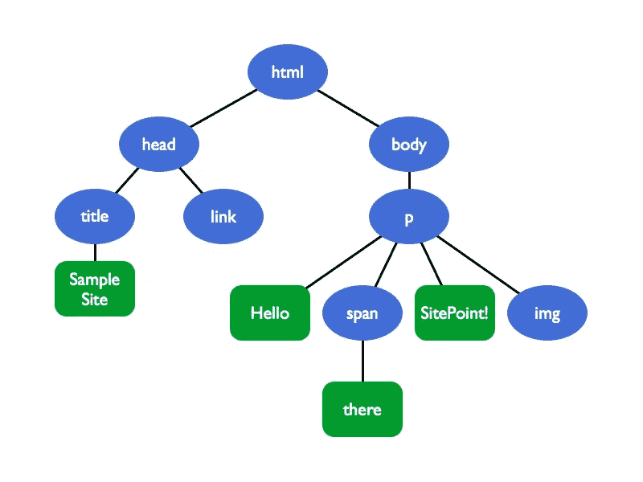
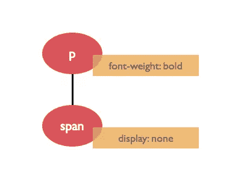
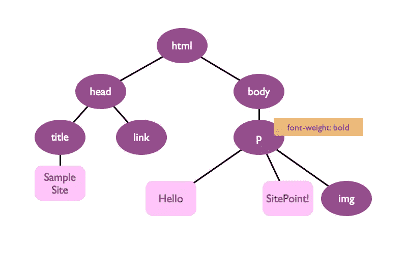
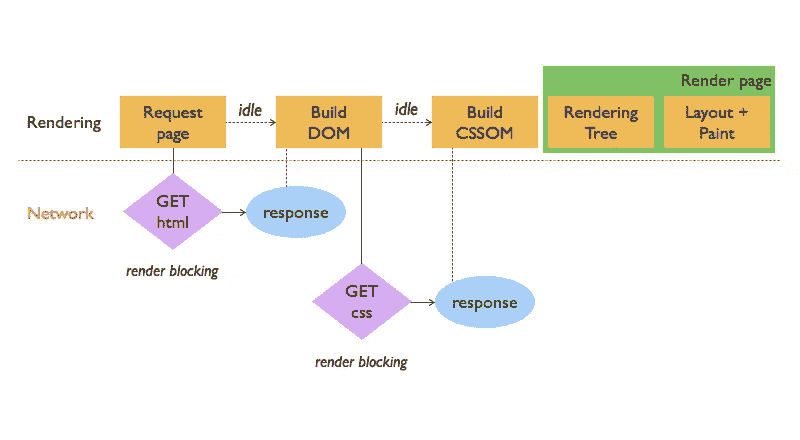
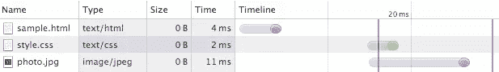
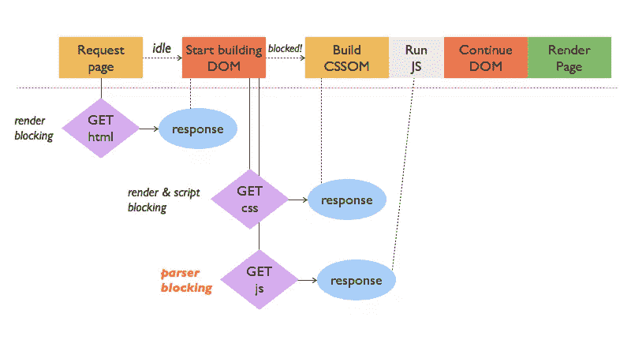

# 优化关键渲染路径

> 原文：<https://www.sitepoint.com/optimizing-critical-rendering-path/>

近年来，网络上出现了两种趋势:

1.  就消耗的带宽和加载的资产(CSS、JS、图像、字体)而言，网页变得越来越大。
2.  使用手机和平板电脑上网的用户比例正在上升。

当然，在家里你有一台网速很快的台式电脑。然而，很多人可能不会用同样的设置来访问你的网站。即使是路上很好的 4G 连接也只是解决了可用带宽的问题。仍然存在网络开销和移动延迟的问题。

这引发了对页面速度和优化的全新思考。如今，如果网页的渲染速度不到一秒钟，谷歌就会给它们更高的排名。这应该是一个最佳的响应时间，考虑到 10ms 被认为是一个即时的反应，3s 让用户昏昏欲睡，10s 是一个永远不再访问你的网站的理由。

但是，如何在不削减功能或显著破坏网站外观的情况下实现这一宏伟目标呢？

这个想法不仅仅是把你的页面放在一个像样的服务器上，尽可能地减少网站的重量，而是优化在浏览器窗口中呈现你的网站的事件链。这个链被称为**关键渲染路径**。

## 从页面加载到页面呈现

谷歌将关键渲染路径定义为浏览器将“渲染网页初始视图所需的代码和资源”转化为屏幕上实际像素的一系列步骤。

这完全改变了页面速度的概念。尽可能快地加载整个页面是不够的。关键的部分是为移动用户提供快速的*可见的*响应，以保证无缝体验。术语 *critical* 在这里很关键，因为并不是你的代码中的所有东西都需要在浏览器窗口中产生。

为了优化关键路径，从而提高页面渲染速度，让我们来看看上面提到的那些步骤，以及它们是如何相互作用的。

## 从空白到内容

想象一个用户访问我们的(公认简单的)网站。输入 URL 后，浏览器向服务器发送请求，最终将得到以下 HTML 作为响应。

```
<!DOCTYPE html>
<html lang="en">
  <head>
    <title>Sample Site</title>
    <link href="style.css" rel="stylesheet">
  </head>
  <body>
    <p>
      Hello <span>there</span> SitePoint!
      
    </p>
  </body>
</html>
```

浏览器将这个代码字节流解析成*文档对象模型*，或者 *DOM* 。DOM 是 HTML 标记的完整树表示:



*注意:*浏览器逐步建立 DOM*。这意味着只要第一批代码进来，它就可以开始解析 HTML，然后根据需要向树结构添加节点。这可以用于一些高级但有效的优化(这超出了本文的范围)。*

 *此时，浏览器窗口仍然是空白的。注意 CSS 文件是如何在`<head>`标签中被引用的。站点的样式对于呈现来说绝对是至关重要的，因此一旦 HTML 解析器到达`<link>`标签就必须下载。

```
p { font-weight: bold; }
p span { display: none; }
```

这个小 CSS 文件然后被解析成 *CSS 对象模型*，或者 *CSSOM* 。



不幸的是，CSSOM 不能像 DOM 一样以增量方式构建。想象一下，如果样式表中有第三行，例如`p { font-weight: normal; }`，它会覆盖第一个`p`声明。这表明我们必须等到所有的 CSS 都被下载和处理之后，才能继续进行渲染。 **CSS 被渲染屏蔽**。

一旦浏览器有了标记和 CSS 的机器可读表示，它就可以构建*呈现树*。这种结构结合了 DOM 和 CSSOM，同时只捕获可见元素:



注意`span`标签不是渲染树的一部分(CSS 被渲染阻塞的另一个原因；只有 CSS 最终告诉浏览器什么应该是渲染树的一部分)。

渲染树很好地展示了我们稍后将在浏览器窗口中看到的内容。实际的像素出现在剩下的两个步骤之后:*布局*和*绘制*。布局步骤处理每个元素相对于当前视口的位置和尺寸的计算。最后，浏览器绘制所有内容并显示完整的呈现页面。

每次改变渲染树(例如通过交互式 JavaScript)或改变视口(可能通过调整浏览器窗口大小或旋转移动设备)，都必须重新运行布局和绘制步骤。

这个简单示例的完整关键渲染路径如下所示:



### 图像呢？

实际上，只有 HTML、CSS 和 JavaScript 被认为是关键资源(也就是说，可能会阻碍页面呈现的资产)。事实证明，图像既不会阻碍 DOM 的构建，也不会阻碍页面的初始呈现。看看我们简单网站的网络时间轴，由 Chrome 的 DevTools 提供:



蓝色竖线标记了`DOMContentLoaded`事件。DOM 一准备好，这个事件就被触发。图像是稍后下载的，这证明图像不会妨碍解析，甚至渲染。但是，它们*确实*阻止了*加载*事件(红色竖线)。此事件表示已下载并处理了请求页面所需的所有资源。也就是说，图像加载当然应该被优化。但是图像在渲染路径方面并不重要。

## 用 JavaScript 增加趣味

JavaScript 是一个强大的工具，对关键路径有着巨大的影响。让我们用一个内联脚本来扩展我们的段落标记:

```
<p>
  Hello <span>there</span>, SitePoint!
  <script> document.write('How are you?');
    var color = elem.style.color;
    elem.style.color = 'red'; </script>
  
</p>
```

甚至这个简单的代码片段也展示了脚本可以查询和更改 DOM 以及 CSSOM。(为了简单起见，假设`elem`持有对页面上某个特定 HTML 元素的引用。)因为 JavaScript 可以向 DOM 添加内容(比如‘你好吗？’文本节点)，解析器必须停止工作，直到脚本完全执行完毕。 **JavaScript 被解析器阻塞**。

上面的第二行 JavaScript 请求元素的颜色。因此，CSSOM 必须在脚本可以运行的之前*出现。 **CSS 因此也被脚本屏蔽**。*

让我们看看当我们去掉内联脚本并用对外部 JavaScript 文件的引用来代替它时，关键的呈现路径是什么样子的:

```
<!DOCTYPE html>
<html lang="en">
  <head>
    <title>Sample Site</title>
    <link href="style.css" rel="stylesheet">
  </head>
  <body>
    <p>
      Hello <span>there</span> SitePoint!
      
    </p>
    <script src="app.js"></script>
  </body>
</html>
```



外部 JavaScript 文件需要额外的请求——内联脚本不需要。此外，不要让流程图欺骗了你:无论哪个文件，CSS 或 JS，首先到达浏览器，CSS 必须首先被解析。一旦 CSSOM 出现，就可以执行脚本内容。只有在那之后，DOM 解析器才被解除阻塞，可以完成它的工作。甚至我们相当简单的网站示例也有一些严重的阻塞和干扰。

既然我们知道了呈现页面需要哪些步骤，以及关键资源(HTML、CSS 和 JavaScript)是如何相互拦截的，我们就可以推导出一些优化措施。

## 优化关键渲染路径的三个步骤

有三个地方可以优化关键的呈现路径，从而优化浏览器为用户生成可视结果的速度。请记住，优化就是仔细的衡量和权衡。不幸的是，从来没有适合所有情况的正确答案。不要犹豫，使用 Chrome DevTools 之类的帮助来看看发生了什么。

### 1.最大限度地减少通过网络传输的字节

这可能是显而易见的，但是你会惊讶有多少网站仍然没有遵循速度优化中最简单的规则:你的网站越小，它的加载和渲染就越快。就这么简单！

*缩小*、*压缩*、*缓存*你的资产以及你的 HTML。没错，HTML 也是*渲染阻塞*。许多构建工具，如 [Grunt](http://gruntjs.com/ "Grunt Homepage") 或 [Gulp](http://gulpjs.com/ "Gulp Homepage") ，都带有缩小/丑陋的插件。这些可以清除代码中的空白、注释等，为文件的生产做准备。

压缩会进一步降低页面负载，而[缓存](https://developers.google.com/web/fundamentals/performance/optimizing-content-efficiency/http-caching "Google's Web Fundamentals on HTTP Caching")则省去了浏览器网络往返服务器的时间。它可以使用缓存的本地副本，而不是在每次页面重新加载时请求每个关键资源。

注意:如果你缩小你的 HTML，你可能会面临内容和样式不能正确显示的风险。例如，如果您使用自然空白来分隔内联块元素，则缩小后空白会消失。所以小心使用 HTML 缩小。

### 2.最小化呈现阻塞 CSS

我们钟爱的风格语言是每一条渲染路径的重要组成部分。记住 CSS 同时阻止了渲染和 JS 执行。毫不奇怪，CSS 的黄金法则是:尽可能快地将 CSS 提供给用户！确保所有的 CSS `link`标签都在 HTML 代码的`head`中，这样浏览器就可以立即发送请求。

另一个策略是通过*媒体查询*降低渲染阻塞 CSS 的数量。假设我们的示例网站有打印样式，也有横向模式设备的特殊规则。您可以利用这些知识将 CSS 分成几个文件，并让浏览器有条件地解析它们。

```
<!DOCTYPE html>
<html lang="en">
  <head>
    <title>Sample Site</title>
    <link href="style.css" rel="stylesheet">
    <link href="print.css" rel="stylesheet" media="print">
    <link href="landscape.css" rel="stylesheet" media="orientation:landscape">
  </head>
  ...
```

原始的 style.css 文件现在应该小得多，并且是唯一始终呈现阻塞的 css 资源。打印样式表仅用于打印，而不用于在浏览器中显示页面。因此，它不会呈现阻塞。第三个 CSS 文件有一个动态媒体查询，它由页面负载决定，并取决于设备的方向是否呈现阻塞。

显然，我们可以使用媒体查询来外包 CSS 代码，这些代码只在特殊情况下才需要。这减少了我们关键的主样式文件的大小，从而减少了浏览器解析它并继续渲染的时间。

*注意:*浏览器仍然会下载所有的样式表，但是这发生在较低的优先级上，并且与呈现过程并行。

最后但并非最不重要的是，你也可以*内联*你的渲染阻塞 CSS 并将其直接放入 HTML 文件。这使浏览器免于网络往返，只留下 HTML 文件(可能还有脚本)来处理。

```
<!DOCTYPE html>
<html lang="en">
  <head>
    <title>Sample Site</title>
    <style> p { font-weight: bold; }
      p span { display: none; } </style>
    <!-- No link tag needed! -->
  </head>
  ...
```

如前所述，这都是关于取舍。上面的技巧可能会降低网络延迟，但是如果必须在许多文件中插入关键的 CSS，可能会增加总负载。

有工具可以帮助你自动完成这项工作。以下是几个选项:

*   [关键路径 CSS 生成器](http://jonassebastianohlsson.com/criticalpathcssgenerator/)，也可以将[作为节点模块或咕哝任务](https://github.com/pocketjoso/penthouse)。
*   [危急](https://github.com/addyosmani/critical)
*   [临界状态](https://github.com/filamentgroup/criticalCSS)

### 3.最小化解析器阻塞 JavaScript

JavaScript 也是如此:如果您需要一些代码行用于初始页面呈现，您可以考虑将它们内联到 HTML 文件中，以节省网络上的往返行程。

在最佳情况下，为了页面的初始呈现，您将 JavaScript 全部放在一起。如果这是不可能的，尝试推迟 JavaScript 的执行，并推迟到加载事件。

此外，仔细检查你的脚本或第三方插件。如果它们不以任何方式与 DOM 和 CSSOM 交互，很有可能你可以异步加载它们*，或者简称为*异步*。实现这一点很容易:*

```
...
    <script src="app.js" async></script>
  </body>
</html>
```

通过这样做，您只是告诉浏览器不要在 HTML 文档中引用脚本的确切位置执行脚本。这将允许浏览器继续构建 DOM，并在 DOM 准备好时执行脚本。想象 app.js 只包含谷歌分析和几个社交媒体功能的设置代码。如果代码保持 DOM 和 CSSOM 不变，那么它是成为异步的完美候选，从而解除解析障碍。

## 结论

关于这件作品的大部分研究来自几个不同的来源:

*   谷歌优秀的[网络基础](https://developers.google.com/web/fundamentals/https://developers.google.com/web/fundamentals/)文档，尤其是关于[关键渲染路径](https://developers.google.com/web/fundamentals/performance/critical-rendering-path/)的部分。
*   Udacity 的[网站性能优化](https://www.udacity.com/course/ud884)课程。
*   伊利亚·格里戈利克的免费在线书籍[高性能浏览器网络](http://chimera.labs.oreilly.com/books/1230000000545/)

因此，请务必查看这些资源，以了解上述内容的更多细节。

对于本文的总结，下面是 TL；博士:

*   页面速度的概念已经从简单的页面加载转变为页面渲染
*   关键渲染路径包括将关键资源转化为可见浏览器输出的所有步骤:DOM 和 CSSOM、JavaScript、渲染树、布局和绘制阶段
*   HTML 呈现阻塞，但是 DOM 可以增量构建
*   CSS 是渲染和脚本阻塞，小心对待它，并使用内联样式或媒体查询优化它
*   JS 是解析器阻塞的，在初始页面加载时少用它，推迟执行或者尝试异步加载
*   不要忘记大小仍然很重要，缩小，压缩，缓存

不要害怕使用像 [Chrome DevTools](https://developer.chrome.com/devtools "Chrome DevTools Overview") 、 [PageSpeed Insights](https://developers.google.com/speed/pagespeed/insights/ "Google's Web Analytics Tool 'PageSpeed Insights'") 或 [WebPagetest](http://www.webpagetest.org/ "WebPagetest Homepage") 这样的工具，在你的网站显示出来之前找出正在发生的事情。

网站的页面渲染速度对于通常不会耐心对待您的页面的访问者来说至关重要。当你最大限度地优化你的网站性能时，请记住这一点。它确实是值得的！* 

## *分享这篇文章**