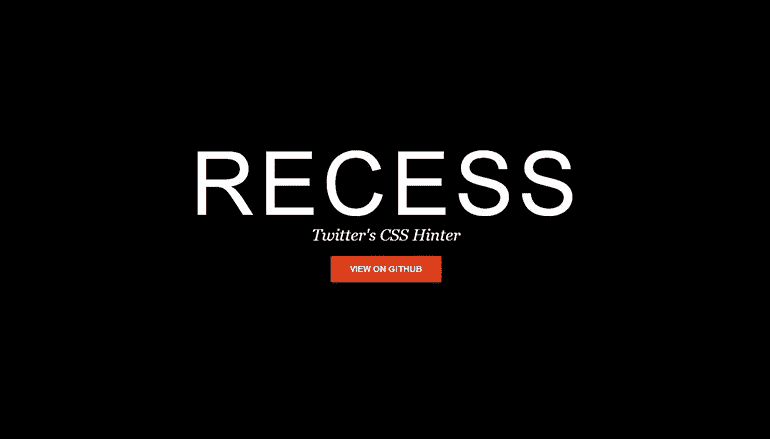
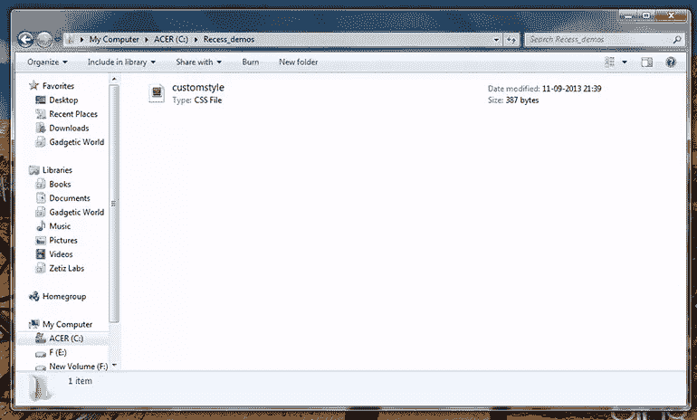
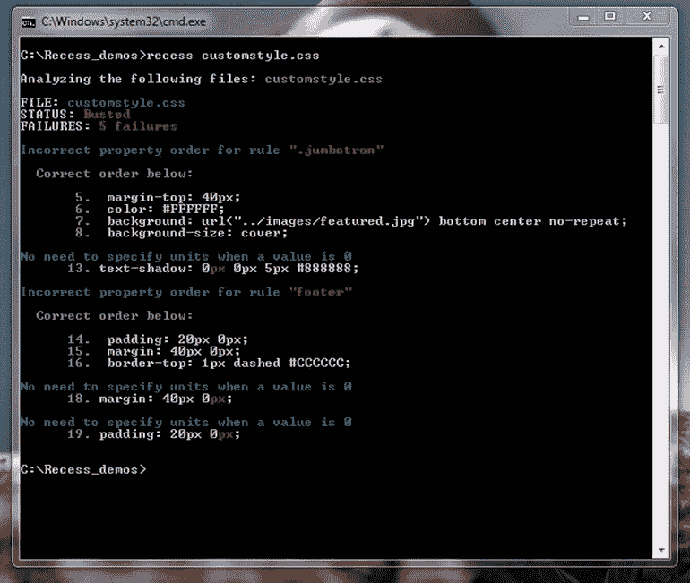

# 用凹槽优化 CSS 样式表

> 原文：<https://www.sitepoint.com/optimizing-css-stylesheets-recess/>



有时，看到一个真正伟大的工具由于缺乏知名度和良好的推广而未能引起人们的注意，真的令人失望。我说的这个工具是由 Twitter 开发人员开发的 CSS 和 LESS 编译器。它于 2013 年初推出，是今年最被忽视的工具之一。

## 什么是休会？

recession 是一个开源工具，构建在 LESS 上，可以极大地用于优化您的 CSS 代码。它拥有 web 开发人员梦寐以求的一些最强大的功能。Twitter 称它为“CSS Hinter ”,但我更愿意认为它是“CSS 编译器”。在本教程中，我将展示如何开始使用休会，并探索它的一些最好的功能。

建立休会是为了检查 CSS 规则的质量。它有助于保持 CSS 代码的整洁、无错误和易管理。它也可以直接集成到您的项目中，以便在发生任何变化时编译样式表。

让我们开始使用它。

## 开始休息

你需要运行的第一件事是 Node.js。去[nodejs.org/download/](http://nodejs.org/download/)为你的操作系统选择最好的安装程序。按照说明操作(如果需要)。一旦 Node.js 安装到您的系统上，您就可以使用下面的命令对它进行交叉检查。

```
node [press enter]
1+1 [press enter]
```

如果您在第三行看到正确的结果(很明显，应该是 2 ),那么 Nodejs 已经启动并运行了！呜…；)按两次 **ctrl+c** 退出节点环境。

现在我们必须从 Nodejs 存储库中安装 recession 包。在命令提示符下输入以下行。

```
npm install recess -g
```

你会看到一个类似于*黑客帝国*电影中的场景，最后还会安装 RECESS。太棒了。让我们交叉检查凹槽安装。

只需在命令提示符下键入`recess`并按下**回车**。您将会看到一个帮助指南，显示可以与`recess`命令一起使用的各种选项。

## 编写您的第一个休会命令

让我们从分析一些之前创建的 CSS 文件开始。我已经为休会创建了一个新的工作空间:`C drive > Recess_demos folder`，然后从我之前的项目中复制了一个 CSS 文件。



在命令提示符下导航到工作区，然后键入

```
recess [filename] [press enter]
```

对我来说，是`recess customstyle.css`。如下图截图所示，它告诉我我的 CSS 文件有五处失败，后面是失败的原因。



这样，在设计任何项目时，您都可以在样式表中看到警告。

## 编译 CSS 文件

当你使用 recession 编译一个 CSS 文件时，它会使用[严格的属性规则](https://github.com/twitter/recess/blob/master/lib/lint/strict-property-order.js#L36)自动修正，然后记录修正后的样式。

例如，让我们创建一个名为`demostyle_1.css`的简单 CSS 文件，其中包含以下规则:

```
.jumbotron{
	margin-top: 40px;
	background: url("img/featured.jpg") bottom center no-repeat;
	background-size: cover;
	color: #FFFFFF;
}
```

现在，在命令提示符中键入以下内容。

```
recess demostyle_1.css --compile
```

它会自动更正并给出以下输出。

```
.jumbotron {
  margin-top: 40px;
  color: #FFFFFF;
  background: url("img/featured.jpg") bottom center no-repeat;
  background-size: cover;
}
```

现在，如果您正在考虑如何将输出强制记录到一个新文件中，而不是命令提示符中，那么请编写如下命令。

```
recess [path to old file] --compile > [path to new file]
```

在我的例子中，命令是:`recess demostyle_1.css --compile > demostyle_1_compiled.css`。这在同一个文件夹中创建了一个名为`demostyle_1_compiled.css`的新文件，其中包含了已更正的规则。

让我们尝试更多的 CSS 规则:

输入:

```
.avatar img{
  -ms-box-shadow: inset 0 1px 5px rgba(0, 0, 0, 0.2);
  -webkit-box-shadow: inset 0 1px 5px rgba(0, 0, 0, 0.2);
  -moz-box-shadow: inset 0 1px 5px rgba(0, 0, 0, 0.2);
  box-shadow: inset 0 1px 5px rgba(0, 0, 0, 0.2);
  -o-box-shadow: inset 0 1px 5px rgba(0, 0, 0, 0.2);
}
```

输出:

```
.avatar img {
  -webkit-box-shadow: inset 0 1px 5px rgba(0, 0, 0, 0.2);
     -moz-box-shadow: inset 0 1px 5px rgba(0, 0, 0, 0.2);
      -ms-box-shadow: inset 0 1px 5px rgba(0, 0, 0, 0.2);
       -o-box-shadow: inset 0 1px 5px rgba(0, 0, 0, 0.2);
          box-shadow: inset 0 1px 5px rgba(0, 0, 0, 0.2);
}
```

是不是很牛逼？

## 编译较少的文件

recession 不仅仅局限于 CSS 文件。您也可以随时编译更少的文件。

让我们创建一个虚拟的`.less`文件，其中包含以下内容。

```
@base: #f938ab;

.box-shadow(@style, @c) when (iscolor(@c)) {
  -webkit-box-shadow: @style @c;
  -moz-box-shadow:    @style @c;
  box-shadow:         @style @c;
}
.box-shadow(@style, @alpha: 50%) when (isnumber(@alpha)) {
  .box-shadow(@style, rgba(0, 0, 0, @alpha));
}
.box { 
  color: saturate(@base, 5%);
  border-color: lighten(@base, 30%);
  div { .box-shadow(0 0 5px, 30%) }
}
```

在 recession 中编译 LESS 文件类似于在 LESS 编译器中编译它们。只是打字

```
recess [path to less file] --compile
```

我的情况，原来是`recess dummy_less.less --compile`。

输出:

```
.box {
  color: #fe33ac;
  border-color: #fdcdea;
}

.box div {
  -webkit-box-shadow: 0 0 5px rgba(0, 0, 0, 0.3);
     -moz-box-shadow: 0 0 5px rgba(0, 0, 0, 0.3);
          box-shadow: 0 0 5px rgba(0, 0, 0, 0.3);
}
```

## 休会规则

在编译 CSS 或更少的文件时，有许多规则需要遵循。默认情况下，这些规则是打开的，可以单独取消。

1.  `noIDs`
    1.  用法:`recess filename.css --noIDs true`。
    2.  这将显示一个警告“IDs 不应该被样式化”。当您想忽略此规则时，可以将其设置为`false`
2.  `noJSPrefix`
    1.  用法:`recess filename.css --noJSPrefix true`。
    2.  将它设置为`true`将会在您尝试样式化`.js-*`类时生成一个警告。
3.  `noOverqualifying`
    1.  用法:`recess filename.css --noOverqualifying true`
    2.  忽略`div#foo.bar`类型的造型。
4.  `noUnderscores`
    1.  用法: `recess filename.css --noUnderscores true`
    2.  在类名中使用下划线时发出警告
5.  `noUniversalSelectors`
    1.  用法:`recess filename.css --noUniversalSelectors true`
    2.  当您尝试使用通用选择器`*`进行造型时发出警告
6.  `zeroUnits`
    1.  用法:`recess filename.css --zeroUnits true`
    2.  当您向零属性值提供单位时发出警告。
7.  `strictPropertyOrder`
    1.  用法:`recess filename.css --strictPropertyOrder true`
    2.  检查严格的属性规则[，如这里指定的](https://github.com/twitter/recess/blob/master/lib/lint/strict-property-order.js#L36)。

## 压缩或缩小 CSS 或更少的文件

休会甚至可以帮助您压缩或缩小大样式表在几秒钟内。这是该工具附带的便利特性之一。使用以下命令来完成此操作:

```
recess filename.css --compress
```

## 结论

如今，干净简单的代码在每个项目中都非常重要。任何有助于我们实现这一目标的工具都应该受到欢迎和探索。我希望你能像我一样，在你的下一个项目中尝试休庭。希望你喜欢了解这个伟大的工具，让我们希望在不久的将来看到这个工具的更多更新。

请在下面评论，让我知道你对这个话题的建议。如果你找到比这个更好的工具，你也可以提个建议:我们也很乐意去探索。

如果你想了解更多关于 Node.js 的知识，你可以通过阅读 [Jump Start Node.js](https://learnable.com/books/jump-start-node-js) 来实现，这是一本由[唐阮](https://learnable.com/users/donnyguyen)写的可学的书。你也可以参加 LESS 课程的[发布会，用 LESS 加速你的 CSS 开发。](https://learnable.com/courses/launch-into-less-2764)

## 分享这篇文章