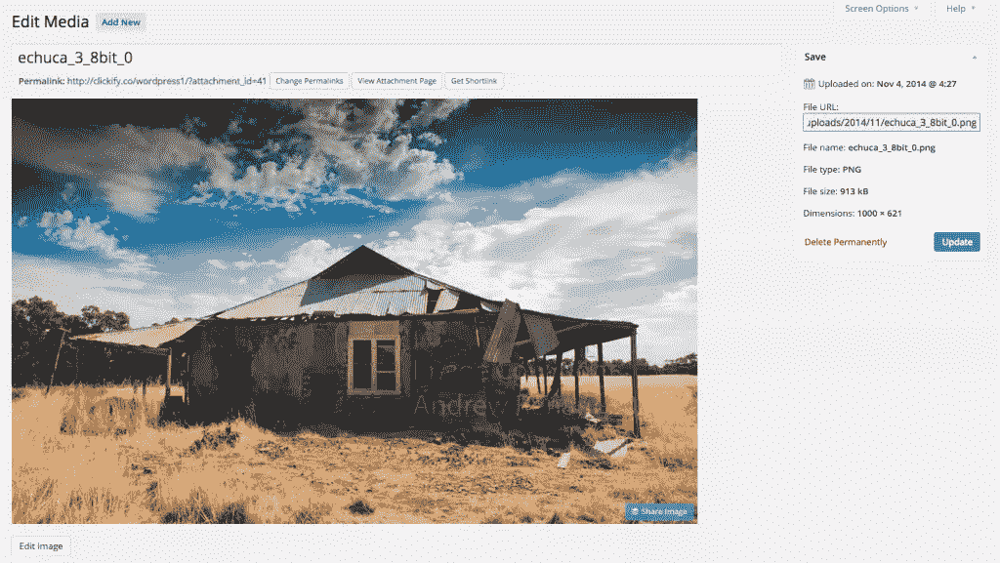
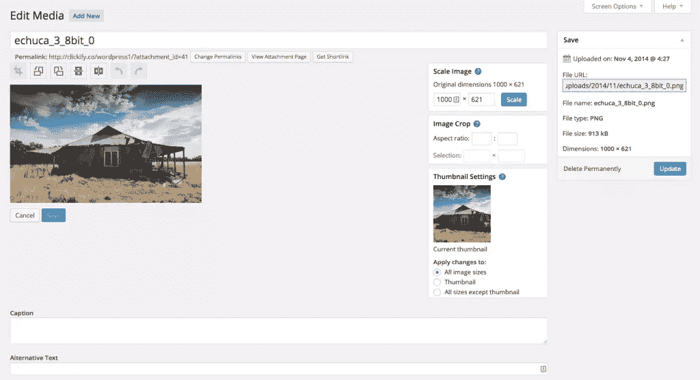
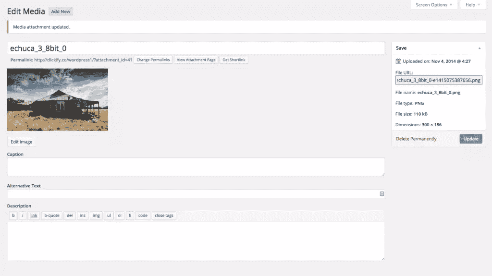
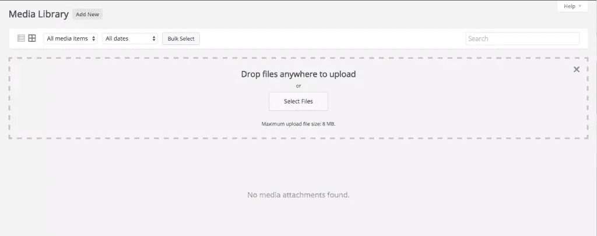

# 为 WordPress 优化你的图片

> 原文：<https://www.sitepoint.com/optimizing-your-images-for-wordpress/>

从前，大约 20 年前，有马赛克。正如我们今天所知，Mosaic 通常被认为是万维网的创始人。这是第一款允许图片与文本一起显示的浏览器，而不是为每张图片提供一个单独的弹出窗口。虽然它不是第一个图形浏览器，但它受到了更广泛的公众欢迎。

那时，256 色的彩色屏幕相对较新，我们都是拨号上网，目的是让你的图像下载，仅此而已。他们看起来如何是次要的。

快进到今天，一切都变了。随着人们购买分辨率越来越高的屏幕，我们需要让我们的图像看起来更棒。另一方面，谷歌希望你的网页能在一秒钟内载入，即使是在移动设备上。那么，如何让你的图片看起来更好，加载更快呢？在这篇文章中，我们将介绍优化 WordPress 图片的基础知识。

## 真的需要图像吗？

当然，你应该问的第一个问题是，当文本、符号和简单的徽标可以被 web 字体和其他 CSS 效果所取代时，你真的需要一个图像吗？从图像创建的任何文本元素，如横幅和按钮，都应该替换为非图像格式。但是，如果您需要使用图像，请继续阅读。

## 光栅与矢量

光栅图像由固定数量的像素网格组成。它们不能很好地缩放，当网格图案变得可见时，放大图像会导致锯齿和像素化。在数码相机和 Adobe Photoshop 等程序中创建的图像是光栅图像。图像质量设置将决定保存文件的大小。对于高端单反相机，这可能高达 7360 x 4912 像素；这种图像的大小将大大超过 36MB。很明显，这比 WordPress 所需要的要大得多。

另一方面，矢量图像是用数学方法构建的。它们尤其适用于简单的图像，如徽标、文本、图标等。它们是数学上的，当它们被放大或调整大小时，浏览器重新计算数学，图像将保持清晰。

这种图像是在 Adobe Illustrator 等程序中创建的，并以 SVG(可缩放矢量图形)格式保存以供网络使用。然而，尽管 WordPress 由于安全问题拒绝 SVG 格式(理论上一个 SVG 文件可能包含恶意代码),但是有一些插件允许你克服这个限制。尽管如此，允许 SVG 文件应该仅限于管理员级别的用户。另一个考虑是，大多数浏览器只提供对该格式的部分支持，所以保持在 1.1 标准内。如果您使用这种格式，请考虑“缩小”图像，去掉任何不必要的元数据。

## JPEG、GIF 或 PNG？

现代浏览器支持一系列光栅图像格式；JPEG/JPG 是最流行的。还有支持 256 色的 GIF，常用于广告。PNG (Adobe 的可移植网络图形)克服了 JPEG 和 GIF 格式的许多限制，本应成为标准的网络图像格式，但却有着混合的牵引力。

每种格式都有优缺点。对于小文件来说，JPEG 可以被压缩到很高的程度，如果尺寸适中，它们看起来会更好。JPEG 使用类似于 MP3 音频文件的有损压缩格式。在压缩过程中，信息被丢弃并且无法恢复。高度压缩的 JPEGs 有高度伪像的缺点(在大面积平坦的颜色区域中有斑点和斑点，以及模糊的边缘)。他们也缺乏支持透明性的能力。这意味着任何剪切区域将默认为白色，所以除非你的页面背景也是白色的，否则图像将在一个白盒中。

gif 非常适合创建文本和颜色有限的简单图形图像——因此它们被用于横幅广告。它们很容易制作动画，但是它们同样不支持透明，所以你创建的图像背景必须与页面颜色相匹配。

PNG 格式将产生最高质量的图像，因为它是一种无损压缩格式。然而，PNG 图像很少能被压缩到与同等的 JPEG 一样小。该格式支持透明，因此剪切区域后面的内容都是可见的。

如需进一步阅读，请查看 James George 在 [SitePoint 上发表的这篇文章，其中讨论了 JPEG、GIF 和 PNG 之间的区别。](https://www.sitepoint.com/gif-jpg-png-whats-difference/)

尽管处理光栅图像的最佳工具是 Adobe Photoshop，但还有很多其他工具，比如一个免费程序， [GIMP](http://www.gimp.org/) 。您也可以使用在线服务来调整光栅图像的大小和压缩光栅图像。

以下步骤基于 Photoshop CC。

### 调整图像大小

当处理来自相机的光栅图像时，首先要做的是减少像素尺寸。这是通过“图像”和“图像尺寸”菜单实现的。请记住“限制纵横比”并更改其中一个尺寸以保留原始形状。

尺寸应该与页面的 HTML/CSS 代码中给出的尺寸相匹配。增大尺寸没有什么好处，因为浏览器在呈现页面时会调整图像的大小；这将降低响应时间。

进一步的考虑是位深度的减少。更好的相机现在允许每通道 14 位的原始处理。摄影师通常以 16 或 32 位模式处理原始图像，以保持最佳质量，直到需要最终输出。这相当于一个巨大的色彩范围，不会在大多数屏幕的 sRGB 色彩空间中再现。如果图像不是这种 8 位格式，通过选择“图像”和“模式”，然后选择“8 位/通道”，将图像减少到 8 位/通道模式。这将立即大幅减小文件大小。

虽然我建议在上传图片到 WordPress 之前调整图片大小，但是你可以使用 WordPress 媒体库来编辑图片的尺寸。例如，下图为 1000 x 621。如果我只想要 300 x 186 的图像，我只需点击下面的“编辑图像”按钮。

这将打开一个窗口，其中有一系列用于编辑图像的选项。

然后，我用“300”更新“缩放图像”字段，它将自动预测“186”像素，然后单击“缩放”查看图像尺寸缩小，然后“更新”保存这些设置。

您现在可以看到，图像的新尺寸保存为 300 x 186，文件大小也从 913KB 减小到 110KB。

### “另存为”与“保存为 Web 格式”

理想情况下，您的摄影图像将作为原始文件保存在相机中，并以 16 位模式处理为 TIFF 格式。一旦你调整了图像的大小并减少了位的深度，你将面临最终文件格式和文件大小的选择。

正如你在上面看到的，WordPress 媒体库文件上传器有一个默认的文件大小限制。这比你想把一张图片放到一个帖子甚至一个横幅上要大得多。抛开限制不谈，你应该让你的图片尽可能的小。

事实上， [WordPress Codex](http://codex.wordpress.org/Image_Size_and_Quality) 建议大的高质量图像最好在 60-100KB 左右，而小的图像最好在 30KB 以下。

“另存为”只能完成部分工作。如果你不使用 Photoshop，大多数编辑器会提供一些基本选项，文件类型，如果是 JPEG，质量和大小选项。你需要做一些实验，看看什么样的设置组合能在尺寸和质量之间取得令人满意的平衡。

另一方面，“保存为 Web 格式”将为您提供广泛的选项和潜在结果的预览。除了减小位深度，您还可以在“存储为 Web 所用格式”对话框中调整图像的大小。这些控件非常简单明了。

我倾向于选择“渐进”选项，这样慢速连接的人至少会看到图像开始出现。你还应该确保“转换为 sRGB”被选中，这样你就可以预览任何意想不到的颜色变化。

在 JPEG 模式下调整图像的大小和压缩时，您应该注意预览图像下方的潜在文件大小，但请仔细观察图像，以确保伪像不会变得太明显。尽管某些版本的 Photoshop 会警告文件太大，但它仍然会处理图像。

请记住始终使用文件的副本。每次你将图像保存为 JPEG 格式，你就丢弃了无法恢复的图像信息。

## 如何处理已经在你的 WordPress 网站上使用的图片

如果你正在阅读这篇文章，但不确定该如何处理你网站上已经有的成百上千的图片，那么一切都还没有失去。

第一步是运行页面速度测试，尝试找出任何问题。有很多工具可以帮助你，你可以从 SitePoint 上的这篇文章[中找到更多关于加速你的 WordPress 站点](https://www.sitepoint.com/speed-wordpress/)的信息。本文还回顾了缓存插件和内容交付网络(cdn)的好处，如果您的网站图片过多，这些也值得研究。

还有一系列方便的 WordPress 批量图像压缩插件值得一试(值得注意的是，大多数插件将只适用于媒体库文件)。以下是几个例子:

*   [EWWWW 图像优化器](https://wordpress.org/plugins/ewww-image-optimizer/)
*   [WP Smush.it](https://wordpress.org/plugins/wp-smushit/)
*   [精神不健全](https://wordpress.org/plugins/imsanity/)

## 摘要

总结一下，这里有一个快速的清单，列出了在优化你的 WordPress 网站图片时需要考虑的事情:

*   你需要一个可以使用 HTML5/CSS3、Web 字体/符号的图片吗？
*   可以用矢量图像代替光栅图像吗？
*   考虑最合适的光栅图像格式:gif 是最小的，但仅限于 256 色，不缩放，不支持透明；JPEGs 压缩到小尺寸，不缩放，不支持透明；PNG 图像保留了最好的图像质量，支持透明，但不会压缩到相同的程度，也不会缩放。
*   在压缩阶段之前，使用最高的位深度和全像素尺寸。
*   如果使用 Photoshop，请使用“保存为 Web 格式”选项，而不是简单的“另存为”。
*   以一致的方式工作并记下您的设置，一旦您开发了一致的工作流程，图像优化就可以成为一个快速而简单的过程，这将导致快速的页面加载。

## 分享这篇文章