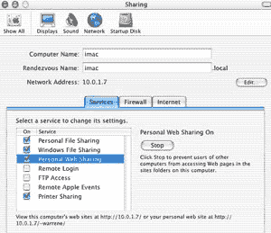

# 为 Web 开发配置 OS X 文章

> 原文：<https://www.sitepoint.com/os-x-web-development/>

在之前的一篇文章中，我们展示了在 Web 开发中使用 OS X 的框架。世界上有超过 60%的 Web 服务器运行 Apache，拥有相同的本地、数据库驱动的开发环境可以加速 Web 开发、设计和测试。在这篇文章中，我们将着手为本地主机 Web 开发配置一个 OS X 系统。

##### 入门指南

默认的 OS X 安装包括启动和运行基本 Web 服务器所需的大部分内容。因为我们之前讨论了 LAMP，或者 Linux、Apache、MySQL 和 Perl/PHP 平台，所以这是我们将在这里讨论的基本配置。我还将在本文末尾包含关于安装 Python 的信息的链接，因为这是一种日益发展和流行的 Web 脚本语言，以及一些关于使用 CVS 的注意事项。

##### 街头流氓

您的 OS X 系统在某种程度上是预配置的，可以运行预安装和预配置了 Apache 的静态网站。主网站文档根目录，可通过 http://127.0.0.1(或 http://localhost；您可以在/Library/WebServer/Documents/中找到。由于 Apache 能够协商本地化内容，即以不同的语言提供相同的页面，您将在这里找到许多索引文件。如果你要专注于一种语言，你可以删除这些文件。

此外，默认情况下，OS X 上的每个用户都可以使用他们的简称，即 http://127.0.0.1/~shortname(即 Blane Warrene 使用简称 bwarrene)，从他们的主目录提供网页。这些本地站点的内容应该放在本地用户主目录(/Users/shortname/Sites/)中的现有站点文件夹中。

要浏览这些网站，您需要启动 Apache Web 服务器，只需在系统首选项菜单中选择共享并打开个人 Web 共享即可。如果您更喜欢在本地 FTP 您的内容，而不是将文件拷贝到目录中，您也应该在此偏好设置面板中打开 FTP 访问。



*OS X 提示上的阿帕奇*

与 Linux 上的 Apache 一样，可以添加额外的模块或服务，或者重新编译 Apache。这些操作通常要求您重新启动 Apache。您可以返回到“系统首选项”菜单，选择“共享”窗格，然后简单地停止和启动个人 Web 共享来重新启动 Apache。

如果您需要一次开发多个本地站点，您可以很容易地在主文件夹的站点目录中为每个项目建立一个文件夹。然后，您可以使用 http://localhost/～short name/project 1、http://localhost/～short name/project 2 等通过浏览器访问这些文件进行测试。

您可以对 Apache 进行定制配置，以使用定制的 URL，比如 http://project1 或 http://project2，同时对您系统上的 httpd.conf(位于/etc/httpd/httpd.conf)和 Hosts 文件(位于/etc/hosts/中)进行编辑。下面的基本示例显示了两个站点。

使用 Vi 或您喜欢的文本编辑器，编辑 httpd.conf 文件，如下所示:

*   取消 NameVirtualHost 行的注释，将*替换为 127.0.0.1
*   Add two virtual host containers:

    `<VirtualHost project1>
    ServerName project1
    DocumentRoot /Users/shortname/Sites/project1
    </VirtualHost>  `

    `<VirtualHost project2>
    ServerName project2
    DocumentRoot /Users/shortname/Sites/project2
    </VirtualHost>`

保存并关闭 httpd.conf 文件。这需要 Apache 重启，重启是在共享窗格下的系统偏好菜单中完成的。

最后，为了确保我们在本地解析，我们将编辑您的本地主机文件。使用终端实用程序，发出以下命令:

```
sudo vi /etc/hosts 
```

输入管理员密码后，按 I 进入插入模式，将光标移动到文件的末尾，并添加以下行:

```
127.0.0.1    project1 

127.0.0.1    project2
```

然后按 esc 键，键入`:wq`，按回车键。

您的配置已完成！您应该能够在您的 Web 浏览器中访问这些独立的网站，网址为 http://project1 和 http://project2。当你第一次浏览这些目录时，记得在其中放一些内容！

***关于阿帕奇*T3 的一些最终说明**

您可以利用许多特性为您的生产 Apache Web 服务器创建一个镜像测试环境。花些时间仔细阅读 httpd.conf 文件，它包含了大量的文档，可以帮助您启用服务器端包含等特性。

此外，虽然我们在本文中专门讨论了将 OS X 设置为本地主机 Web 服务器，但是您应该注意到，只需几个步骤，就可以将网站从您的工作站直接连接到互联网，以进行协作或测试活动。这个难题有两个部分，假设你有一个静态 IP 地址和一个宽带连接。

如果您喜欢使用完全合格的域名或子域(即 test.domain.com)，您需要确保 DNS 服务指向您本地工作站上的静态 IP 地址。

您需要进入“系统偏好设置”，选择“共享”面板，并确保此屏幕的“网络地址”部分正确填写了可公开访问的 IP 地址。然后停止并启动个人 Web 共享来重新启动 Apache。

**Go to page:** [1](https://sitepoint.com/os-x-web-development) | [2](https://sitepoint.com/os-x-web-development-2/)

## 分享这篇文章