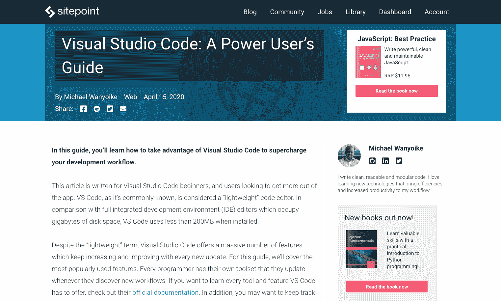

# 为什么我们把一个有 20 年历史的网站搬到盖茨比

> 原文：<https://www.sitepoint.com/our-gatsby-redesign/>

我们知道我们有一个问题。

2019 年，SitePoint 在移动设备上的灯塔速度得分低于 10 分，在桌面上的得分在 20 到 30 分之间。

我们控制 UX 膨胀的努力失败了，因为出版业务环境出现了新的漏洞，就在我们暂时堵住最后一个漏洞的时候。我们对广告的依赖，由外部团体控制，是提高网站性能的主要障碍。我们的流量增长已经转为下降。

在一个为人们提供学习用最佳实践编码的地方的网站上，这看起来并不好。这也不是一个值得我们骄傲的网站。

更糟糕的是，运营瓶颈的出现使得适应成为一项棘手的后勤业务。我们的团队正在努力改变网站:几年来一直专注于我们的优质体验，我们只剩下一个有 WordPress 和 PHP 经验的开发人员。为了测试代码变更，团队必须排队等待访问我们的临时服务器。

这对任何人都没有激励作用，当然也没有效率。

是时候做出一些改变了，我们开始寻找解决方案。经过大量研究，我们认为盖茨比非常适合我们的团队。这将发挥我们的人才优势，帮助我们解决我们发现的所有问题，并允许我们继续使用 WordPress 作为后端，这样编辑过程就不需要改变。

## 为什么我们搬到盖茨比



最终结果。

在研究过程的早期，盖茨比开始看起来像一个严肃的领先者。SitePoint 不是一个小网站，所以我们知道我们选择的技术必须能够处理一些非常激烈的需求。盖茨比检查了我们所有的箱子:

*   我们可以在 [React](https://reactjs.org/) 中编写所有代码，这是前端团队的每个成员都知道并每天使用的技术。
*   Gatsby 的核心是超快的——性能是这个项目的核心，我们可以从一个良好的基础开始。
*   整个网站呈现为静态，这将是搜索引擎优化的伟大。
*   我们可以将它作为一个新项目来构建，这意味着不用担心现有的代码库，现有的代码库会带来大量的遗留代码。
*   我们可以使用 Gatsby Cloud，允许团队在任何时候通过将分支推送到 GitHub 来获得关于构建的反馈。
*   对 WordPress 的 DDoS 攻击不会给我们带来问题，因为前端是完全独立的。

## 使用`styled-components`更易维护的 CSS

因为我们打算从头开始重建网站，所以我们计划同时做一些设计上的改变。为了帮助这项工作，我们决定使用[样式组件](https://styled-components.com/)。

styled-components 使站点的样式易于维护，并且我们知道当我们想改变某个东西的样式时应该去哪里——样式总是和组件在一起。

## 我们是如何建造的

我们开始遵循 Gatsby 的基本文档，并使用`gatsby-source-wordpress`插件提交我们的帖子。

这对我们来说是一个巨大的初始测试:我们必须看看是否有可能在我们的网站上使用 Gatsby。

经过 20 年的博客生涯，我们已经发布了超过 17，000 篇帖子。我们知道构建需要很长时间，但我们必须弄清楚盖茨比是否能处理如此大量的内容。你可能已经猜到了，测试带来了好消息:盖茨比成功了。

给其他大型网站团队的一个小提示:为了让开发成为更好的体验，我们使用环境变量来防止 Gatsby 在开发中抓取网站的所有帖子。没有什么比 60 分钟的热装更能减缓进度了。

```
if (hasNextPage && process.env.NODE_ENV != "development") {
  return fetchPosts({ first: 100, after: endCursor });
} 
```

从这一点来看，我们遇到了一些 WordPress 源代码插件的限制。我们无法获得我们需要的所有数据，所以我们转向了 [WordPress GraphQL 插件](https://github.com/wp-graphql/wp-graphql)。

我们使用 Yoast 来为 SEO 设置元数据，并且必须确保我们获取了正确的信息。我们可以用 WordPress GraphQL 做到这一点。通过这样做，内容团队仍然可以用同样的方式编辑元数据，并且数据仍然是动态的，并且在每次构建时都会被获取。

在构建过程中，我们的团队中会有三到四个人负责新博客的部分工作。在过去，如果他们想得到反馈，他们必须推到我们的临时服务器，并确保没有人已经在使用它。

我们发现盖茨比云是这个问题的一个很好的解决方案。现在，当有人推送 GitHub 中的一个分支时，它会在 Gatsby Cloud 中创建一个 build，并附带一个预览链接。我们的开发人员可以共享这个链接，并获得比以前更有效的即时测试和反馈。

这种更快的反馈周期使得团队中的多人一起工作变得容易，并且结束了一个主要的瓶颈。

## 发布日乐趣

在重要的一天，我们推出了新网站，并通过了我们的初步测试。新博客正在飞速发展——每一次页面加载都感觉很快。

我们在 SitePoint Premium 上遇到了一些问题，它开始变慢甚至崩溃。罪魁祸首是博客页面上的一个新元素，它吸引了人们当前正在阅读的热门书籍。它将通过客户端 API 调用来实现这一点，由于我们在博客端获得的流量太大，Premium 无法处理。

我们很快在 API 中添加了一些页面缓存来暂时解决这个问题。我们意识到我们这样做是错误的——我们应该在构建时获取这些数据，这样当我们将页面提供给用户时，已经加载了流行的书籍。

这是您在使用 Gatsby 时需要进行的主要思维转变:您可以在构建时获得的任何数据都应该在构建时获取。当您需要实时数据时，您应该只使用客户端 API 调用。

一旦我们在构建期间重写了 API 调用，博客页面的第一次加载甚至更快了 Premium 停止崩溃。

## 我们仍然需要解决的是

虽然很难夸大我们今天的现场体验有多好，但仍有一些棘手问题需要我们解决。

如果发布了一篇新文章，或者更新了内容——因为每天都有多次更新——我们需要在这些变化出现之前重新运行 Gatsby 构建。

我们现在的解决方案是一个简单的 cron 作业，它在一天中预先安排的时间运行。对此的长期解决方案是在 WordPress 发布和更新按钮上添加一个 webhook，这样一旦按下就会触发一个新的构建。

我们还需要运行增量构建。现在，整个网站每次都需要重建，考虑到我们的内容存档，这可能需要一段时间。Gatsby 在我们上线时引入了增量构建，我们正在我们的网站上实现它。一旦设置好了，如果唯一改变的是内容，我们的构建将会快得多。

我们的速度分数仍然没有达到我们想要的水平。虽然该网站主观上感觉非常快，但我们仍然没有在 Lighthouse 中获得一致的分数。我们希望移动和桌面都进入绿色区域(90 分以上)，以获得最佳的用户体验和搜索引擎优化。

## 我们会再做一次吗？

这种类型的发布通常会是一件非常伤脑筋的事情，并且在发布当天需要团队做很多工作。

有了盖茨比，我们的启动真的很容易。我们只需要把 WordPress 转移到一个新的领域，让 sitepoint.com 指向这个网站的盖茨比版本。

然后我们坐下来，看着数字，看看我们的交通发生了什么变化。几天之内，数据开始出现，我们看到流量增加了 15%。用户参与度指标全面上升。

不难理解为什么效果如此立竿见影。我们有更好的在静态 HTML 和 CSS 页面上运行的 SEO，并且通过转移到 Gatsby 可以实现大规模的速度提升。

自从我们采取行动以来，我们已经将 Lighthouse 的移动速度分数从 6-15 分提高到 50-60 分，将桌面速度分数从 30 分提高到 70 分。我们希望确保速度在这一变化中仍然是最重要的，所以我们使用了一个名为 [Calibre](https://calibreapp.com/) 的伟大工具，该工具每天对一些顶级页面进行速度测试，并提醒我们分数。我们正在使用这个工具来继续提高我们的分数，所以我希望在三个月内，当我们把一切都保持在 90+的范围内时，再给你一篇文章。

团队喜欢在盖茨比工作。博客代码库是没人想做的东西。现在，由于出色的开发者体验，每个人都想拿到这些卡。

如果你一直在考虑搬到盖茨比，想知道它是否已经准备好了，接受我们的建议——这是值得的。

## 分享这篇文章