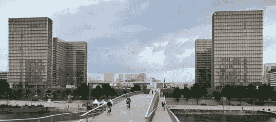
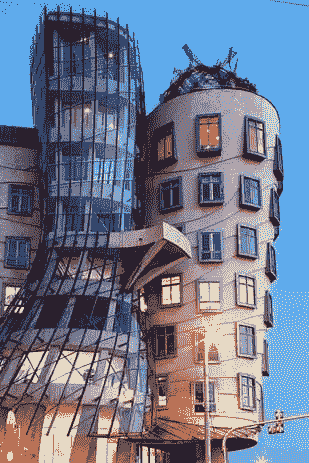

# 过度设计网页

> 原文：<https://www.sitepoint.com/over-designing-the-web/>

当法国国家图书馆建成时，它是一项令人印象深刻的工程和建筑壮举。像 20 世纪后期的许多建筑一样，它使用了相当多的玻璃。事实上，你可以看到，大部分的正面是玻璃。不幸的是，这使它变成了一个巨大的热温室，开始损害书籍。成千上万个巨大的木制百叶窗被安装在里面来反射阳光，这是一个笨拙的解决方案，解决了一个本可以避免的问题。

谁想擦那些窗户？

设计是每个人都乐于发表意见的东西。没有人会去看盖里的 *[舞厅](http://en.wikipedia.org/wiki/Dancing_House "Dancing House")* 并评论管道系统有多优雅。设计是最能给人留下深刻印象的情感因素，也常常是说服购买者花更多钱的因素(无论是在网络上还是在建筑上)。当有目的、有计划地使用时，它不仅使东西变得有用，还能创造享受和快乐。

在没有充分考虑人们将如何在日常生活中使用它的情况下，让一个 web 项目给路人留下深刻印象是非常诱人的。一旦一家公司“搬进”一个网站，它的形式就必须调整以适应其功能——就像图书馆的大木制百叶窗一样。事先做的规划越多，这些调整所需的成本和时间就越少。

那么，你如何知道你的项目是否存在过度设计的风险呢？

1.  **Is the pressure on?** 
    The tight deadline on the library project meant that many concerns went unheeded. When you are pressed up against a deadline and there is already a design in place, it seems like moving backward to reevaluate what’s already been put together.

    不要让团队思维的力量和截止日期的压力给你带来太大的压力。否则，您的团队可能最终会推进过度设计，这将增加发布后修复的时间和成本。

2.  **Can your windows be washed?** 
    The Biblioteque Nationale librarians had little to no voice in the design process. In Dancing House, the tower of windows is so difficult to keep clean that mountaineers had to be hired to wash them.

    在你当前的网络项目中，你和将要运行或维护网站的人谈过了吗？他们需要什么内容才能经常更新？

    一个常见的过度设计问题是创建看起来很棒但不方便更新的精致界面。如果网站上有任何文本需要开发人员的干预来更新，找出这些信息需要更新的频率(越少越好！).

3.  **Do you know the function of your form?** 
    Originally, the whole French library was going to accommodate the public. After its opening, it was partitioned into a section for scholars and another for the public. On top of that division, the two-building design forced administration and collections to be split by subject areas.

    如果事先有足够的研究，这些部门可以从一开始就以更成功的方式执行。在网上其他地方寻找你想在你的网站上实现的功能类型的例子。如果你正在进行重新设计，那么你就有优势与使用当前网站的人交谈。观察他们使用它，进行观察，并提出问题。

    即使没有现成的网站，你仍然可以找到你的目标受众成员进行交流。你甚至可以看到他们使用与你相似的网站。你越了解谁会使用你的网站，他们在那里会做什么，你就越能设计出适合他们需要的功能的网站。

## 分享这篇文章