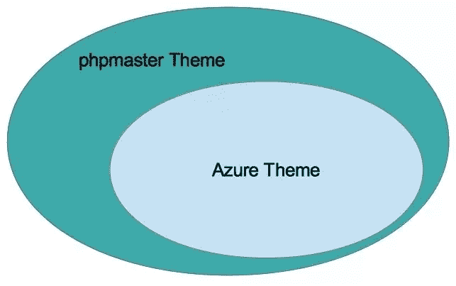
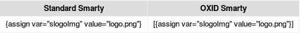
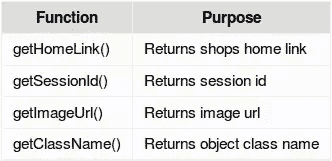
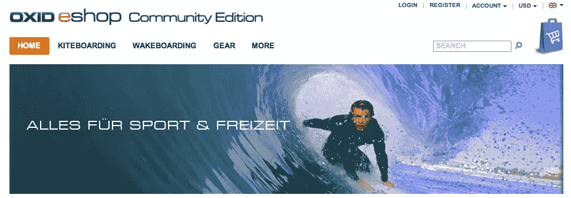
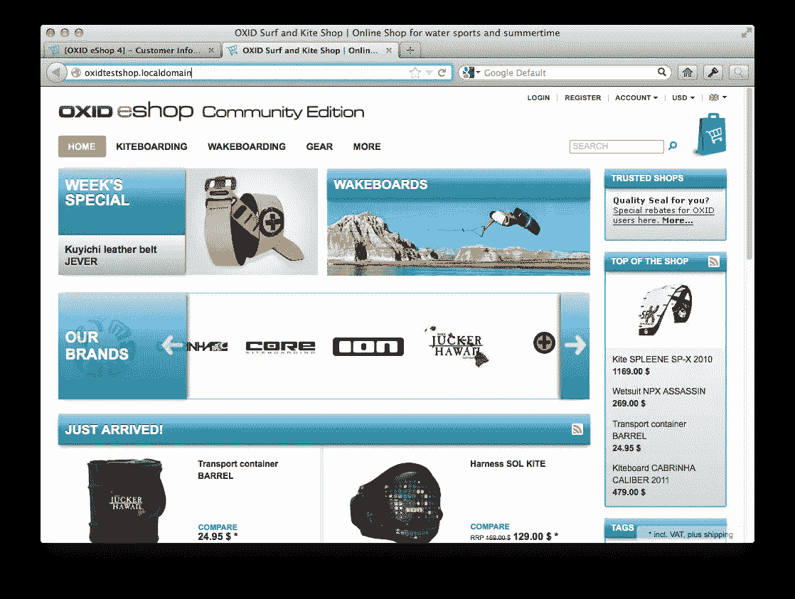
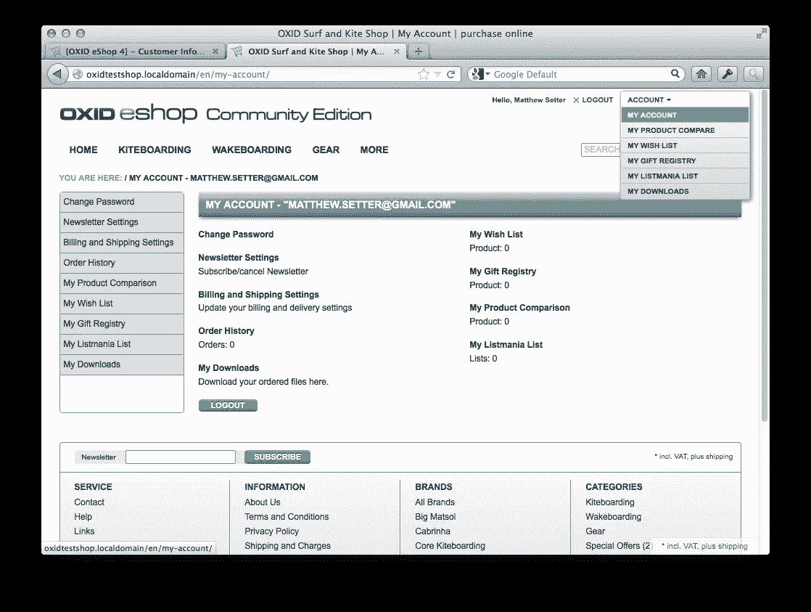
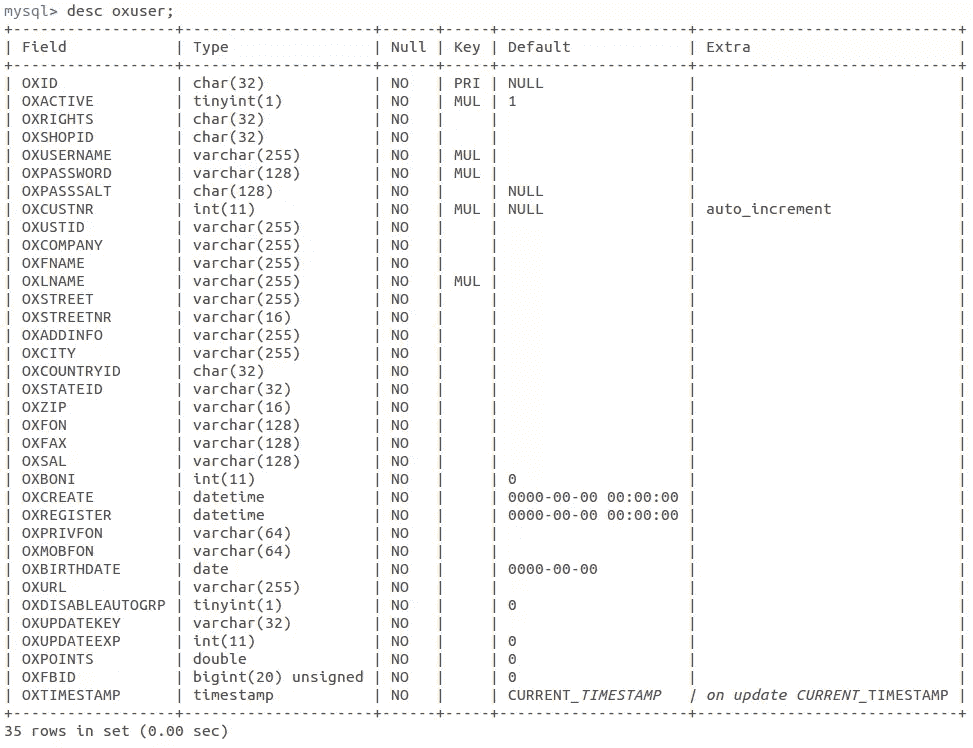
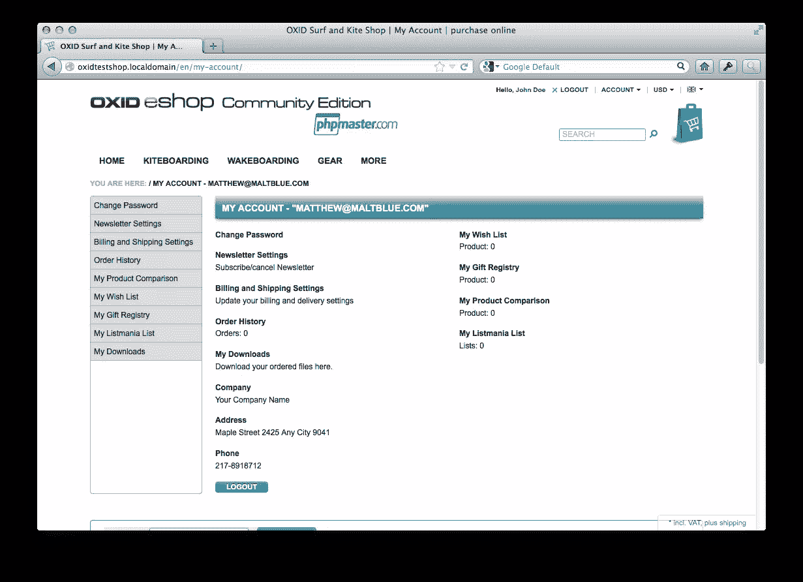

# ox id eSales——运转良好的电子商务平台！第二部分

> 原文：<https://www.sitepoint.com/oxid-esales-ecommerce-2/>

[在本系列的第一部分](https://www.sitepoint.com/oxid-esales-ecommerce-1/ "OXID eSales – The E-Commerce Platform that Just Works! Part 1")中，我们大致介绍了 OXID eSales，这是一个高质量的电子商务包，易于安装、配置和扩展。我们查看了它的一些特性和要求，然后完成了它在一个完全正常工作的车间中的安装。

在这里，我们将在第 1 部分所学的基础上，学习主题如何在 OXID 中工作，以及如何通过扩展它的默认主题来编写新的主题。所以，让我们深入研究一下什么是主题。

## 什么是主题？



OXID 中的主题就像你可能已经熟悉的大多数其他应用程序中的主题一样。主题允许开发人员和设计人员操作业务逻辑层提供的信息，这些信息通过我们编写的核心库、定制模块和扩展变得可用。

OXID 中的主题化系统使用了 Smarty 模板引擎,该引擎允许使用类似 PHP 的语法构建模板，如果需要，还可以完全访问 PHP 内核。

下面是`header.tpl`模板的一个片段。在其中你可以看到标准 HTML 中穿插的 Smarty 模板标签。OXID 中使用的模板标签是标准版本的一个微小变化，标准版本使用了方括号和花括号，而不仅仅是花括号。

```
[{assign var="slogoImg" value="logo.png"}]
  <a id="logo" href="[{$oViewConf->getHomeLink()}]" 
      title="[{$oxcmp_shop->oxshops__oxtitleprefix->value}]"
          >getImageUrl($slogoImg)}]" 
              alt="[{$oxcmp_shop->oxshops__oxtitleprefix->value}]"
          ></a>
    [{oxid_include_widget cl="oxwCategoryTree" 
        cnid=$oView->getCategoryId() sWidgetType="header" 
        _parent=$oView->getClassName() nocookie=1}]

      [{if $oxcmp_basket->getProductsCount()}]
          [{assign var="blAnon" value=0}]
          [{assign var="force_sid" value=$oViewConf->getSessionId()}]
      [{else}]
          [{assign var="blAnon" value=1}]
      [{/if}]
    [{oxid_include_widget cl="oxwMiniBasket" nocookie=$blAnon 
        force_sid=$force_sid}]
    [{include file="widget/header/search.tpl"}]
</div>
[{if $oView->getClassName()=='start' && $oView->getBanners()|@count > 0 }]
    <div class="oxSlider">
        [{include file="widget/promoslider.tpl" }]
    </div>
[{/if}]
```

从下表可以看出，真的没有太大区别。如果您已经熟悉 Smarty(或另一种 PHP 模板语言)，那么您会有宾至如归的感觉。



OXID 还提供了许多定制插件，这使得使用它变得更加简单和容易。您可以在`/core/smarty/plugins`下找到这些与包含的 Smarty 散布在一起的内容。有很多可用的，但是我将坚持讨论与本系列文章相关的内容。如果您想了解更多，我鼓励您在闲暇时通读源代码。

回到模板，在上面的模板片段中，您可以看到条件逻辑和其他模板的包含。为了可读性，我把它稍微格式化了一下。让我们浏览一下模板，以便您更好地理解所涉及的部分。

开始时，我们将*logo.png*赋给模板变量`slogoImg`。然后我们将它传递给`$oViewConf`对象的`getImageUrl`方法。这将返回对所请求图像的特定于商店的引用。

有几个方法在`$oViewConf`对象上被调用。这些是:



```
[{assign var="slogoImg" value="logo.png"}]

  <a id="logo" href="[{$oViewConf->getHomeLink()}]" 
      title="[{$oxcmp_shop->oxshops__oxtitleprefix->value}]"
      >getImageUrl($slogoImg)}]" 
          alt="[{$oxcmp_shop->oxshops__oxtitleprefix->value}]"></a>
```

在这一行中，我们使用了 OXID 的一个优秀特性，**小部件**，它允许我们在整个应用程序中重用条件业务和模板逻辑。在这种情况下，我们引用由`cl`参数标识的`oxwCategoryTree`小部件。

```
[{oxid_include_widget cl="oxwCategoryTree" 
        cnid=$oView->getCategoryId() sWidgetType="header" 
        _parent=$oView->getClassName() nocookie=1}]
```

这里我们使用简单的条件逻辑来决定设置哪些模板变量。

```
[{if $oxcmp_basket->getProductsCount()}]
          [{assign var="blAnon" value=0}]
          [{assign var="force_sid" value=$oViewConf->getSessionId()}]
      [{else}]
          [{assign var="blAnon" value=1}]
      [{/if}]
```

最后，我们包括另一个小部件`oxwMiniBasket`和`widget/header/search.tpl`模板。

```
[{oxid_include_widget 
        cl="oxwMiniBasket" 
        nocookie=$blAnon 
        force_sid=$force_sid}]
    [{include file="widget/header/search.tpl"}]
```

您需要习惯的一个惯例是如何动态引用 OXID 对象和数据库表。以上述代码示例中的以下片段为例:

```
title="[{$oxcmp_shop->oxshops__oxtitleprefix->value}]"
```

在这个例子中，模板正在检索`oxshops`表中`oxtitleprefix`列的值。它通过扩展了`oxView`类的`oxcmp_shop`类上的神奇方法来做到这一点。你可以在`application/components`下找到这个。简而言之，我们能够通过预定义的模板对象从数据库中检索值。

我意识到这开始有点太快了，但是在这个介绍之后，剩下的就很简单了，因为它一直都是建立在这个基础上的。

## 主题文件结构

现在我们对模板的结构有了基本的了解。让我们来看看一个 OXID 主题的文件结构。从 OXID Community Edition (CE) 4.7 和 Professional/Enterprise Edition(PE/EE)5.0 开始，主题被分成两个位置。

*   `/application/views/<theme>/</theme>`:用于模板、翻译和配置文件
*   `/out/<theme></theme>`:针对公共文件(CSS、JavaScript、图片等。)

在您的安装中浏览它们并熟悉它们。

我们可以用两种方法之一来创建主题。我们可以自己创建所有的模板、图片、CSS 和 JavaScript，也可以扩展现有的主题，只修改我们需要的。商店的 CE 4.7 和 PE/EE 5.0 版本都带有一个名为 Azure 的默认主题，它提供了构建工作商店所需的所有核心模板、CSS、JavaScript 和图像文件。为了节省时间和简单起见，在这个例子中，我们将扩展它来构建我们的自定义主题。

## 扩展基本主题

让我们开始创建新的自定义主题。在`application/views`下，创建一个名为`sitepoint`的新目录。在其中，创建一个名为`theme.php`的文件，并将下面的信息添加到其中。

```
<?php
/**
 * Theme Information
 */
$aTheme = array(
    'id'             => 'sitepoint',
    'title'          => 'SitePoint',
    'description'    => 'example for SitePoint.com',
    'thumbnail'      => 'theme.jpg',
    'version'        => '1.3',
    'author'         => 'Matthew Setter <matthew@maltblue.com>',
    'parentTheme'    => 'azure',
    'parentVersions' => array('1.3')
);
```

这给了我们的主题一个唯一的 ID 和名称，并告诉 OXID 我们将使用 Azure 主题作为基础。这样，如果 OXID 在我们的主题中找不到模板，它就会在 Azure 主题中寻找它，并从那里提供服务。

为了保持这些例子的实用性，我们将对商店的外观和感觉进行三个小的修改。

*   更改徽标
*   从主页中移除图像滚动条
*   在用户帐户配置文件中显示额外内容

### 更改徽标

在`/out`下创建一个名为`sitepoint`的新目录。在它下面，新建两个目录:`img`和`src`，下载`theme.jpg`文件。接下来将`logo.png`文件下载到`/img`中。这是一个稍微修改的默认版本，我这样做是为了清楚地表明我们正在改变主题。

现在已经完成了，您需要登录商店并启用新主题。所以去`<yourshop>/admin</yourshop>`登录。之后，你会看到一个类似下面截图的布局。在左侧导航栏中，单击扩展，然后单击主题。


在右边的列表中，你会看到 Azure 和 PHP Master。点击“PHP 高手”。然后在底部面板的右上角，单击激活。一切正常，你的主题现在是活跃的。

当你重新加载商店，你可能会看到原来的标志，而不是你刚刚放在那里。这是介绍`tmp`目录的好时机。像所有好的软件一样，OXID 大量使用缓存。

它的缓存涵盖了智能模板、数据库查询、模块等等。在本系列的第三部分也是最后一部分，我将介绍缓存配置和选项——敬请关注。

同时，在安装的根目录下，您会看到一个名为`tmp`的目录。删除里面的所有文件，然后重新加载商店。现在你会看到你的新的惊人的商店标志。

### 移除主页的图像滚动条

好吧，改变标志是一个非常简单，容易开始的方法。现在让我们做一些实际的模板更改。让我们从主页中删除图像滚动条。它是主导航部分和搜索栏下方的大图像区域，如下面的截图所示。



将`application/views/azure/tpl/layout/header.tpl`复制到`application/views/sitepoint/tpl/layout/header.tpl`，根据需要创建目录结构。完成后，打开复制的文件，删除底部类似下面代码的部分:

```
[{if $oView->getClassName()=='start' && $oView->getBanners()|@count > 0 }]
 <div class="oxSlider">
  [{include file="widget/promoslider.tpl" }]
 </div>
[{/if}]
```

清除`tmp`目录并重新加载商店。去掉这个之后，你的商店应该看起来像下面的截图。



### 显示输出条件

现在让我们继续看一个稍微难一点的例子。这一次，当用户登录时，我们将在用户帐户中显示一些额外的信息。

要查看用户的现有帐户，请登录商店前台，然后导航到 */en/my-account/* 。或者，当您登录后，您可以点击商店右上角的帐户，然后点击我的帐户，如下图所示。



在该页面上，您会看到许多链接和用户详细信息，如电子邮件地址和姓名。如果您对数据库中的表`oxuser`执行`DESCRIBE`操作，您会看到模式如下所示:



我们要做的是在“我的帐户”页面的底部添加一个小表格，列出用户的几个关键细节。这些是:

*   公司
*   地址
*   电话号码

为此，我们需要做两件事:

1.  修改另一个模板
2.  与一些 OXID 模板对象交互

首先将模板`application/views/azure/tpl/page/account/dashboard.tpl`复制到`application/views/sitepoint/tpl/page/account/dashboard.tpl`下的相同位置，在需要的地方创建目录结构。在其中，您会注意到两个 div，布局中的每一列都有一个 div。在第一个 div 的底部，您会看到以下代码:

```
[{if $oView->isEnabledDownloadableFiles()}]
 <dl>
  <dt><a id="linkAccountDownloads" href="[{ oxgetseourl ident=$oViewConf->getSelfLink()|cat:"cl=account_downloads" }]" rel="nofollow">[{ oxmultilang ident="MY_DOWNLOADS" }]</a></dt>
  <dd>[{ oxmultilang ident="MY_DOWNLOADS_DESC" }]</dd>
 </dl>
[{/if}]
```

在该栏下，添加以下内容:

```
<dl>
 <dt>[{ oxmultilang ident="PAGE_ACCOUNT_DASHBOARD_COMPANY" }]</dt>
 <dd>[{ $oxcmp_user->oxuser__oxcompany->value }]</dd>
</dl>
<dl>
 <dt>[{ oxmultilang ident="PAGE_ACCOUNT_DASHBOARD_ADDRESS" }]</dt>
 <dd>
  [{ $oxcmp_user->oxuser__oxstreet->value }] [{ $oxcmp_user->oxuser__oxstreetnr->value }] 
  [{ $oxcmp_user->oxuser__oxcity->value }] [{ $oxcmp_user->oxuser__oxzip->value }]
 </dd>
</dl>
<dl>
 <dt>[{ oxmultilang ident="PAGE_ACCOUNT_DASHBOARD_PHONE" }]</dt>
 <dd>[{ $oxcmp_user->oxuser__oxfon->value }]</dd>
</dl>
```

这将通过使用 available objects magic 方法从数据库中检索信息来添加标签和各自属性的值。

## 添加翻译

如果我们清空`tmp`目录并重新加载商店，我们将会看到一些相当糟糕的警告，因为翻译丢失了。我们需要添加自定义翻译文件以及新的翻译，这样无论用户的语言如何，我们的更改都会生效。

所以，在`application/views/sitepoint/`下创建两个目录:`de`和`en`。在这些文件下，创建一个名为`cust_lang.php`的新文件。在`de`下增加以下内容:

```
<?php
$sLangName  = "Deutsch";
// -------------------------------
// RESOURCE IDENTIFIER = STRING
// -------------------------------
$aLang = array(
    'charset'                        => 'ISO-8859-15',
    'PAGE_ACCOUNT_DASHBOARD_COMPANY' => "Company",
    'PAGE_ACCOUNT_DASHBOARD_ADDRESS' => "Address",
    'PAGE_ACCOUNT_DASHBOARD_PHONE'   => "Phone Nummer"
);
```

在`en`下增加:

```
<?php
$sLangName  = "English";
// -------------------------------
// RESOURCE IDENTIFIER = STRING
// -------------------------------
$aLang = array(
    'charset'                        => 'ISO-8859-15',
    'PAGE_ACCOUNT_DASHBOARD_COMPANY' => "Firma",
    'PAGE_ACCOUNT_DASHBOARD_ADDRESS' => "Adresse",
    'PAGE_ACCOUNT_DASHBOARD_PHONE'   => "Telefonnummer"
);
```

现在，当您清除`tmp`目录并重新加载页面时，您将看到新添加的内容，看起来像下面的截图。



## 最后

我们已经从安装 OXID eSales community edition 的副本发展到根据我们的需求定制外观。所有这些都非常简单、可预测和直接。

我希望你喜欢这个系列，它向你展示了一个优秀的电子商务工具。请继续关注第 3 部分，我们将构建一个定制模块，让您能够将 OXID 定制到众所周知的“下一个级别”。

图片 via[Fotolia](http://us.fotolia.com/?utm_source=sitepoint&utm_medium=website_link&utm=campaign=sitepoint "Royalty Free Stock Photos at Fotolia.com")

## 分享这篇文章