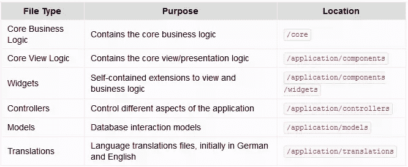
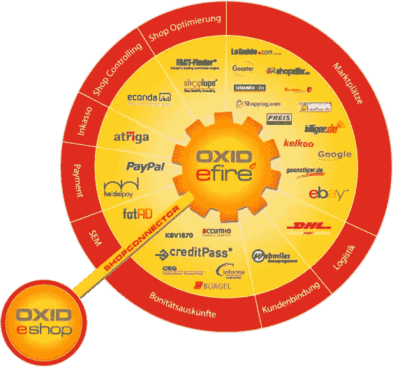
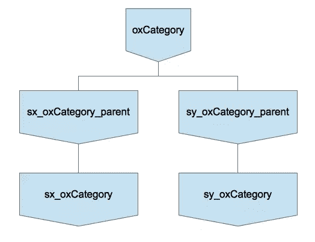
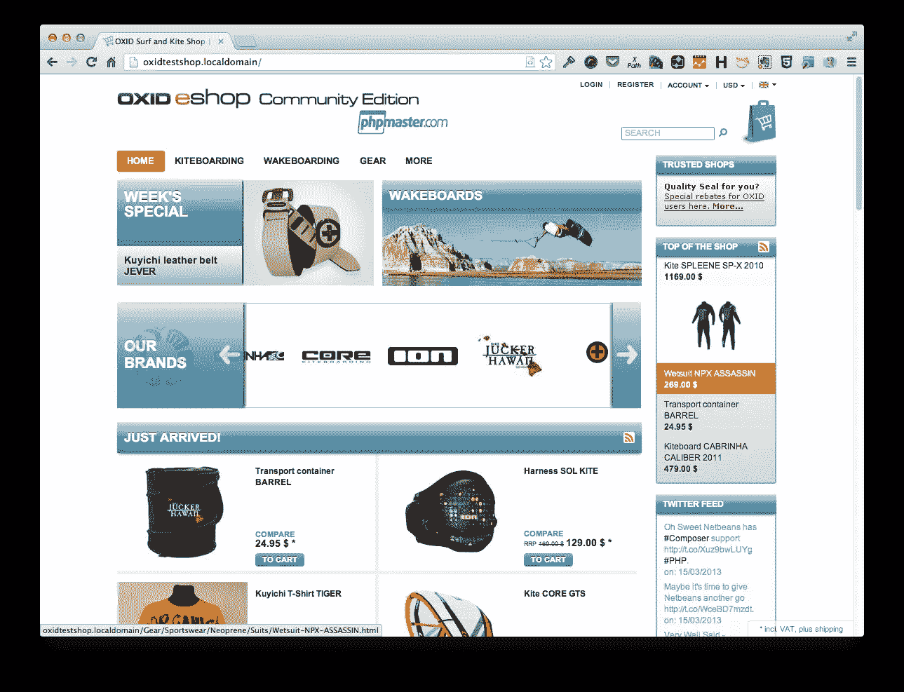

# ox id eSales——运转良好的电子商务平台！第三部分

> 原文：<https://www.sitepoint.com/oxid-esales-ecommerce-3/>

欢迎阅读本系列的第三部分，也是最后一部分，向您介绍一个非常棒的替代 PHP 电子商务平台——ox id eSales。如果你错过了，这个系列的第一部分对 OXID eSales 进行了广泛的介绍。我们查看了一些功能和要求，最后安装了一个功能齐全的车间。[第二部分](https://www.sitepoint.com/oxid-esales-ecommerce-2/ "OXID eSales – The E-Commerce Platform that Just Works! Part 2")更深入，看看主题是如何组成的，我们开始创建一个基于默认主题 Azure 的自定义主题。

这是第三部分，我们将通过编写一个自定义模块来扩展其核心功能，从而获得一些使用 OXID 的实践经验。我们将实现的功能将使我们能够根据我们将添加到管理后端的新自定义字段，显示来自我们 twitter 帐户的最新推文。

## 创建模块

在 OXID 中，有六种类型的核心文件。它们涵盖了您可以在商店中做的一切，比如与数据库交互、语言支持(考虑国际化)、调试、验证、PDF 生成、图像、主题等等。具体来说，它们是:



除非你永远不会升级，但特别是如果你，最好让所有这些核心文件保持原样。否则，到了升级的时候，你将会失去你所有的努力和改变。

如果你曾经玩过 Magento 或实现类似方法的平台，你会对 OXID 相当熟悉。与 Magento 一样，用户可以使用自定义扩展名来扩展核心文件，这些扩展名将在升级周期中保留下来。无论您是否需要额外的货币支持，在模板中显示更多标准函数无法提供的信息，或者需要存储标准结构不支持的数据，您都可以随心所欲地扩展 OXID。然后，到了升级的时候，你的更改就不会丢失了。

同样有趣的是，OXID 允许您在多个位置扩展核心文件。这提供了使用各种第三方模块和扩展的能力，例如来自 [OXID eFire 市场](https://www.oxid-efire.com/login/index)的模块和扩展。下图显示了可用模块的示例。



## 扩展核心文件

那么，如何扩展一个 Oxid 类呢？在下图中，你可以看到一个简单的 OXID 类继承树的图解。



假设我们想要扩展`oxCategory`的功能。在顶部，你会看到核心的`oxCategory`类。在它下面你会看到两个扩展它的类，`sx_oxCategory_parent`和`sy_oxCategory_parent`。你会看到这些类分别被`sx_oxCategory`和`sy_oxCategory`扩展。简而言之，这就是你如何扩展 OXID 核心类。

你创建的所有定制类都必须从一个`*_parent`类扩展而来。这些类是伪类；您实际上没有实例化它们。但是为了让 OXID 中的继承工作，您需要从伪类进行扩展，以便内部 OXID 进程可以跟踪扩展核心类的多个类。

一旦你完成了这些，你就需要通知 OXID 你的类扩展了哪些核心类。这是通过向我们的`modules`目录中的文件`metadata.php`添加额外的信息来实现的。

## 让我们创建一个模块

如果您已经在第 2 部分创建了一个主题，那么这个过程对您来说会非常熟悉。我们将扩展核心的 OXID 功能，以便我们可以检索和显示指定 Twitter 帐户的当前 tweets。这包括以下步骤:

1.  定制管理后端，允许我们指定 twitter 帐户名称
2.  添加一个自定义类来检索 twitter 流
3.  扩展`oView`对象，以便我们可以在模板中检索信息
4.  定制模板以检索和显示信息

在我们开始之前，请确保您已经[创建了您的 Twitter 应用程序](https://dev.twitter.com/apps)；因为我们在下面写的类中需要四个配置值。当您创建自己的值时，请记下这些值:

*   消费者密钥
*   消费者秘密
*   访问令牌
*   访问令牌秘密

我们首先需要创建模块的基本结构。在`modules`下，创建一个名为`sitepointtwitter`的新目录，并在该目录下创建一个名为`metadata.php`的文件。在其中添加以下代码:

```
<?php
/**
 * Metadata version
 */
$sMetadataVersion = '1.0';

/**
 * Module information
 */
$aModule = array(
    'id'           => 'sitepointtwitter',
    'title'        => 'SitePoint Twitter',
    'description'  => 'Module for retrieving and displaying a Twitter feed.',
    'thumbnail'    => 'picture.png',
    'version'      => '1.0',
    'author'       => 'Matthew Setter <matthew@maltblue.com>',
    'extend' => array(),
    'files' => array(
        'sitepointwTwitterFeed' => 
            'sitepointtwitter/widget/sitepointwtwitterfeed.php',
    )
);
```

这些是模块的基本要求。在这一点上，我们已经提供了所需的基本注册信息，其中大部分实际上只是用于显示目的，我们很快就会看到。然而，`id`值和目录名必须匹配，所以请确保它们匹配。

## 创建 Twitter 类

现在我们将创建一个扩展`oxView`的自定义类，使来自我们的流的 Twitter 信息可用。在`modules/sitepointtwitter`下创建一个名为`sitepointview.php`的新文件，代码如下:

```
<?php
class sitepointwTwitterFeed extends oxWidget  
{
    /**
     * Current class template name.
     * @var string
     */
    protected $_sThisTemplate = 'widget/sidebar/twitterfeed.tpl';

    /**
     * Simple class to retrieve a list of the latest
     * feeds from a users twitter feed.
     *
     * @return array An array containing the Twitter feed information
     *
     */
    public function getTwitterFeed()
    {
        $oConfig = $this->getConfig();

        try {
            $twitter = new Twitter(
                '<your/consumer/key>', 
                '<your/consumer/secret>', 
                '<your/access/token>', 
                '<your/access/token/secret>'
            );
        } catch (TwitterException $e) {
            print $e->getMessage();
            return array();
        }

        try {
            if ($statuses = $twitter->load(Twitter::ME)) {
                return $statuses;
            }
        } catch (InvalidArgumentException $e) {
            print $e->getMessage();
            return array();
        } catch (TwitterException $e) {
            print $e->getMessage();
            return array();
        }
    }
}
```

在我们继续代码概述之前，将存储库的一个副本克隆到一个新目录`vendor`，在`modules/sitepointtwitter`下。为此，只需运行以下命令:

```
git clone git://github.com/dg/twitter-php.git
```

然后将两个源文件从`src`复制到`vendor`目录。

现在，回到代码。在上面的代码中，我们创建了一个类`sitepointView`，它扩展了伪类`oxWidget`，并使用大卫·格鲁德尔的 [Twitter for PHP 类](https://github.com/dg/twitter-php)的简单性来进行一次调用，并从我们的 Twitter 流中检索最新的推文。

我们尝试实例化一个新的 Twitter 对象，使用我们之前创建的 Twitter 开发人员帐户的配置设置。如果抛出一个`TwitterException`，我们返回一个空数组。否则，我们将进入下一步，尝试从 Twitter 流中检索最新状态。如果我们遇到异常，像以前一样，我们返回一个空数组。

我写这段代码的目的是让它尽可能简单。我们本可以记录出错的事实，或者做些别的事情来通知用户。相反，它的编码方式是，无论哪种方式，都返回一个可以被解析的数组，保持它的简单和有效，这样这个例子的目的就不会丢失。

写好类后，我们必须让 Twitter PHP 类对我们的新 OXID 类可用。在`modules`目录的根目录中，打开文件`functions.php`并添加以下几行:

```
// add in required classes for Twitter
require_once __DIR__ . "/sitepointtwitter/vendor/twitter.class.php";
require_once __DIR__ . "/sitepointtwitter/vendor/OAuth.php";
```

在此之后，清除`tmp`目录并重新加载商店。模块功能现在将可用。

## 自定义模板

因此，我们扩展了后端配置选项，克隆了依赖项，用我们的新类扩展了`oxView`,并更新了`metadata.php`文件，使我们的商店可以使用所有代码。只剩下一个步骤——定制视图模板。

将`application/views/azure/tpl/layout/sidebar.tpl`复制到`application/views/sitepoint/tpl/layout/sidebar.tpl`。然后打开它，找到下面的块:

```
[{block name="sidebar_tags"}]
    [{if $oView->showTags() && $oView->getClassName() ne "details" && $oView->getClassName() ne "alist" && $oView->getClassName() ne "suggest" && $oView->getClassName() ne "tags"}]
        [{oxid_include_widget nocookie=1 cl="oxwTagCloud" blShowBox="1" noscript=1 }]
    [{/if}]
[{/block}]
```

在其上方，添加以下新块:

```
[{block name="sidebar_twitter_feed"}]
    [{oxid_include_widget cl="sitepointwTwitterFeed" nocookie=$blAnon force_sid=$force_sid}]
[{/block}]
```

这是使用一个定制的 Smarty 插件来内联呈现小部件的内容，使用由`cl`参数指示的类`sitepointwTwitterFeed`。还有一系列其他可能的论点，你可以在[在线文档](http://wiki.oxidforge.org/Tutorials/widgets_in_4.7_%2B_5.0)中读到更多。

接下来，创建一个新目录`application/views/sitepoint/tpl/widget/sidebar`。在其中，创建名为`twitterfeed.tpl`的新文件，这将是小部件将呈现的模板。在其中添加以下代码:

```
[{assign var=aTwitterFeed value=$oView->getTwitterFeed()}]

<style type="text/css">
    div#twitterFeedBox ul {
        border: 0px;
    }

    div#twitterFeedBox ul li {
        margin-top: 5px;
        margin-bottom: 5px;
        color: #999;
    }
</style>
<div id="twitterFeedBox" class="box twitterFeed">
    <h3>[{ oxmultilang ident="WIDGET_TWITTER_FEED_HEADER" }]</h3>
    <div class="content">
        <ul>
            [{foreach from=$aTwitterFeed item=sTweet key=iCount}]
            <li>[{$sTweet->text}].<br />on: [{$sTweet->created_at|date_format:"%e/%m/%Y"}]</li>
            [{/foreach}]
        </ul>
    </div>
</div>
```

最后，在`application/views/sitepoint/en/cust_lang.php`中添加以下一行:

```
'WIDGET_TWITTER_FEED_HEADER' => 'Twitter Feed',
```

这提供了模板的 H3 标签所需的翻译。一旦你完成了，你就需要清空`tmp`目录并重新加载 OXID，这样它就会知道这些变化。说了这么多，做了这么多，我们的商店现在看起来就像下面的图片，你可以在右下角看到 twitter feed。



## 结论

介绍 OXID eSales 的 3 部分系列到此结束。我们已经了解了它是什么，安装了社区版的工作版本，修改了主题的各个方面，并创建了一个可重用的小部件，通过外部库显示 Twitter feed。

你觉得怎么样？OXID 非常非常容易上手和扩展，你同意吗？

我希望你喜欢这篇介绍，并尝试一下 OXID。如果您已经从第 1 部分开始，您的体验是什么样的？效果好吗？我希望如此。

如果您有任何问题或疑问，您可以随时跳转到 [OXID eSales 论坛](http://forum.oxid-esales.com/?langid=2)或在 [IRC 频道](http://wiki.oxidforge.org/Oxid_IRC)聊天。

下次再见，祝 OXID 一切顺利，别忘了在下面的评论中分享你的反馈。

图片 via[Fotolia](http://us.fotolia.com/?utm_source=sitepoint&utm_medium=website_link&utm=campaign=sitepoint "Royalty Free Stock Photos at Fotolia.com")

## 分享这篇文章