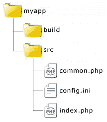
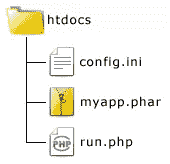
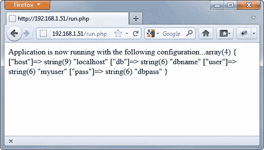

# 用 Phar 打包你的应用

> 原文：<https://www.sitepoint.com/packaging-your-apps-with-phar/>

如果没有合适的工具，web 应用程序的部署会非常困难和麻烦。如果您以前部署过 Java 应用程序，我肯定您听说过 JAR 文件(它代表“Java 归档”)。组成应用程序的所有可执行/可访问的内容都可以打包在一个 JAR 文件中，这对于部署来说是一个福音。

PHAR(“Php 存档”)类似于 JAR 文件的概念，但是是针对 Php 的。如果你有 PHP 5.3 或者更高版本，Phar 扩展是内置的并且启用了；没有任何附加要求就可以开始使用了。

本文旨在为那些以前没有使用过这个重要特性的人提供一些帮助。希望您会发现它是一个非常有用的工具，并拥有更好、更快的部署体验。

默认情况下，PHAR 文件被视为只读文件，您可以使用任何 PHAR 文件，无需任何特殊配置。这对部署非常有利。但是由于您将创建自己的 PHARs，您需要允许通过`php.ini`文件进行写访问。

打开`php.ini`，找到`phar.readonly`指令，并相应修改:

```
phar.readonly = 0
```

现在您已经准备好将您的库和应用程序打包成 PHARs 了。

## 你的第一个 PHAR

首先创建应用程序的目录结构；在系统的某个地方，创建以下内容:



当 PHAR 包被创建时，`build`目录将保存它，以避免生成的工件污染源代码树。`src`目录保存组成应用程序的源文件。

`index.php`将作为应用程序的入口点，`common.php`将是应用程序使用的公共类的伪库，`config.ini`将是应用程序的配置文件。

`index.php`的内容看起来像是:

```
<?php
require_once "phar://myapp.phar/common.php";
$config = parse_ini_file("config.ini");
AppManager::run($config);
```

`common.php`的内容看起来像是:

```
<?php
class AppManager
{
    public static function run($config) {
         echo "Application is now running with the following configuration... ";
         var_dump($config);
     }
}
```

而`config.ini`的内容看起来像是:

```
[database]
host=localhost
db=dbname
user=myuser
pass=dbpass
```

## 创造 PHAR

除了应用程序结构，您还需要一个脚本来生成 PHAR 归档文件。用以下代码在您的`myapp`根目录下创建一个名为`create-phar.php`的新 PHP 文件:

```
<?php
$srcRoot = "~/myapp/src";
$buildRoot = "~/myapp/build";

$phar = new Phar($buildRoot . "/myapp.phar", 
	FilesystemIterator::CURRENT_AS_FILEINFO |     	FilesystemIterator::KEY_AS_FILENAME, "myapp.phar");
$phar["index.php"] = file_get_contents($srcRoot . "/index.php");
$phar["common.php"] = file_get_contents($srcRoot . "/common.php");
$phar->setStub($phar->createDefaultStub("index.php"));

copy($srcRoot . "/config.ini", $buildRoot . "/config.ini");
```

然后打开一个终端窗口，导航到`myapp`目录并运行它:

```
aabouzekry@platinum:~/myapp$ php create-phar.php
```

运行脚本后，您应该在`build`目录中找到`myapp.phar`档案以及一个`config.ini`文件的副本。将这两个文件复制到您的 web 服务器的文档根目录(例如`htdocs`)。

要访问 Phar 打包的应用程序，您可以直接调用归档文件，但是不建议这样做，这可能需要对您的 web 服务器进行额外的配置，以便将 PHAR 文件转发到正确的 PHP 处理程序。另一种方法是创建一个包含归档文件的运行脚本。

在 web 服务器的文档根目录下创建一个名为`run.php`的运行脚本，如下所示:

```
<?php
require "myapp.phar";
```

这段代码除了绕过重新配置服务器来直接处理 PHAR 文件的麻烦之外，什么也没做。如果你在一个共享的托管环境中托管你的应用程序，并且不能访问你的服务器配置，那么这也是一个完美的解决方案！

创建好跑步者后，你的 web 根目录应该是这样的:



将浏览器指向`run.php`脚本，您应该会看到以下输出:



## 窗帘后面

让我们仔细看看`create-phar.php`代码，看看它到底是什么意思。看看下面这句话吧:

```
<?php
$phar = new Phar($buildRoot . "/myapp.phar", 
        FilesystemIterator::CURRENT_AS_FILEINFO |
        FilesystemIterator::KEY_AS_FILENAME, "myapp.phar");
```

创建一个新的`Phar`对象，它通常有三个参数。第一个参数是要操作的归档文件的路径。您不仅可以创建新的归档，还可以操作现有的归档。

第二个参数是一个标志，用来设置对象如何处理文件。`Phar`对象是 PHP `RecursiveDirectoryIterator`类的子类，这个参数被简单地传递给父类。无论如何，我提供的参数是`RecursiveDirectoryIterator`的默认参数，这在目前来说很好。

第三个参数是存档的别名，当使用`phar`流包装器引用自身时，将在内部使用这个别名。换句话说，归档文件中需要包含归档文件中其他文件的所有文件都应该使用流包装器和别名显式地引用它。例如，`index.php`中的代码以这种方式引用了`common.php`文件。

```
<?php
require_once "phar://myapp.phar/common.php";
```

创建对象后，`index.php`和`common.php`被添加到档案中。代码现在将`Phar`对象作为一个关联数组来指定以文件名为关键字的文件内容，而`file_get_contents()`用于从磁盘读取文件。类似地，你可以添加任意多的文件，但是如果你需要添加很多文件或者整个目录，那么你可以考虑使用更方便的`buildFromDirectory()`方法。

```
<?php
$phar->buildFromDirectory("/path/to/dir",'/.php$/');
```

`buildFromDirectory()`的第一个参数是所需目录的路径，第二个参数是可选的正则表达式，指定包含哪些文件。要包含目录中的所有文件，只需跳过第二个参数。

调用`setStub()`方法来创建存根文件。存根文件告诉归档文件在被编译器加载时做什么。

最后，将`config.ini`从`src`目录复制到归档旁边的`build`目录。

## 存根文件

当您运行 PHAR 归档文件时，其中的存根被视为一个元文件来初始化归档文件，并告诉它在调用时做什么，而不引用特定的文件。在本例中，我将存根文件的创建留给了使用`createDefaultStub()`方法的`Phar`对象，该方法创建了包含以下代码的默认存根:

```
<?php
Phar::mapPhar();
include "phar://myapp.phar/index.php";
__HALT_COMPILER();
```

用`createDefaultStub()`生成的缺省存根只说明了最低要求。`Phar::mapPhar()`填充归档的元数据并初始化它，您的存根文件应该以对`__HALT_COMPILER()`的调用结束，结尾没有空格。这个函数在这一点上停止 PHP 解释器的进一步执行，允许在它之后包含数据而没有被执行的风险。这是 Phar 包装器的一个要求，没有它，存档根本就不能工作。

或者，您可以创建自己的存根文件来执行 PHAR 归档文件的自定义初始化，并按如下方式读取它:

```
<?php
$phar->setStub(file_get_contents("stub.php"));
```

## 认真对待法尔

如果你正在开发一个类库或其他可包含的代码，把它放在 PHAR 档案中是一个整洁的解决方案，可以把它分发给多个项目。Phar 扩展已经过高度优化，即使不比普通文件访问更好，也能提供相同的性能，因此使用它很可能不会损害您自己的应用程序的性能。

为了有效地使用 Phar，你应该意识到它确实有一些限制。这里有一些技巧可以帮助你更好地理解 Phar，并从中获得最大收益:

*   您可以在 PHAR 中打包整个应用程序，但它不是自动部署解决方案。这是应用程序的单个文件访问方法。
*   您可以在归档中手动执行自动部署功能，从而实现更强大的部署，如在服务器上创建缓存和上传目录，生成通用配置文件等。
*   在实际部署中，您应该避免回写 Phars。相反，将所有可写文件放在归档文件之外。在标准的 PHP 安装中，写入 PHAR 是禁用的，因为这样做对您的应用程序来说是不安全的。

## 摘要

Phar 可以为您省去打包和部署应用程序的许多麻烦，我建议您考虑使用它。本文旨在向您介绍 Phar 的主要概念。您了解了如何创建归档文件和包含文件，了解了存根文件的重要性，以及 PHP 如何访问归档文件中的文件。不幸的是，PHP 手册中关于使用 Phar 的资源并不完整，互联网上其他地方有限的资源也不够有用。希望在以后的文章中，我能够向您展示更多关于利用 Phar 的内容。

图片 via [帕维尔·伊格纳托夫](http://www.shutterstock.com/gallery-372148p1.html)/[Shutterstock](http://www.shutterstock.com)

## 分享这篇文章