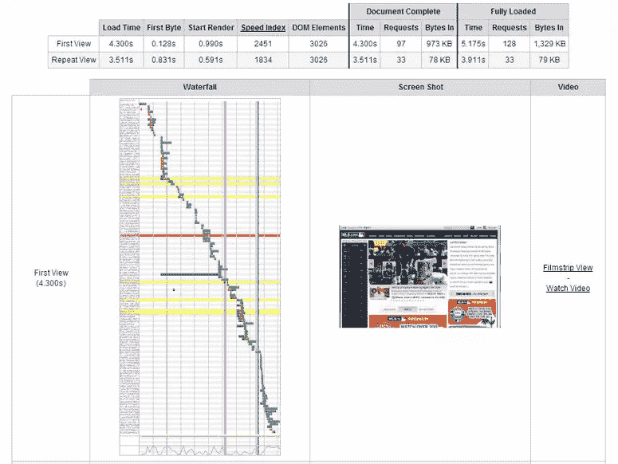
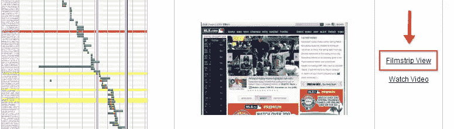
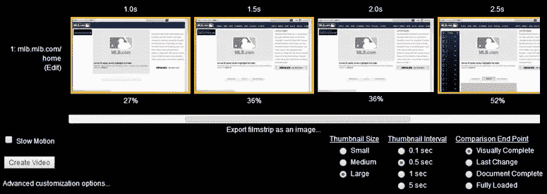
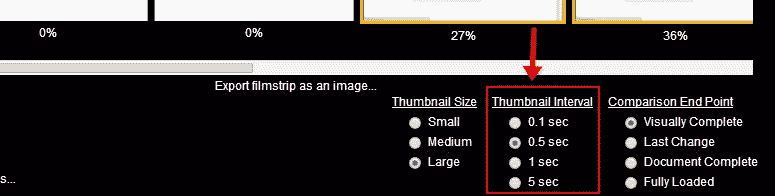
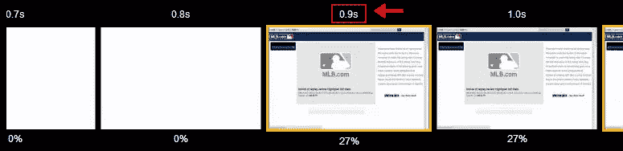
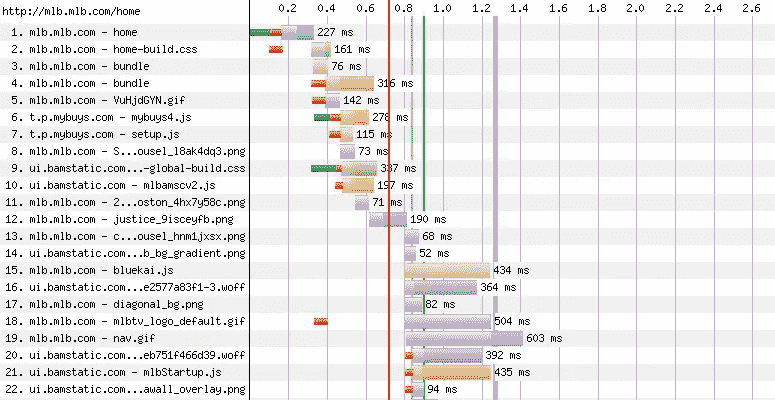

# 页面速度:访问者多久能看到你的内容？

> 原文：<https://www.sitepoint.com/page-speed-soon-visitors-see-content/>

如果你花时间测试你的网站和应用程序的性能，那么在某个时候你可能会遇到[WebPagetest.org](http://www.webpagetest.org/)。如果你没有，那么这是非常值得一试。

WebPageTest.org 似乎拥有你在进行性能测试时可以要求的几乎所有特性，甚至在 2010 年被史蒂夫·索德称赞为该领域的顶级工具。

在他的帖子中，Souders 简要提到了 WebPagetest.org 的一个我认为相对而言没有被注意到的特点:**电影胶片视图**。 [Paul Irish](https://twitter.com/paul_irish/) 在几周前的一次聊天中向我介绍了这个非常酷的功能，我想我应该在这里展示一下。

## WebPagetest.org 的幻灯片视图

要使用此功能，请转到[WebPagetest.org](http://www.webpagetest.org/)并在主字段中输入 URL。为了在本文中演示电影视图，我将使用 MLB.com 的[主页](http://mlb.mlb.com/home)——这也将作为一个友好的提醒，世界上最伟大的运动即将开始新的赛季。:)

WebPageTest.org 有许多设置，我们可以在初始入口页面上更改(例如，要模拟的浏览器、测试位置、连接速度等)。)但是我们将只使用这一个的默认值。当我们点击“开始测试”按钮时，测试开始运行。测试完成后，您应该会看到类似这样的内容:

这里已经有很多好东西可以看了，但我们特别想关注第一张截图右侧“视频”栏下的“幻灯片视图”链接:

**更新:**正如一些人在评论中指出的，你在上面看到的“视频”栏可能看不到。如果你在 Firefox 或 IE11 上访问 WebPagetest.org，运行测试时选择的默认“浏览器”是(出于某种奇怪的原因)“IE9”。使用该选项,“视频”栏和“电影视图”链接将不会出现。选择 Chrome、Firefox、IE11 或其他浏览器来查看连续画面视图选项。

点击该链接后，您将看到以下内容(您可能需要再次等待):

正如你所看到的，“幻灯片”功能从视觉角度向我们展示了页面加载的进度，基本上是向你展示了用户在加载过程中将会看到什么。当您在幻灯片窗格中向右滚动时，您会看到渲染进度，因为新元素开始出现。

但更重要的是，默认显示的第一个幻灯片单元是页面最初开始呈现的地方。如果向左滚动连续画面，您会看到空白的连续画面单元，表示浏览器正在等待页面开始呈现:

根据我们在上面看到的，MLB.com 主页在用户看到任何东西出现在页面上之前花了大约 1 秒钟。但是我们可以进一步分解这个时间。请注意“连续画面”面板下面的选项:

在这里，我们可以将“缩略图间隔”更改为十分之一秒，这样当页面负载从空白切换到可视呈现开始时，我们可以更准确地看到:

通过比较截图，您可以看到，通过将时间间隔更改为“0.1 秒”，我们能够更准确地观察到页面呈现从 0.9 秒开始。

那么我们能用这些信息做什么呢？

## 分析数据

在同一个页面上，您将看到显示页面资产及其各自加载时间的瀑布图:

深绿色线表示页面呈现开始的位置。红线表示连续画面已滚动到的位置(当您在连续画面窗格中滚动时，此位置会发生变化)。

MLB.com 开始渲染页面的 0.9s 的时间是很不错的。但是，根据我们在瀑布中看到的，并与电影胶片中空白帧的结尾进行比较，似乎仍有改进的余地。

例如，有一些 CSS 文件和脚本会在页面开始呈现之前加载。如果[脚本被加载到页面底部](http://developer.yahoo.com/blogs/ydn/high-performance-sites-rule-6-move-scripts-bottom-7200.html)而不是头部，如果 CSS [被内联到](https://medium.com/coding-design/24888fbbd2e2)，页面渲染可能早在 0.5 秒或更早开始。在底层加载的一个阻塞脚本是使用`document.write`插入的，这是[可能是问题](http://www.stevesouders.com/blog/2012/04/10/dont-docwrite-scripts/)的一部分。

通过测试您自己的页面来尝试一下。如果您注意到在初始页面呈现之前白帧有显著的延迟(2s 或更长)，那么您可能需要查看是哪些资源导致了延迟，并考虑优化的方法。

## 使用视频选项

在之前的截图中，您可能已经注意到了一个相关的功能，即当初始测试完成时，在“电影视图”链接下方出现的“观看视频”链接。此功能也可以在“连续画面视图”页面上找到，它允许您创建一个可以观看的视频，这样您就可以确切地看到页面是如何实时呈现的。

你可以在这个位置观看我在 MLB.com[上做测试时制作的视频，并且可以在这里](http://www.webpagetest.org/video/view.php?id=140303_41e3039c04fdb42d8529c974da8436c1e6cdf127)找到这个测试的幻灯片页面[。](http://www.webpagetest.org/video/compare.php?tests=140303_HD_J1P-r%3A1-c%3A0&thumbSize=200&ival=100&end=visual)

## 结论

当然，我在这里简单讨论的关于 MLB.com 的内容只是我自己对图表的肤浅解读，我对该网站的资源和流程当然还不够熟悉，甚至不能提出改进建议。

应该注意的是，像这样的性能分析将使用不同的选项重复多次，以确保观察到的问题可以重现。我在这里的单一测试可能不会给出准确的结果。但这只是为了说明 WebPagetest.org 的幻灯片视图有多有用。

我们都应该意识到页面快速加载有多重要。WebPagetest.org 的这个功能可以帮助你改变网站的表现，这对你网站的成功有深远的影响。

如果你对电影视图功能有任何体验，我很乐意在评论中听到你的想法。

更多信息:

*   [MLB.com 的连续画面查看结果](http://www.webpagetest.org/video/compare.php?tests=140303_HD_J1P-r%3A1-c%3A0&thumbSize=200&ival=100&end=visual)
*   [速度指数-WebPagetest.org 文档](https://sites.google.com/a/webpagetest.org/docs/using-webpagetest/metrics/speed-index)
*   [破译关键渲染路径](http://calendar.perfplanet.com/2012/deciphering-the-critical-rendering-path/)

## 分享这篇文章