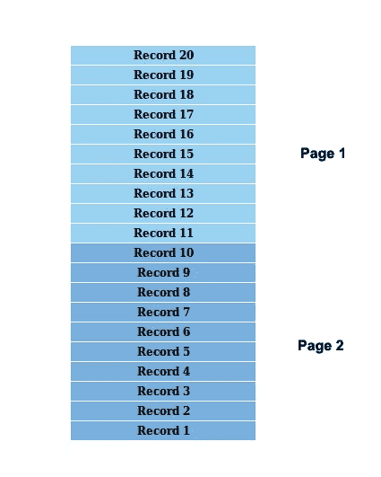
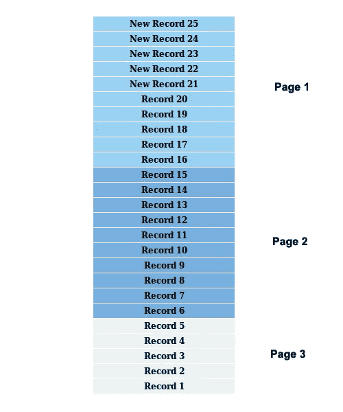
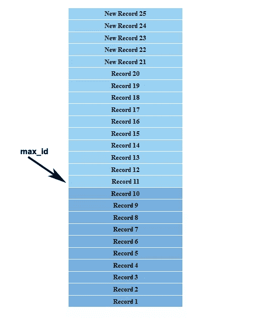

# 使用基于光标的分页对实时数据进行分页

> 原文：<https://www.sitepoint.com/paginating-real-time-data-cursor-based-pagination/>

分页是一种将大型记录集分成称为页面的较小部分的技术。作为开发人员，您应该熟悉分页的实现，但是即使对于有经验的开发人员来说，为实时数据实现分页也会变得很棘手。在本教程中，我们将讨论实时数据分页和基于光标分页的实际用例及解决方案。

## 识别实时数据分页中的问题

维基百科将实时数据定义为收集后立即交付的信息。所提供信息的及时性没有延误。在这样的应用程序中，由于频繁的更新，很难提供准确的分页数据。让我们看看管理实时数据时标准分页的问题。

*   **假设数据是静态的，不会频繁更改**–在默认分页中，检索到的记录集被分成许多页。由于数据不经常更改，用户感觉分页运行得很准确，但是当添加新数据或删除现有数据时，分页的结果会变得不准确。

*   **分页只考虑记录数，而不考虑每条单独的记录**–使用总记录数将记录分成页面，并正常分页。它不考虑每条记录在分页时是否都在正确的页面中。这可能导致记录的冗余显示。

考虑到这几点，很难使用默认分页技术来处理实时数据。让我们尝试使用一个实际的场景来确定问题。

假设我们最初有 20 条记录，我们使用 10 条作为将记录分成页面的限制。下图显示了如何将记录分成页面。



现在假设当我们在第一页时，结果集被五条新记录更新。下图显示了当前的场景。


现在我们导航到第二页。根据我们的第一张图片，它应该可以检索到 1-10 的记录。但是，将检索编号为 15-6 的记录。您可以清楚地看到，记录编号 15-11 显示在第一页和第二页中。

## 实时数据分页的实际使用案例

众所周知，重新发明轮子不是一个开发者应该做的事情。在考虑构建自己的分页技术之前，我们应该先看看现有的解决了这些问题的分页技术。许多社交网站，如 Twitter 和脸书，在其用户资料中提供实时数据。在这一节中，我们将通过一些最流行的站点来看看实时数据分页的实际用例。

### Twitter API 基于光标的分页

Twitter 用户配置文件经常被新的 tweets 填充，因此 Twitter 时间线数据检索机制应该是识别实时数据提要中分页技术的良好开端。让我们使用 Twitter API 方法来看看它是如何工作的。

下面包含一个对 Twitter API search tweets 方法的示例请求。

```
https://api.twitter.com/1.1/search/tweets.json?q=php&since_id=24012619984051000&max_id=250126199840518145&result_type=recent&count=10
```

在上面的 URL 中，我们请求包含单词“php”的最新 tweets，并使用`count`参数将结果集分成 10 个块。这是偏移分页的典型行为，我们根据记录计数进行回复。但是在这里我们可以看到两个额外的参数叫做`since_id`和`max_id`，它支持基于光标的分页。让我们用前面的例子来看看基于光标的分页是如何工作的。

我们将 20 条记录分成两页，假设我们在第一页。5 条新记录被添加到列表的顶部。下图预览了当前场景。



现在让我们来看看 Twitter 搜索请求的第一页所生成的部分响应。您可以在此查看完整的回复格式[。](https://dev.twitter.com/docs/api/1.1/get/search/tweets)

```
"search_metadata": {
  "max_id": 250126199840518145,
  "since_id": 24012619984051000,
  "refresh_url": "?since_id=250126199840518145&q=php&result_type=recent&include_entities=1",

  "next_results": "?max_id=249279667666817023&q=php&count=10&include_entities=1&result_type=recent",

  "count": 10,
  "completed_in": 0.035,
  "since_id_str": "24012619984051000",
  "query": "php",
  "max_id_str": "250126199840518145"
}
```

如您所见，`search_metadata`部分提供了关于结果的详细信息。它将生成`next_results` URL，以防有更多记录需要分页。我们主要使用`max_id`参数进行分页。对于每个响应，我们将检索`max_id`参数，并可以使用它来生成下一个结果集。我们使用 max_id 参数来接收早于给定 id 的结果。

在我们的示例中，我们应该在显示记录 20-11 的同时，将`max_id`参数作为记录 11 进行检索。然后我们传递 max_id 来生成下一个结果集。因此，我们将得到如下图所示的准确结果。



如您所见，我们通过消除顶部的 15 条记录，而不是基于偏移量的分页中的 10 条记录，获得了第二页的准确结果。在基于光标的分页中，我们不能考虑页面的概念，因为它变化很快，所以结果将被认为是上一个或下一个。一般来说，`max_id`足以有效地生成准确的结果，但是在某些情况下，`since_id`在来回分页时也是必不可少的。你可以在 [Twitter 的开发者版块](https://dev.twitter.com/docs/working-with-timelines)查看更多使用`max_id`和`since_id`的高级例子。

### 基于脸书 API 游标的分页

与 Twitter 相比，脸书的 API 实现略有不同，尽管两者使用了相同的理论。让我们来看看对一个脸书 API 请求的响应。

```
{
  "data": [
     ... Endpoint data is here
  ],
  "paging": {
    "cursors": {
      "after": "MTAxNTExOTQ1MjAwNzI5NDE=",
      "before": "NDMyNzQyODI3OTQw"
    },
    "previous": "https://graph.facebook.com/me/albums?limit=25&before=NDMyNzQyODI3OTQw"
    "next": "https://graph.facebook.com/me/albums?limit=25&after=MTAxNTExOTQ1MjAwNzI5NDE="
  }
}
```

如你所见，脸书使用两个基于字符串的光标`before`和`after`进行分页，而不是`since_id`和`max_id`。在脸书，`before`光标将指向页面的开始，而`after`光标指向页面的结尾。

大多数具有实时数据的 API 都使用这种机制来准确地对结果进行分页。作为开发人员，我们需要了解基于光标的分页背后的理论，以便使用现有的 API，并在必要时创建自己的 API。

## 为实时数据构建分页的基础

实现实时数据分页是一项复杂的任务，超出了本教程的范围，因此我们将研究创建简单分页机制的基本需求和过程，以理解基于光标的分页。

让我们使用前面讨论的例子来确定基于光标的分页的基本组件。

*   游标——我们需要至少有一列具有唯一的顺序值，以实现基于游标的分页。这可能类似于 Twitter 的`max_id`参数或脸书的`after`参数。

*   count——我们需要`count`参数作为基于偏移量的分页，以便在光标之前或之后过滤有限数量的结果。

*   下一个 URL——如果我们通过 API 提供分页，这是需要的。用户需要知道下一页是否可用，以及如何获取下一个数据集。

*   前一个 URL——如果我们通过 API 提供分页，这是必需的。用户需要知道上一个页面是否可用，以及如何获取下一个数据集。

这些是基于光标的分页的基本需求。开发人员经常使用基于偏移量的分页，很少有机会使用基于光标的分页，因此，确定每种技术的差异和优势，以便在适当的场景中使用它们是非常重要的。

*   在偏移分页中，我们可以按任何列排序并对结果进行分页，而基于游标的分页取决于唯一游标列的排序。

*   除了下一个和上一个链接之外，偏移分页还包含页码。但是由于数据的高度动态性，我们不能为基于光标的分页提供页码。

*   通常，偏移分页允许我们双向导航，而基于光标的分页主要用于向前导航。

到目前为止，我们已经了解了基于光标分页的基本需求和区别。现在，我们可以进入一个示例实现来确定它是如何工作的。

## 实现基本的基于光标的分页

```
<?php

class Real_Time_Pagination{
  public $conn;
  public function dbConnection(){
    $this->conn = new PDO('mysql:host=localhost;dbname=database','username','password');		
  }

  public function handlePaginationData(){
    $direction = 'next';
    $order = 'desc';
    $where = '';
    $params = array();

    if(isset($_GET['max_id'])){
      $direction = 'next';
      $where = " where tweetID < :max_id ";
      $order = 'desc';
      $params = array(':max_id' => $_GET['max_id']);

    }else if(isset($_GET['since_id'])){
      $direction = 'prev';
      $where = " where tweetID > :since_id ";
      $order = 'asc';
      $params = array(':since_id' => $_GET['since_id']);
    }

    $sth = $this->conn->prepare("select * from tweets $where order by tweetID $order  ");
    $sth->execute($params);
    $results = $sth->fetchAll();

    $count = count($results);

    $sth = $this->conn->prepare("select * from tweets $where order by tweetID $order  limit 3");
    $sth->execute($params);
    $results = $sth->fetchAll();

    if($direction == 'prev'){
      $results = array_reverse($results);
    }

    $html = "";

    $max_id = '';
    $since_id = '';

    foreach($results as $row) {
      if($since_id == '' )
        $since_id = $row['tweetID'];

	$view = $this->paginateDataView();
        $html .=  $this->assignTemplateVars(array('tweets'=>$row['tweet']) , $view);

	$max_id = $row['tweetID'];
      }

      $html  = $this->getResultsList($html);

      $html .= $this->paginator($max_id,$since_id,$count,$direction); 

      return $html;

  }	

  public function getResultsList($res){

    $html = "<table>$res</table>";
    return $html;
  }

  public function assignTemplateVars($params,$view){
    foreach($params as $key=>$val){
      $view = str_replace('{'.$key.'}',$val,$view);
    }		
    return $view;
  }
}
```

*   首先，我们使用 PDO 创建数据库连接。然后我们执行`handlePaginationData`函数对结果进行分页。

*   然后我们检查 URL 中是否有`max_id`或`min_id`参数。`max_id` is 类似于脸书的 after 参数，用于向前导航。`min_id`类似于脸书的 before 参数，用于向后导航。此外，我们还设置了导航方向、使用`max_id`或`min_id`的 where 子句以及排序顺序。

*   然后，我们执行查询以获得完整的结果计数，接着执行带有限制语句的相同查询以缩小结果范围。

*   如果我们在前面的方向上遍历，我们必须将排序改为 asc。否则，它将检索最近的记录，而不是上一页。我们反转数组中的记录，以降序显示它们。

*   然后我们遍历结果。在循环时，我们将第一条记录的 ID 指定为`min_id`，将最后一条记录的 ID 指定为`max_id`。这些游标值用于通过消除重复来过滤准确的数据。

*   最后，我们可以看看实现分页链接的`paginator`函数。

```
public function paginator($max_id,$since_id,$count,$direction){
  $pag['next_url'] = "?max_id=".$max_id;
  $pag['prev_url'] = "?since_id=".$since_id;

  $html = '';
  $params = array('prev_url'=> $pag['prev_url'], 'next_url' => $pag['next_url']);

  if($direction == 'next' ){

    if($count <= 3)
      $params['next_url'] ='#';

      $view   = $this->paginateLinksView();
      $html  .= $this->assignTemplateVars($params,$view);

  }

  if($direction == 'prev'){	
    if($count <= 3)
      $params['prev_url'] ='#';

      $view   = $this->paginateLinksView();
      $html  .= $this->assignTemplateVars($params,$view);
  }
  return $html;
}

public function paginateLinksView(){
  $html   ="<a  href='{prev_url}'>Prev</a>";
  $html  .="<a  href='{next_url}'>Next</a>";

  return $html;
}
public function paginateDataView(){

  $html = "<tr><td>{tweet}</td></tr>";
		return $html;
}
```

下面的代码包含本节中生成的分页的初始化代码。

```
<?php
$rtp = new Real_Time_Pagination();
$rtp->dbConnection();
echo $rtp->handlePaginationData();
```

现在我们有一个简单的数据分页示例来理解实时数据分页是如何工作的。使用这段代码并对结果进行分页。分页时，在表的末尾添加一些记录，使之实时。然后向前和向后分页，以检查页面中的重复数据。对基于偏移量的分页进行同样的操作，以了解不同之处。

## 结论

在本教程中，我们学习了基于光标分页的实时数据分页背后的理论。请在下面的评论中告诉我们你的想法和经历！

## 分享这篇文章