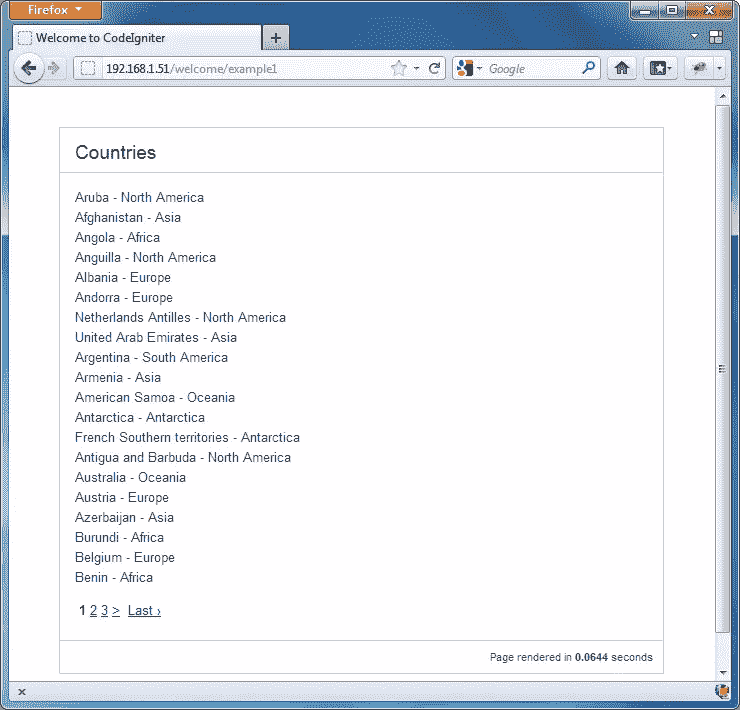
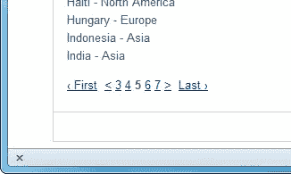
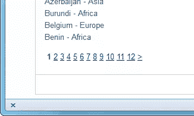
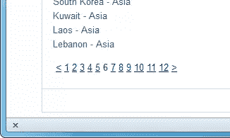

# 用 CodeIgniter 分页

> 原文：<https://www.sitepoint.com/pagination-with-codeigniter/>

当你在谷歌上进行搜索时，搜索结果会显示在一个列表中，你可以选择点击搜索结果页面。这是分页的一个例子。分页仅仅意味着用户能够点击结果页面，每次查看其中的一个子集，而不必在屏幕上滚动很长时间。

当您编写与数据库交互的应用程序时，分页特别有用。一个大型数据集的一个查询可能会有数百个可能的结果，而分页会带来更好的用户体验。

在本教程中，我将使用 CodeIgniter 的分页库向您展示如何从 MySQL 数据库创建分页的结果列表。同时，您还将看到如何修复库可能产生的分页链接问题。

我假设您已经安装了 CodeIgniter 2.1。对于数据库，我将使用 MySQL 提供的官方示例数据库，它可以作为 SQL 文件下载。

## 模型

我们将首先在应用程序中创建一个模型，它需要做两件事:提供对`Country`表中所有记录的计数，并从表中检索国家列表。将以下内容另存为`models/countries.php`:

```
class Countries extends CI_Model
{
    public function __construct() {
        parent::__construct();
    }

    public function record_count() {
        return $this->db->count_all("Country");
    }

    public function fetch_countries($limit, $start) {
        $this->db->limit($limit, $start);
        $query = $this->db->get("Country");

        if ($query->num_rows() > 0) {
            foreach ($query->result() as $row) {
                $data[] = $row;
            }
            return $data;
        }
        return false;
   }
}
```

CodeIgniter 的带有活动记录的数据库类用于计算和检索数据库中的数据。

`record_count()`方法返回记录的数量，这是必需的，因为分页库的`$config`数组中的一个选项是`$config["total_rows"]`。该库将使用这个选项和我们设置的其他选项来计算如何将结果分成页面。

`fetch_countries()`方法从`Country`表中检索所有记录的列表。这种方法有两种说法:`$limit`和`$start`。它们将被传递到查询中，以确定返回多少条记录，以及从哪条记录开始。参数将在控制器中设置。

## 控制器

接下来，我们需要在默认的`Welcome`控制器(`controllers/welcome.php`)中创建一个名为`example1()`的方法。但是在我们这样做之前，我们需要在类的构造函数中加载模型和分页库。

```
<?php
class Welcome extends CI_Controller 
{
    public function __construct() {
        parent:: __construct();
        $this->load->helper("url");
        $this->load->model("Countries");
        $this->load->library("pagination");
    }

    public function example1() {
        $config = array();
        $config["base_url"] = base_url() . "welcome/example1";
        $config["total_rows"] = $this->Countries->record_count();
        $config["per_page"] = 20;
        $config["uri_segment"] = 3;

        $this->pagination->initialize($config);

        $page = ($this->uri->segment(3)) ? $this->uri->segment(3) : 0;
        $data["results"] = $this->Countries->
            fetch_countries($config["per_page"], $page);
        $data["links"] = $this->pagination->create_links();

        $this->load->view("example1", $data);
    }
}
```

`example1()`方法首先为分页库提供一些最常见的配置选项。这些选项放在一个数组中，然后作为参数传递给库的 initialize 方法。该库要求选项必须传递一个基本 URL、一个总行数、我们希望每页有多少行，以及 URL 的哪个部分将包含用户正在使用的页面部分。

还记得查询国家列表(`$limit`和`$start`)所需的那些参数吗？这些在模型的`fetch_countries()`方法的调用中被设置。`$page`变量使用三元运算符将其值设置为 URI 字符串第三段中的任何值，或者设置为零(意味着用户在第一页上)。

最后，分页库的`create_links()`方法创建分页链接，然后我们加载视图来显示结果。

## 景色

对于视图文件，我们可以复制`views/welcome_message.php`并将其命名为`example1.php`，并用以下内容替换主体的大部分内容:

```
<body>
 <div id="container">
  <h1>Countries</h1>
  <div id="body">
<?php
foreach($results as $data) {
    echo $data->Name . " - " . $data->Continent . "<br>";
}
?>
   <p><?php echo $links; ?></p>
  </div>
  <p class="footer">Page rendered in <strong>{elapsed_time}</strong> seconds</p>
 </div>
</body>
```

所以现在当你访问`http://yourdomain/welcome/example1`时，你应该会看到这样的内容:



## 更多配置选项

单击分页链接，您应该会发现自己正在浏览`Country`表中的 239 条记录。但是你可能会注意到链接数字的数量发生了变化。最初有三个数字，后来有五个！



有一个配置项可能有助于解决这个问题。在这个阶段，记住我们正在从数据库中检索记录，CodeIgniter 必须在访问每个页面时重新计算数字链接，这可能是有用的。我们可以做的第一件事是禁用第一个/最后一个上一个/下一个链接来整理导航。它并没有阻止数字的膨胀，但它确实整理了一些东西。

我们可以做的第二件事是通过将总行数除以每页所需的行数来计算有多少页，对结果进行舍入，并将其传递给`$config["num_links"]`参数。

下面是经过这些修改后的`example1()`方法:

```
public function example1() {
    $config["base_url"] = base_url() . "welcome/example1";
    $config["total_rows"] = $this->Countries->record_count();
    $config["per_page"] = 20;
    $config["uri_segment"] = 3;
    $choice = $config["total_rows"] / $config["per_page"];
    $config["num_links"] = round($choice);

    $this->pagination->initialize($config);

    $page = ($this->uri->segment(3))? $this->uri->segment(3) : 0;
    $data["results"] = $this->Countries
        ->fetch_countries($config["per_page"], $page);
    $data["links"] = $this->pagination->create_links();

    $this->load->view("example1", $data);
}
```

这将改善现在的联系。





## 摘要

现在您已经知道如何使用 CodeIgniter 分页库的最有用的配置选项，并且还可以修复分页链接的显示方式，以便为您的用户提供一致的体验。CodeIgniter 的每个下载都附带了一个用户指南，所以一定要查看那里库的其他配置选项。它包含设置分页链接样式的选项，以及更改页面上呈现链接的方式的选项。

图片 via [亚历克西斯·普恩特斯](http://www.shutterstock.com/gallery-2901p1.html)/[Shutterstock](http://shutterstock.com)

如果你喜欢读这篇文章，你会爱上[可学的](https://learnable.com?utm_source=sitepoint&utm_medium=link&utm_campaign=learnablelink)；向大师们学习新技能和技术的地方。会员可以即时访问 SitePoint 的所有电子书和交互式在线课程，如 [Jump Start PHP](https://learnable.com/books/jump-start-php?utm_source=sitepoint&utm_medium=link&utm_campaign=learnablelink) 。

对本文的评论已经关闭。有关于 PHP 框架的问题吗？为什么不在我们的[论坛](https://www.sitepoint.com/forums/forumdisplay.php?34-PHP?utm_source=sitepoint&utm_medium=link&utm_campaign=forumlink)上问呢？

## 分享这篇文章