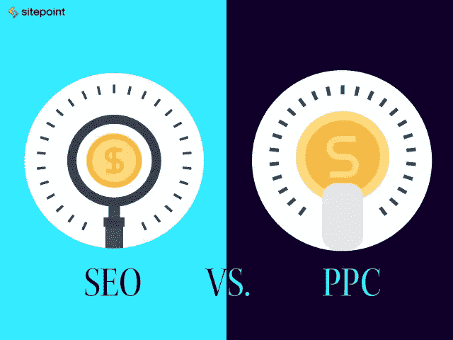
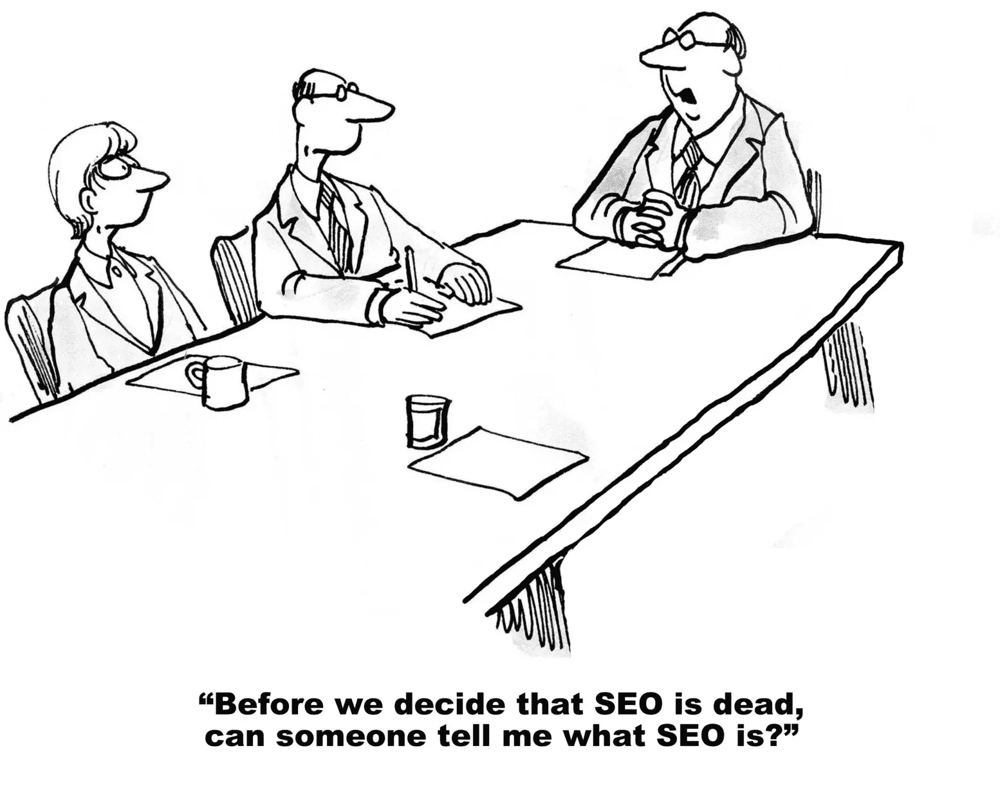
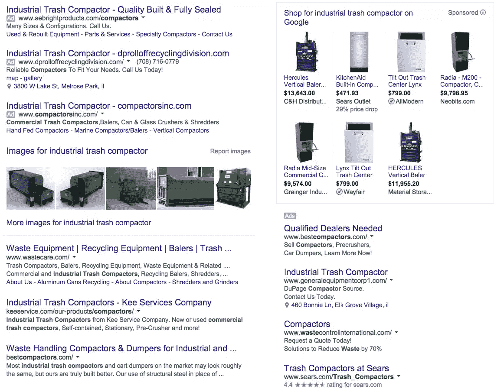

# 付费与有机:两者都重要的 5 个理由

> 原文：<https://www.sitepoint.com/paid-versus-organic/>

付费还是有机——这是个问题。

搜索引擎优化(SEO 或有机)和点击付费(PPC 或付费)通常由不同的团队采用不同的策略来处理。

重要的是要记住，两者都在优化你的搜索结果。

那么你应该选择 SEO 还是 PPC 呢？

答案是:都有。

SEO 和 PPC 是数字营销的互补形式，这两种策略结合起来会产生比单独使用更多的线索。

以下是你应该同时执行这两种策略的五个理由。

## 1.SEO 是长尾的。PPC 立即交付。

搜索引擎优化运动需要稳定的投资，月复一月，年复一年。

谷歌希望看到持续的优化努力；因此，从大量的 SEO 活动转移到非常少的 SEO 活动是失败的秘诀。

为什么会这样呢？

首先，谷歌可能会将某些 SEO 活动的大量爆发，如一夜之间获得数百个链接，视为“黑帽”SEO 策略，并忽略甚至惩罚该网站。

其次，合法的搜索引擎优化实践，如站内和站外内容开发、网站维护和故障排除，不可能一蹴而就，即使一家公司有财力这样做。

相反，PPC 活动可以随时开启和关闭，广告预算可以通过点击鼠标来增加或减少，而不会造成任何伤害。

PPC 的灵活性对于公司的营销预算和底线有着巨大的价值。

在一个时候，当业务蓬勃发展，一个公司可以保持他们的搜索引擎优化运动稳步前进，并大大提高其 PPC 的努力，以使干草，而阳光普照。

在业务不景气的年份，公司可以维持他们的搜索引擎优化活动，这样就不会失去多年努力建立起来的阵地，但放慢速度以保持预算在控制之下。

## 2.通用搜索使双重运动变得强大。

在过去，让你的网页排在谷歌第一页的最前面是很有意义的。今天——没有那么多。

当用户在谷歌上输入搜索查询时，他们会看到通用或“混合”结果，这是有机结果、新闻、视频、本地化结果和 PPC 广告的混合。

虽然保持高的有机排名仍然很重要，但根据搜索引擎结果页面(SERP)的格式，高排名的网页很容易在混乱中丢失。

下面是一个混合结果的 SERP 示例。对于用户来说，区分广告和自然结果并不容易:

通过同时追求 SEO 和 PPC，公司在 SERPs 上获得了更大的可见性。

如果搜索者错过了有机列表，他们可能会发现 PPC 广告，反之亦然。

此外，当用户看到强大的有机列表和精心制作的 PPC 广告时，公司就会获得可信度。他们认为:这家公司一定是一个领导者，因为他们在我的搜索查询上统治了谷歌。

## 3.PPC 是一个 SEO 实验室。

PPC 的一个重要特点是关键词、广告文本、优惠和登陆页面可以不断测试。

从 PPC 测试中获得的情报对改进 SEO 活动非常有帮助，而 SEO 活动更难测试。

目前，谷歌没有向站长提供有机流量的关键词数据，这使得无法知道哪些关键词从 SEO 活动中产生流量。

另一方面，关键字数据在 PPC 活动中是可见的。

知道哪些关键词能为 PPC 活动带来巨大的转化率，可以让 SEO 经理们有价值地了解他们应该关注哪些关键词。

更重要的是，SEO 经理从知道哪些竞价排名的转化率最高中获益匪浅。

一个可靠的点击付费活动会把用户从点击付费广告带到一个专门围绕广告内容设计的登陆页面。

例如，如果 50 美元的优惠比买二送三的优惠多获得 25%的转化，那么 SEO 活动经理可以在具有重要战略意义的相关网站页面上显示更受欢迎的优惠，并大大提高销售线索的生成。

## 4.PPC 允许更广泛的关键词覆盖。

在关键词覆盖方面，把 SEO 想象成一英寸宽一英里深，把 PPC 想象成一英里宽一英寸深。

一个强大的 SEO 活动将针对数百个关键词，而一个类似的强大的 PPC 活动将针对数万甚至数十万个关键词。

因此，当搜索引擎优化活动培养其战略关键词时，同时进行的点击付费活动可以覆盖更广泛的领域，从搜索引擎优化活动的关键词中获取线索甚至不接近目标。

这对于长尾关键词尤其重要——复杂的关键词短语，如“蜡烛制造商的移动信用卡处理”

长尾关键词吸引特定的细分市场或特定产品或服务的特定应用。

这些关键字往往搜索量低，但转化率极高，这使得它们作为 SEO 目标不切实际，但对于 PPC 却很理想。

为什么？

因为要获得高的有机可见性，SEO 活动必须创造稳定的站内和站外内容流，并获得与关键词相关的入站链接。

对 PPC 来说，唯一的成本是当用户点击广告时——可能是 15 美元和一个用户成为潜在客户或顾客的好机会。

## 5.PPC 允许公司控制他们的品牌。

不幸的是，一些公司实施“竞争对手的 PPC 运动。”

通过这一策略，该公司锁定了包含竞争对手品牌的关键词。因此，当用户搜索“ABC 鞋”时，他们会看到广告商“XYZ 鞋”的广告

首先，让我们明确一点:竞争对手活动不是一个好主意。

他们的转换率很低，降低了公司整体竞价排名的效率。尽管如此，这种行为还是会发生，公司应该通过运行自己品牌的 PPC 活动来保护自己，也就是说，锁定包含自己品牌的关键词。

开展品牌活动，与竞争对手的活动形成鲜明对比，是一个好主意。

品牌活动有非常高的转化率，因为用户正在搜索品牌。此外，品牌广告显然是相关的，增加了公司的质量分数，这是谷歌衡量广告质量的标准，决定了一场广告活动的成败。

同样重要的是，开展品牌活动意味着搜索者将会看到该公司的广告，而不是竞争对手的广告。

任何可能流向竞争对手的点击将直接流向公司，防止竞争对手从公司辛苦赢得的声誉中获利。

## 一定要追踪线索

我们已经看到了 SEO 和 PPC 是如何合作产生销售线索的，但是作为最后一个想法，如果一个公司不能正确地跟踪这些销售线索，潜在的好处将会被浪费掉。

一个可靠的跟踪系统跟踪转换，包括在线订单、表单线索和电话线索，追溯到他们的推荐来源。

只有当一家公司知道他们的在线线索来自哪里(PPC 活动、SEO 活动、社交媒体或集客营销内容)时，他们才能做出关于花费多少和关注哪里的合理决定。

### 你或客户认为哪种策略更有价值？SEO 还是 PPC？请在下面的评论中告诉我们，别忘了解释原因！

## 分享这篇文章